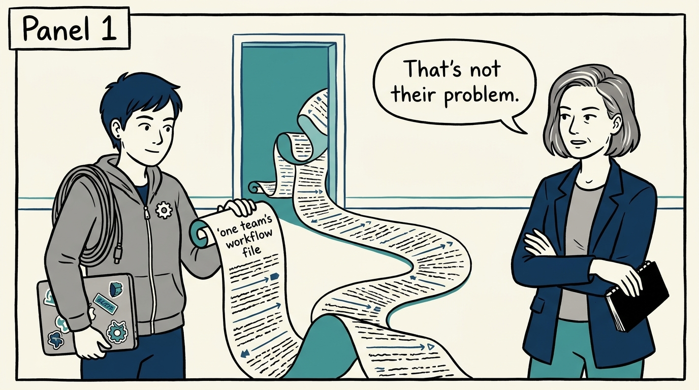
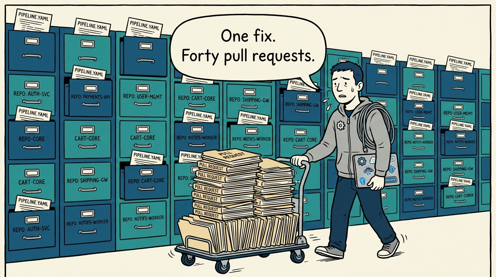
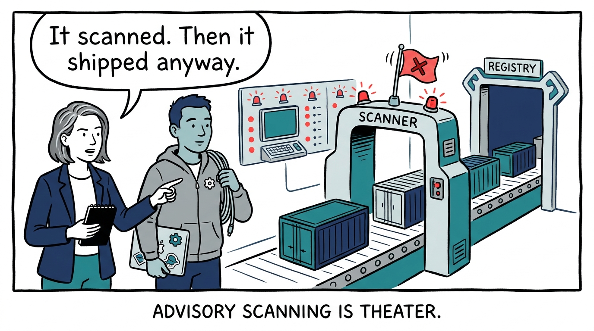
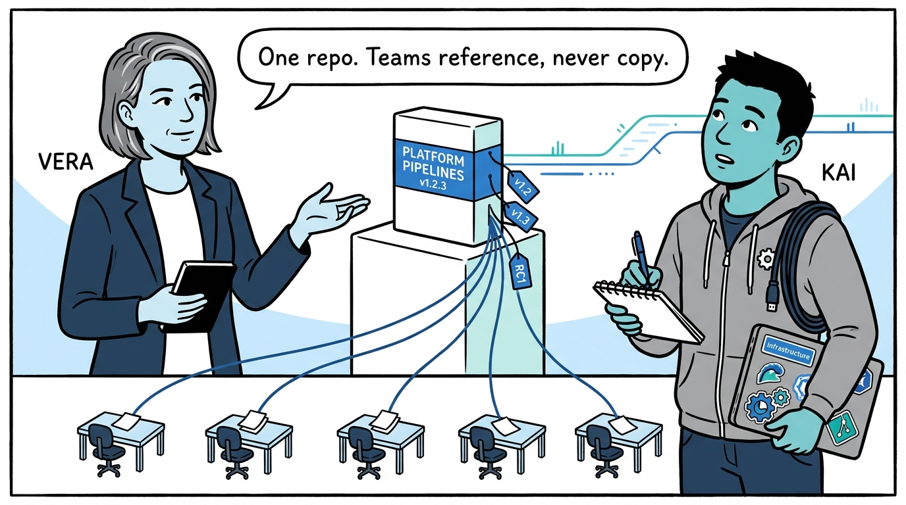
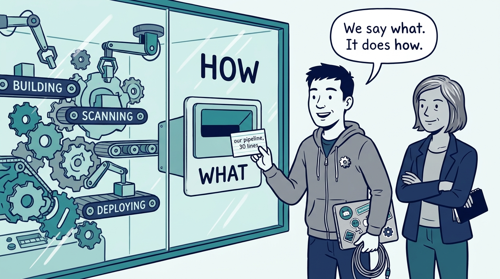
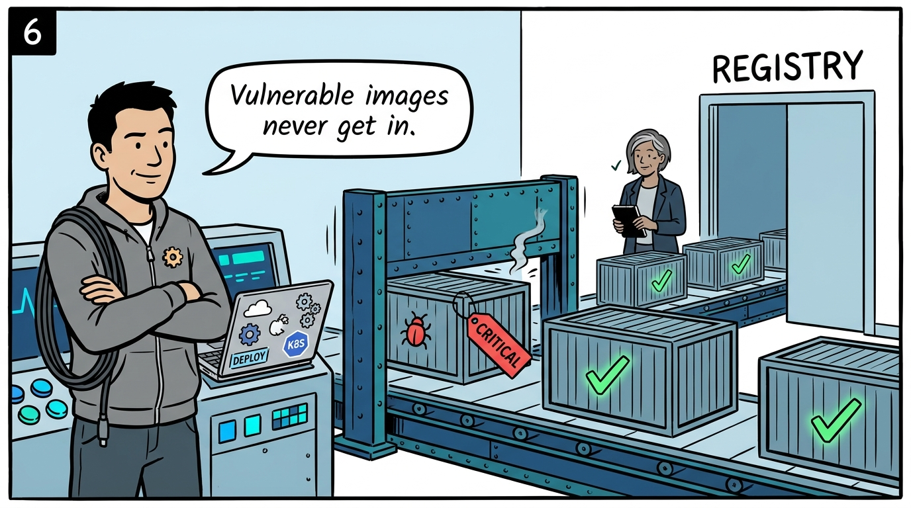
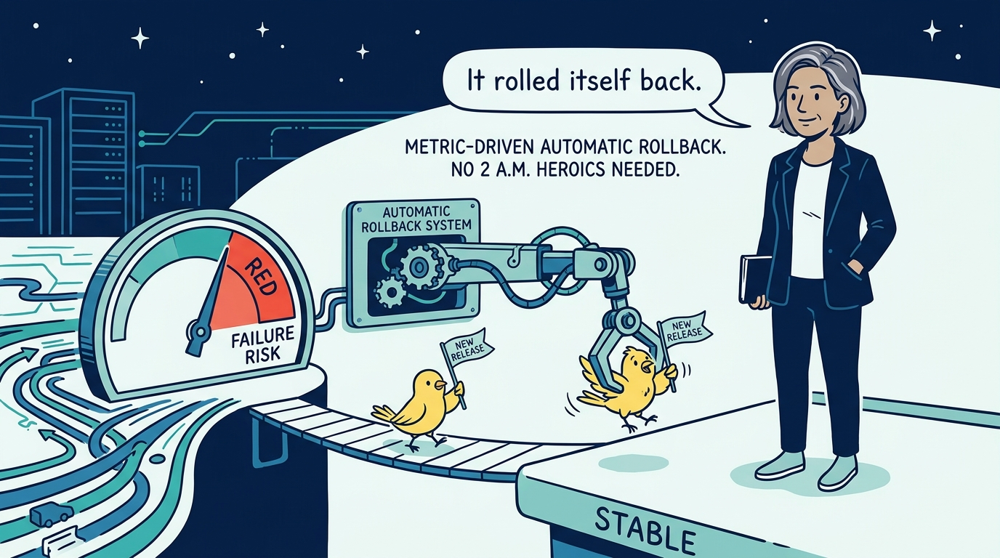
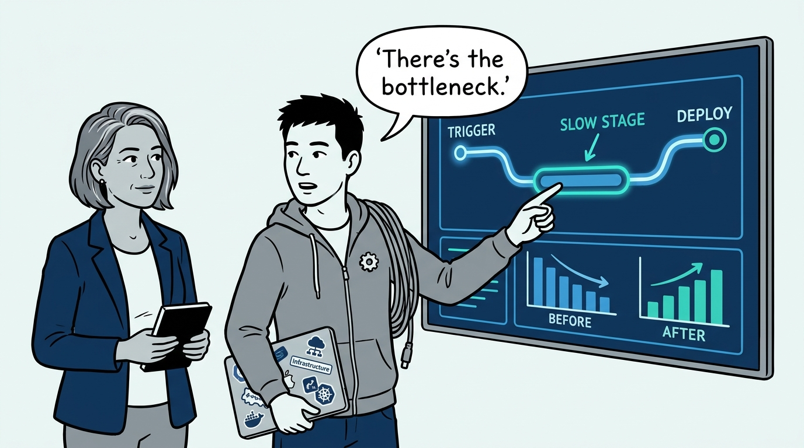
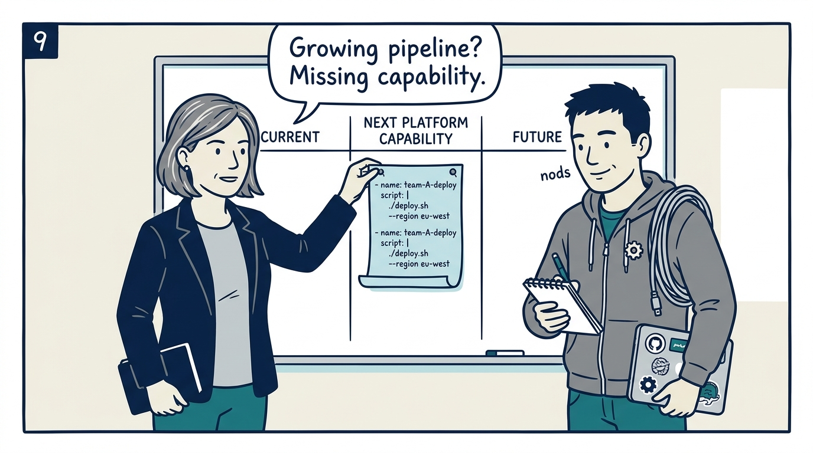

Why CI/CD stops being a per-team craft and becomes a product the platform ships — in nine panels.

<!-- comic-style
{
  "cast": "VERA: a calm, seasoned engineering executive, short gray-streaked hair, dark blazer over a plain t-shirt, carries a small black notebook. KAI: a hands-on platform engineering lead, short dark hair, gray zip-up hoodie with a small gear pin, laptop covered in infrastructure stickers under one arm, a coil of cable slung over the shoulder.",
  "style": "Clean two-tone explainer comic, thick ink outlines, flat colors with deep blue and teal accents on a light background, generous white space, hand-lettered speech bubbles with SHORT readable text, no photorealism."
}
-->

**Panel 1:** *The hook: a team's workflow file keeps growing — and that is not that team's problem to solve.*

**Panel 2:** *The problem: copy-paste is how pipeline debt compounds — every improvement becomes N pull requests, every bug becomes immortal.*

**Panel 3:** *The wrong way: the advisory scanner — a scan that ships anyway just fills the registry with known-vulnerable images and the dashboard with guilt.*

**Panel 4:** *The principle: one platform repository, run like a product — semantically versioned, tested by its own CI, consumed by reference.*

**Panel 5:** *How it plays out: the thirty-line wrapper — teams declare what their service needs; everything about how lives in platform templates.*

**Panel 6:** *How it plays out: the build gate — HIGH or CRITICAL fails the build, and a vulnerable image never reaches the registry.*

**Panel 7:** *How it plays out: progressive delivery — the platform watches every release against live metrics and retreats automatically, no 2 a.m. heroics.*

**Panel 8:** *What it proves: an instrumented pipeline — stage timings, DORA metrics, and adoption on a dashboard rather than in a slide.*

**Panel 9:** *The closer: the test that keeps running — a growing team pipeline is not that team's problem; it is a platform capability we have not built yet.*
