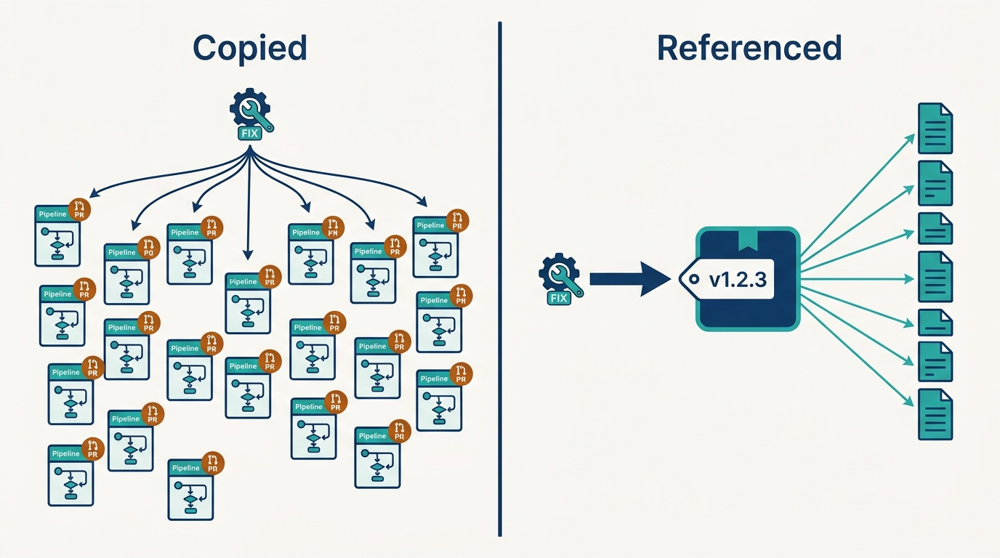
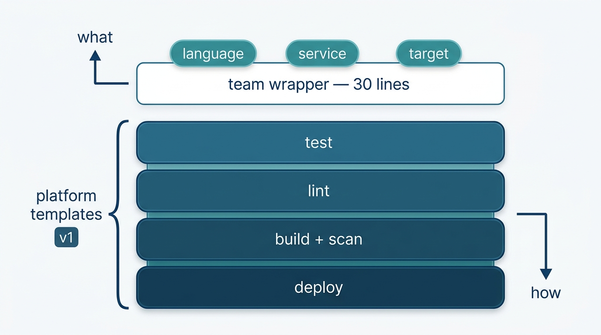
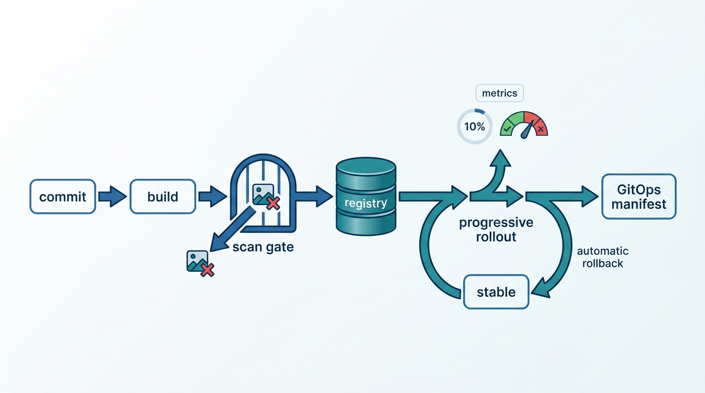

> **Status**: DRAFT
>
> **Principle**: In my organization, CI/CD is a service the platform ships, not a craft each team practices. One platform repository holds the reusable actions and composed pipeline templates; it is **semantically versioned**, tested by its own CI, and consumed by reference — never by copy. Team pipelines are **minimal wrappers of roughly thirty lines** that declare *what* the service needs; everything about *how* lives in platform templates, and team-specific logic that keeps growing is read as a missing platform capability, not team creativity. Security scanning is a **gate, not a report** — a vulnerable image never reaches the registry. Delivery is **progressive by default** — canary or blue-green, analyzed against live metrics, rolled back automatically when unhealthy. And the pipeline itself is **instrumented end to end**, so DORA metrics, stage timings, and adoption are measured, not guessed.

## Statement

When a platform team in my organization builds CI/CD as a platform service, this is the shape I hold the build to.

**One platform repository, run like a product:**

- **Structured for reuse.** A single platform repository with `actions/` for composite single-task actions, `workflows/` for composed pipeline templates, `tests/` for validation and integration tests, and `docs/` for usage guides, migration instructions, and changelogs. Reusable tasks stay separate from the pipeline templates that compose them.
- **Versioned so teams can trust it.** Semantic versioning throughout: major for breaking changes, minor for compatible features, patch for fixes. Specific release tags (`v1.2.3`) plus floating major tags (`v1`); teams pin to stable versions; breaking changes ship with documented migration requirements.
- **Tested like the software it is.** Every platform action is validated in CI — syntax, required fields, supported types, described inputs, composite actions that actually contain steps. An invalid action cannot be released.

**Team pipelines declare what; the platform owns how:**

- **Minimal wrappers.** Team-owned workflow files reference platform templates and pass typed inputs — target under roughly thirty lines. Sensible defaults, secrets configured at the workflow level, controlled escape hatches where genuinely needed.
- **Batteries included.** The composed templates carry automated testing, linting, container build, security scanning, and deployment stages with proper job dependencies — per application type, starting with the backend microservice pipeline.
- **Growth is a signal.** Team-specific pipeline logic that keeps growing is investigated, not tolerated as local color.

**Builds are gated, delivery is progressive:**

- **The build gate.** A reusable container-build action: Buildx, build caching, generated metadata and tags, registry authentication, vulnerability scanning. HIGH or CRITICAL findings fail the build, and a vulnerable image is never pushed to the registry. The action exposes image tag and digest as outputs; third-party actions are pinned to known versions.
- **The delivery gate.** Progressive delivery per service — blue-green where instant switching is useful, canary where gradual traffic shifting is preferred — with deployment analysis wired to live success-rate thresholds. Unhealthy releases stop or roll back automatically; the previous stable release remains recoverable. The pipeline ends at a GitOps manifest change; the cluster machinery of [[platform-creation]] takes it from there.

**The pipeline is measured, not narrated:**

- **Telemetry as a built-in.** Pipeline events flow through a collector into metrics and traces; a pipeline run is traceable from trigger through deployment, with time in tests, builds, and deploys measured and failures associated with the commits or infrastructure changes that caused them.
- **Evidence, not opinion.** A baseline taken before the build — workflow counts, pipeline line counts, adoption rate, deployment frequency, lead time, change failure rate, MTTR, p95 build duration, scan pass rate — so line-count reduction and DORA improvement can be demonstrated, not asserted.
- **Migration is part of the product.** A real application pipeline is migrated end to end as the validation, and documentation plus migration guidance exist for every team that follows.

## How to Read This

This record is part of the **Reference Implementation** section of my platform operating model — the how-it-concretely-looks companion to the Platform Engineering records. It is grounded in the "CI/CD as a Platform Service" chapter of the *Platform Engineer's Handbook*, which builds this capability end to end on a concrete stack. **The tools are the worked example, not the mandate**: the commitments above hold at the capability level whatever the vendor. The full working checklist — every step, in build order — lives in the **Checklist** tab; the **TL;DR** tab carries the management summary, and the **Conversation** tab talks through the objections.

## Reference Stack

| Role | Reference tool | The property that matters |
| --- | --- | --- |
| Reusable tasks and pipelines | GitHub Actions (composite actions + reusable workflows) | Teams compose by reference; implementation lives in one platform repo |
| Container build | Docker Buildx | Cached, metadata-tagged builds exposing image tag and digest |
| Vulnerability scanning | Trivy | HIGH/CRITICAL fails the build; vulnerable images never reach the registry |
| Progressive delivery | Argo Rollouts | Canary and blue-green with metric-driven automatic rollback |
| Deployment analysis | Prometheus | Success-rate thresholds gate every traffic shift |
| Delivery into clusters | Flux (GitOps) | The pipeline commits manifests; the cluster pulls — see [[platform-creation]] |
| Pipeline telemetry | OpenTelemetry Collector → Prometheus, Grafana | Every run traced trigger-to-deployment; bottlenecks measured |

## Rationale

**Copy-paste is how pipeline debt compounds.** Before any of this exists, the honest baseline is an inventory: how many workflows, how many thousands of lines of YAML, how many repositories already share anything. Every copied pipeline is a fork that will never be merged — every improvement becomes N pull requests, every bug becomes immortal, and every security fix rolls out at the speed of the slowest team. Consolidating CI/CD into referenced, versioned templates is the only mechanism I know that makes a pipeline improvement land everywhere at once.

**Figure 1:** *Copied pipelines turn one improvement into N pull requests; a referenced, versioned platform repository makes it land everywhere at once.*

**The thirty-line wrapper is the interface contract.** The number matters less than what it measures: the quality of the abstraction. A team pipeline that fits in thirty lines of typed inputs is a team that declares *what* — language, service name, deploy target — while the platform owns *how*. When a team's workflow file grows past that, one of two things is true: the team is routing around the platform, or the platform is missing a capability many teams need. Both are roadmap input, which is why the record treats **team-specific pipeline logic as a discovery mechanism**, exactly the product posture [[platform-as-a-product]] demands.

**Figure 2:** *The interface contract: a thin team wrapper declares what; the deep, versioned platform layers own how.*

**Versioning is what makes a shared pipeline safe to depend on.** The moment every team references one template, that template is a single point of coordinated breakage — unless it is versioned like the product it is. Semantic versions, pinnable releases, floating major tags for teams that want compatible updates automatically, and documented migrations for the rest: this is [[four-pillars]] pillar two applied to CI/CD, a real software abstraction with an owned lifecycle. And the platform's own actions get CI, because a platform that ships an invalid action ships an outage to everyone simultaneously.

**A scan that ships anyway is theater.** Advisory scanning produces dashboards of known vulnerabilities already running in production. The reference build makes the scan a gate: HIGH or CRITICAL fails the build and the image never reaches the registry, so the registry itself becomes a trustworthy boundary. This is the pipeline's slice of security only — the cluster-side story is [[platform-security]] and admission-time enforcement is [[policy-as-code]] — but it is the slice that stops vulnerable artifacts at the cheapest possible point.

**Progressive delivery turns rollback from heroics into a property.** A big-bang deploy makes every release a bet with the whole table's chips, and rollback a manual scramble under pressure. Canary and blue-green, analyzed against live success-rate thresholds, make the platform watch every release and retreat automatically when the metrics say so — with the previous stable release verified recoverable before anyone needs it. Recovery becomes something the platform does, not something an engineer performs at 2 a.m.

**Figure 3:** *The gated flow: the scan gate stops vulnerable images before the registry, and progressive rollout retreats to stable automatically when live metrics say so.*

**You cannot improve a pipeline you cannot see.** Instrumenting CI/CD itself — traces from trigger to deployment, stage timings, failures tied to commits — replaces anecdote with measurement. It answers the practical question (where is the bottleneck: tests, builds, or deploys?) and the executive one (are deployment frequency, lead time, change failure rate, and MTTR actually improving?). The same telemetry produces the platform's own proof of value: adoption rate and demonstrated line-count reduction, the evidence [[platform-success]] asks every platform to carry.

**Migration is the product's first release.** A platform pipeline nobody has migrated to is a hypothesis. The reference build ends by moving a real application onto the platform template — inputs, secrets, pinned version, GitOps manifests, progressive rollout — and by shipping the documentation and migration guidance that make the second migration cheaper than the first.

## What This Means in Practice

| What this record says | What it does **not** say |
| --- | --- |
| Team pipelines are minimal wrappers, roughly thirty lines. | Teams lose control — typed inputs, sensible defaults, and controlled escape hatches keep the *what* in their hands. |
| The reference stack is GitHub Actions, Trivy, Argo Rollouts, Flux, OpenTelemetry. | Those tools are mandated — commitments hold at the capability level; the stack is the worked example. |
| HIGH/CRITICAL findings fail the build and block the push. | Every scanner finding blocks work — the gate's threshold is explicit and deliberate. |
| The platform pipeline is semantically versioned and teams pin. | Teams must chase every release — floating major tags deliver compatible updates; breaking changes come with migration docs. |
| Delivery is progressive with automated rollback. | Every service must canary — blue-green is chosen where instant switching fits; the strategy is per service. |
| The pipeline itself is instrumented and DORA metrics are measured. | Telemetry is for grading teams — it exists to find pipeline bottlenecks and to prove the platform's own value. |
| Migrate a real application as validation. | Migration is announced by memo — it ships with documentation and guidance for the teams that follow. |

Concretely: a CI/CD platform build in my organization is done when a real service deploys through a pinned platform pipeline declared in under thirty lines of team-owned YAML, a vulnerable image demonstrably cannot reach the registry, an unhealthy canary demonstrably rolls itself back, and the before/after numbers — line counts, adoption, DORA — are on a dashboard rather than in a slide.

## Anti-Patterns

- **The snowflake estate.** Hundreds of hand-rolled pipelines, thousands of YAML lines, nothing shared — the baseline inventory nobody wanted to take.
- **Copy-paste as a service.** "Reuse" by copying workflow files between repositories — every improvement becomes N pull requests and every bug becomes permanent.
- **Pinned to `main`.** Teams referencing unversioned platform actions — one merge breaks every pipeline in the company at once.
- **The advisory scanner.** Vulnerability scanning that reports and ships anyway, filling the registry with known-vulnerable images and the dashboard with guilt.
- **The untested platform action.** CI code with no CI of its own — an invalid action released to everyone simultaneously.
- **The escape hatch that became the road.** Team-specific logic growing quietly for months, never investigated as the missing platform capability it is.
- **The big-bang deploy.** One hundred percent of traffic switched at once, rollback as a manual redeploy performed under pressure.
- **The blind pipeline.** No telemetry on CI/CD itself — bottleneck debates by anecdote, DORA metrics unmeasurable, the platform's value unprovable.
- **Migration by memo.** The platform pipeline announced but never proven on a real service, with no migration guide — adoption stalls at the teams who wrote it.

## Related Records

- [[four-pillars]] — this record is pillars two and three made concrete for one offering: a software abstraction with an owned lifecycle, consumed self-service by many teams.
- [[platform-as-a-product]] — the product mechanics this record applies: versioning, migration guides, adoption metrics, team logic as roadmap input.
- [[groundwork]] — the repository, secrets, and release discipline this build stands on.
- [[platform-creation]] — the GitOps and cluster machinery the pipeline hands off to at the manifest commit.
- [[platform-security]] — the end-to-end security story; this record carries only the build-time scan gate.
- [[policy-as-code]] — admission-time enforcement inside clusters, complementing this record's pipeline gates.
- [[observability-implementation]] — the platform observability stack; this record instruments the pipeline itself.
- [[starter-kits]] — how new services get this pipeline from day one, so migration is only for the existing estate.
- [[devex-evaluation]] — where the DORA and developer-experience measurements this record baselines are read and acted on.

## Scope and Revisiting

This record is `draft`. It applies whenever a platform team in my organization builds or consolidates CI/CD as a shared service, whatever the vendor stack. I revisit it if team pipeline line counts start creeping back up (the abstraction is leaking), if adoption stalls while teams maintain parallel pipelines (the product is not winning on merit), if the scan gate accumulates routine bypasses (the gate has become theater), or if a rollback fails in production despite passing verification (the delivery-gate promise is broken).

## Authoritative References

- *Platform Engineer's Handbook* — the "CI/CD as a Platform Service" chapter, whose checklist this record distills and reproduces in the Checklist tab.
- Camille Fournier and Ian Nowland, *Platform Engineering: A Guide for Technical, Product, and People Leaders* (O'Reilly, 2024) — the conceptual foundation this reference implementation executes; see [[four-pillars]] and [[platform-as-a-product]].
