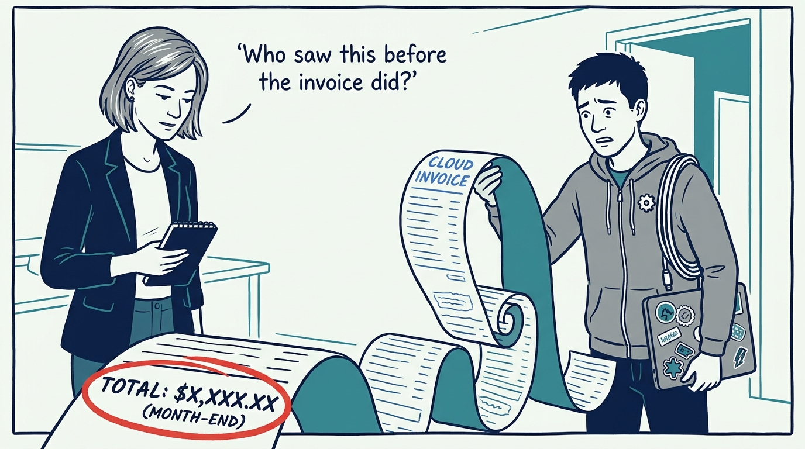
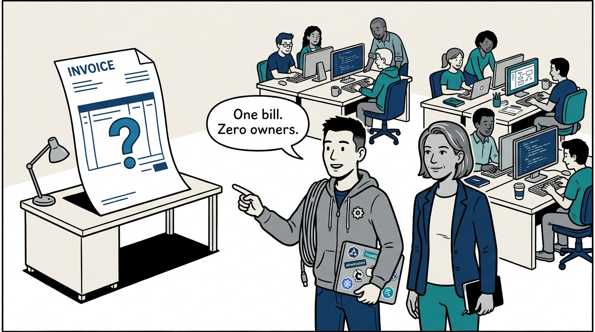
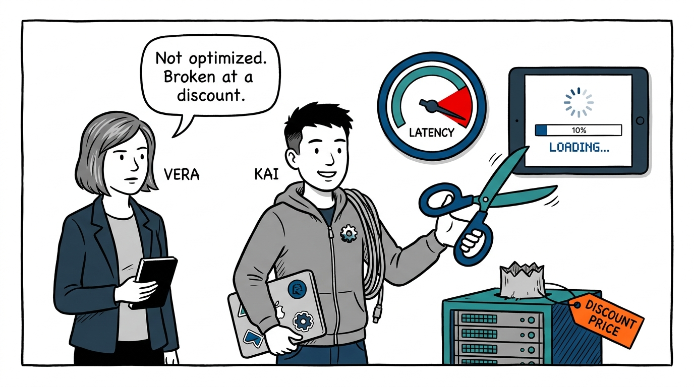
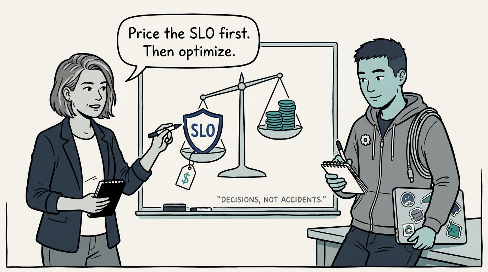
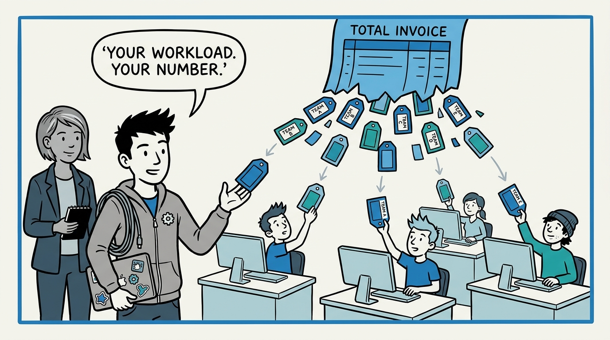
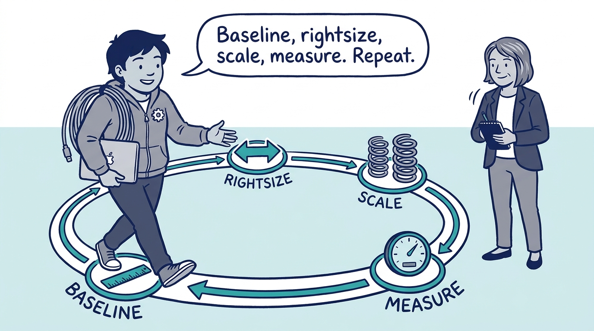
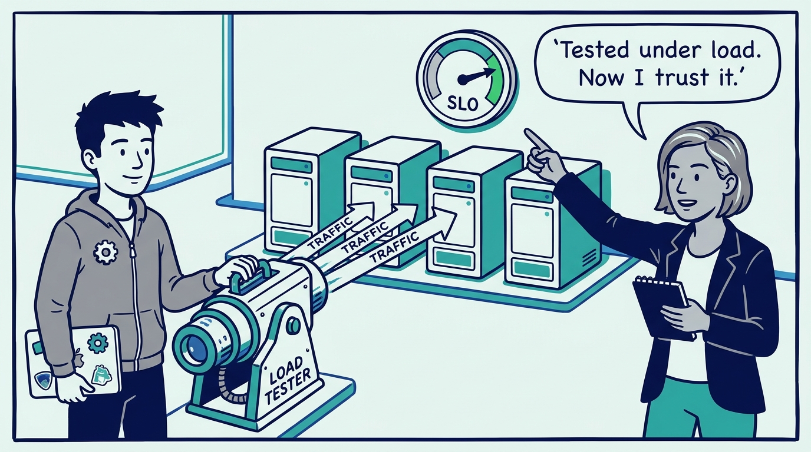
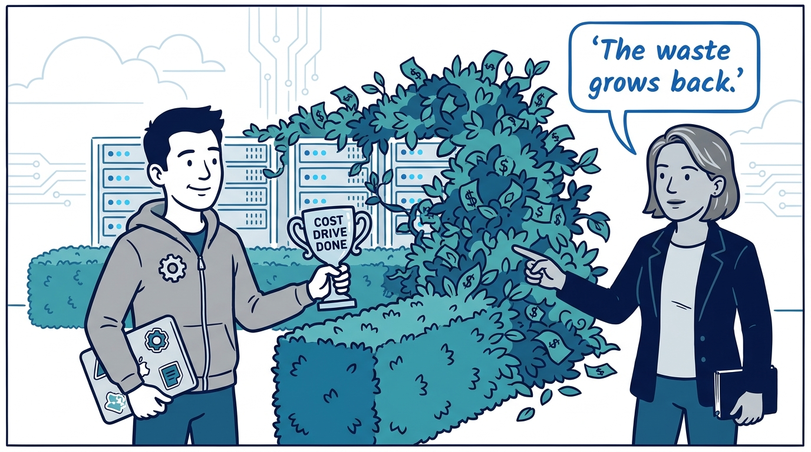
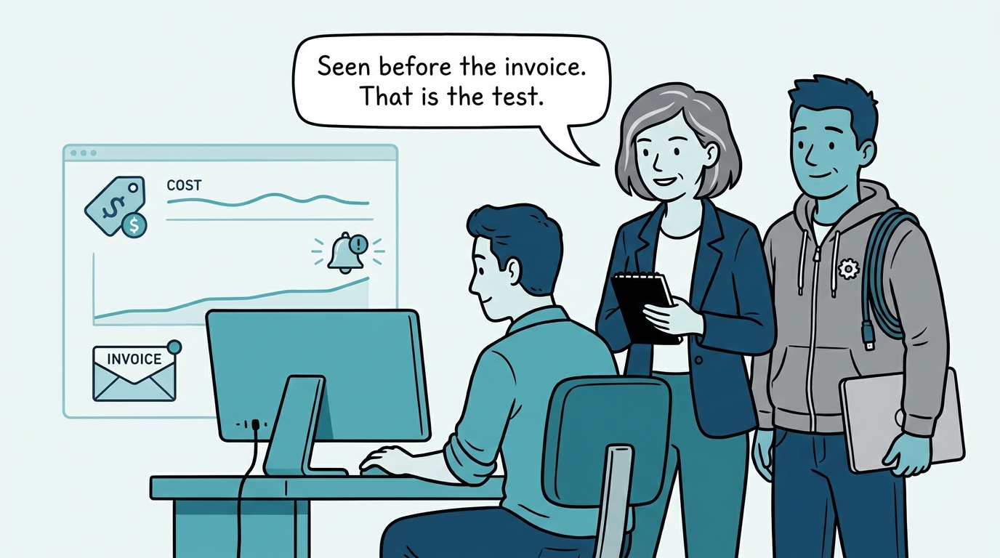

Why savings work never starts before the SLOs are on the table — in nine panels.

<!-- comic-style
{
  "cast": "VERA: a calm, seasoned engineering executive, short gray-streaked hair, dark blazer over a plain t-shirt, carries a small black notebook. KAI: a hands-on platform engineering lead, short dark hair, gray zip-up hoodie with a small gear pin, laptop covered in infrastructure stickers under one arm, a coil of cable slung over the shoulder.",
  "style": "Clean two-tone explainer comic, thick ink outlines, flat colors with deep blue and teal accents on a light background, generous white space, hand-lettered speech bubbles with SHORT readable text, no photorealism."
}
-->

**Panel 1:** *The hook: the month-end surprise — every cost spike discovered on the invoice, weeks after it started.*

**Panel 2:** *The problem: one org-level invoice and no attribution — cost stays finance's problem, and nobody who could fix it ever sees it.*

**Panel 3:** *The wrong way: the lowest bid — a cheaper platform that misses its latency target has not been optimized, it has been broken at a discount.*

**Panel 4:** *The principle: SLOs before savings — the question is never 'what is cheapest' but 'what is the cheapest way to meet the SLO the business needs.'*

**Panel 5:** *How it plays out: labels and showback turn one invoice into hundreds of small, ownable numbers — and the team that sees its own number is the team that fixes it.*

**Panel 6:** *The loop: baseline, rightsize, scale, measure — then run it again.*

**Panel 7:** *How it plays out: autoscaling earns trust by being load-tested against the SLO — the difference between having autoscaling and hoping for it.*

**Panel 8:** *The cost: the savings project with an end date — the waste grows back, because the forces that created it were never put under a standing loop.*

**Panel 9:** *The closer: the test that never stops running — can any engineer see what their workload costs today, and does a bad cost decision get caught before month-end?*
