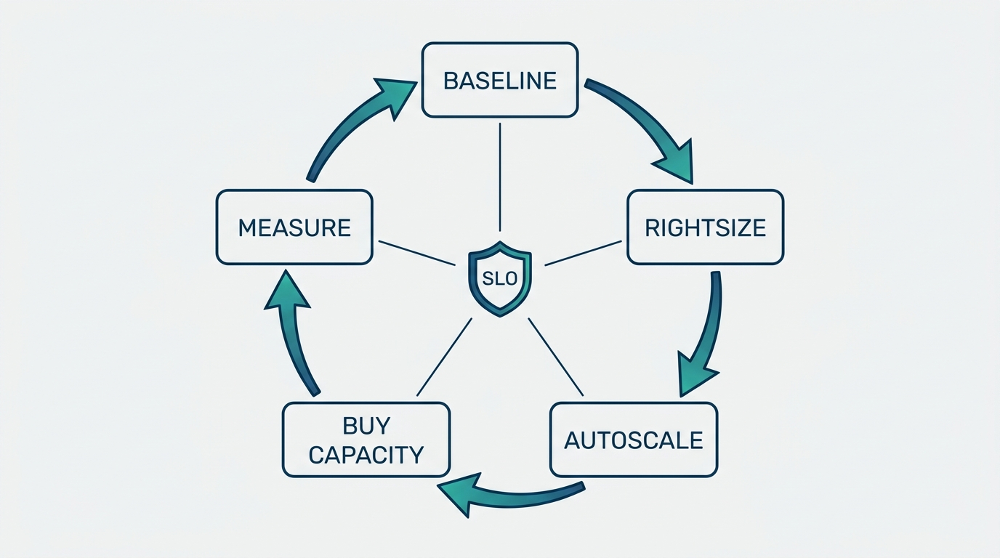
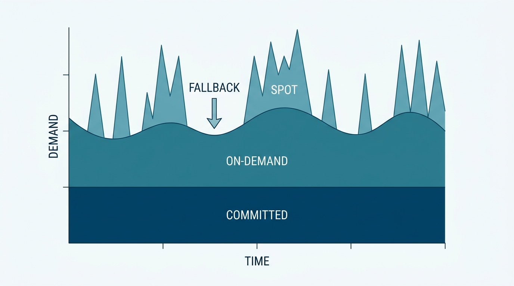
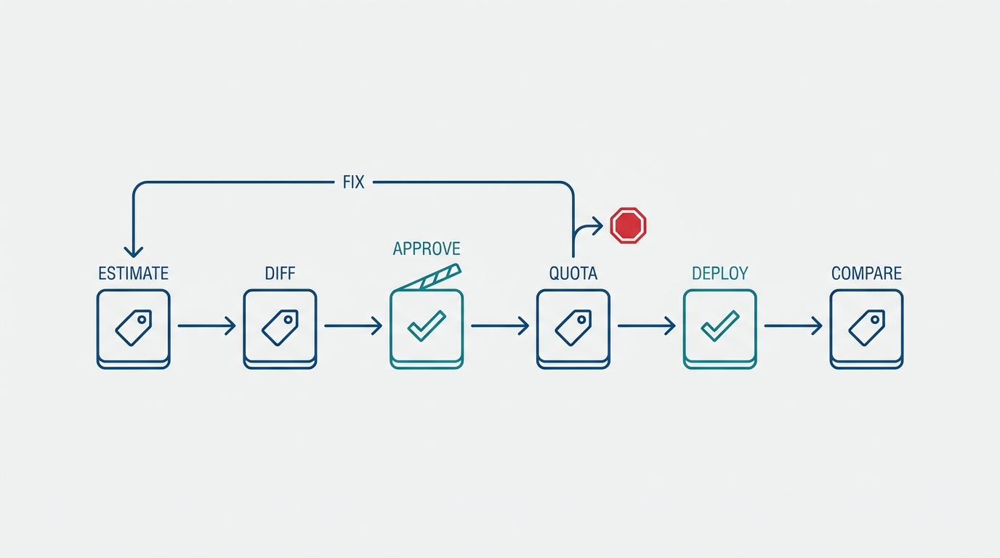

> **Status**: DRAFT
>
> **Principle**: When a platform team in my organization builds the cost, performance, and scalability capability, the finished build makes three things true at once. **Cost is visible and attributable** — every workload's spend is queryable, labeled to a team and cost center, and reported back through showback or chargeback. **Performance is defended, not assumed** — availability and latency SLOs are defined first, the cost of meeting each is calculated, trade-offs are explicit, and autoscaling is load-tested against those SLOs before it is trusted. **Consumption is bounded** — quotas, limit ranges, anomaly alerts, and CI/CD cost gates catch expensive mistakes before the invoice does. Optimization runs as a continuous loop — baseline, rightsize, scale, buy capacity at the right price, measure, repeat — never as a one-time savings project. The test I keep running: can any engineer see what their workload costs today, and does a bad cost decision get caught before month-end?

## Statement

When my organization builds this capability into a platform, this is the shape of the build I hold the team to.

**Goals and trade-offs come first:**

- **SLOs before savings.** Availability and performance SLOs are defined, with acceptable latency, throughput, and downtime named explicitly — and the cost of meeting each SLO is calculated, so the trade-off between cost, performance, and scalability is a decision, not an accident.
- **Cost justified by value, never by price alone.** Infrastructure spend is justified by the business value it delivers; nothing is chosen only because it is the cheapest option on the menu.

**Cost is observable and attributable:**

- **Every workload has a price tag.** Cloud-native cost reporting is on, and cluster-level cost visibility (OpenCost in the reference stack) makes CPU and memory cost queryable per workload.
- **Every price tag has an owner.** Consistent labels — team, cost center, business unit, application — are applied to namespaces and deployments, workload costs are allocated to specific teams or projects, dashboards make the numbers visible, and showback or chargeback reporting closes the loop.

**Optimization starts from a measured baseline:**

- **Baseline, then target.** The workload to optimize is chosen, its current hourly and monthly cost recorded, and a measurable reduction target set before anything is touched.
- **Profile before you cut.** Actual CPU and memory usage, peak periods, whether peaks coincide, and the gap between usage and configured requests are all measured first.

**Workloads are rightsized and scale on demand:**

- **Requests follow observed usage.** Oversized CPU and memory requests are reduced with reasonable headroom; the workload's bound — CPU, memory, I/O, or storage — determines the instance category, with automated instance selection (Karpenter) where it pays.
- **Horizontal scaling is configured and proven.** HPA carries sensible minimum and maximum replicas, utilization targets, safe scale-up and scale-down behavior, stabilization windows against thrash, and business-level metrics (requests per second, queue depth, active sessions) where CPU is the wrong signal — and it is tested under generated load against the SLO before it is trusted.
- **Vertical recommendations are observed before they are obeyed.** VPA runs in recommendation mode first, watches realistic behavior long enough to mean something, gets bounded by minimum and maximum limits, excludes containers that must not be touched, and the HPA-plus-VPA interplay is an explicit decision.

**Capacity is bought at the right price per stability class:**

- **On-demand for stability, spot for the fault-tolerant.** Stable baseline capacity runs on-demand or committed; spot capacity serves fault-tolerant workloads with interruption handling, taints and affinity for isolation, and fallback to on-demand — and never carries business-critical single replicas, uninterruptible long jobs, or latency-critical paths.
- **Commitments cover the true baseline only.** Committed-use discounts apply to predictable baseline load, never stretched over variable development, test, batch, or emerging workloads.

**Consumption is bounded and anomalies page someone:**

- **Quotas and limits by policy.** ResourceQuotas per team or namespace, LimitRanges with defaults, minima, and maxima, and mandatory CPU and memory requests — enforced by policy-as-code, not by convention.
- **Spikes are alerts, not invoices.** A normal cost baseline exists, unexpected spikes alert, thresholds are tuned to observed behavior, and runaway memory or CPU consumers get investigated while they are still small.

**Deployments expose their financial impact, and results are measured:**

- **The pipeline talks money.** Cost is estimated before production deployment, resource-request changes are diffed against the previous release, unusually large increases require explicit approval, quota-exceeding deployments fail with a clear remediation message, and estimated cost lands in pull-request and deployment summaries.
- **The loop closes.** Post-optimization cost is compared against the baseline, SLOs, latency, and autoscaling behavior are re-verified, remaining waste is identified, and the loop runs again. Optimization is a standing platform practice, not a project with an end date.

**Figure 1:** *Optimization runs as a closed loop — baseline, rightsize, scale, buy capacity at the right price, measure, repeat — with the SLOs as the fixed constraint every stage checks against.*

## How to Read This

This record is part of the **Reference Implementation** section of this journal — the how-it-concretely-looks companion to the Platform Engineering records. Where [[four-pillars]] states that a platform must get cheaper as adoption grows, this record shows what that pillar looks like as a build, end to end. It is grounded in the "Cost, Performance, and Scalability" chapter checklist of the *Platform Engineer's Handbook*, read as a practitioner-executive contract: when a platform team builds this capability, this is what done means. The runnable version — every step from SLO definition to the 30%-reduction exercise — lives in the **Checklist** tab; the **TL;DR** tab carries the management summary; the **Conversation** tab talks it through.

## Reference Stack

The handbook builds this capability on a concrete stack. I name it honestly as the worked example — the commitments above hold whatever tools implement them.

| Role | Reference tool | The property that matters |
| --- | --- | --- |
| Cost visibility | OpenCost + cloud-native cost reporting | Every workload's CPU and memory cost is queryable, not reconstructed from the invoice |
| Attribution | Kubernetes labels (team, cost center, business unit, application) | Every euro maps to an owner |
| Reporting | Grafana dashboards, showback/chargeback | Teams see their own spend without asking |
| Horizontal scaling | HPA, with custom business metrics | Replicas follow demand while holding the SLO |
| Rightsizing | VPA in recommendation mode, Goldilocks | Requests follow observed usage, not guesses |
| Instance selection | Karpenter | Node shapes follow workload profiles automatically |
| Capacity mix | On-demand / spot / committed-use | Each stability class pays its right price |
| Guardrails | ResourceQuotas, LimitRanges, Kyverno/Gatekeeper | Consumption is bounded by policy, not by convention |
| Cost gates | Pipeline cost checks and quota checks | Financial impact is visible before deploy, not after |
| Anomaly detection | Cost baseline + alerting | Spikes page someone; they do not wait for month-end |

## Rationale

**Cost work without SLOs is just a smaller number.** The chapter's first move is not a savings measure — it is defining availability and performance SLOs and calculating what meeting each one costs. That ordering is the whole discipline: a cheaper platform that misses its latency target has not been optimized, it has been broken at a discount. Making the trade-offs explicit also kills the lowest-price reflex, because the question is never "what is cheapest" but "what is the cheapest way to meet the SLO the business actually needs."

**You cannot allocate what you cannot see, and unallocated cost changes nobody's behavior.** An organization with one cloud invoice has one team that cares about cost: finance. Labels on every namespace and deployment, per-workload cost tracking, and showback or chargeback turn the invoice into hundreds of small, ownable numbers — and the team that sees its own number is the team that fixes it. Attribution is the mechanism that converts cost from an executive's problem into everyone's constraint.

**The baseline is what separates optimization from guessing.** Recording current cost, setting a measurable target, and profiling actual usage against configured requests before changing anything is what makes the eventual claim — "we cut this workload 30%" — a fact instead of a story. It also surfaces the most common finding in practice: requests sized by fear, provisioned for a peak that telemetry shows never coincides across resources.

**Autoscaling is a performance instrument before it is a savings instrument.** HPA earns trust by being load-tested against the SLO, not by existing; stabilization windows and safe scale behaviors are what keep it from thrashing exactly when traffic is least forgiving. VPA earns trust by watching first — recommendation mode, a realistic observation window, bounded limits, excluded sidecars — because a recommender that acts on a week it did not see is a new source of outages. The chapter's insistence on testing scaling under generated load is the difference between having autoscaling and hoping for it.

**Capacity pricing follows workload stability, not the other way around.** Spot capacity is a real discount with a real failure mode, so it carries only what tolerates interruption — with handling, isolation, and on-demand fallback built in — and never the business-critical single replica. Committed-use discounts are the same bet inverted: they pay off only on the true baseline, and committing variable or emerging workloads converts a discount into a liability. The mix is a design decision per stability class, revisited as the workload portfolio moves.

**Figure 2:** *Each stability class pays its right price: committed discounts cover only the true baseline, on-demand carries the variable load, and spot carries fault-tolerant bursts with fallback built in.*

**Guardrails and gates move the cost conversation to before the money is spent.** Quotas and limit ranges bound what any tenant can consume; policy-as-code makes declared requests non-optional; anomaly detection catches the leak and the runaway consumer while they are still cheap; and the CI/CD gates put the estimated cost of a change in front of the engineer who is about to make it — with an approval step for the big ones and a clear remediation message when a quota blocks the deploy. Every one of these moves the same conversation earlier: from the month-end invoice review to the pull request.

**Figure 3:** *The pipeline talks money: cost is estimated, diffed, approved, and quota-checked before deploy — and compared against the estimate after — so the conversation happens at the pull request, not at month-end.*

**Optimization is a platform practice, not a project.** The chapter closes its worked exercise the way I close every optimization round: measure against the baseline, verify the SLOs still hold, find the remaining waste, repeat. A one-time savings drive produces a one-time saving, and the waste grows back — because the forces that created it (fear-sized requests, unlabeled workloads, unwatched autoscalers) are still there. The capability this record describes is the standing loop that keeps them in check.

## What This Means in Practice

| What this record says | What it does **not** say |
| --- | --- |
| Define SLOs and calculate the cost of meeting each before optimizing. | Chase the lowest price — cheapest infrastructure that misses the SLO is a failure, not a saving. |
| Make cost visible and attributable per team via labels and showback/chargeback. | Use chargeback as a blame instrument — the number exists so the owning team can act on it. |
| Rightsize requests from observed usage, with reasonable headroom. | Strip headroom to the bone — the target is fit, not asphyxiation. |
| Configure HPA where extra replicas actually help, and load-test it against the SLO. | Autoscale everything by default — HPA on the wrong workload or the wrong metric is thrash, not elasticity. |
| Run VPA in recommendation mode first and adopt high-confidence recommendations. | Let a recommender resize production on day one, sidecars included. |
| Use spot for fault-tolerant workloads, with interruption handling and fallback. | Put business-critical single replicas or uninterruptible jobs on spot to hit a savings number. |
| Commit discounts on the true, predictable baseline. | Commit variable dev, test, batch, or emerging workloads — that turns a discount into a liability. |
| Gate deployments on cost estimates, request diffs, and quota checks — with a clear remediation path. | Block every cost increase — major increases need approval, not prohibition; growth that pays for itself is the point. |

Concretely: every platform in my organization that claims this capability can show me, on a dashboard, what any named workload costs today and which team pays for it; can show the load-test evidence behind its autoscaling; and can show the last optimization round's baseline, result, and SLO verification. **A cost story without a baseline is an anecdote.**

## Anti-Patterns

- **The lowest bid.** Choosing infrastructure on price alone, with no SLO on the table — the savings are real and so is the outage.
- **The invisible bill.** One org-level invoice, no labels, no attribution — cost stays finance's problem, and nobody who could fix it ever sees it.
- **Optimizing in the dark.** Rightsizing without a recorded baseline or a profiling window — changes nobody can verify, savings nobody can prove.
- **Scaling thrash.** HPA without stabilization windows or safe scale behaviors, never tested under load — an autoscaler that amplifies traffic spikes instead of absorbing them.
- **VPA on day one.** Turning a recommender loose on production before it has observed realistic behavior — resizing sidecars and all.
- **Spot roulette.** Business-critical single replicas and uninterruptible jobs on spot capacity, because the discount looked good in the spreadsheet.
- **The commitment trap.** Committed-use discounts stretched over variable and emerging workloads — paying steady-state prices for load that never became steady.
- **The quota-free commons.** No ResourceQuotas, no LimitRanges, requests optional — one team's memory leak is everyone's capacity problem.
- **The month-end surprise.** No cost baseline, no anomaly alerts — every spike discovered on the invoice, weeks after it started.
- **The savings project.** A quarterly cost-cutting drive with an end date — the waste grows back because the forces that created it were never put under a standing loop.

## Related Records

- [[four-pillars]] — pillar 3's economic signature (each new adopting team costs less than the last) is what this capability makes measurable and true; pillar 4's capacity management is what it operationalizes.
- [[operating-platforms]] — capacity and cost management as part of the standing operating discipline; this record is that discipline's cost loop made concrete.
- [[platform-success]] — the efficiency and cost metrics by which platform success is judged; this record builds the instrumentation behind them.
- [[observability-implementation]] — the telemetry stack this capability reuses to carry cost signals, dashboards, and anomaly alerts.
- [[policy-as-code]] — the enforcement machinery behind the quotas, limit ranges, and required requests this record mandates.
- [[cicd-as-a-platform-service]] — the pipeline into which this record's cost estimates, diffs, and quota gates are built.
- [[self-service-onboarding]] — the default quotas a new tenant receives at onboarding; this record governs how those bounds hold over time.
- [[resilience-automation]] — the failure-injection sibling: spot interruption handling built here is exercised there.

## Scope and Revisiting

This record is `draft`. It applies to every platform team in my organization that owns shared compute capacity or bills workloads to product teams, everywhere I am the accountable executive. I revisit it if cloud spend grows faster than platform adoption for two consecutive quarters (the loop is not running), if an optimization round ships without SLO re-verification (savings are being taken out of reliability), if cost anomalies keep being discovered on invoices rather than by alerts, or if teams start gaming quotas instead of negotiating them — which means the guardrails have become bureaucracy and need redesign, not more enforcement.

## Authoritative References

- *Platform Engineer's Handbook* — the "Cost, Performance, and Scalability" chapter and its checklist, which this record distills; the chapter's worked 30%-reduction exercise is reproduced in the Checklist tab.
