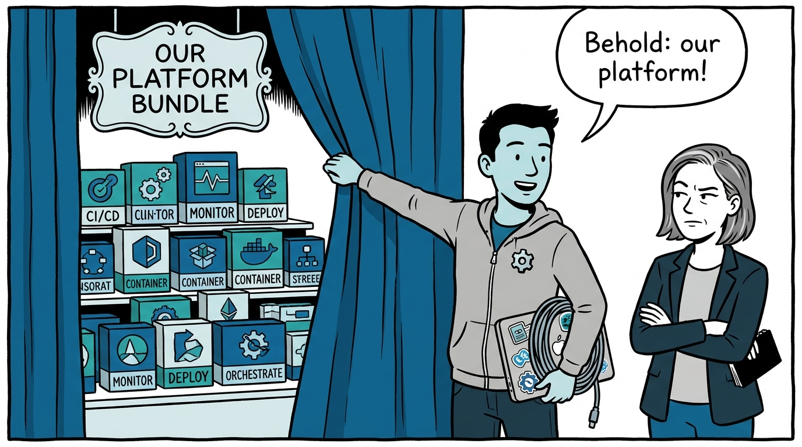
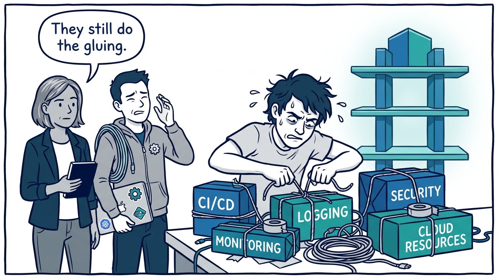
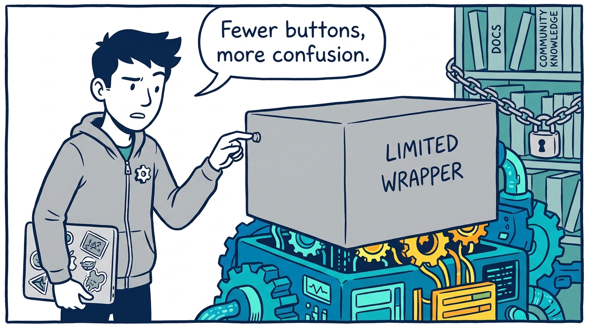
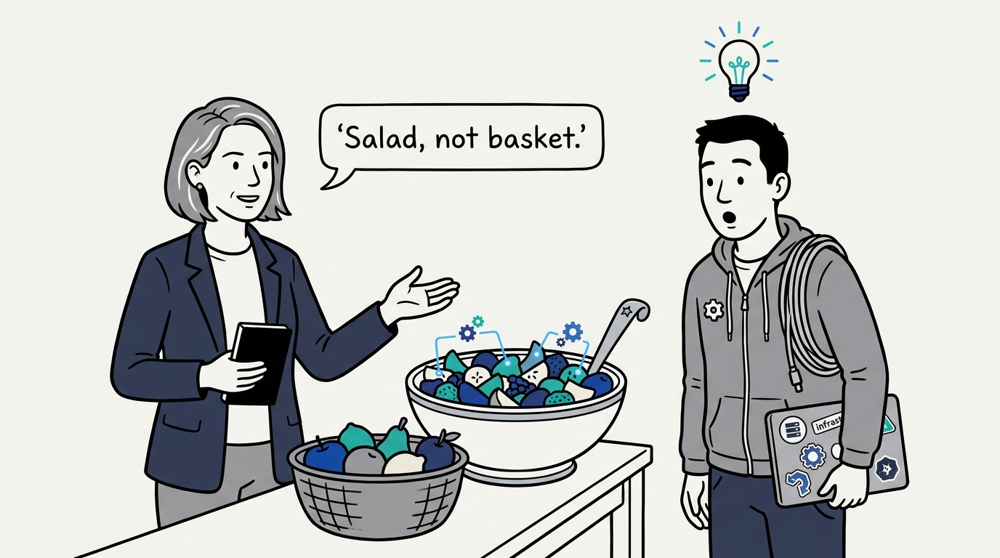
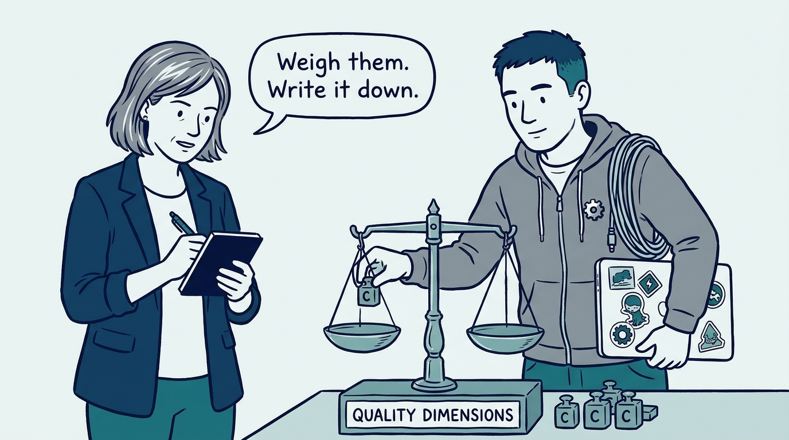
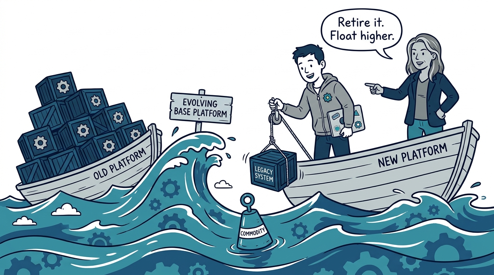
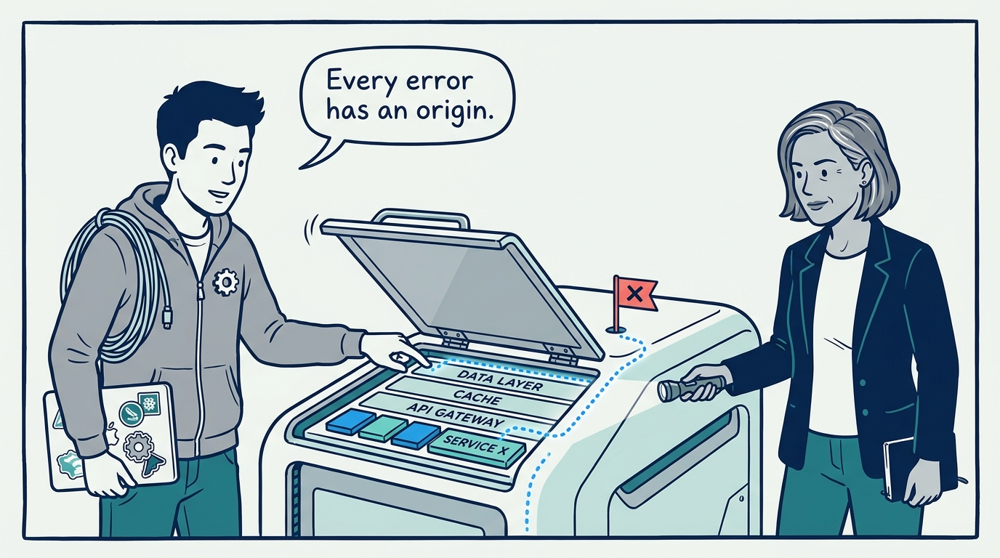
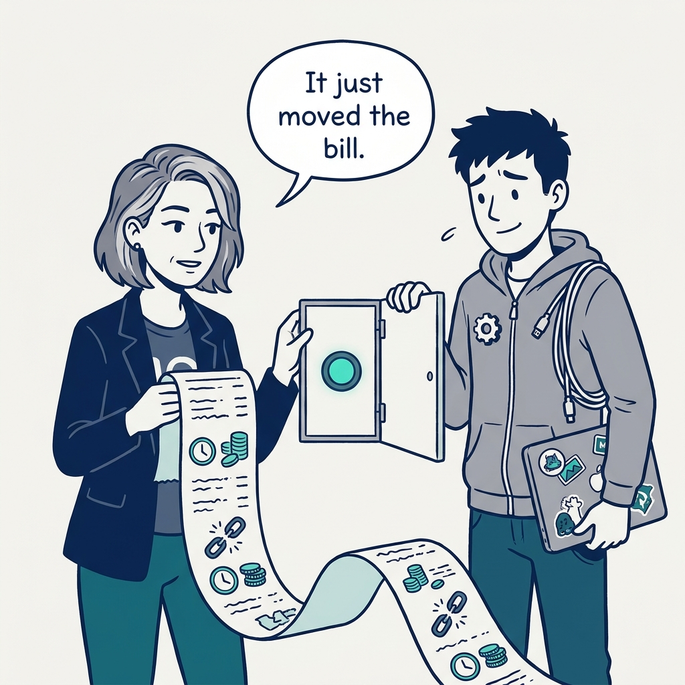

Why a platform is a fruit salad, not a fruit basket — in eight panels.

<!-- comic-style
{
  "cast": "VERA: a calm, seasoned engineering executive, short gray-streaked hair, dark blazer over a plain t-shirt, carries a small black notebook. KAI: a hands-on platform engineering lead, short dark hair, gray zip-up hoodie with a small gear pin, laptop covered in infrastructure stickers under one arm, a coil of cable slung over the shoulder.",
  "style": "Clean two-tone explainer comic, thick ink outlines, flat colors with deep blue and teal accents on a light background, generous white space, hand-lettered speech bubbles with SHORT readable text, no photorealism."
}
-->

**Panel 1:** *The hook: anyone can assemble a fruit basket — buy the tools, install them, publish a catalog page.*

**Panel 2:** *The problem: a basket adds almost nothing — users could have assembled it themselves, and now they carry our quirks on top.*

**Panel 3:** *The wrong way: the grim wrapper — fewer API calls, more cognitive load, lagging the platform it hides and severing users from its community.*

**Panel 4:** *The principle: a fruit salad, not a fruit basket — integration, defaults, automation, and information flowing between components.*

**Panel 5:** *How it plays out: the 7 Cs are trade-off dimensions — pick which matter most, document what you traded away.*

**Panel 6:** *How it survives: the base platform keeps rising — a floating platform retires what got commoditized underneath it; a sinking one only gains weight.*

**Panel 7:** *The cost of honesty: design for the unhappy path — errors trace to their origin, the hood opens, and someone still understands the layers below.*

**Panel 8:** *The closer: an abstraction that hides essential complexity has not simplified anything — it has just moved the bill.*
