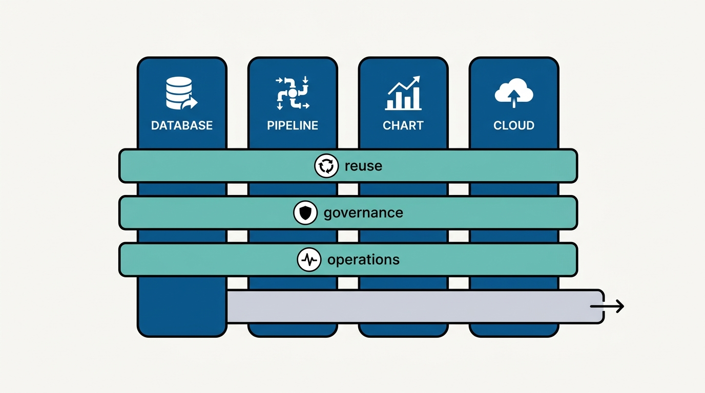
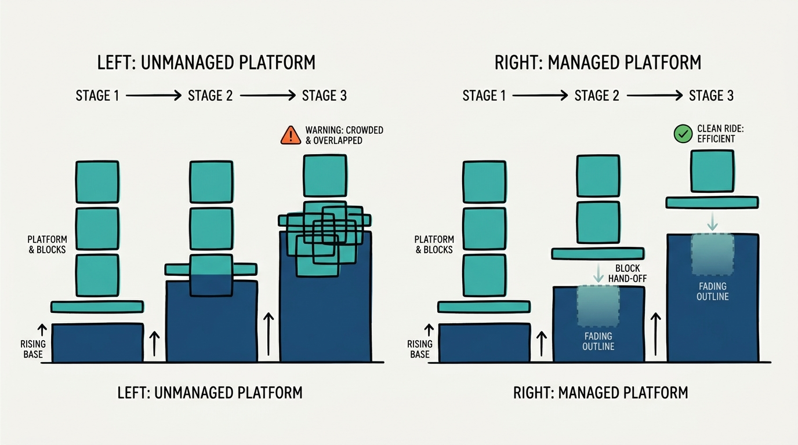
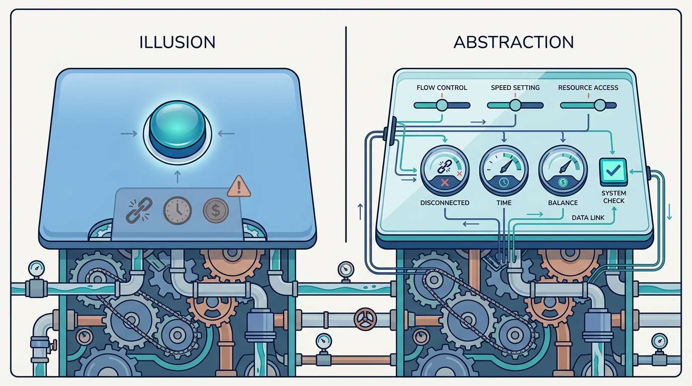

> **Status**: DRAFT
>
> **Principle**: I design platforms as fruit salads, not fruit baskets: the value must come from integration, defaults, automation, and reduced toil — not from cataloging tools that users could have installed themselves. The 7 Cs of platform quality are trade-off dimensions I weigh and document, not qualities to maximize. Every horizontal capability earns its existence through concrete user benefit; every wrapper is a last resort after configuration, hooks, and tracking; every abstraction speaks a higher-level domain vocabulary without becoming an illusion that hides essential complexity. The platform floats on its base by retiring what gets commoditized underneath it, and it is designed for failure, because an abstraction that hides essential complexity has not simplified anything — it has just moved the bill.

## Statement

My operating model for platform design has six commitments.

- **Weigh the 7 Cs; do not maximize them.** Cohesion, closure, completeness, consistency, commensurate value, connectedness, and captivity are dimensions for evaluating design trade-offs. I document which ones matter most for each platform and what we traded away — chasing all seven at once buys complexity, not quality.
- **Build a fruit salad, not a fruit basket.** The platform must provide more value than installing or cataloging existing tools: shared identity and conventions, sensible defaults, automation that kills repetitive work, information flowing between components, and toil visibly reduced. Users can start small and still get value.
- **Earn every horizontal capability.** The platform is vertical components joined by horizontal layers — and each horizontal layer exists only for a concrete reason: reuse, governance, or better operations. Standardization by architectural preference does not qualify.
- **Float; do not sink.** The base platform underneath us keeps evolving. When it commoditizes something we built, we retire our version, give users a migration path, and redirect the freed capacity — no sunk-cost reasoning, no platform that only gains weight.
- **No grim wrappers; abstractions, not illusions.** Before any new interface over an existing platform, I exhaust configuration, interception, and tracking. When we do abstract, the abstraction is a higher-level vocabulary grounded in a real domain — and essential characteristics such as failures, latency, and cost stay visible where users need them to make correct decisions.
- **Design for failure, not only the happy path.** Platform errors trace back to their lower-level origin, experienced users can open the hood, failure modes are documented as part of the abstraction, and we keep people who understand the layers underneath well enough to diagnose problems that cross them.

## How to Read This

This journal is my platform operating model, one record per source checklist. This record is grounded in the "Designing Platform" chapter checklist of Gregor Hohpe's *Platform Strategy: Innovation Through Harmonization* (Leanpub, 2024) — the chapter on what separates a platform that creates value from a bundle of tools with a portal in front. The runnable version — the 7 Cs assessment, the fruit-salad test, the wrapper interrogation, and the final go/no-go review — lives in the **Checklist** tab of this post.

## Rationale

**The fruit-salad test is the whole game.** Anyone can assemble a fruit basket: buy the tools, install them, publish a catalog page. Hohpe's point is that a basket adds almost nothing — users could have done the assembly themselves, and now they carry our version's quirks on top. A fruit salad is different: components are meaningfully integrated, defaults get people started quickly, automation removes manual glue, and information flows across the pieces — operational metrics linked to deployments linked to source changes. That integration work is invisible in an architecture diagram and decisive in daily use, which is why I measure platform features by user value delivered, never by how hard they were to build.

**Trade-off discipline beats quality maximization.** The 7 Cs give me a vocabulary for what "good" means — but a platform maximizing all seven collapses under its own ambition. Completeness fights simplicity; consistency fights the autonomy of individual components; low captivity fights deep integration. The chapter's framing is that these are dimensions to *evaluate trade-offs*, and the discipline I take from it is documentation: for each platform, we write down which Cs matter most and which we consciously sacrificed. A trade-off nobody wrote down gets relitigated in every design review.

**Horizontal layers are where platforms quietly rot.** Every architect is tempted to add shared layers — a common portal, a unified API, one identity for everything. Some of that is exactly what makes the salad a salad. But a horizontal capability that exists because of architectural preference rather than user benefit is pure coupling: it slows every vertical component's evolution and delivers nothing anyone asked for. So each horizontal layer must answer for itself — does it increase reuse, support necessary governance, or improve operations across components? If none of the three, it goes.

**Figure 1:** *Vertical components, horizontal capabilities: every horizontal layer earns its place through reuse, governance, or operations — an unjustified one goes.*

**Floating is a survival posture, not a nice-to-have.** Our platform sits on cloud and vendor platforms that ship features continuously. Every year, some of what we built becomes a commodity underneath us. A sinking platform keeps its duplicated functionality out of sunk-cost pride and pays twice: the maintenance cost of the redundant layer and the opportunity cost of the differentiated capability we did not build. A floating platform periodically compares itself against the base, retires what has been commoditized — with a migration path, not an ambush — and reinvests the freed capacity. This only works if components are modular enough to be replaced without cascading changes, which is itself a design requirement, not an afterthought.

**Figure 2:** *Float, do not sink: as the base platform commoditizes functionality, a floating platform retires its overlapping blocks and reinvests the capacity.*

**Wrappers and illusions are the two ways abstraction goes wrong.** The grim wrapper reduces the number of API operations while increasing cognitive load: it lags the fast-moving platform underneath, cuts users off from external documentation and community knowledge, flattens different technologies into a lowest common denominator, and adds one more component we must run, secure, and upgrade. The illusion is subtler: an interface that looks beautifully simple but hides retries, backpressure, timeouts, latency, and cost — exactly the things users need to reason about to build correct systems. A genuine abstraction does neither; it gives users a higher-level vocabulary rooted in a real domain and keeps the essential characteristics of the underlying system represented. If a "simple" interface needs extensive documentation to explain its hidden behavior, the model is wrong.

**Figure 3:** *Abstraction versus illusion: a genuine abstraction speaks a higher-level vocabulary while keeping failures, latency, and cost visible where users need them.*

**Failure is where the design is actually tested.** Abstractions are judged on the happy path and broken on the unhappy one. When a platform-level operation fails, the user's first question is *which underlying component did this* — and a platform without an equivalent of a stack trace turns every incident into archaeology. So I require error messages that preserve context, observability into the underlying components, documented failure modes, a recovery path, and open-the-hood access for specialists. And I keep people on the team who understand the underlying technology deeply, because someone has to diagnose the failures that cross abstraction boundaries.

## What This Means in Practice

| What this record says | What it does **not** say |
| --- | --- |
| Platform value comes from integration, defaults, and automation. | Bundling tools behind a catalog page is a platform — that is a fruit basket. |
| The 7 Cs are weighed, and the trade-offs are written down. | Every quality dimension gets maximized — that is how platforms drown in complexity. |
| Horizontal capabilities exist for reuse, governance, or operations. | Shared layers are justified by architectural elegance — preference is not a user benefit. |
| Commoditized functionality is retired, with a migration path. | We defend what we built because we built it — sunk cost is not a strategy. |
| Configuration, hooks, and tracking come before any new wrapper. | Every underlying tool gets hidden behind our universal interface. |
| Abstractions keep failures, latency, and cost visible where they matter. | A good abstraction makes complexity disappear — hiding essential complexity makes an illusion, not an abstraction. |
| Errors trace to their origin and specialists can open the hood. | The happy path is the design; failure handling is an operational detail. |

Concretely: every platform we run has a written statement of which Cs it optimizes and what it traded away, every proposed wrapper has survived the configuration-hooks-tracking interrogation first, and every platform-level error a user sees can be traced to the component that caused it. Once a year, at minimum, we list what the base platform commoditized and what we are therefore retiring — **a platform roadmap that only ever adds is a platform that is sinking**.

## Anti-Patterns

- **The fruit basket.** A catalog of installed tools presented as a platform — no shared identity, no defaults, no automation, no information flow. Users carry the integration burden themselves, plus our quirks.
- **The seven-C maximizer.** A design that tries to score top marks on every quality dimension and delivers complexity nobody can operate or evolve.
- **The org-chart horizontal.** A shared layer that exists because a team wanted a mandate, not because it increases reuse, governance, or operational quality.
- **The sinking platform.** Redundant functionality defended long after the base platform commoditized it — gaining weight every year, shedding nothing, funding maintenance instead of differentiation.
- **The grim wrapper.** A new interface over a fast-moving platform that lags its innovations, severs users from community knowledge, and adds an operational burden — while claiming to reduce cognitive load because it has fewer API calls.
- **The illusion.** An abstraction that pretends a distributed system is simple — hiding retries, partial failures, latency, and cost until the first serious incident reveals everything at once.
- **The opaque failure.** A platform-level error with no trace to the underlying cause, no hood to open, and no one left who understands the layers below.

## Related Records

- [[understanding-platforms]] — what platforms are and why harmonization beats standardization; this record applies that philosophy to concrete design decisions.
- [[platform-strategy]] — the strategic frame that decides what the platform should be; this record governs the quality of what gets designed inside that frame.
- [[implementing-platforms]] — the build, buy, and sizing decisions that turn a design into a running platform; this record is the design bar those implementations must meet.
- [[rearchitecting-platforms]] — the discipline of evolving a platform that already exists; the float-or-sink commitment here is what makes that evolution survivable.
- [[four-pillars]] — the platform-engineering pillar view of curated products and software abstractions; this record is the design doctrine behind the abstractions pillar.

## Scope and Revisiting

This record is `draft`. It governs the design of every internal platform where I am the accountable executive — developer platforms, data platforms, and shared service layers alike. I revisit it if a platform's adoption stalls while its component count grows (the fruit-basket signal), if incident reviews keep showing failures that cannot be traced across abstraction boundaries, or if the base platforms underneath us commoditize faster than our retirement discipline can keep up.

## Authoritative References

- Gregor Hohpe, *Platform Strategy: Innovation Through Harmonization* (Leanpub, 2024) — the "Designing Platform" chapter, whose checklist this record distills.
