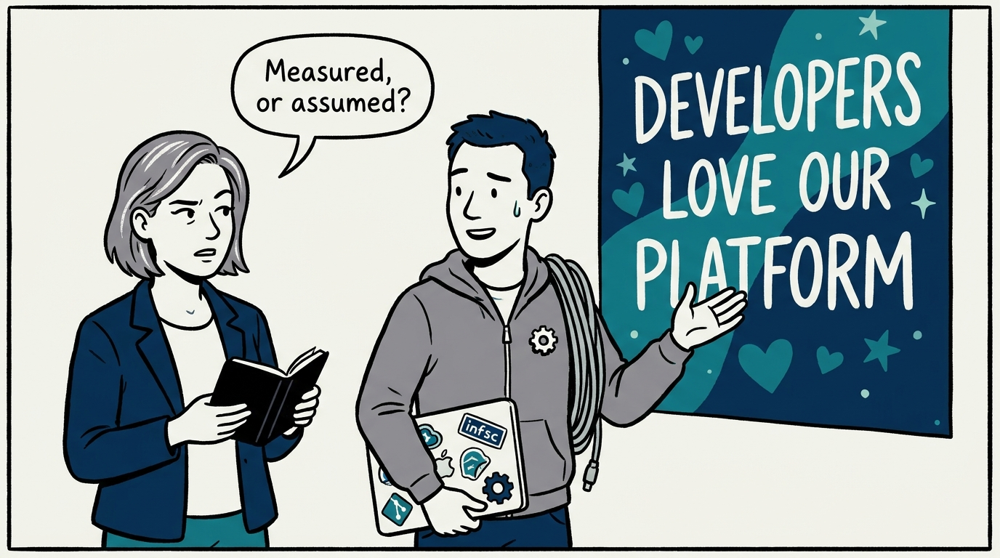
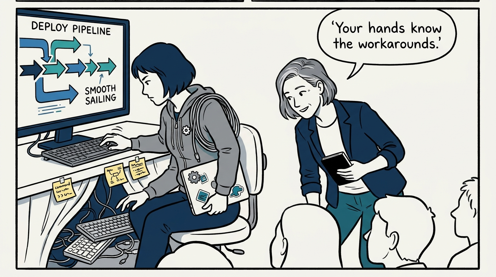
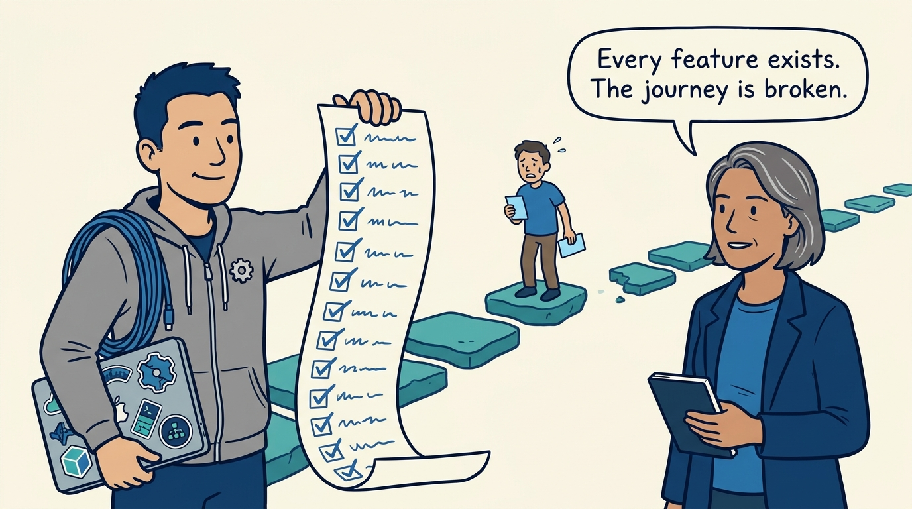
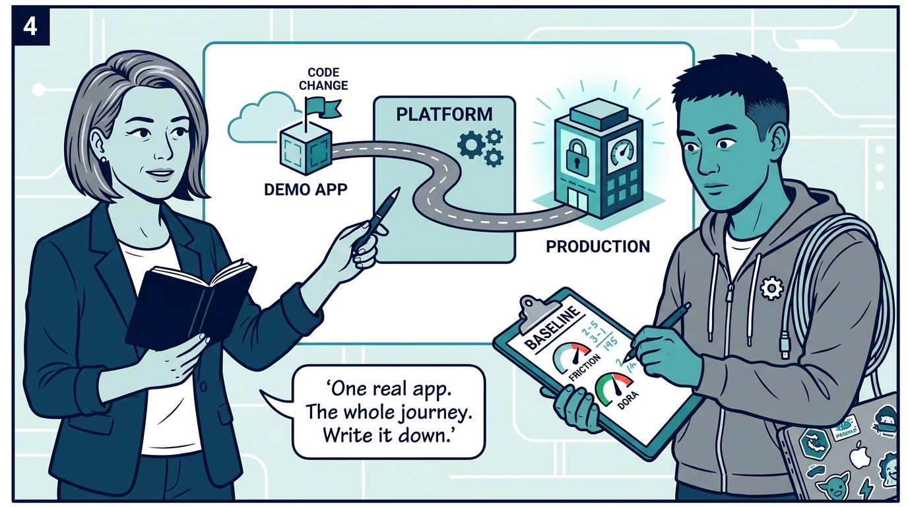
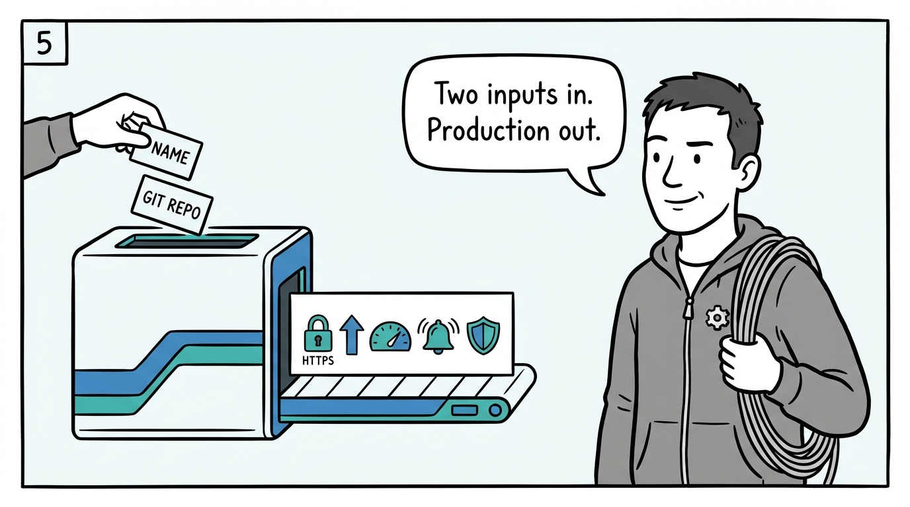
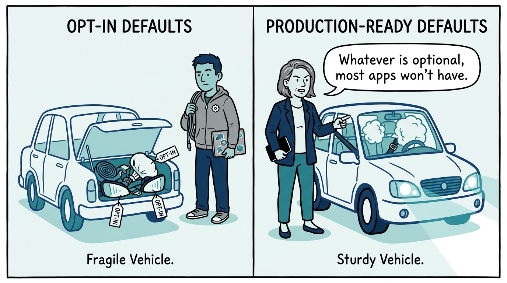
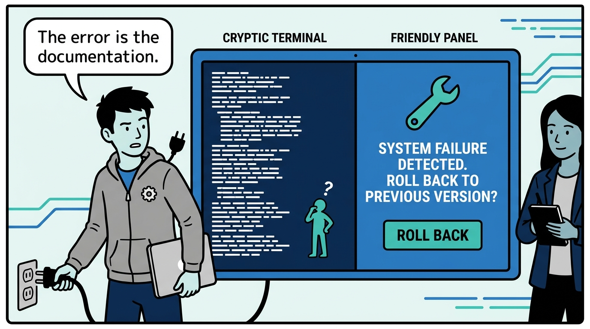
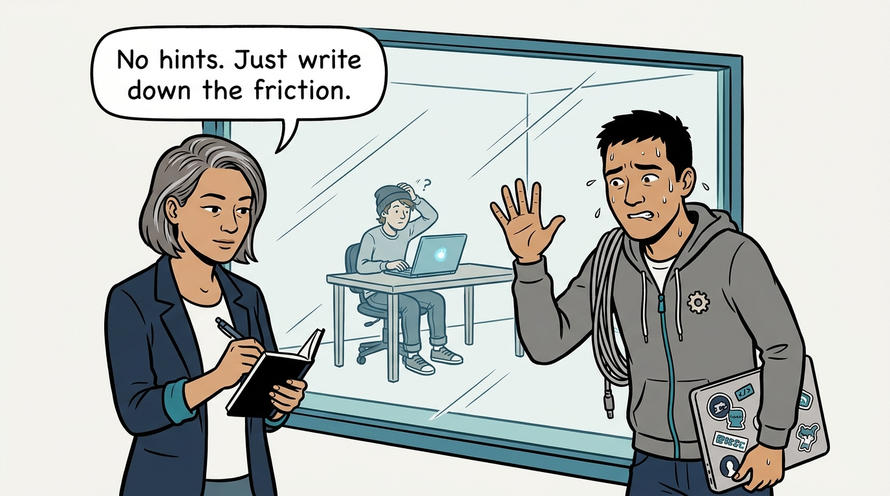
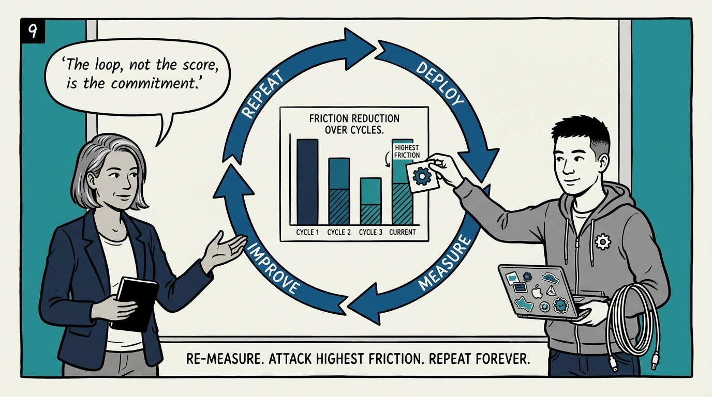

Why developer experience is measured, not assumed — and why a stranger is the final examiner — in nine panels.

<!-- comic-style
{
  "cast": "VERA: a calm, seasoned engineering executive, short gray-streaked hair, dark blazer over a plain t-shirt, carries a small black notebook. KAI: a hands-on platform engineering lead, short dark hair, gray zip-up hoodie with a small gear pin, laptop covered in infrastructure stickers under one arm, a coil of cable slung over the shoulder.",
  "style": "Clean two-tone explainer comic, thick ink outlines, flat colors with deep blue and teal accents on a light background, generous white space, hand-lettered speech bubbles with SHORT readable text, no photorealism."
}
-->

**Panel 1:** *The hook: every platform team believes developers love their platform — the question is whether that claim is measured or assumed.*

**Panel 2:** *The problem: the demo-day platform — the journey works flawlessly when the platform team drives, because their hands skip the friction.*

**Panel 3:** *The wrong way: the capability inventory — every feature can be present while the seams between them still cost three tickets and a YAML archaeology session.*

**Panel 4:** *The principle: deploy a realistic demo application through the entire journey — and record the baseline: friction, DORA metrics, efficiency, satisfaction, impact.*

**Panel 5:** *How it plays out: an application name and a Git repository in — a running, scaled, monitored, HTTPS-served application out. Every ticket in between is a named defect.*

**Panel 6:** *The defaults decide: probes, limits, scanning, TLS, observability — if they are opt-in, the median application runs fragile, dark, and exposed.*

**Panel 7:** *Break it on purpose: errors must read as human guidance at the point of failure — and rollback must be discoverable, tested, and ticket-free.*

**Panel 8:** *The final examiner: a developer who has never seen the platform, observed without handholding — everything else is the platform team grading its own homework.*

**Panel 9:** *The closer: one evaluation is an audit; the repeating loop — improve, re-measure, compare, attack the highest friction — is the operating practice.*
