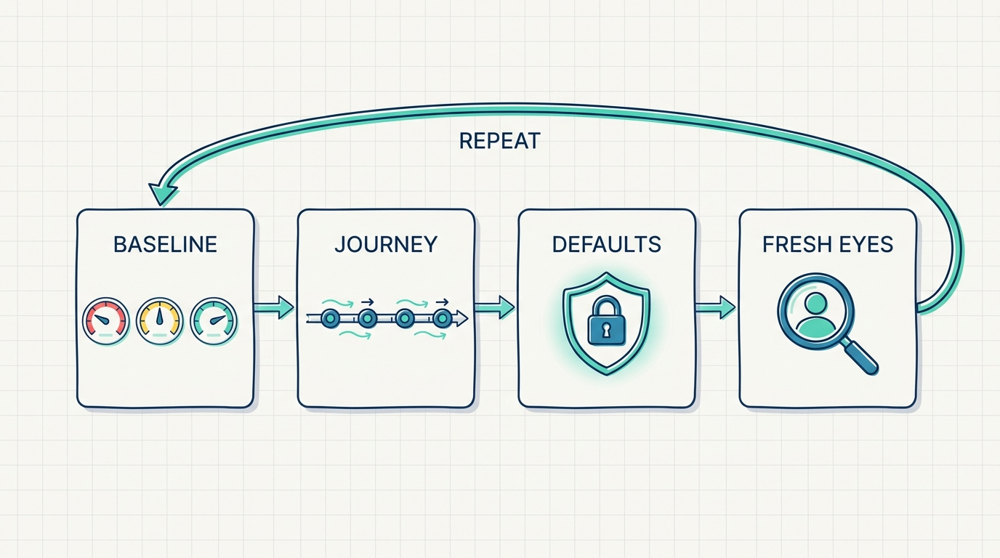
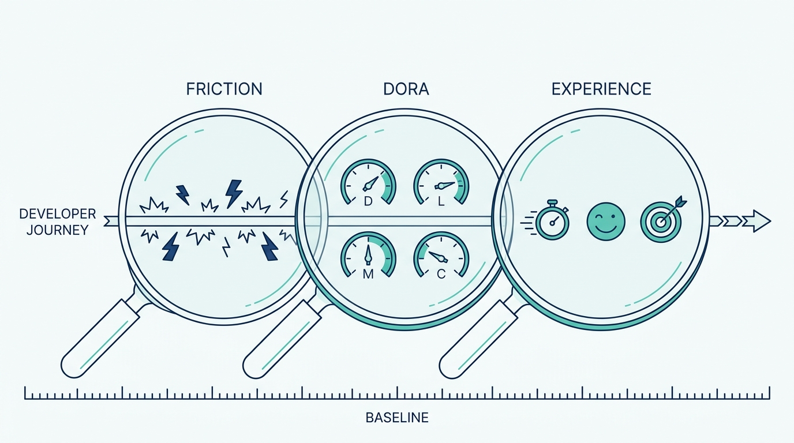
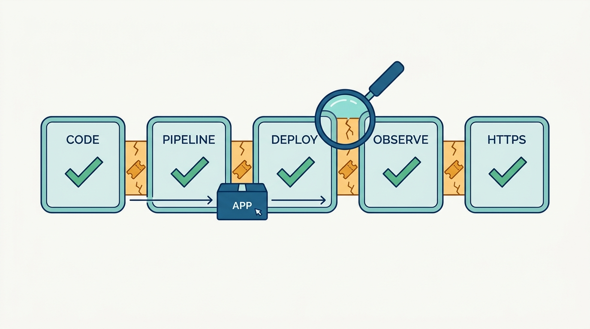

> **Status**: DRAFT
>
> **Principle**: When a platform team in my organization claims their platform serves developers, the claim is **measured, not assumed**. The instrument is a realistic demo application deployed through the **entire journey** — code change to running, monitored, HTTPS-served production application — recorded as a baseline: workflow friction, the four DORA metrics, and developer efficiency, satisfaction, and impact. The journey itself must pass the test at every station: a push that triggers the whole pipeline, **genuine self-service with no tickets**, production-ready and secure defaults that are on rather than optional, observability that works without asking, errors a developer can understand and recover from alone. Then the loop closes: improve, re-measure against the baseline, attack the highest remaining friction, repeat as the platform matures. The final examiner is a **developer who has never seen the platform**, shipping to production from minimal inputs — everything else is the platform team grading its own homework.

## Statement

My operating model holds every platform's developer experience to a four-part evaluation.

**Part 1 — Baseline before improvement:**

- **A realistic application is the instrument.** The evaluation deploys a real demo application through the platform and tests the complete developer journey, from code change to running application — not a slide, not a happy-path demo driven by the platform team.
- **The current experience is recorded first.** Workflow friction is measured and the high-priority bottlenecks named before any improvement work starts.
- **Three DevEx measures plus four DORA metrics.** Efficiency, satisfaction, and impact are tracked as the core developer-experience measures; deployment frequency, lead time, mean time to recovery, and change failure rate are captured as the delivery baseline.

**Part 2 — Every station of the journey passes:**

- **The pipeline runs itself.** A push triggers checkout, tests, linting and quality checks, build, container image, registry push, and deployment update — no manual intervention, GitOps keeping desired and actual state aligned, failed deployments can be rolled back, every action leaving an audit trail.
- **Self-service is genuine.** No tickets, no unnecessary approvals, no manual infrastructure configuration; at least one simple touchpoint (CLI, UI, or API); templates for common application types; resources provisioned from application requirements; configuration validated and manifests generated automatically; organizational policies applied without asking; endpoints and monitoring available the moment the deployment lands.
- **Minimal inputs, complete result.** A developer deploys from an application name and a Git repository — and the platform fills in namespace, build, replicas, autoscaling, ingress, HTTPS, monitoring, alerts, backups, security scanning, network policies, and secret rotation.

**Part 3 — The defaults — and the paved surroundings — are production-grade:**

- **Containers are production-ready by construction.** Reproducible multi-stage builds, non-root execution, only required runtime files, health checks, resource requests and limits, liveness and readiness probes, no privilege escalation, read-only root filesystems, dropped capabilities.
- **Security is in the workflow, not after it.** Images scanned for CVEs, committed secrets detected, RBAC validated, policies and network policies applied automatically, overly permissive access and exposed internal services caught, HTTP-only access remediated — all before production.
- **Observability works without asking.** Vendor-neutral instrumentation captures metrics, logs, and traces automatically; HTTP and database telemetry, custom spans and metrics, recorded exceptions, cross-service propagation — and structured logs carry trace and span IDs so a developer moves from a log line to the trace in one step.
- **Public access and HTTPS are declarative.** Developers request public access without touching ingress controllers, gateways, DNS, or routing; certificates are provisioned, renewed, stored, and monitored automatically. HTTPS is the path of least resistance, and certificate expiry is never a developer-facing incident.
- **Environments are part of the experience.** Preview environments with auto-generated PR URLs, full-stack local development that supports debugging, parity between the two — same variable names, same service discovery, sample data that works in both — with documented usage and TTLs that keep preview costs bounded.
- **Paved paths actually pave.** Service templates ship with CI/CD, health checks, metrics endpoints, and security scanning pre-configured, encoding organizational best practice so no developer recreates common patterns by hand.

**Part 4 — Fresh eyes, then the loop:**

- **Failure is part of the experience.** Realistic failures are triggered deliberately: errors must be understandable without deep Kubernetes knowledge, translated into human language with remediation guidance at the point of failure; rollback is self-service, discoverable, tested, and ticket-free; autoscaling holds under a significant traffic increase.
- **A stranger runs the gauntlet.** A developer unfamiliar with the platform completes the workflow without handholding, while the team records delight, confusion, and friction — and every step that required infrastructure knowledge, another team, or manual configuration.
- **The loop closes and reopens.** After improvements, the same deployment is repeated, every measure re-taken and compared with the baseline, the highest-friction steps prioritized, and the evaluation repeated as the platform matures.

**Figure 1:** *The four-part evaluation: record a baseline, pass every station of the journey, hold the defaults to production grade, then let fresh eyes close the loop.*

## The Reference Stack

This record is grounded in a concrete end-to-end build; the tools below are that build's answers, not mandates. **The commitments hold at the capability level** — swap any tool as long as the property in the third column survives.

| Role | Reference tool | The property that matters |
| --- | --- | --- |
| Deployment pipeline | CircleCI | A push triggers test, build, image, registry, and deploy with no manual step |
| Deployment sync | Flux (GitOps) | Desired and actual state stay aligned; rollback and audit trail come free |
| Developer touchpoint | Backstage (plus CLI/API) | Deploy and observe without tickets or platform-team hand-holding |
| Instrumentation | OpenTelemetry | Vendor-neutral traces, metrics, and logs collected automatically |
| Telemetry backend | Prometheus + Grafana | Exported metrics are verifiably visible, not just emitted |
| Certificates | cert-manager + ACME CA | HTTPS provisioned, renewed, and monitored without developer action |
| Ingress and routing | Istio | Public access is declarative; gateway and routing complexity stays hidden |
| Delivery measures | DORA metrics | Deployment frequency, lead time, MTTR, change failure rate — comparable over time |

## How to Read This

This record is part of the **Reference Implementation** section of this journal — the how-it-concretely-looks companion to the Platform Engineering records. Where [[four-pillars]] states the qualification test for a platform, this record makes its third pillar — a broad developer base served through self-service — **falsifiable for one concrete build**, and gives [[platform-as-a-product]]'s feedback discipline an executable form. It is grounded in the Developer Experience Evaluation chapter of the *Platform Engineer's Handbook*. The runnable version — all sixteen evaluation stations and the final success criteria — lives in the **Checklist** tab; the **TL;DR** tab carries the management summary, and the **Conversation** tab talks the argument through.

## Rationale

**A baseline turns DevEx from vibes into engineering.** Without a recorded before, every improvement claim is unfalsifiable and every roadmap fight is won by the loudest anecdote. The baseline is deliberately plural — friction points, the four DORA metrics, and efficiency, satisfaction, and impact — because each catches what the others miss: DORA numbers can look healthy while developers drown in toil, and satisfaction can be high on a platform that ships slowly. Measured together, before and after, they make DevEx investment **an engineering activity with a regression suite**.

**Figure 2:** *The baseline is deliberately plural: friction points, the four DORA metrics, and efficiency, satisfaction, and impact each catch what the other lenses miss.*

**The demo application is the honest instrument.** Platforms are evaluated the way software is tested: by running a realistic workload through the whole system, not by inspecting the parts. A capability inventory can be complete while the journey is broken — every feature present, and still three tickets, two Slack asks, and a YAML archaeology session between a code change and production. Testing the **complete journey** is what surfaces the seams between capabilities, and the seams are where developer experience actually lives.

**Figure 3:** *Every capability can pass while the journey fails: friction hides in the seams between stations, and only a realistic application traveling end to end surfaces them.*

**Self-service is a testable claim, not a mission statement.** The test is brutal and simple: an application name and a Git repository in — a running, scaled, monitored, HTTPS-served, policy-compliant application out. Every ticket, approval, or manual configuration step between those two points is a named defect. This is also where velocity and governance stop being a trade-off: policies, scanning, and network rules are **applied by the platform, invisibly**, so the fast path and the compliant path are the same path.

**Defaults decide the real experience.** Whatever the platform makes optional, most applications will not have. If probes, resource limits, security scanning, TLS, and observability are opt-in features, the platform's median application is fragile, dark, and exposed — and the developer finds out during an incident. The record therefore holds the platform to **production-ready defaults that are on**: the developer who does nothing extra still gets a production-grade result, and observability that provides value immediately, not after an instrumentation sprint. Log-trace correlation earns its own line because it is where observability becomes usable: a developer who can move from a log entry to the trace in one step debugs alone; one who cannot files a ticket.

**Errors are documentation at the point of need.** The evaluation deliberately breaks things, because the failure path is the part of the experience the platform team never sees in demos. An error that requires deep Kubernetes knowledge to interpret is a tax the platform charges precisely when the developer is most stressed. Translated errors with remediation guidance at the point of failure — and a rollback that is discoverable and ticket-free — are what let developers **recover from their own mistakes without an operations ticket**, which is the difference between a platform that reduces cognitive load and one that redistributes it.

**Fresh eyes are the only honest reviewers.** The platform team cannot evaluate its own experience; they know the workarounds, so their hands skip the friction. A developer who has never seen the platform, observed without handholding, is the closest thing to an objective instrument the evaluation has — and the recording discipline (delight, confusion, friction; every step needing infrastructure knowledge, another person, or manual work) turns the observation into a work queue.

**The loop is the point.** One evaluation is an audit; the repeated loop — improve, re-deploy the same application, re-measure everything, compare, attack the highest remaining friction — is an operating practice. Platforms drift as they grow, and the loop is what keeps the DevEx claim **continuously true rather than historically true**.

## What This Means in Practice

| What this record says | What it does **not** say |
| --- | --- |
| Measure DevEx with a baseline and re-measure after improvements. | Chase metrics for their own sake — the numbers exist to rank friction, not to decorate dashboards. |
| Test the complete journey with a realistic demo application. | A capability inventory is enough — features can all exist while the journey between them is broken. |
| Deploy from minimal inputs with no tickets or manual approvals. | Approvals never exist — unnecessary ones are eliminated; the ones policy genuinely requires are automated into the workflow. |
| Production-ready and secure defaults are on for everyone. | Developers cannot deviate — defaults are the paved path, not a locked gate. |
| Errors are translated, with remediation at the point of failure. | Developers never need to learn anything — the platform removes *infrastructure-specific* knowledge from the critical path, not engineering judgment. |
| A developer who has never seen the platform is the final examiner. | The platform team's own testing is worthless — it is necessary, and insufficient. |
| Repeat the evaluation as the platform matures. | One good evaluation earns a permanent DevEx claim — the loop, not the score, is the commitment. |

Concretely: no platform in my organization graduates to onboarding teams at scale until its team can show a baseline, a re-measurement, and the delta between them — and until one developer outside the platform team has gone from a Git repository to a monitored production application **without a single ticket**.

## Anti-Patterns

- **The vibes-based DevEx.** Improvement priorities set by the loudest recent complaint — no baseline, no re-measurement, no way to know whether last quarter's investment changed anything.
- **The demo-day platform.** The journey works flawlessly when the platform team drives it, and has never been attempted by a developer who does not know the workarounds.
- **The ticket behind the curtain.** "Self-service" that quietly ends in a Slack ask, a manual approval, or a platform engineer running a script — the ticket still exists; it just changed clothes.
- **The optional seatbelt.** Probes, limits, scanning, TLS, and monitoring shipped as opt-in features — so the median application runs fragile, dark, and exposed, and the developer discovers it mid-incident.
- **The kubectl oracle.** Errors surfaced as raw infrastructure output, readable only through deep Kubernetes knowledge — the platform charges its highest cognitive tax at the developer's worst moment.
- **The environment lottery.** Local, preview, and production drift apart — different variable names, different service discovery, different data — until "works on my machine" becomes the platform's most-used feature.
- **The dashboard graveyard.** Telemetry is exported but never verified visible or useful; observability exists on the architecture diagram and nowhere a developer actually looks.
- **The single audit.** One thorough evaluation at launch, framed as a certificate — while the platform, its users, and its friction keep moving.

## Related Records

- [[four-pillars]] — the qualification test this evaluation makes concrete: pillar 3 (a broad, self-served developer base) rendered falsifiable for one build.
- [[platform-as-a-product]] — the product operating mechanics whose feedback loop this evaluation instruments.
- [[platform-success]] — the organization-level success measures; this record is the hands-on loop that feeds them.
- [[cicd-as-a-platform-service]] — the sibling build record for the pipeline this evaluation exercises end to end.
- [[observability-implementation]] — the sibling build record for the telemetry stack; here it appears as what every application gets by default.
- [[platform-security]] — the sibling build record for platform hardening; here security appears as checks the developer never has to notice.
- [[starter-kits]] — the sibling build record for the templates this evaluation validates from the developer's seat.
- [[self-service-onboarding]] — the sibling record for the day-zero flow; this record tests the workflow that onboarding hands developers into.

## Scope and Revisiting

This record is `draft`. It applies to every internal platform my organization runs application workloads on, from the first moment the platform claims to serve developers. I revisit it if re-measurement rounds stop happening (the loop decaying into a launch audit), if DORA numbers improve while satisfaction and friction measures worsen (the metrics being gamed rather than the experience improved), or if the fresh-eyes test repeatedly requires intervention from the platform team — which means the platform's real interface is still its people.

## Authoritative References

- *Platform Engineer's Handbook* — the Developer Experience Evaluation chapter, whose checklist this record distills; part of the end-to-end reference build this journal's Reference Implementation section follows.
