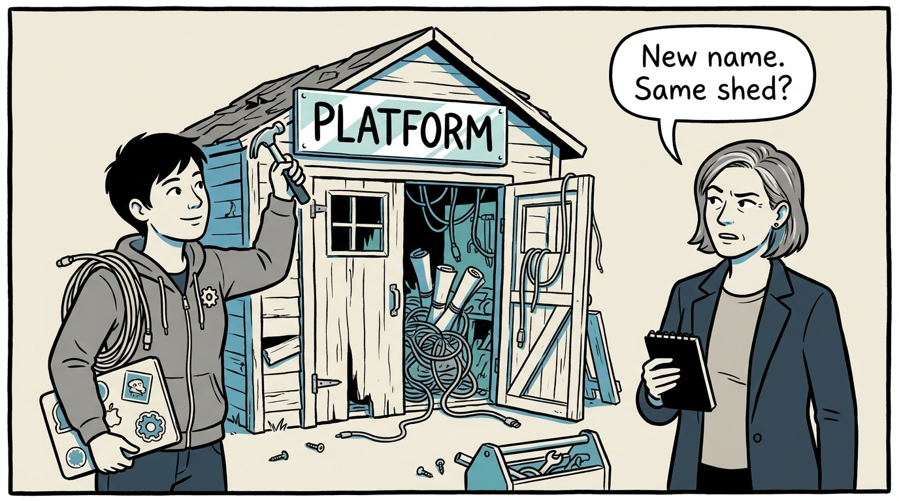
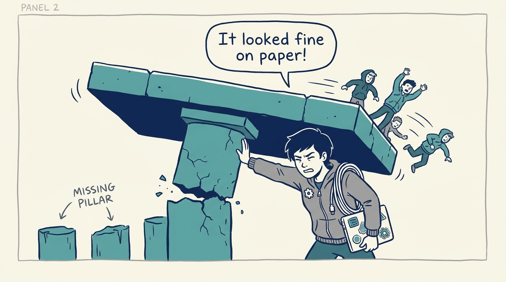
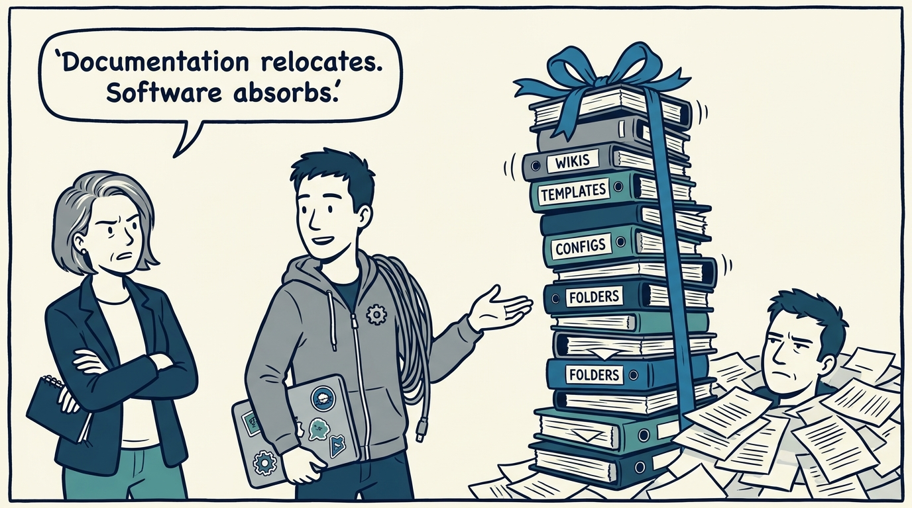
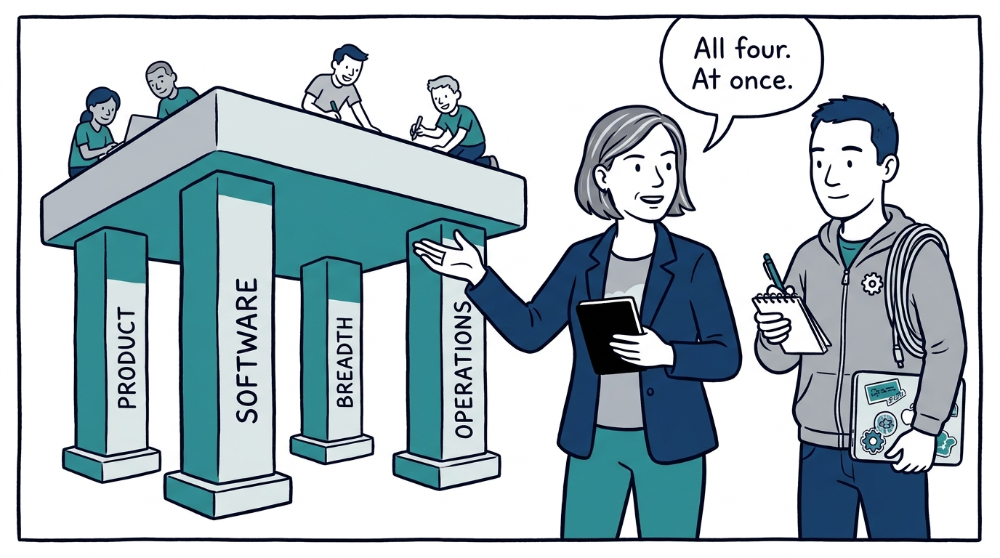
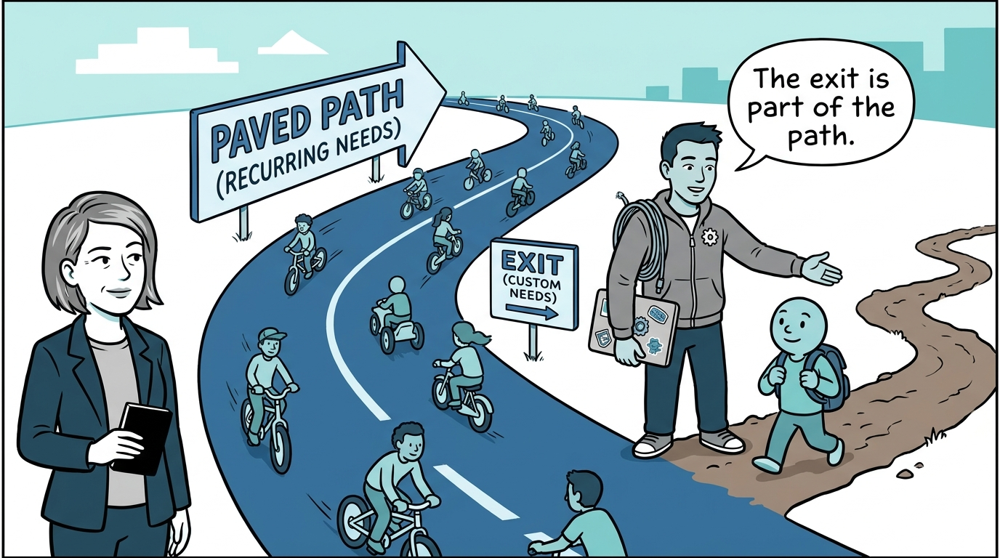
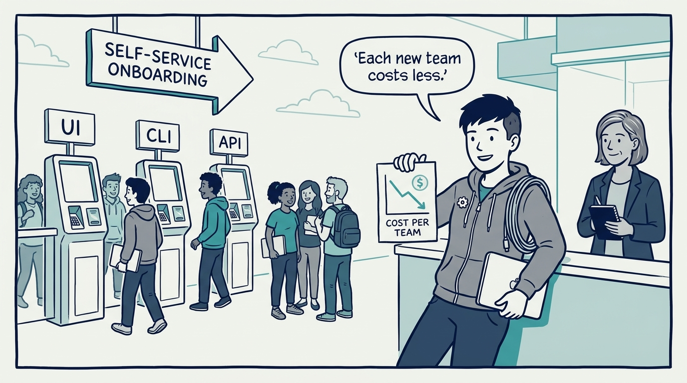
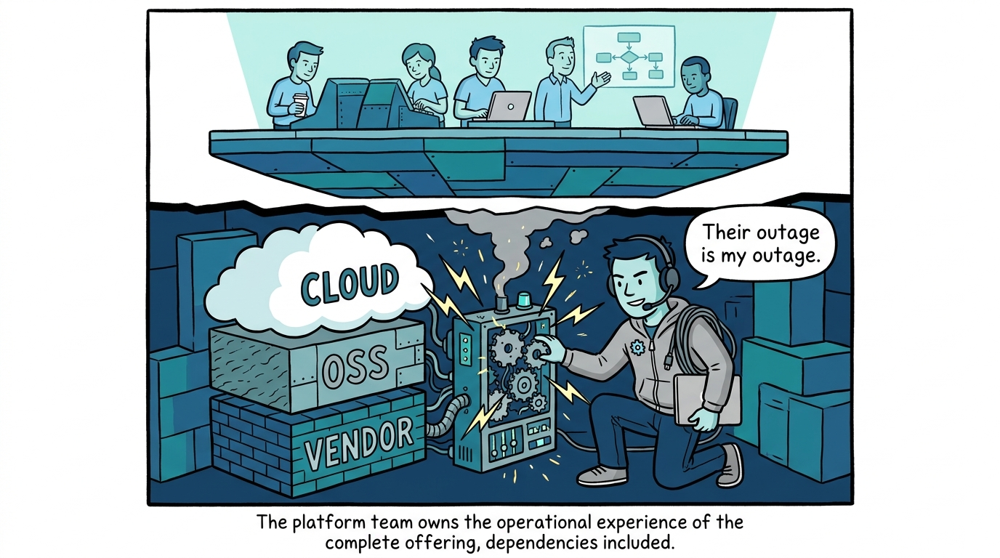
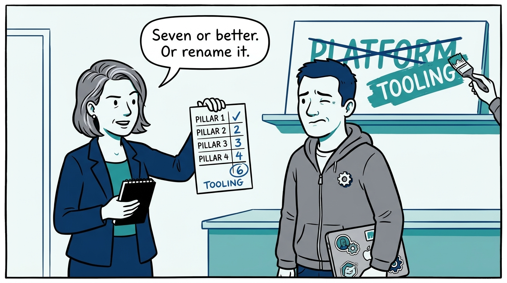
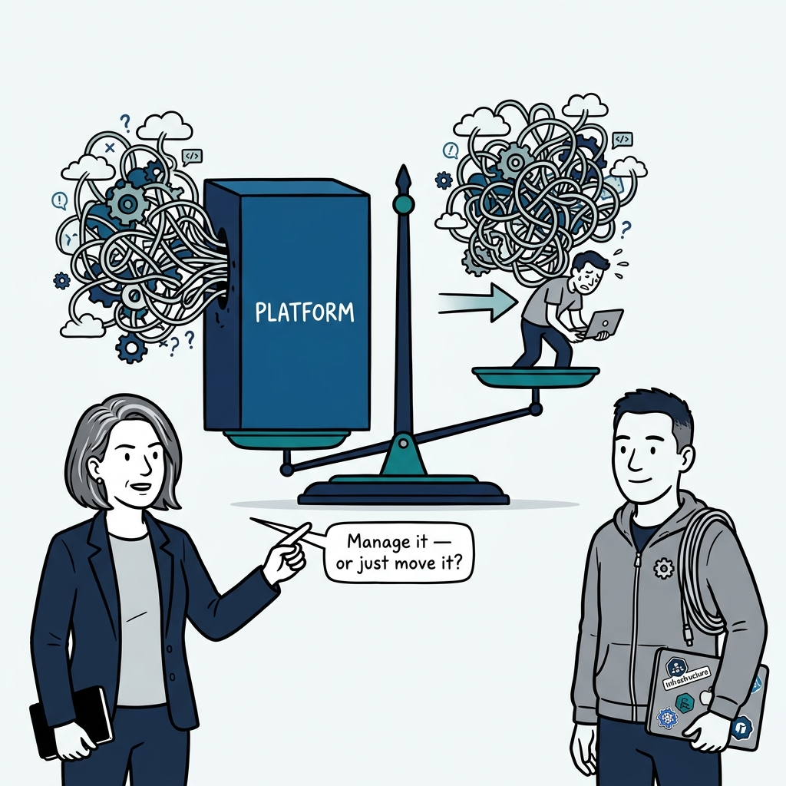

Why nothing gets called a platform until it stands on all four pillars — in nine panels.

<!-- comic-style
{
  "cast": "VERA: a calm, seasoned engineering executive, short gray-streaked hair, dark blazer over a plain t-shirt, carries a small black notebook. KAI: a hands-on platform engineering lead, short dark hair, gray zip-up hoodie with a small gear pin, laptop covered in infrastructure stickers under one arm, a coil of cable slung over the shoulder.",
  "style": "Clean two-tone explainer comic, thick ink outlines, flat colors with deep blue and teal accents on a light background, generous white space, hand-lettered speech bubbles with SHORT readable text, no photorealism."
}
-->

**Panel 1:** *The hook: the platform badge — renaming a tooling team 'platform' changes the sign, not what it builds, runs, or serves.*

**Panel 2:** *The problem: most failed platforms are strong on one pillar and absent on the rest — a curated catalog nobody can self-serve, an abstraction nobody operates.*

**Panel 3:** *The wrong way: the documentation platform — wikis, templates, and config repos relocate and annotate complexity; only real software absorbs it.*

**Panel 4:** *The principle: curated product, software abstractions, a broad developer base, operated as a foundation — a conjunction, not a menu.*

**Panel 5:** *Pillar one in action: the paved path is the product — and a paved path without an exit is a cage, so the exit is marked, not forbidden.*

**Panel 6:** *Pillar three in action: self-service onboarding, multiple interfaces, guardrails — and economics where each new adopting team costs less than the last.*

**Panel 7:** *Pillar four in action: the platform team owns what breaks, all the way down through cloud, OSS, and vendor layers — that ownership is what makes the other pillars credible.*

**Panel 8:** *The cost: the scorecard is a truth serum — four questions, scored 0–2; score low and the honest move is to rename the offering and fund it as what it is.*

**Panel 9:** *The closer: the test that never stops running — does the platform manage complexity for application developers, or merely move it somewhere else?*
