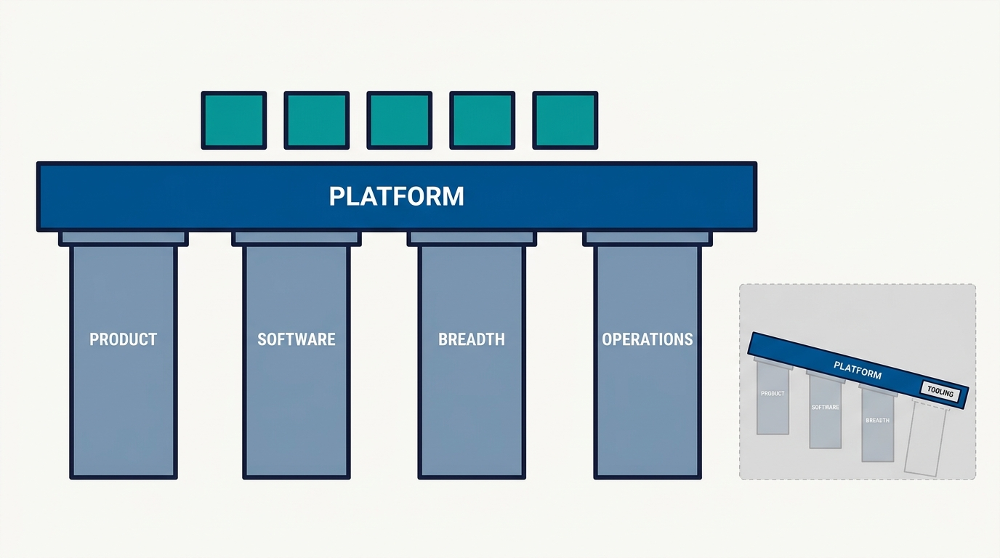
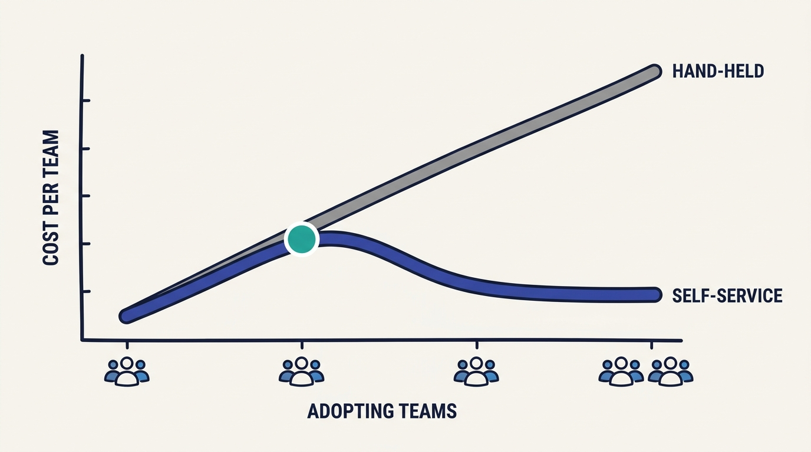
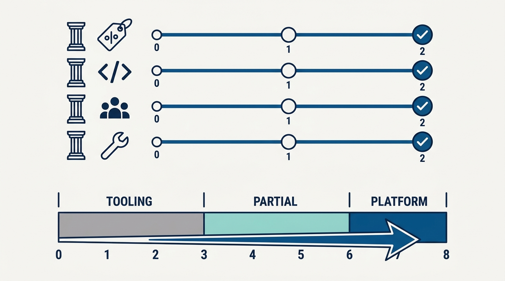

> **Status**: DRAFT
>
> **Principle**: I call something a platform only when it stands on four pillars at once. It is a **curated product** — an opinionated offering with paved paths, shaped by customer needs rather than technical preference. It is built on **software abstractions** — real software by real engineers that genuinely manages complexity, not documentation stapled to configuration. It serves a **broad base of application developers** — self-service, multiple interfaces, guardrails, and multitenancy that makes it cheaper as adoption grows. And it is **operated as a foundation** — the platform team owns the operational experience of the complete offering, down through the cloud, OSS, and vendor layers beneath it. Miss a pillar and it is tooling, provisioning, or enablement wearing a platform badge. The test I keep running: does this manage complexity for application developers, or merely move it somewhere else?

## Statement

My operating model holds every internal platform to four pillars.

**Pillar 1 — Curated product approach:**

- **Known customers, real problems.** The platform's application developers are identified, their recurring problems understood, and priorities follow customer needs rather than purely technical preferences.
- **An opinion about scope.** What is in and what is out is explicit. Technologies and workflows exposed to developers are intentionally curated.
- **Paved paths, with exits.** Paved paths cover most recurring needs without chasing every edge case — and developers can leave the path when necessary. Common capability gaps justify new "railway" platforms, reusable across multiple teams.
- **Customer-outcome success.** Feedback is collected regularly; success is measured by developer outcomes, not only platform delivery metrics.

**Pillar 2 — Software-based abstractions:**

- **Real software, real engineers.** The platform contains software built by platform engineers with strong software skills — not just documentation and infrastructure configuration.
- **Abstractions that earn their keep.** APIs simplify interactions with underlying OSS, cloud, vendor, and internal systems — but nothing is hidden unless the abstraction genuinely improves productivity, and primitives stay reachable where the abstraction would add friction.
- **Owned lifecycle.** Thick clients come with a plan for versioning, observability, and upgrades; OSS is customized when needed rather than treated as untouchable.
- **Metadata as a first-class capability.** The platform can answer who owns a resource, who uses it, what access it has, who pays for it, what depends on it, and what a change would break — collected automatically, not hand-curated.

**Pillar 3 — A broad base of application developers:**

- **Many teams, many skill levels, self-service.** Common workflows are self-service with easy interfaces (UI, CLI, APIs, SDKs, configuration-as-code); new users onboard without manual platform-team work; advanced users still reach lower-level building blocks.
- **Observable and guarded.** Developers can diagnose their own problems, tell platform issues from application issues, and are protected by guardrails with safe defaults that do not needlessly block them.
- **Economics that improve with scale.** Shared components are deliberately multitenant where that pays; the platform gets cheaper and easier to operate as adoption grows.

**Pillar 4 — Operated as a foundation:**

- **Dependable for production.** Application teams can put important workloads on it; the platform team owns the operational experience of the complete offering — platform software, cloud services, OSS, vendor systems, internal dependencies.
- **Full operational discipline.** Clear incident ownership, monitoring, SLOs, capacity management, runbooks, and platform engineers on call — more than provisioning and handing over, more than thin frameworks that leave operations to developers.
- **Support as product feedback.** Teams know how to get support, and support questions feed the roadmap.

## How to Read This

This journal is my platform operating model, one record per source checklist. This record is grounded in the four-pillars chapter of Camille Fournier and Ian Nowland's *Platform Engineering: A Guide for Technical, Product, and People Leaders* (O'Reilly, 2024) — the chapter that defines what a real platform is made of, distilled here into **the qualification test I apply before anything gets called, funded, or staffed as a platform**. The runnable version — all four pillars, the supporting quality dimensions, and the quick scorecard — lives in the **Checklist** tab of this post.

## Rationale

**The pillars are a conjunction, not a menu.** Most failed platforms I have seen were strong on one pillar and absent on the others: a beautifully curated catalog nobody could self-serve, a powerful abstraction operated by nobody, a widely adopted toolset with no product opinion. The chapter's sharpest claim is that **all four must hold at once** — product, software, breadth, operations — or the offering degrades into something else: tooling, provisioning, or enablement. Naming that honestly matters, because each of those is funded and staffed differently than a platform.

**Figure 1:** *The structural test: all four pillars carry the deck at once — remove any one and the offering degrades into tooling, provisioning, or enablement.*

**Curation is what makes the product a product.** A platform that exposes every option is an inventory, not an offering. The paved path is the product: an opinionated route through the recurring cases, with the explicit freedom to step off when a real need demands it. That last clause is load-bearing — **a paved path without an exit is a cage**, and teams in cages dig tunnels. Equally, the platform must know when a common gap justifies a new "railway" — a capability worth building precisely because many teams will ride it.

**Software is the difference between managing complexity and documenting it.** Wikis, templates, and configuration repositories relocate complexity; only software absorbs it. That is why platform teams need genuine software engineers, and why the abstraction bar cuts both ways: **do not hide a system unless hiding it genuinely improves productivity**, and keep the primitives reachable when the abstraction would add friction. An abstraction that merely renames what lies beneath adds a layer of indirection to learn on top of everything it failed to hide. Metadata is part of this pillar for a reason — ownership, usage, dependencies, and migration impact are what make every future change cheap, and they only stay true when collected automatically.

**Breadth is what turns a platform into leverage.** A system built for one or two teams is a shared dependency, not a platform. Serving a broad base forces the disciplines that create leverage: self-service (or the platform team becomes the bottleneck it was meant to remove), user observability (or every developer question becomes a support ticket), guardrails with safe defaults (or every team relearns the same security and cost mistakes), and deliberate multitenancy (or costs scale linearly with adoption). The economic signature of a real platform is that **each new adopting team costs the platform team less than the last**.

**Figure 2:** *The economic signature of breadth: with self-service, guardrails, and deliberate multitenancy, each new adopting team costs the platform team less than the last.*

**Operations is the pillar that makes the other three credible.** Application teams bet production workloads on the platform only if someone demonstrably owns what happens when it breaks — all the way down through cloud, OSS, and vendor layers, because **an outage in a dependency you chose is still your outage** as far as your customers are concerned. Provision-and-hand-over teams and thin-framework teams both fail this pillar the same way: operational reality lands on application teams, who conclude, correctly, that the platform is decorative. And support belongs inside this pillar — every support question is product feedback about where the platform is confusing, incomplete, or wrong.

**The scorecard keeps the assessment honest.** Four questions, scored 0–2, resist both grade inflation and platform-washing: it takes 7–8 to claim strong platform-engineering characteristics, and 0–3 means the honest name is tooling or provisioning. I use it less as a maturity model than as **a periodic truth serum** — cheap to run, hard to argue with.

**Figure 3:** *The truth serum: four questions scored 0–2 — a total of 7–8 supports the platform claim, and 0–3 means the honest name is tooling or provisioning.*

## What This Means in Practice

| What this record says | What it does **not** say |
| --- | --- |
| A platform must stand on all four pillars at once. | Scoring high on one pillar earns the name — one strong pillar with three missing is tooling. |
| Curate paved paths that cover most recurring needs. | Cover every edge case — and never let anyone off the path. Developers can leave when there is a real need. |
| Build software abstractions with strong engineers. | Wrap everything in an API — nothing is hidden unless hiding it genuinely improves productivity. |
| Serve many teams through self-service and guardrails. | Every capability must be shared and multitenant — shared versus per-application is a deliberate choice, made case by case. |
| The platform team owns operations of the complete offering, vendors and OSS included. | Application teams are off the hook — they still run their own applications on top of it. |
| Build an internal developer portal if it solves a validated problem. | An IDP is mandatory — a portal built for fashion is another interface to maintain, not a platform. |
| Score the four pillars periodically and name the result honestly. | The scorecard is a one-time gate — it is a recurring truth check as the platform and organization evolve. |

Concretely: every offering my organization calls a platform has a current four-pillar score its lead can defend; anything scoring 0–3 gets renamed to what it is — tooling, provisioning, or enablement — and either funded as what it is or given an explicit plan to earn the missing pillars. **Names are cheap; pillars are not.**

## Anti-Patterns

- **The platform badge.** Renaming an infrastructure or tooling team "platform" without changing what it builds, how it is operated, or who it serves — the name changes, the pillars do not.
- **The inventory platform.** Exposing every technology and option with no scope opinion — an offering with no curation is a catalog of the swamp.
- **The paved path with no exit.** Treating any departure from the golden path as a violation, until teams stop asking and start tunneling.
- **The documentation platform.** Wikis, templates, and config repos presented as a platform — complexity relocated and annotated, never absorbed.
- **The abstraction tax.** Forcing every dependency through a platform API without clear benefit, coupling teams to a wrapper that hides nothing and slows everything.
- **The single-tenant "platform".** Built for one or two teams, unable to onboard anyone without hand-holding — a shared dependency drawing a platform budget.
- **Provision and vanish.** Handing over infrastructure, thin frameworks, or UIs while operational reality lands on application teams — pillar four missing, and with it the trust that makes the rest matter.
- **The fashionable portal.** Standing up an IDP because it is standard, producing a disconnected catalog that adds an interface instead of removing work.

## Related Records

- [[what-is-platform-engineering]] — why platform engineering exists at all; this record defines what qualifies once you build it.
- [[platform-as-a-product]] — pillar 1 expanded into the full product operating mechanics.
- [[operating-platforms]] — pillar 4 expanded into the full operating discipline: reliability, on-call, and support.
- [[building-platform-teams]] — the staffing model that makes pillar 2's software-engineering bar achievable.
- [[platform-success]] — what success looks like once all four pillars stand; the outcome side of this record's structural test.

## Scope and Revisiting

This record is `draft`. It applies to every internal offering my organization funds or labels as a platform, everywhere I am the accountable executive. I revisit it if a four-pillar scorecard round shows scores drifting down while the platform label persists, if platform-team cost starts scaling linearly with adopting teams (the breadth pillar failing economically), or if application teams begin routinely operating around the platform — running their own copies of what the platform claims to own — which is the operations pillar failing in public.

## Authoritative References

- Camille Fournier and Ian Nowland, *Platform Engineering: A Guide for Technical, Product, and People Leaders* (O'Reilly, 2024) — the four-pillars chapter, whose checklist and scorecard this record distills.
