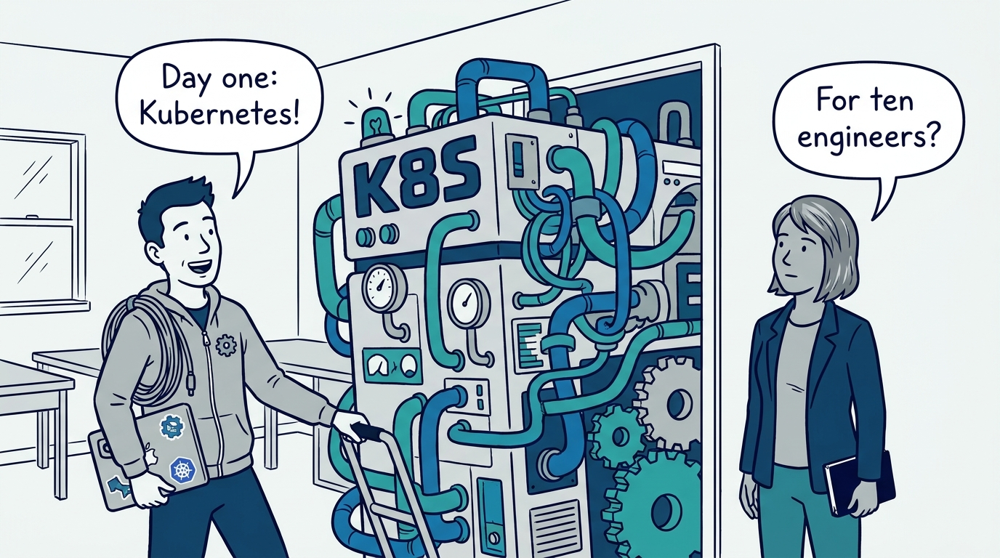
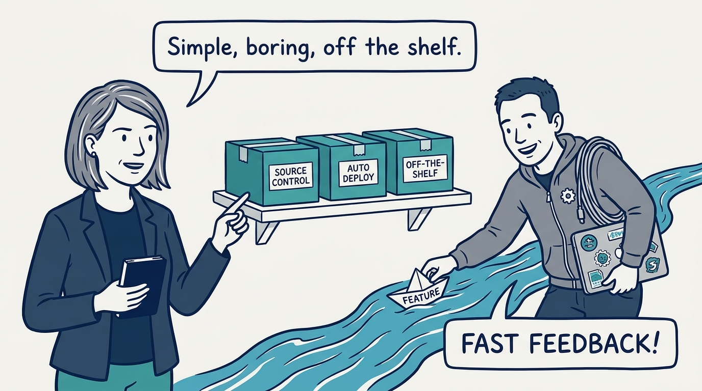
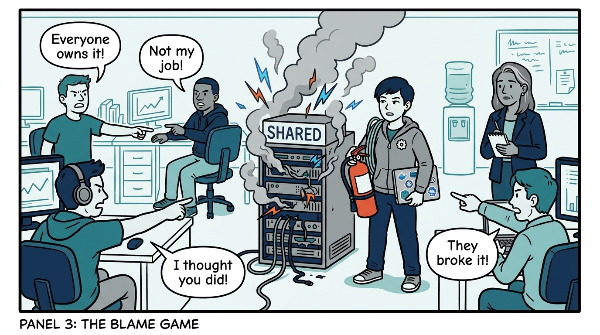
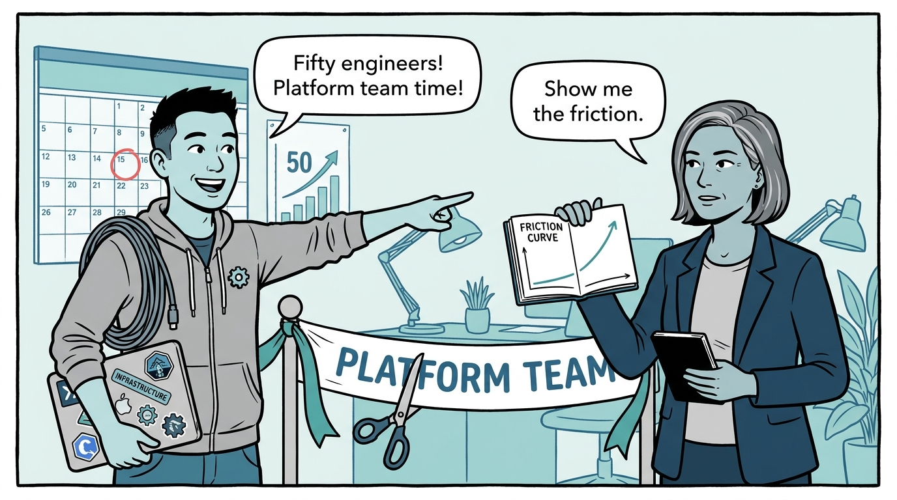
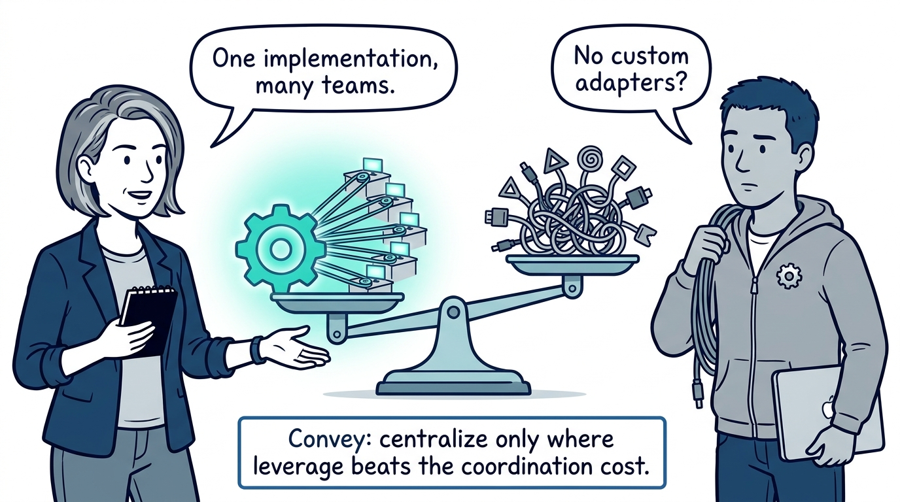
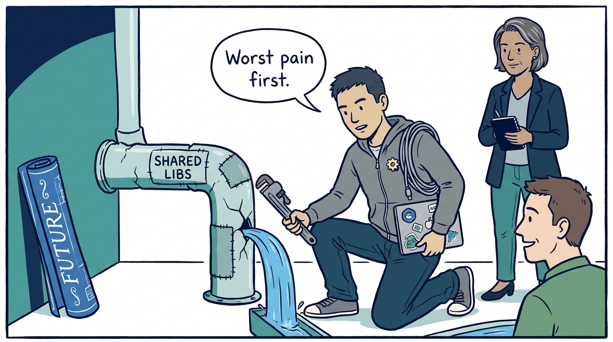
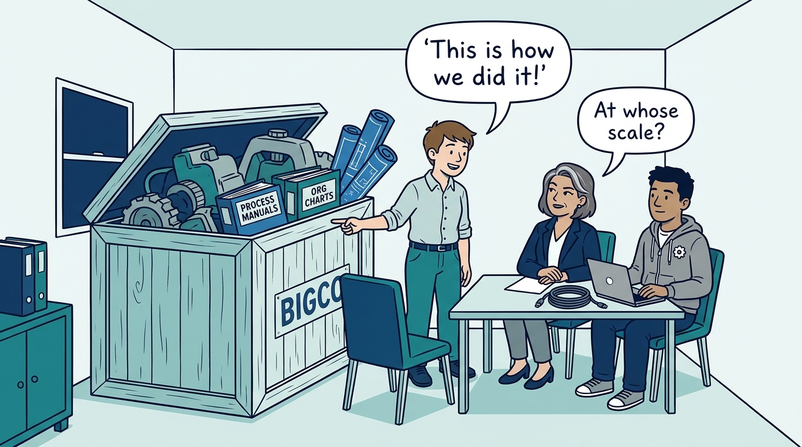
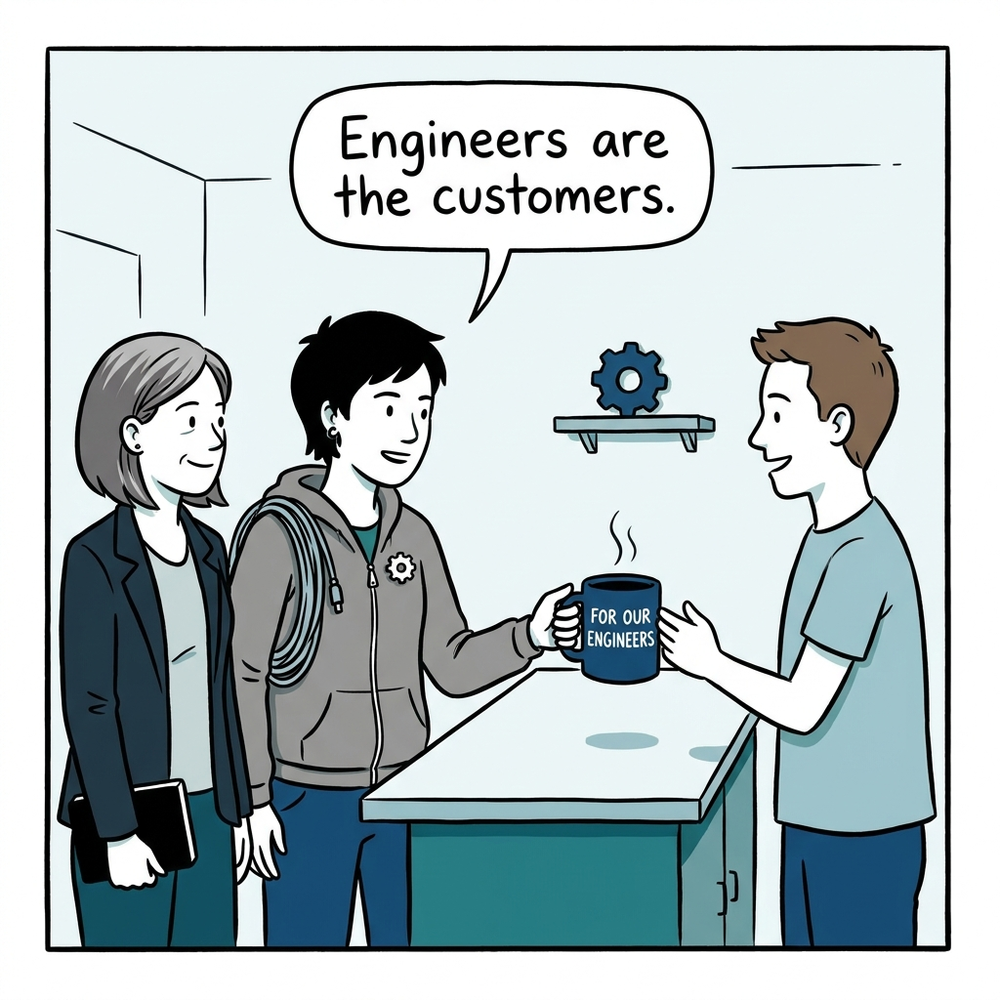

Why platform engineering starts when coordination costs demand it — in eight panels.

<!-- comic-style
{
  "cast": "VERA: a calm, seasoned engineering executive, short gray-streaked hair, dark blazer over a plain t-shirt, carries a small black notebook. KAI: a hands-on platform engineering lead, short dark hair, gray zip-up hoodie with a small gear pin, laptop covered in infrastructure stickers under one arm, a coil of cable slung over the shoulder.",
  "style": "Clean two-tone explainer comic, thick ink outlines, flat colors with deep blue and teal accents on a light background, generous white space, hand-lettered speech bubbles with SHORT readable text, no photorealism."
}
-->

**Panel 1:** *The hook: the temptation to start with big-company infrastructure long before anything demands it.*

**Panel 2:** *Early stage: fast feedback and boring off-the-shelf tooling — platform work stays a shared responsibility.*

**Panel 3:** *The signal: 'everyone owns it' has quietly become 'nobody owns it' — coordination costs are now visible.*

**Panel 4:** *The wrong way: forming a platform team on a calendar or headcount milestone instead of observable friction.*

**Panel 5:** *The test: centralize only where one implementation serves many teams — leverage, not apparent efficiency.*

**Panel 6:** *The first team: fix the most painful existing problems first — trust is the currency for any later redesign.*

**Panel 7:** *The cost: hire first-principles thinkers for the organization you have — not importers of big-company machinery.*

**Panel 8:** *The closer: platform engineering is a product and cultural discipline — the customers are engineers, not the technology.*
