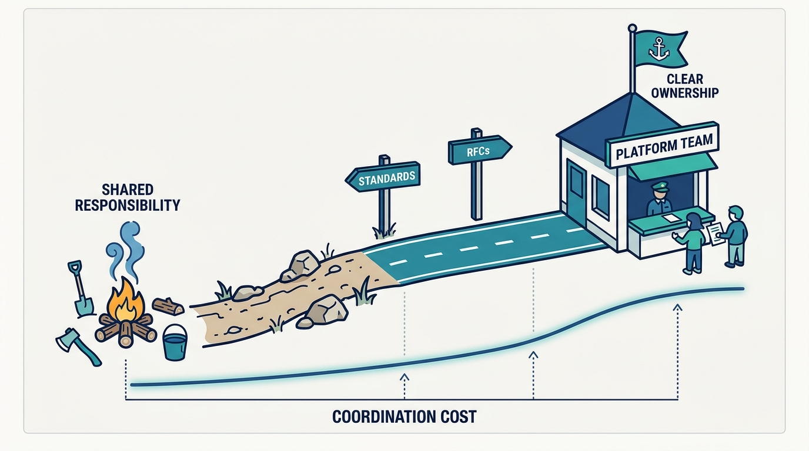
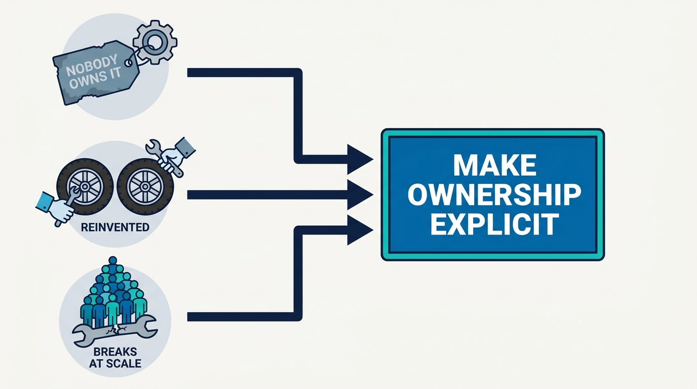
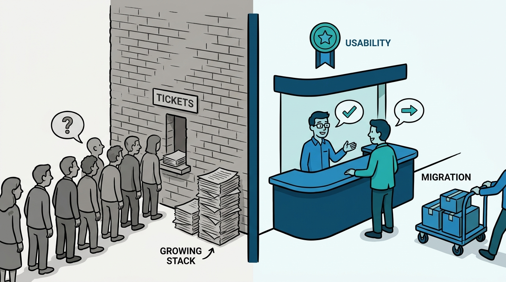

> **Status**: DRAFT
>
> **Principle**: I introduce platform engineering when coordination costs demand it, and not a day earlier. While a handful of engineers can still cooperate informally, platform work stays a shared engineering responsibility and the tooling stays simple, boring, and off the shelf. When shared systems start failing because "everyone owns it" has quietly become "nobody owns it", I make ownership explicit and form a platform team — and that team starts by fixing today's most painful problems, treating the engineers who consume the platform as customers, rather than designing an architecture for a scale we do not have. Platform engineering is a product and cultural discipline, not a collection of new infrastructure technologies.

## Statement

My operating model for starting platform engineering follows the coordination cost, not the calendar.

Early stage — stay lightweight:

- **Optimize for fast feedback and deployment, not future scale.** Source control for everything, continuous deployment automated as early as practical, and simple off-the-shelf deployment platforms. No Kubernetes or similarly complex infrastructure before we actually need it.
- **Evaluate tooling on complexity, cost, expected scale, and lifespan.** Outsource capabilities that are not core business differentiators; automate only where it removes repetitive work.
- **Keep platform work a shared responsibility.** No dedicated platform team while informal cooperation still works — but track whether support and technical-debt work is starting to crowd out feature work, and document engineering decisions and their reasoning from day one.

Growing — introduce structure:

- **Standardize the paved road.** Automated local development environments, test coverage gated into the merge process, branch-based and ephemeral environments, feature flags, build and deployment monitoring, and automated infrastructure provisioning.
- **Introduce a lightweight decision process.** RFCs or ADRs reviewed for technical tradeoffs, operational impact, security, licensing, and cost — with affected engineers included, so individual preferences stop determining organization-wide tooling.

Forming the first team — only when it earns its keep:

- **Watch for the ownership signals.** Recurring friction around shared code and tooling, failures caused by unclear ownership, capabilities reinvented team by team, and a group too large for everyone to maintain working relationships.
- **Apply the centralization test.** Centralize only where one implementation can serve many teams without extensive per-team customization, and where the leverage is substantially greater than the cost of another coordination point. If every application needs substantial custom logic, do not centralize it.
- **Start with problems, not architecture.** The first team makes ownership boundaries explicit, treats platform-consuming engineers as customers, fixes the messiest shared code and workflows first, and builds trust before attempting any major redesign.
- **Hire for the organization we have.** People who reason from first principles at our scale and constraints — not people who can only reproduce how platforms worked at much larger companies. Product managers come after the team has built direct customer relationships; project managers come later still.

Transforming a traditional infrastructure organization is a **culture transformation, not a technology migration**: start where platform practices are closest, introduce real product thinking, fix support, change hiring and incentives, own migrations, and spend more engineering time with customers.

**Figure 1:** *Structure follows coordination cost: shared responsibility while informal cooperation works, a paved road as the organization grows, a formal team only when explicit ownership creates real leverage.*

## How to Read This

This journal is my platform operating model, one record per source checklist. This record is grounded in the "Getting Started" chapter of Camille Fournier and Ian Nowland's *Platform Engineering: A Guide for Technical, Product, and People Leaders* (O'Reilly, 2024) — the chapter about when to introduce platform engineering and what to build first, distilled here into **the readiness rules I hold platform investment to**. The runnable version — the stage-by-stage checklist, the team-formation test, and the transformation program — lives in the **Checklist** tab of this post.

## Rationale

**A premature platform team is a tax on product experimentation.** While a startup is still finding product-market fit, developer needs change too fast for any platform to stabilize around them. Fournier and Nowland are blunt: if a handful of engineers can still coordinate informally, shared tooling rarely causes friction, and ownership is obvious, a dedicated platform team **slows the company down** — it adds a coordination point and an opinionated layer exactly when the product needs neither. Staying lightweight is not neglect; it is the correct platform strategy for that stage.

**Coordination cost is the signal, not company size.** The moment to add structure is not a headcount milestone but the moment informal cooperation stops scaling: shared systems failing because "everyone owns it" has become "nobody owns it", teams reinventing the same capabilities, tooling chosen by one developer breaking at team scale. These are observable facts, which means the decision to form a platform team can be **evidence-based rather than fashionable** — I can point at the friction I am buying my way out of.

**Figure 2:** *The readiness signals are observable facts, not milestones: when these frictions accumulate, the decision to add structure becomes evidence-based rather than fashionable.*

**The centralization test protects against apparent efficiency.** Centralizing a capability always looks efficient on a slide — one team, one system, no duplication. The chapter's discipline is to demand **leverage, not merely apparent efficiency**: one implementation that genuinely serves many teams without extensive per-team customization, worth more than the coordination point it adds. When every consumer needs substantial custom configuration, centralization manufactures a bottleneck and calls it a platform.

**Trust is built by fixing today's pain, not by shipping tomorrow's architecture.** A new platform team that opens with a grand redesign asks its customers for faith it has not earned, while the messy shared libraries and broken workflows that justified its existence keep hurting. Fixing the most painful existing problems first delivers **visible value quickly**, and that credibility is the currency the team will later spend on larger architectural change. Replacing a working platform simply because newer technology exists is not a strategy; it is a hobby.

**Hiring for someone else's scale imports someone else's problems.** People who only know how platforms worked at much larger companies will faithfully rebuild that machinery — the complexity, the process, the cost — regardless of whether we need it. At formation time I test for **first-principles reasoning at our current scale**, comfort with immature processes, and customer empathy alongside technical ability. For the same reason, product managers arrive only after engineers have built direct customer relationships: a PM added too early becomes a substitute for engineers talking to customers, which is the exact culture I am trying to prevent.

**Transforming an infrastructure organization is won or lost on culture, not migration plans.** Ticket queues, "us versus them" attitudes, and incentives that reward heroic complexity over usability do not disappear because the technology changed. The transformation has to change what is rewarded — usability work, listening to customers, reducing customer effort — change how support and hiring work, and make the platform team **own migration pain instead of exporting it** to its customers. Start with the teams closest to platform practices, and let their success argue for the rest.

**Figure 3:** *The transformation is cultural: the ticket wall comes down, engineers talk to customers directly, the platform team owns migration pain, and usability becomes what gets rewarded.*

## What This Means in Practice

| What this record says | What it does **not** say |
| --- | --- |
| Early on, platform work is a shared engineering responsibility. | The early team ignores platform hygiene — source control, automated deployment, and decision records start on day one. |
| Structure arrives as coordination costs rise. | Structure arrives on a calendar, at a headcount milestone, or because platform engineering is fashionable. |
| A formal team forms when centralizing creates real leverage. | Every shared annoyance justifies a central team — capabilities needing heavy per-team customization stay decentralized. |
| The first team fixes the most painful existing problems first. | The first team's mandate is a greenfield redesign — big-bang replatforms come, if ever, after trust is earned. |
| Engineers build direct customer relationships before PMs arrive. | Product managers are a substitute for engineers talking to customers. |
| Transforming an infrastructure org means changing incentives, support, and hiring. | A platform transformation is a technology migration with a new team name. |
| The platform team owns migration pain as part of its value proposition. | Customers absorb the cost of every platform change. |

Concretely: before I approve a platform team, someone can show me the friction — the outages with unclear ownership, the reinvented capabilities, the coordination cost — and can name **a concrete group of customers and the problems the team will solve first**. And six months in, I expect the team to be measured on whether those customers work more effectively, not on how much new architecture it has produced.

## Anti-Patterns

- **Kubernetes on day one.** Adopting the infrastructure of a thousand-engineer company at ten engineers, then spending the seed round operating it.
- **The calendar-driven platform team.** Forming a team because "we're at fifty engineers now" rather than because specific, observable friction demands explicit ownership.
- **Centralizing the uncentralizable.** Pulling a capability into a platform team when every consumer needs substantial customization — creating a bottleneck with a platform's name tag.
- **The big-bang replatform.** A new team whose first act is replacing the entire existing platform because newer technology is available, burning trust it never built.
- **The BigCo import.** Hiring people who can only reproduce large-company platform machinery, and getting large-company complexity without large-company scale.
- **PM as proxy.** Adding a product manager so engineers can stop talking to customers — inverting the customer-facing culture the team exists to build.
- **The ticket black hole.** Running platform support as an untracked queue that customers learn to route around, then wondering why shadow platforms appear.
- **Migration dumped on customers.** Shipping platform changes and expecting application teams to absorb all migration costs, teaching them that the platform is a source of work rather than leverage.

## Related Records

- [[what-is-platform-engineering]] — why platform engineering exists at all; this record covers when to actually start it.
- [[four-pillars]] — what a real platform must be; this record covers how to get there from zero without overbuilding.
- [[building-platform-teams]] — who the first team is made of once it is justified; this record only sets the formation-time hiring cautions.
- [[platform-as-a-product]] — the full product operating mode the first team grows into; this record establishes the customer framing at formation.
- [[organizing-for-platforms]] — Hohpe's organizational view of the same question: how team setup follows platform intent.

## Scope and Revisiting

This record is `draft`. It governs platform-engineering investment decisions everywhere I am the accountable executive: when a platform team may form, what it does first, and how an existing infrastructure organization transforms. I revisit it if a platform team forms without a nameable set of customers and current problems (the signal that fashion has replaced evidence), if support and technical-debt load is measurably crowding out feature work while I am still resisting structure, or if a transformation stalls with new technology in place but old ticket-queue culture intact.

## Authoritative References

- Camille Fournier and Ian Nowland, *Platform Engineering: A Guide for Technical, Product, and People Leaders* (O'Reilly, 2024) — the "Getting Started" chapter, whose checklist this record distills.
