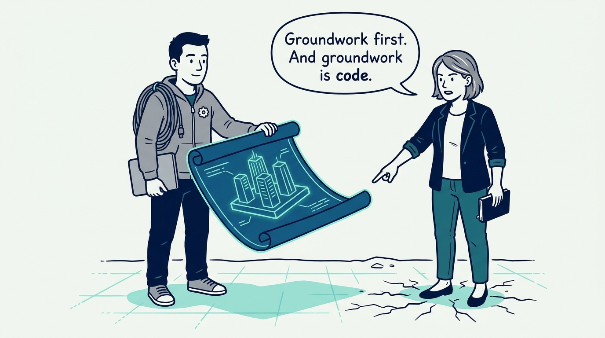
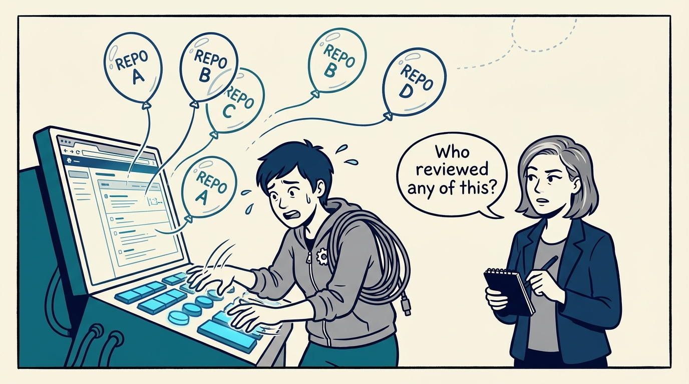
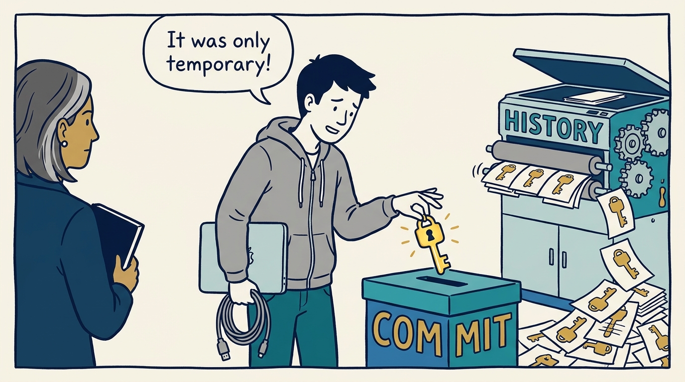
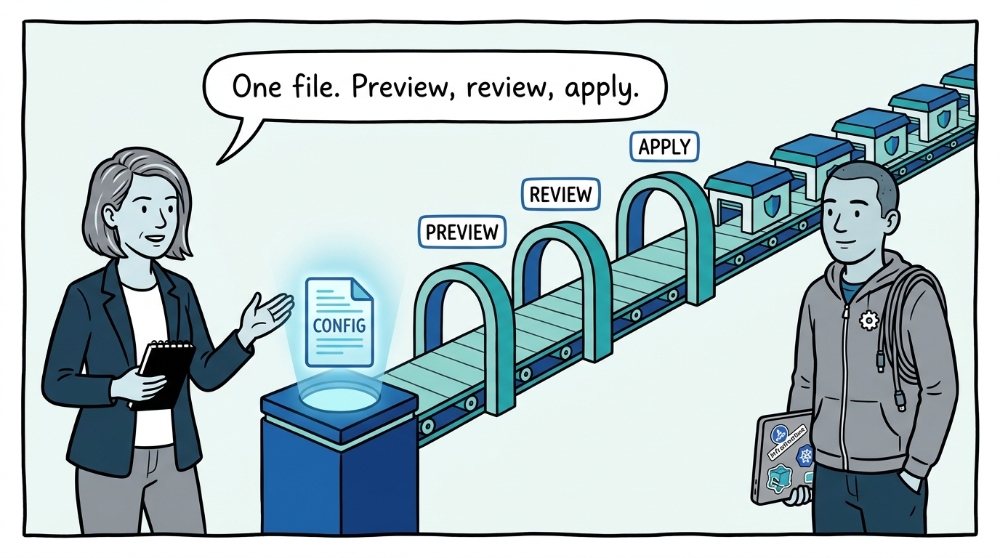
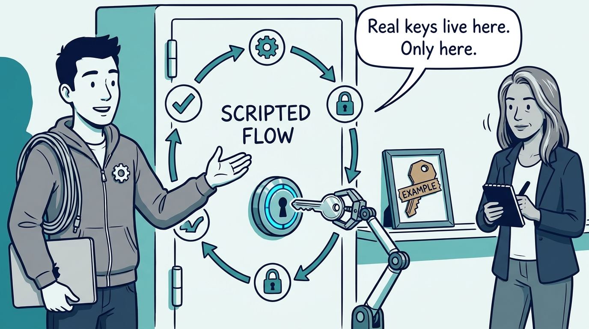
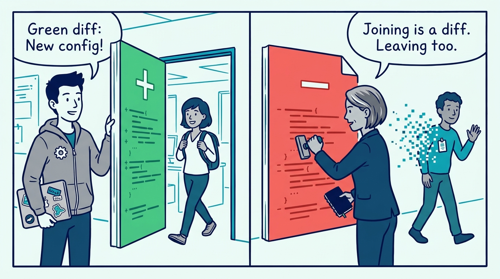
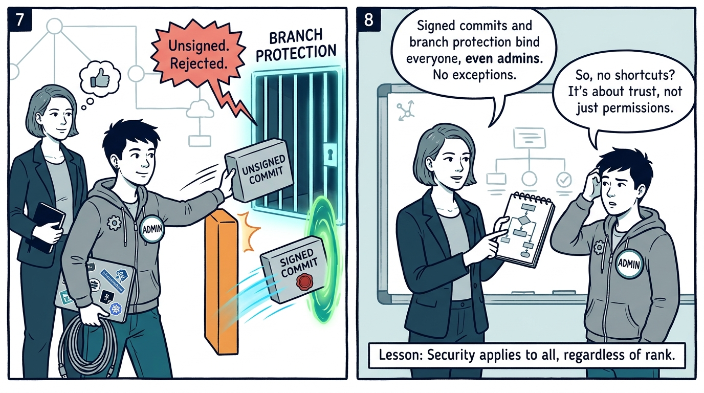
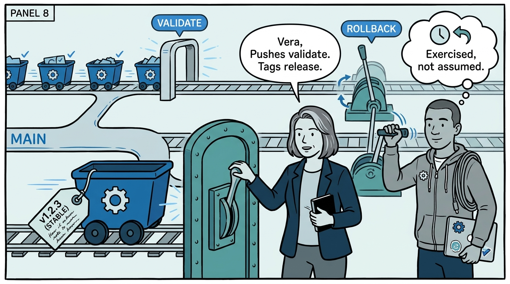
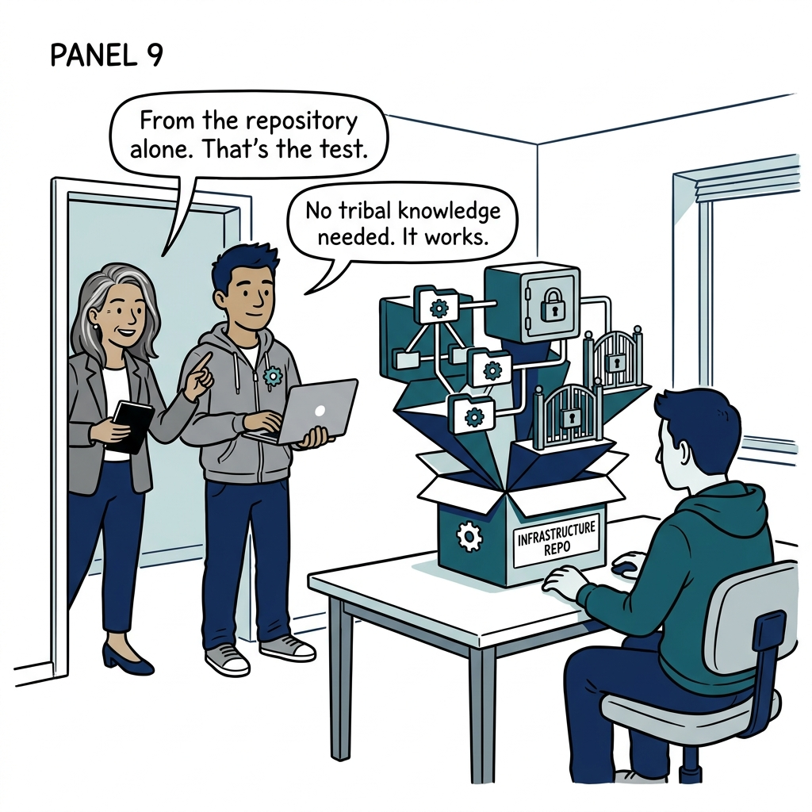

Why the platform's own foundation is code — repositories, secrets, membership, and releases — in nine panels.

<!-- comic-style
{
  "cast": "VERA: a calm, seasoned engineering executive, short gray-streaked hair, dark blazer over a plain t-shirt, carries a small black notebook. KAI: a hands-on platform engineering lead, short dark hair, gray zip-up hoodie with a small gear pin, laptop covered in infrastructure stickers under one arm, a coil of cable slung over the shoulder.",
  "style": "Clean two-tone explainer comic, thick ink outlines, flat colors with deep blue and teal accents on a light background, generous white space, hand-lettered speech bubbles with SHORT readable text, no photorealism."
}
-->

**Panel 1:** *The hook: before my platform builds anything for anyone else, it lays its own groundwork — and the groundwork is code.*

**Panel 2:** *The problem: the ClickOps foundation — repositories and policies clicked into existence by whoever had admin that day, invisible to review, drifting from day one.*

**Panel 3:** *The wrong way: the credential that made it in 'temporarily' — history is forever, and there is no mostly-clean history.*

**Panel 4:** *The principle: one configuration file is the source of truth — repositories are provisioned by IaC through preview, review, apply, with delete protection proven.*

**Panel 5:** *How it plays out: example files are committed, real values are gitignored, and credentials enter the vault through a scripted flow — authenticate, unlock, upsert, sync, lock.*

**Panel 6:** *How it plays out: onboarding is a diff, offboarding is a diff — membership lives in configuration, applied and verified through the same pipeline.*

**Panel 7:** *How it plays out: branch protection binds administrators, and signed commits are required on every branch — both the rejection and the success are verified.*

**Panel 8:** *What it costs: every release is a named, gated, auditable act — and the rollback lever gets pulled regularly, because an untested rollback is a hope.*

**Panel 9:** *The closer: the groundwork test — a second platform engineer can reproduce the entire foundation from the repository alone.*
