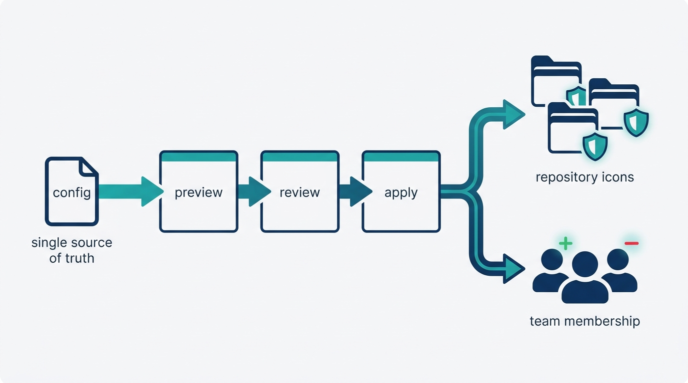
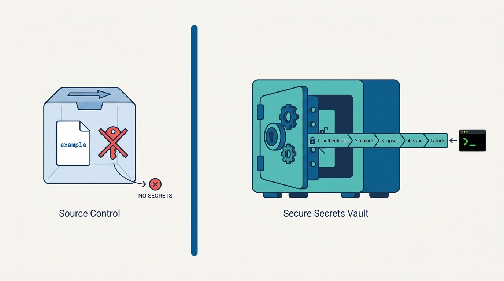
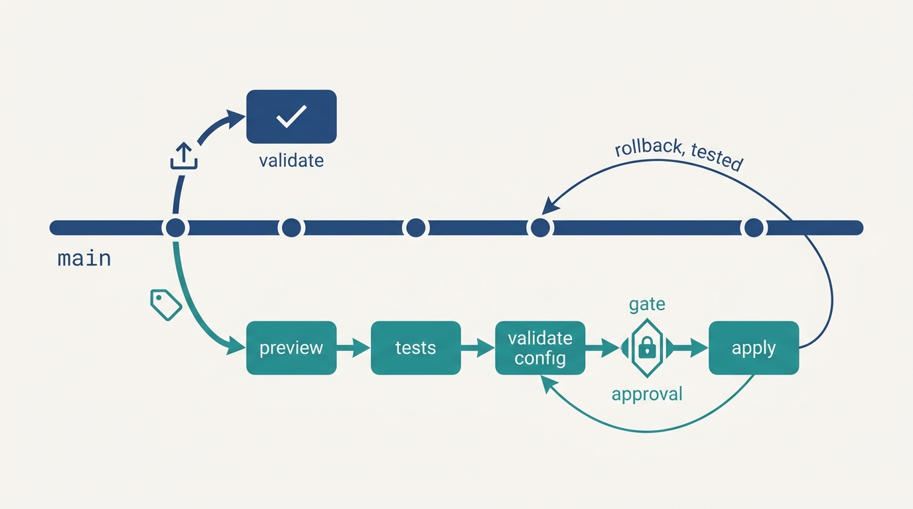

> **Status**: DRAFT
>
> **Principle**: Before my platform builds anything for anyone else, it lays its own groundwork — and the groundwork is code. **Repositories are provisioned by infrastructure-as-code from one configuration file** that is the source of truth; **secrets live in a vault and never touch source control**; **team onboarding and offboarding are reviewed configuration diffs**, not favors; **commits are conventional and signed**, validated by hooks and branch protection that binds administrators, with signed commits required on every branch; and **delivery is trunk-based** — pushes trigger validation, annotated tags trigger a release workflow that runs tests, validates configuration, and waits for an approval gate before anything is applied. The test I hold the build to: **a second platform engineer can reproduce the entire foundation from the repository alone** — and an accidental destroy cannot take it down.

## Statement

When a platform team in my organization starts a platform build, this is the groundwork I hold it to, end to end.

**The foundation is a product from day zero.**

- **Known stakeholders, short loops.** The developers, SREs, security and compliance teams, and product managers who will use or influence the platform are identified before the first line of IaC, and feedback loops with them are short.
- **Metrics before machinery.** Adoption, reliability, delivery performance, and developer satisfaction have defined metrics from the start.
- **Golden paths and embedded guardrails.** Supported golden paths and sensible defaults exist from the beginning, and security, governance, testing, and compliance are embedded — not scheduled for later.

**The tooling baseline is deliberate.**

- Infrastructure-as-code in a general-purpose language, a secrets vault with a CLI, API-driven source control, CI/CD with a local runner, local Kubernetes tooling ready for the next stage — and a quality toolchain (tests, linting, type checking, security scanning) that holds platform code to the same bar as product code.

**Repository architecture is decided, not accreted.**

- **Monorepo versus polyrepo is an explicit decision**, made against the platform's identified domain boundaries; repositories or pipelines are separated by domain where that pays.
- **Conventions are set once**: repository naming, branch naming, access roles, repository policies and governance controls — with security and compliance guardrails spanning all platform domains.
- **The administration project is reproducible.** One platform-administration project with a standard structure — configuration, modules, scripts, secrets setup, tests — that another platform engineer can reproduce.

**Secrets never touch source control.**

- Example files are committed; real values are gitignored. Credentials live in the vault, put there by a scripted, idempotent flow — authenticate, unlock, upsert, sync, lock — and verified there.

**Repositories and membership are configuration.**

- **One configuration file is the source of truth** for managed repositories; repositories are created programmatically through preview → review → apply, with visibility set by configuration and delete protection proven against an accidental destroy.
- **Onboarding is a diff; offboarding is a diff.** Organization members are defined in configuration — name, username, role, email — and joining, leaving, and role changes are applied and verified through the same pipeline. Administrative access goes through a platform service account or group, not individual engineers.

**Figure 1:** *One configuration file is the source of truth: repositories and membership are provisioned through preview, review, and apply — never by hand.*

**Commits are conventional, signed, and enforced.**

- Commit-message structure and allowed types are defined and validated by a distributed commit-msg hook; pre-commit checks catch fast failures; changelog and version automation is planned in from the start.
- Branch protection and merge requirements are enforced through IaC; **signed commits are required on every branch, administrators included**, and both the rejection of unsigned commits and the success of signed ones are verified.

**Delivery is trunk-based; releases are tags behind a gate.**

- Changes integrate through main. Pushes trigger validation; annotated tags trigger the release workflow — preview, automated tests, configuration validation, an approval gate, and only then apply. Rollback triggers are considered, and rollback mechanisms are tested regularly, not assumed. The groundwork ends with a first tagged release, verified end to end.

## How to Read This

This record opens the **Reference Implementation** section of the journal — the how-it-concretely-looks companion to the conceptual records. Where [[four-pillars]] defines what qualifies as a platform, these records fix the shape of the build when a team in my organization constructs one capability end to end. This one is grounded in the Groundwork chapter of *The Platform Engineer's Handbook*, the first chapter of a build that ends with a working internal developer platform. **The named tools are the handbook's reference stack, not a mandate** — my commitments are stated at the capability level, and the Reference Stack table below names the property each tool stands for. The full working checklist — every step, exercise, and the completion check — lives in the **Checklist** tab; the **TL;DR** tab carries the management summary and the **Conversation** tab the dialog.

## The Reference Stack

| Role | Reference tool | The property that matters |
| --- | --- | --- |
| Infrastructure-as-code | Pulumi with Python and `uv` | Infrastructure declared in a general-purpose language, testable with the same toolchain as any other code |
| Secrets vault | Bitwarden + CLI | Secrets scripted in and out of a vault; source control never sees a real value |
| Source control | GitHub | Repositories, membership, and policies manageable through an API — so IaC can own them |
| CI/CD | CircleCI + local runner | Push and tag filters, shared secret contexts, approval gates |
| Local Kubernetes | Kind + Helm | Ready for [[platform-creation]]; nothing cluster-shaped is needed yet |
| Quality toolchain | pytest, ruff, mypy, bandit | Platform code held to the same test, lint, type, and security bar as product code |

## Rationale

**The platform team is its own first customer.** The groundwork chapter starts with product discipline — stakeholders, feedback loops, metrics, golden paths — before a single tool is installed, and that ordering is the point. The first paved path a platform ships is the one its own engineers walk every day. A team that cannot make its own administration project reproducible will not make a starter kit reproducible for anyone else; treating the foundation as the first product run keeps [[platform-as-a-product]] from being something the team preaches but does not practice.

**Day zero decides the culture.** Whatever is done manually "just this once" in week one becomes the permanent exception. Anything clicked into existence in a web console is invisible to review, unrevertable, and unauditable; a repository created from a configuration file is a diff someone approved. The configuration file as source of truth converts the platform's most sensitive operations — creating repositories, granting access, changing roles — into ordinary, reviewable engineering changes.

**Secrets hygiene is binary.** A credential is either never in source control or it is leaked; there is no mostly-clean history. That is why the record insists on the full mechanical discipline — committed example files, gitignored real values, a scripted vault flow that authenticates, unlocks, upserts, syncs, and locks — rather than on good intentions. The scripted path makes the safe way the easy way, which is the only way a rule about secrets survives contact with a deadline.

**Figure 2:** *Secrets hygiene is binary: source control sees only example files, and real credentials reach the vault through one scripted, idempotent flow.*

**Onboarding as configuration is really an offboarding guarantee.** The day someone joins, a config diff is convenient. The day someone leaves, it is the difference between one reviewed change — applied, then verified — and an archaeology project across consoles. The same logic drives the service-account preference: administrative power attaches to a role the organization controls, not to individuals who may be on holiday, or gone.

**A policy that exempts administrators is theater.** The trust you can place in a repository's history equals the protection on its weakest branch and its most privileged user. Hence the record's insistence that branch protection binds administrators, that signed commits are required on all branches — not only main — and that both failure modes are actually verified: unsigned commits rejected, signed commits accepted. Every commit traceable to an authorized developer is a property [[platform-security]] will later build on.

**Validation and release are different events.** Pushes prove the change; tags ship it. Separating the two — push-triggered preview versus tag-triggered release through tests, configuration validation, and a human approval gate — gives continuous integration without accidental deployment, and makes every release an explicit, named, auditable act. And because the gate exists, the rollback path must too: **a rollback that has never been tested is a hope**, which is why the record requires rollback mechanisms to be exercised regularly, not documented and trusted.

**Figure 3:** *Pushes prove the change; tags ship it — through preview, tests, configuration validation, and a human approval gate, with a rollback path that is exercised, not assumed.*

**Reproducibility is the completion test.** The chapter's completion check is the record's finish line: repository structure repeatable, secrets out of source control, provisioning automated, onboarding and offboarding configuration-driven, commit conventions validated, signed-commit policies enforced, trunk-based development with release tagging established, pushes validating, tags releasing, and a first stable release created and verified. Everything on that list is checkable by a second engineer with no tribal knowledge — which is exactly the standard.

## What This Means in Practice

| What this record says | What it does **not** say |
| --- | --- |
| Repositories are provisioned by IaC from one configuration file. | You must use Pulumi and GitHub — the stack is the reference; the capability is the commitment. |
| Secrets live in a vault and never in source control. | Secrets never exist locally — `.env` files exist on machines; they are templated and gitignored. |
| Onboarding, offboarding, and role changes are configuration diffs. | The platform team grants access by hand when it is urgent — urgency is what the pipeline is for. |
| Branch protection binds administrators; signed commits are required on all branches. | Signed commits apply to main only, or seniority earns an exemption. |
| Pushes validate; annotated tags release, behind tests, validation, and an approval gate. | Every push applies infrastructure changes, or releases ship without a human approval. |
| Managed repositories carry delete protection, proven against accidental destroy. | Destroy operations are forbidden — they must be deliberate and non-catastrophic. |
| Platform code passes tests, linting, type checks, and security scans. | The quality bar is for application teams only. |

Concretely: every platform build in my organization starts with this groundwork, and the first review question on the administration project is *"could a second platform engineer reproduce this from the repository alone?"* The first release is a tag, not a push — and the tag goes through the gate.

## Anti-Patterns

- **The ClickOps foundation.** Repositories, teams, and policies created in the web console by whoever had admin that day — invisible to review, impossible to reproduce, drifting from day one.
- **The credential that made it in.** One real secret committed "temporarily" — history is forever, and the clean-up costs more than the vault discipline ever would.
- **The admin exemption.** Branch protection for everyone except the people most capable of doing damage; the policy becomes decoration precisely where it matters most.
- **Onboarding by DM.** Access granted as a favor in a chat thread — nobody reviews it, nobody records it, and nobody remembers to revoke it when the person leaves.
- **The tag that means nothing.** Tags applied as decoration while releases actually ship from pushes — no gate, no approval, no audit line between "validated" and "live".
- **The untested rollback.** A rollback mechanism that exists in a runbook and has never been run — a hope with documentation.
- **The snowflake admin project.** An administration project whose structure only its author can navigate — the reproducibility test failed at the very first repository.
- **Cobbler's children.** A platform team that enforces tests, linting, and security scanning on application teams while its own IaC has none.

## Related Records

- [[platform-creation]] — the next record in the build: environments, GitOps, and the mesh, erected on this groundwork.
- [[cicd-as-a-platform-service]] — the pipelines here serve the platform team's own repositories; that record turns CI/CD into a product for application teams.
- [[policy-as-code]] — repository policies here are IaC-enforced at the source-control layer; cluster admission policy and general policy-as-code live there.
- [[self-service-onboarding]] — membership automation here covers the platform team itself; onboarding application teams at scale lives there.
- [[four-pillars]] — pillar 2 (software-based abstractions) and pillar 4 (operated as a foundation) practiced first on the platform's own foundation.
- [[platform-as-a-product]] — the product discipline the groundwork chapter opens with, in full operating form.
- [[getting-started]] — choosing where a platform effort starts; this record is what the start looks like once chosen.

## Scope and Revisiting

This record is `draft`. It applies to every new platform build my organization undertakes, and as the audit bar for existing platform foundations. I revisit it if the reference stack changes materially (a tool swap must preserve every capability commitment, or the record is amended honestly), if an audit finds repositories or members existing outside the configuration file (the source-of-truth claim failing in practice), or if teams begin routing around the tag-and-gate release path because it is too slow — friction in the gate is a defect to fix, not a rule to waive.

## Authoritative References

- *The Platform Engineer's Handbook* — the Groundwork chapter, whose checklist (including its exercises and completion check) this record distills.
