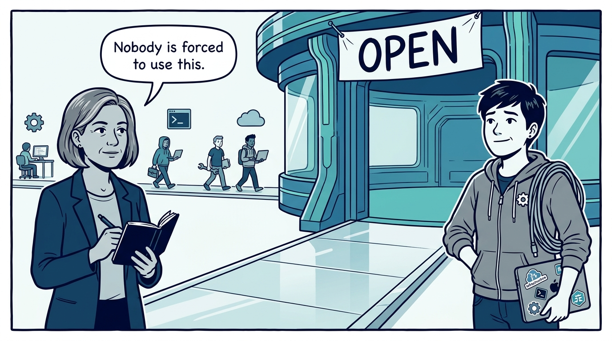
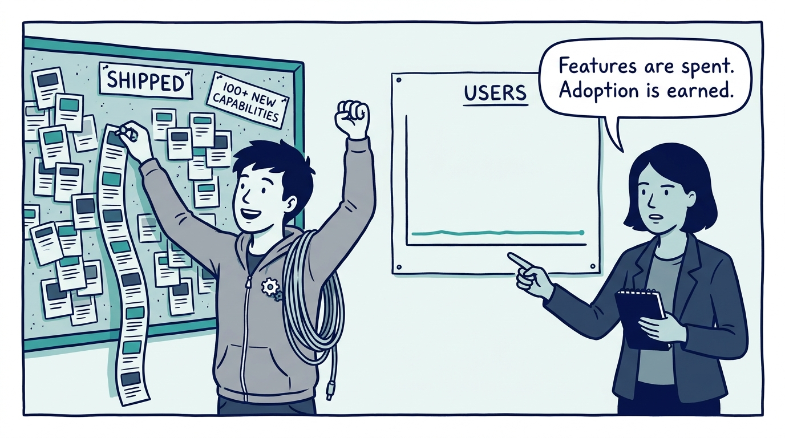
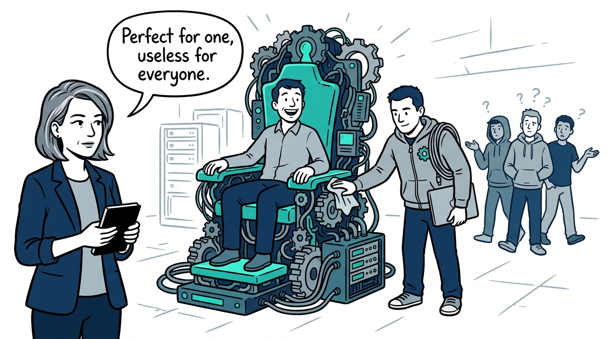
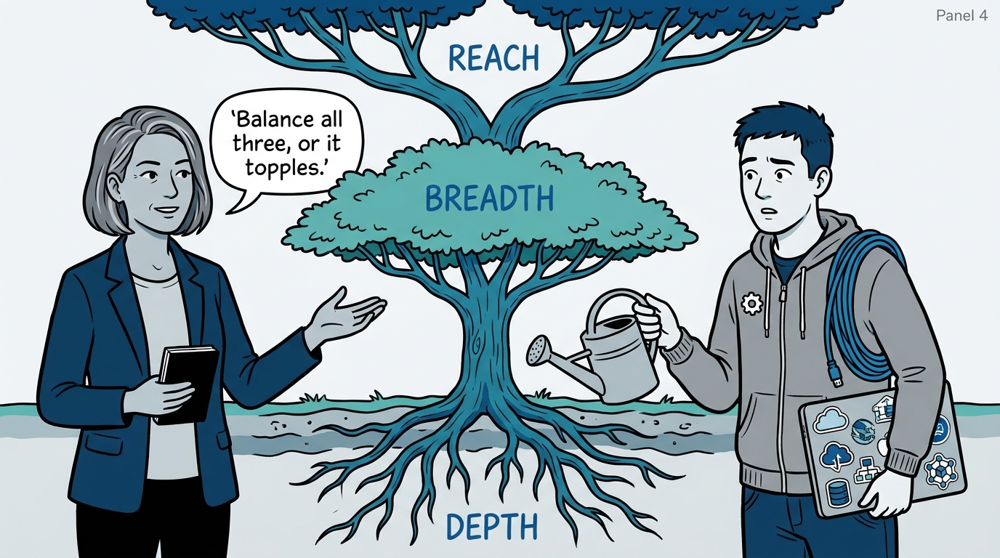
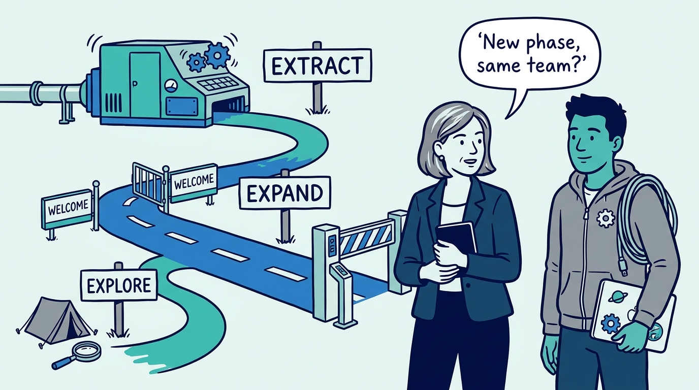
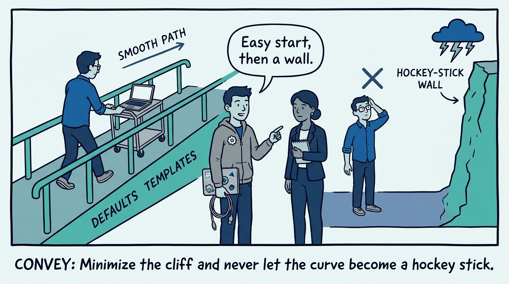
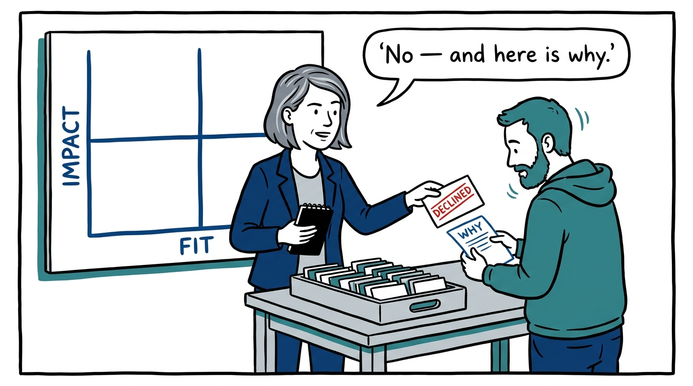
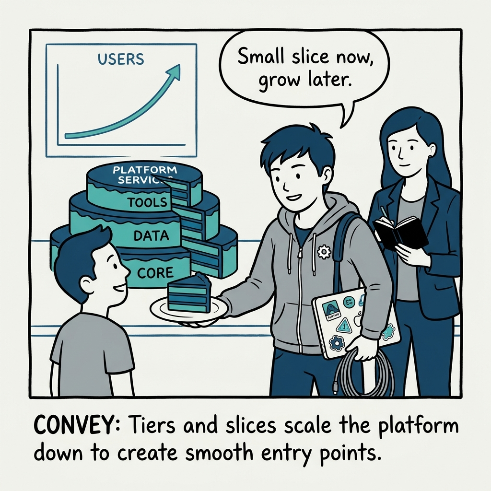

Why platforms grow adoption, not features — in eight panels.

<!-- comic-style
{
  "cast": "VERA: a calm, seasoned engineering executive, short gray-streaked hair, dark blazer over a plain t-shirt, carries a small black notebook. KAI: a hands-on platform engineering lead, short dark hair, gray zip-up hoodie with a small gear pin, laptop covered in infrastructure stickers under one arm, a coil of cable slung over the shoulder.",
  "style": "Clean two-tone explainer comic, thick ink outlines, flat colors with deep blue and teal accents on a light background, generous white space, hand-lettered speech bubbles with SHORT readable text, no photorealism."
}
-->

**Panel 1:** *The hook: an internal platform nobody is forced to use lives or dies on voluntary adoption.*

**Panel 2:** *The problem: the feature-count victory lap — a roadmap celebrating shipped capabilities while adoption stays flat is a platform in denial.*

**Panel 3:** *The wrong way: the perfect platform for one customer — customer obsession that quietly becomes a professional-services team for one account.*

**Panel 4:** *The principle: platforms grow along three dimensions — reach, breadth, and depth — and starving two to max one is how platforms fail.*

**Panel 5:** *The lifecycle: Explore validates that users value the platform, Expand removes adoption obstacles, Extract improves the economics — and between phases the team itself gets reassessed.*

**Panel 6:** *The first hour decides: minimize the cliff, keep simple tasks easy and complex tasks possible — a hockey-stick experience loses users just as they commit.*

**Panel 7:** *The discipline: saying no is how the roadmap protects the product — every request accepted is cohesion spent, so triage on impact and fit and explain the principle behind the no.*

**Panel 8:** *The closer: scale down as deliberately as up — tiers and slices on shared assets give small customers a way in, and adoption does the growing.*
