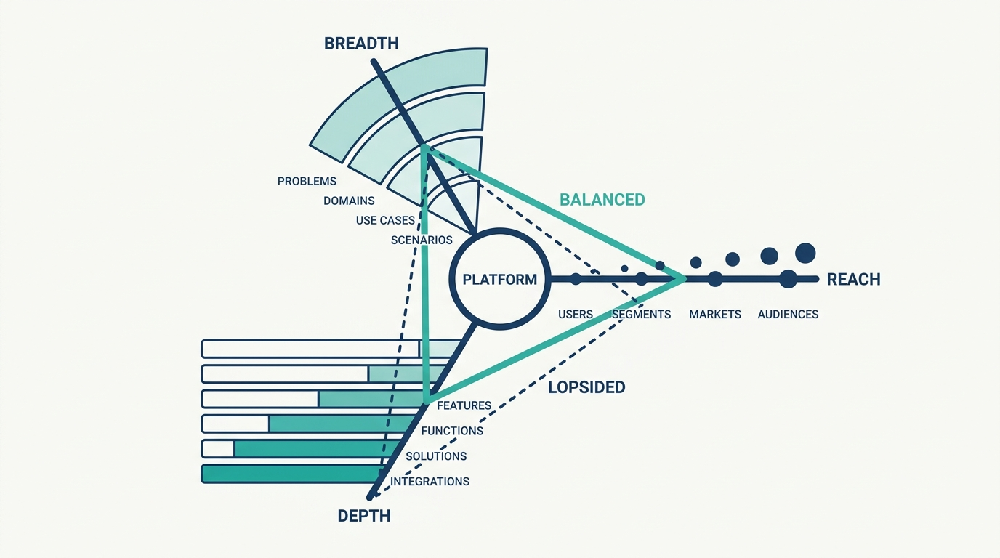
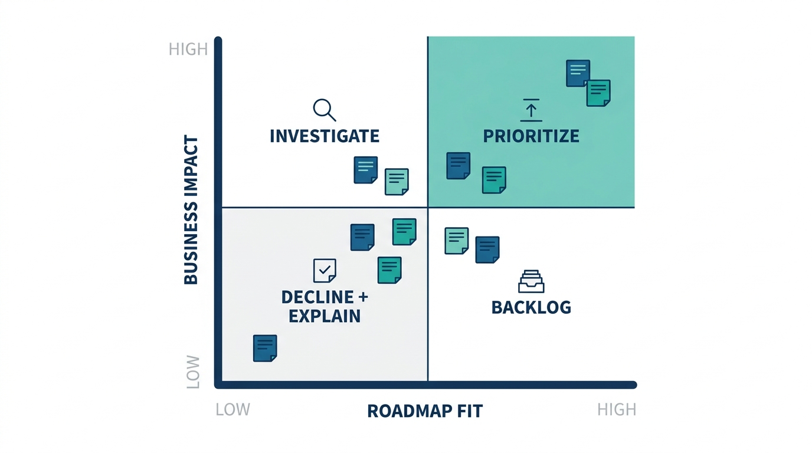
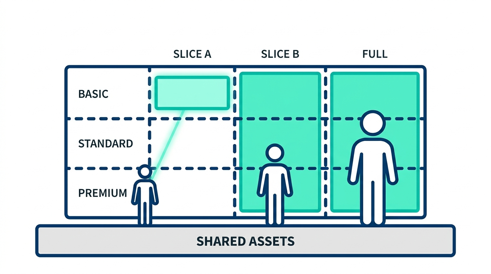

> **Status**: DRAFT
>
> **Principle**: A platform grows **adoption**, not merely functionality. It grows along three dimensions — reach, breadth, and depth — and I balance them rather than maxing one, because the perfect platform for one customer is a failed platform for everyone else. Growth follows a product lifecycle — Explore, Expand, Extract — and is decided in the new user's first hour: minimize the initial cliff, and keep simple tasks easy and complex tasks possible. The roadmap protects cohesion by triaging every request on business impact and strategy fit, and the platform scales **down** through tiers and slices as deliberately as it scales up. An internal platform nobody is forced to use lives or dies on voluntary adoption — so growth is a product discipline, not a feature race.

## Statement

My operating model for growing platforms:

- **Adoption is the growth metric.** We identify the target users and addressable market, grow iteratively on real user feedback, prefer cohesion over accumulating features, and make trade-offs and priorities visible to users. Feature count is an input; adoption is the result.
- **Three dimensions, kept in balance.** Market reach (which user groups, geographies, and business units adopt), platform breadth (does it cover the right portions of the problem space), and platform depth (are key capabilities complete, integrated, automated, and polished). Optimizing any one dimension while the others starve is how platforms fail — including building the "perfect" platform for one customer before gaining broader adoption.
- **The lifecycle sets the mode.** **Explore**: test hypotheses with inexpensive experiments and validate that users actually *value* the platform, not merely that the technology works. **Expand**: remove adoption obstacles — better self-service, less manual support, high-quality documentation. **Extract**: with adoption established, improve the economics and benefit from scale. Between phases, we reassess whether the team, skills, or leadership need to change.
- **The on-ramp is a first-class feature.** We evaluate the platform from a new user's perspective, measure the initial learning effort, minimize the cliff, build on familiar concepts, default the complicated parameters, and give useful feedback on failure. Simple tasks stay easy, complex tasks stay possible, gear-shifts between them are painless, and escape hatches exist when platform constraints are reached.
- **The roadmap is a triage function.** Every request is evaluated on **business impact** and **roadmap fit**: prioritize high-impact fits, investigate high-impact challenges to the strategy, backlog low-impact fits by capacity, and decline low-impact misfits — explaining the principles behind the decline. We publish a credible roadmap, approach users with hypotheses rather than feature polls, and remember that existing users are a biased sample.
- **Scale down as deliberately as up.** Vertical tiers for different operational-quality levels and horizontal slices for customers who do not need the whole platform — each defined around a clear use case, with trade-offs communicated and the underlying assets kept shared.

**Figure 1:** *Three growth dimensions: reach, breadth, and depth grow together — a spike on one axis while the others starve is how platforms fail.*

## How to Read This

This journal is my platform operating model, one record per source checklist. This record is grounded in the "Growing Platforms" chapter of Gregor Hohpe's *Platform Strategy: Innovation Through Harmonization* (Leanpub, 2024) — the chapter about evolving a platform from first users to established scale, distilled here into **the adoption-first growth discipline I hold platform roadmaps to**. The runnable version — growth dimensions, lifecycle, on-ramp, visualization, roadmap triage, metrics, tiering, and the final review — lives in the **Checklist** tab of this post.

## Rationale

**Voluntary adoption is the only honest signal a platform gets.** An internal platform can usually be mandated, but a mandated platform learns nothing: usage numbers say "compliance," not "value." Hohpe's Explore-phase test is the one I insist on — validate whether users actually *value* the platform, not merely whether the technology works. That is also why the growth metric is adoption rather than functionality: **features are what we spend; adoption is what we earn**, and a roadmap that celebrates shipped capabilities while usage stays flat is a platform in denial.

**Reach, breadth, and depth starve each other when one is maximized.** Every platform team feels the pull of its loudest customer: add the sophisticated depth that one segment demands, and the platform becomes expensive and confusing for everyone else; chase breadth, and quality and cohesion dilute; chase reach with a shallow product, and early adopters churn. The failure Hohpe names — building the perfect platform for one customer before gaining broader adoption — is the most common one I have seen, because it feels like customer obsession while it quietly converts a platform team into **a professional-services team for one account**.

**The first hour decides more than the feature list.** A prospective user who hits a wall of unfamiliar concepts, long parameter lists, and silent failures does not file a feature request — they go back to what they know. So the on-ramp is engineering work, not marketing: minimize the initial cliff, build on concepts users already know, default what can be defaulted, template the common cases, and give useful feedback when actions fail. And the curve must stay smooth after the first hour: a **hockey-stick experience** — simple tasks easy, slightly advanced needs dramatically harder — loses users precisely when they were becoming committed. Programmatic interfaces, painless gear-shifts, and escape hatches are what keep the growth curve from snapping at the first advanced use case.

**Saying no is how the roadmap protects the product.** A platform that accepts every request stops being a product and becomes an accumulation. The impact-times-fit triage gives me a defensible way to decline: low-impact requests that do not align with the platform's direction are refused, **with the principles explained** — because an unexplained "no" spends trust, while a principled one builds it. High-impact requests that challenge the strategy get investigated rather than reflexively accepted or refused; extensions and plug-ins carry needs that should not enter the core; and requests are reviewed across the whole platform before functionality is duplicated. A published, credible roadmap turns all of this from private judgment into a visible contract.

**Figure 2:** *Roadmap triage: every request lands in an impact × fit quadrant — prioritize, investigate, backlog, or decline with the principle explained.*

**Existing users are a biased sample.** The people already on the platform are, by definition, the people the platform already fits. Optimizing purely on their feedback deepens the platform for the converted while the unconverted — the actual growth frontier — stay invisible. That is why we approach users with hypotheses and options rather than asking what features they want, measure outcomes and customer experience rather than platform activity, and deliberately study the needs of **non-users** before declaring the roadmap demand-driven.

**Scaling down is a growth strategy.** Not every customer needs — or can afford — the full platform, and forcing the whole offering on small workloads is an adoption tax. Vertical tiers let performance, security, and scalability vary independently for different budgets; horizontal slices serve customers who need only part of the platform; and keeping the underlying assets shared prevents the tiers from becoming forks. Done well, tiering and slicing create **a smoother entry point for customers who may grow later** — which is exactly what an adoption-first strategy wants.

**Figure 3:** *Scaling down deliberately: vertical tiers and horizontal slices on shared assets — every customer gets an appropriately sized offering, and nobody gets a fork.*

## What This Means in Practice

| What this record says | What it does **not** say |
| --- | --- |
| Growth is measured in adoption and user outcomes. | Growth is measured in shipped features — activity metrics flatter the team while the platform stalls. |
| Reach, breadth, and depth are balanced deliberately. | Depth for the most demanding customer comes first — that is the professional-services trap. |
| The Explore phase validates that users value the platform. | A working prototype proves the platform — technology working and users caring are different tests. |
| The new-user on-ramp is engineered: low cliff, defaults, templates, useful errors. | Onboarding pain is acceptable because the platform is powerful — the powerful platform nobody starts using grows nothing. |
| Requests are triaged on business impact and roadmap fit, and declines are explained. | The platform team builds what the loudest customer asks — every request accepted is cohesion spent. |
| Existing users inform the roadmap; non-users define the frontier. | User feedback alone steers growth — the sample is biased toward the already-converted. |
| Tiers and slices give smaller customers an appropriately sized offering on shared assets. | Every customer gets the full platform or nothing — and duplicated per-tier stacks are fine. |

Concretely: our platform roadmap is published and names its trade-offs; every request in the intake queue carries an impact and fit assessment, and declined requests reference the principle that declined them; we measure time-to-first-useful-result for new users and treat regressions as bugs; and each lifecycle phase transition triggers an explicit conversation about whether the team and its leadership still match the phase.

## Anti-Patterns

- **The feature-count victory lap.** Reporting platform growth in shipped capabilities while adoption stays flat — spending without earning.
- **The perfect platform for one customer.** Deep, polished, and adored by a single team — and irrelevant, expensive, or intimidating to every other potential adopter.
- **The professional-services drift.** The platform team gradually becomes a bespoke delivery arm for its biggest customer, one accepted request at a time.
- **The hockey-stick on-ramp.** Demos beautifully, handles the tutorial case in minutes — then the first slightly advanced need requires a week and an expert.
- **The feature poll.** Roadmapping by asking existing users what they want, which optimizes for the converted and never discovers why non-users stay away.
- **The unexplained no.** Declining requests without stating the principle, converting a defensible product decision into perceived arrogance.
- **The everything-or-nothing offering.** No tiers, no slices — small teams must swallow the full platform's cost and complexity, so they never start.
- **Big-bang completeness.** Attempting to finish the entire platform before real users touch it, forfeiting the feedback that iterations exist to capture.

## Related Records

- [[platform-as-a-product]] — the product operating mode for platform teams; this record is the growth discipline that mode makes possible.
- [[platform-strategy]] — the strategy the roadmap-fit test evaluates requests against; without it, triage collapses into taste.
- [[implementing-platforms]] — the machinery behind self-service and low cognitive load; the on-ramp this record demands is built there.
- [[platform-success]] — what success looks like once growth works; the adoption and outcome measures here feed that definition.
- [[understanding-platforms]] — the harmonization-over-standardization frame; voluntary adoption is that frame applied to growth.

## Scope and Revisiting

This record is `draft`. It governs how we grow internal platforms everywhere I am the accountable executive — the roadmap process, the adoption metrics, and the lifecycle-phase reviews for every platform we run. I revisit it if adoption plateaus while the feature list keeps growing (the signal we are optimizing the wrong dimension), if the platform team's calendar shows it operating as a delivery arm for a single customer, or if new-user time-to-first-useful-result trends up across two consecutive quarters.

## Authoritative References

- Gregor Hohpe, *Platform Strategy: Innovation Through Harmonization* (Leanpub, 2024) — the "Growing Platforms" chapter, whose checklist this record distills.
