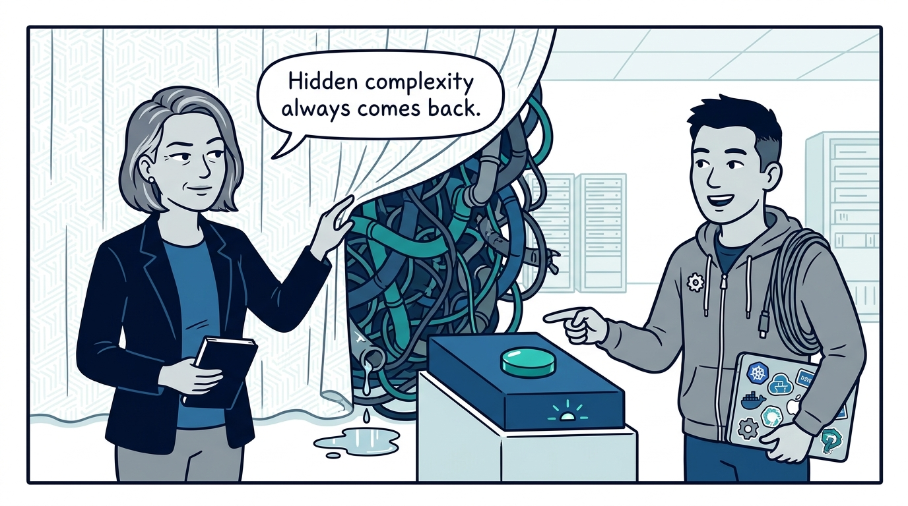
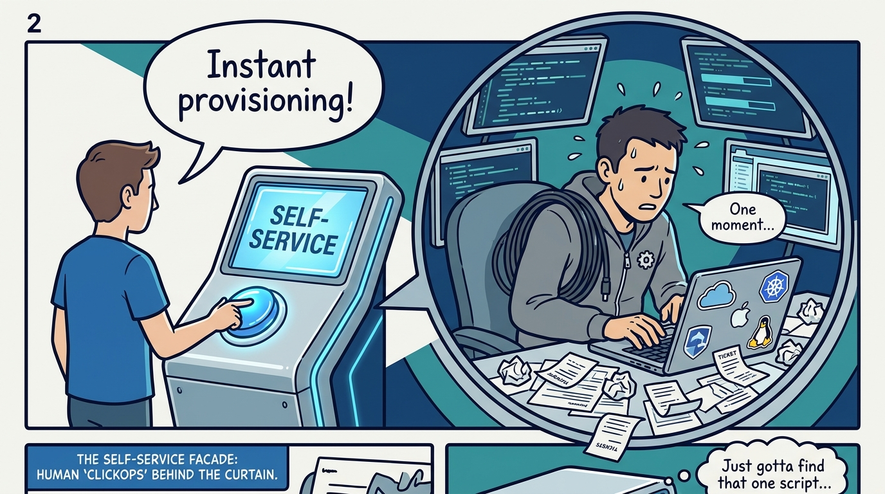
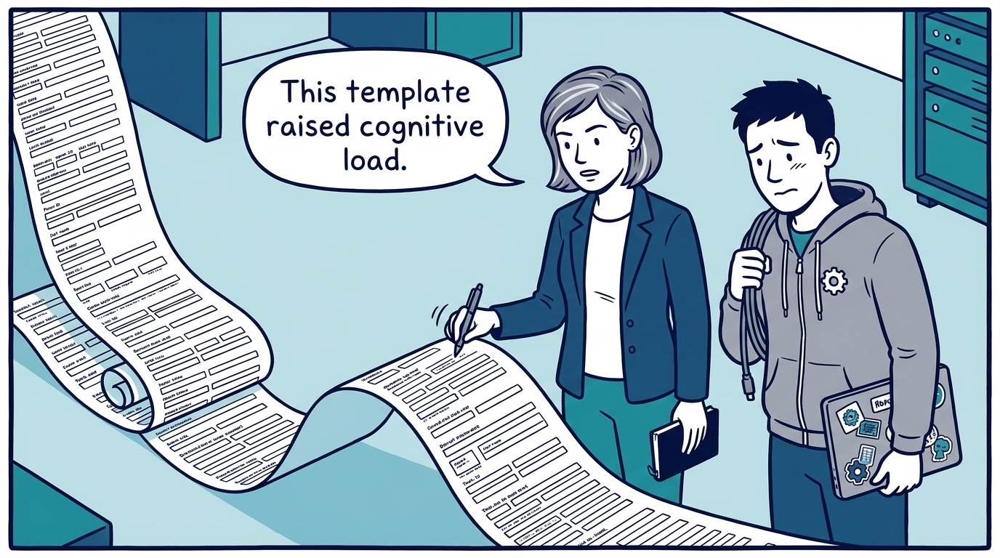
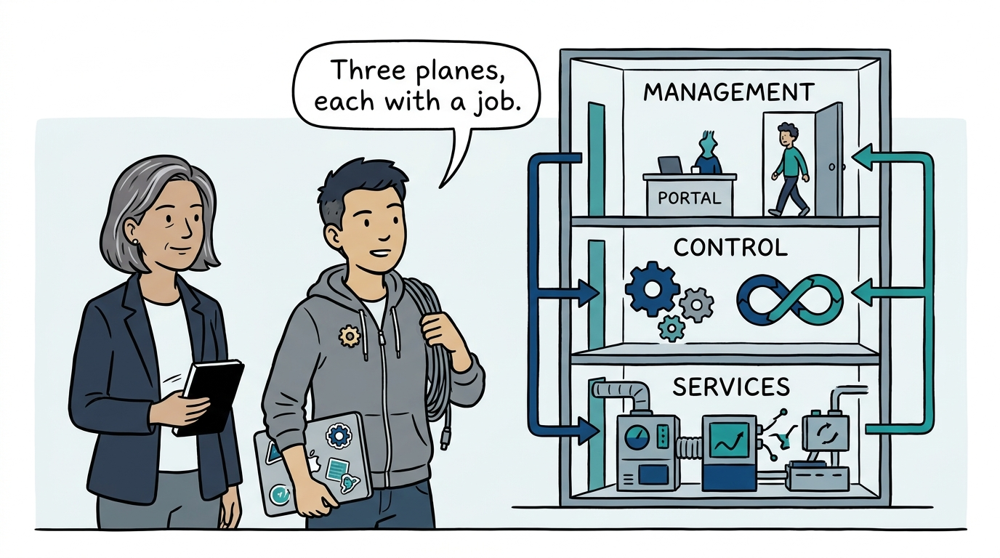
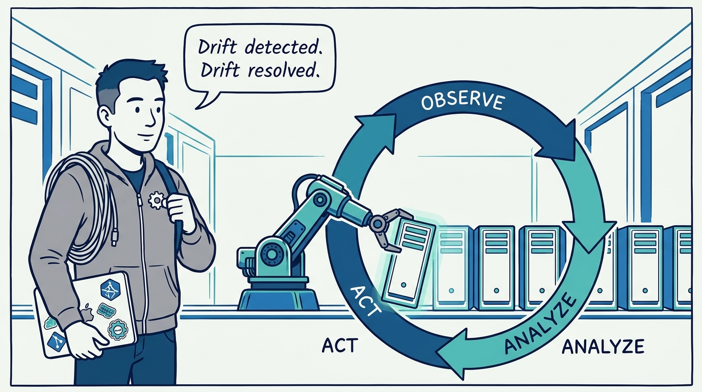
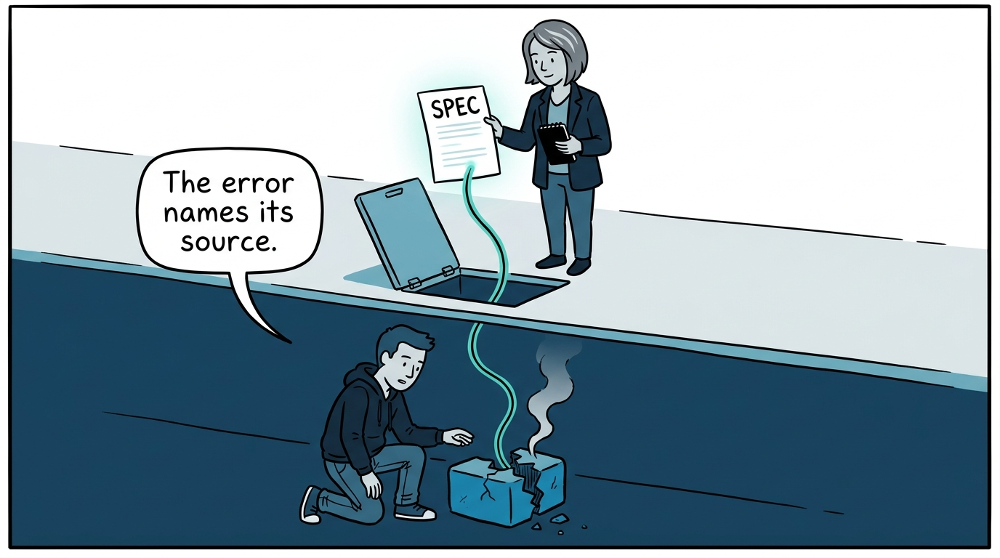
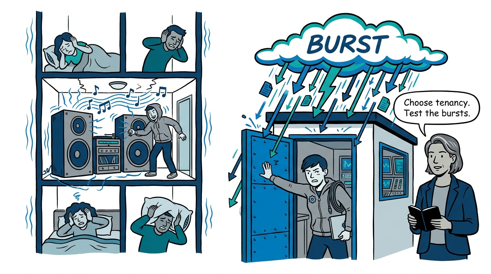
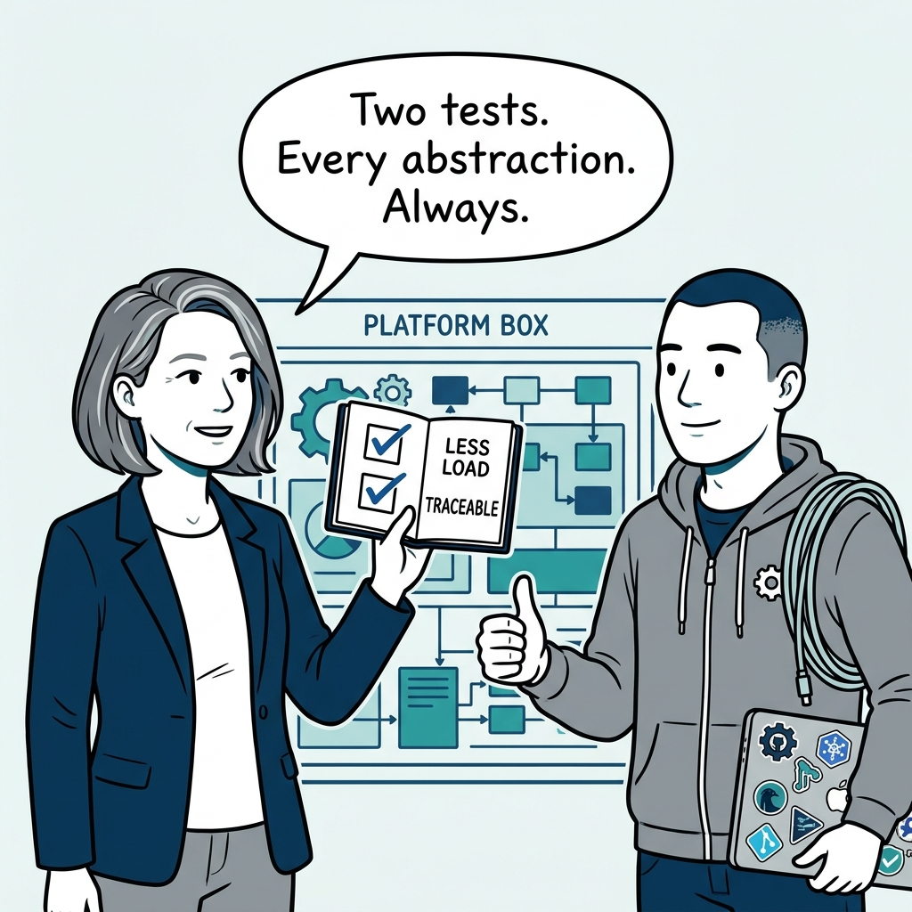

Why an internal platform is three planes and two tests — in eight panels.

<!-- comic-style
{
  "cast": "VERA: a calm, seasoned engineering executive, short gray-streaked hair, dark blazer over a plain t-shirt, carries a small black notebook. KAI: a hands-on platform engineering lead, short dark hair, gray zip-up hoodie with a small gear pin, laptop covered in infrastructure stickers under one arm, a coil of cable slung over the shoulder.",
  "style": "Clean two-tone explainer comic, thick ink outlines, flat colors with deep blue and teal accents on a light background, generous white space, hand-lettered speech bubbles with SHORT readable text, no photorealism."
}
-->

**Panel 1:** *The hook: a platform that hides complexity without a way back hasn't reduced cognitive load — it has deferred it to the worst moment.*

**Panel 2:** *The problem: if every request becomes a ticket and a human, it is not a platform — it is ClickOps with a facade.*

**Panel 3:** *The wrong way: the forty-parameter template — all the indirection of a platform, none of the cognitive-load reduction.*

**Panel 4:** *The principle: an internal platform is three planes — a self-service management plane, a reconciling control plane, and a services plane that does the work.*

**Panel 5:** *How it runs: reconciliation is the engine — a platform that provisions but does not reconcile is only right on day one.*

**Panel 6:** *How it runs: traceability is the price of abstraction — every generated resource keeps a thread back to the spec that produced it.*

**Panel 7:** *The cost: tenancy is a conscious decision and scale fails in bursts — test the control plane before adoption performs the test for you.*

**Panel 8:** *The closer: every abstraction earns its keep by two tests — it genuinely reduces cognitive load, and a failure can be traced back through it.*
