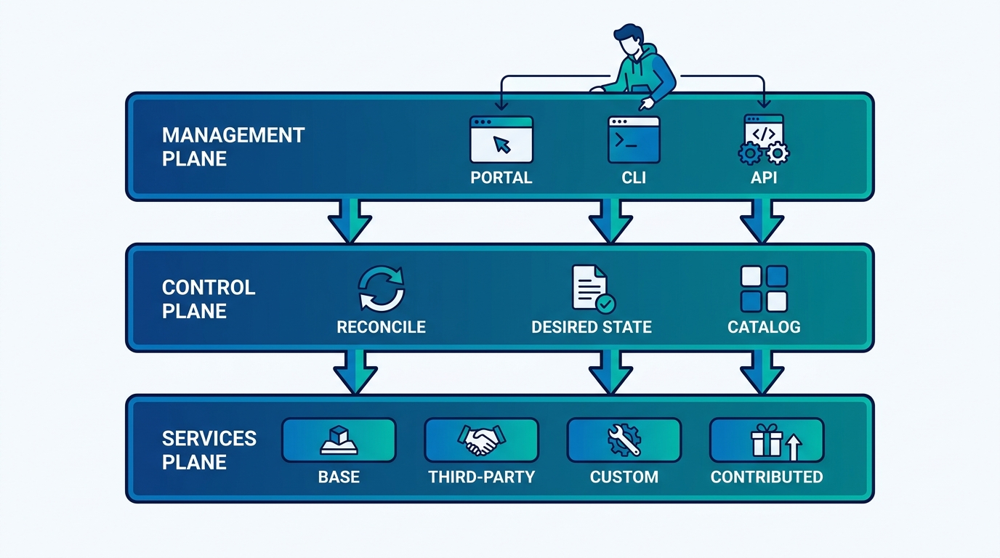
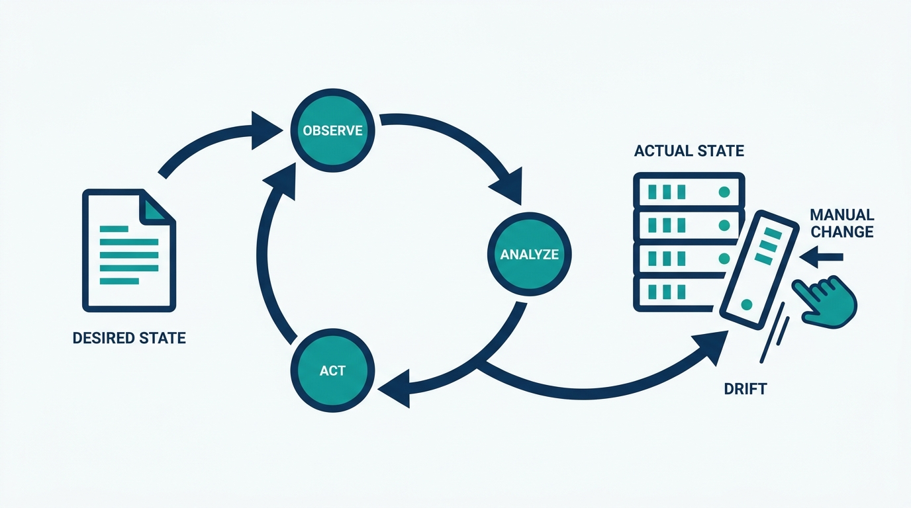
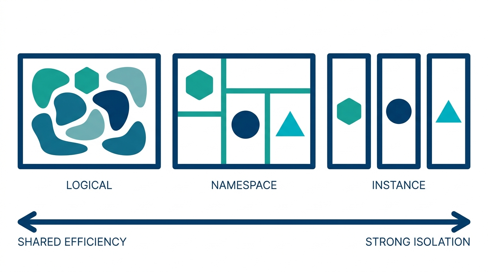

> **Status**: DRAFT
>
> **Principle**: An internal platform is implemented as three planes: a self-service **management plane** that developers touch, a **control plane** that continuously reconciles desired state with actual state, and a **services plane** that does the actual work. Every abstraction the platform introduces must pass two tests — it genuinely reduces cognitive load, and a failure can be traced back through it to the specification that produced it. Responsibilities between platform and application teams are explicit, and the tenancy and isolation model is a conscious architecture decision tested for scale and failure, not a default inherited from the first prototype. A platform that hides complexity without a troubleshooting path has not reduced cognitive load; it has deferred it to the worst possible moment.

## Statement

My operating model for implementing internal platforms:

- **Three planes, each with a job.** The management plane is the visible, self-service face — portal, CLI, management APIs, and possibly an automation language — built around common user journeys rather than CRUD-style resource manipulation. The control plane records desired state and reconciles it with actual state; it also carries identity, ownership, the service catalog, and orchestration. The services plane holds what the platform actually delivers: base infrastructure services, third-party products, custom services behind a defined interface, and governed user-contributed services, plus SDLC capabilities.
- **Reconciliation is the engine.** The platform runs a continuous control loop — **Observe → Analyze → Act** — that detects drift caused by manual changes and resolves it deliberately. Declarative provisioning, desired-versus-actual diffing, and in-place-update versus replace handling are core machinery, not advanced features.
- **Abstractions must earn their keep.** Templates and higher-level orchestration exist to reduce cognitive load. I define which values developers may provide, default the rest sensibly, and restrict what they must not touch. If a template exposes a long, confusing parameter list, it has increased cognitive load, and we move to higher-level orchestration instead.
- **Traceability is non-negotiable.** Every generated resource links back — by reference, tag, or identifier — to the platform construct that created it, and errors are traceable to the relevant specification. An abstraction that hides resources without providing a troubleshooting path does not ship.
- **Ownership is explicit.** Platform-team and application-team responsibilities are written down. Application teams get enough configuration control to avoid ticket-based friction; the platform retains the restrictions that security and compliance genuinely require, plus control over the resource lifecycle where necessary.
- **Tenancy is a decision, not an accident.** We name what a tenant is, choose consciously among multi-tenant resources, multi-tenancy in the platform, or independent instances, validate security and performance isolation, protect against noisy neighbors, and test the control plane against reconciliation bursts before adoption makes the test involuntary.

**Figure 1:** *The three-plane anatomy: developers touch the management plane, the control plane reconciles desired and actual state, and the services plane does the work.*

## How to Read This

This journal is my platform operating model, one record per source checklist. This record is grounded in the "Implementing (Internal) Platforms" chapter of Gregor Hohpe's *Platform Strategy: Innovation Through Harmonization* (Leanpub, 2024) — the chapter that opens up the machinery behind a working internal platform, distilled here into **the anatomy and the two tests I hold every implementation to**. The runnable version — plane by plane, from management-plane self-service through tenancy and the final readiness check — lives in the **Checklist** tab of this post.

## Rationale

**Self-service is what makes it a platform rather than a team with a queue.** If developers cannot provision what they need through a portal, CLI, or API, every request becomes a ticket and every ticket becomes a human — and humans doing "ClickOps" do not scale. Hohpe's management-plane checklist is really a test of whether the platform supports **user journeys** — the things developers are actually trying to accomplish — rather than exposing raw resource CRUD and calling it an experience. An inventory of provisioned services, with compliance and reference-architecture status visible, is part of the same promise: self-service includes seeing what you have, not just getting more.

**Reconciliation is what separates a platform from a pile of provisioning scripts.** Scripts create resources; a control plane owns them. Recording desired state and continuously reconciling it against reality is what lets the platform detect drift from manual changes, propagate updates across many tenants, and recover after failures. The control loop — Observe, Analyze, Act, repeated forever — is the heart of the implementation, whether we build it ourselves or delegate it to tools like Kubernetes or cloud automation. **A platform that provisions but does not reconcile is only right on day one.**

**Figure 2:** *The engine: an endless Observe → Analyze → Act loop that diffs desired against actual state and resolves drift deliberately.*

**An abstraction that does not reduce cognitive load is just another layer to learn.** Template-based provisioning looks like simplification, but Hohpe's warning is precise: excessive exposure to underlying cloud resource definitions can *increase* cognitive load rather than reduce it. That is why my test for any platform abstraction is behavioral, not architectural — did the developer's world get simpler? Sensible defaults, a short list of values developers are allowed to set, and expansion of simple inputs into complex resource definitions are the mechanics; **"does this template actually reduce cognitive load?" is the acceptance criterion**, and when templates cannot pass it, we move up to real orchestration — translation, composition, lookup, and model translation where the platform's metamodel differs from the cloud's.

**Traceability is the price of abstraction.** Every abstraction hides something, and whatever it hides will eventually fail. When it does, a developer staring at a broken generated resource needs a path back to the higher-level construct that produced it — a link, a tag, an identifier, an error message that names the relevant specification. Abstractions that hide resources without providing that path are how platforms lose the trust of their best engineers: **the first unexplainable failure converts an advocate into someone who builds around the platform**.

**Speed comes from moving configuration control to application teams — inside guardrails.** The chapter's ownership argument matches my experience exactly: platform speed is lost less in technology than in tickets. Giving application teams enough configuration control to act without asking, while the platform retains only the restrictions that security and regulatory compliance genuinely require, removes the friction without removing the guardrails. That boundary must be written down — who owns provisioned resources, who gets which access rights, where the platform keeps lifecycle control — because **an implicit ownership boundary is renegotiated in every incident**.

**Tenancy and scale failures arrive together, and they arrive late.** What a tenant is, where isolation lives — shared logical resource, namespace, or fully separate instance — and how fairness is enforced against noisy neighbors are decisions that are cheap on a whiteboard and brutally expensive to retrofit. The same is true of control-plane scale: Hohpe warns that uneven callback bursts — after an outage, during mass updates — can overload a control plane whose normal operating scale is moderate. So we choose the tenancy model consciously, validate isolation, and **test reconciliation at scale before adoption performs the test for us**.

**Figure 3:** *Tenancy is a chosen point on a spectrum: shared logical resources, namespace separation, or independent instances — each trading efficiency against isolation.*

## What This Means in Practice

| What this record says | What it does **not** say |
| --- | --- |
| Developers provision through a self-service management plane built around user journeys. | Every platform needs a lavish portal on day one — an API and CLI that serve real journeys beat a beautiful UI that serves none. |
| Desired state is recorded and continuously reconciled with actual state. | Reconciliation must be hand-built — delegating to Kubernetes or cloud automation is a legitimate implementation choice. |
| Abstractions are accepted only if they demonstrably reduce cognitive load. | More abstraction is always better — a leaky template with forty parameters is worse than the raw resource it wraps. |
| Every generated resource is traceable back to the specification that produced it. | Developers should routinely work at the raw-resource level — traceability is a debugging path, not the daily interface. |
| Application teams get configuration control; the platform keeps security and compliance guardrails. | Application teams get root on everything — restrictions that compliance genuinely requires stay platform-owned. |
| The tenancy model is chosen consciously and isolation is validated and tested. | One tenancy model fits all platforms — logical, namespace, and resource-level separation are all legitimate, at different cost and isolation points. |
| The control plane is tested against reconciliation bursts and adoption-scale load. | Normal-load performance proves scale readiness — the killer load arrives in bursts after outages and mass updates. |

Concretely: for our platform I can point at the three planes and name what implements each; drift detected this quarter was resolved by the control loop, not by a heroic engineer; every abstraction that shipped passed the cognitive-load question in review; and the tenancy model, isolation level, and burst-reconciliation test results are written down where the **Final Readiness Check** in the Checklist tab expects them.

## Anti-Patterns

- **The ticket platform.** A "platform" whose management plane is a service desk — every provisioning request lands on a human, and ClickOps does the rest.
- **Day-one-only correctness.** Provisioning without reconciliation: the platform creates resources, manual changes drift them, and nobody notices until an audit or an outage does.
- **The forty-parameter template.** An abstraction that exposes most of the underlying resource definition anyway — all the indirection of a platform with none of the cognitive-load reduction.
- **The trapdoor abstraction.** Hiding resources without a troubleshooting path, so the first production failure strands developers on the wrong side of the abstraction with no way back to the cause.
- **The CRUD portal.** A portal that renders raw resource operations in nicer colors instead of supporting the journeys developers actually take.
- **The implicit ownership boundary.** Nobody wrote down what platform and application teams each own, so every incident begins with a negotiation.
- **Tenancy by accident.** The isolation model is whatever the prototype happened to do; noisy neighbors, cross-tenant exposure risk, and quota limits are discovered in production.
- **Untested scale optimism.** The control plane handled fifty tenants smoothly, so a thousand will be fine — until the first post-outage callback burst.

## Related Records

- [[designing-platforms]] — what to design into the platform and where its boundaries sit; this record is how that design becomes a running system.
- [[organizing-for-platforms]] — the team setup behind the machinery; the ownership boundary fixed here is staffed and governed there.
- [[growing-platforms]] — growing adoption of what this record builds; a low on-ramp depends on the abstractions here actually reducing cognitive load.
- [[operating-platforms]] — running the result in production; the traceability and drift-resolution machinery here is what makes that operability real.
- [[four-pillars]] — the pillar view of platform engineering; the "operated as a foundation" pillar assumes exactly the control-plane discipline this record demands.

## Scope and Revisiting

This record is `draft`. It governs the implementation of internal developer platforms everywhere I am the accountable executive — new builds and rearchitectures alike — and it is the bar behind the readiness check I expect before a platform declares itself generally available. I revisit it if developers keep escaping the platform's abstractions to work at the raw-resource level (the signal the cognitive-load test is failing in the field), if a production incident cannot be traced back to the platform specification that caused it, or if control-plane load or tenant-isolation incidents show the tenancy model was outgrown rather than chosen.

## Authoritative References

- Gregor Hohpe, *Platform Strategy: Innovation Through Harmonization* (Leanpub, 2024) — the "Implementing (Internal) Platforms" chapter, whose checklist this record distills.
