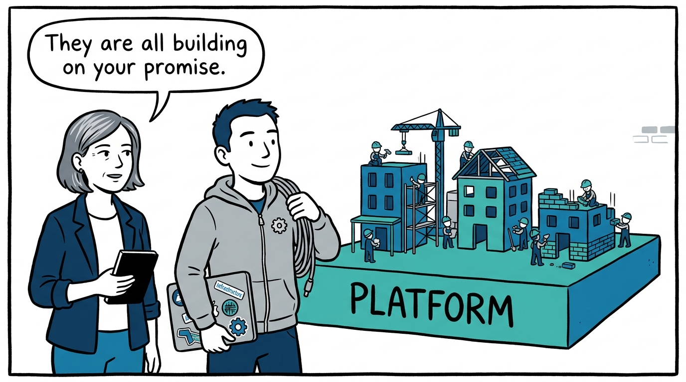
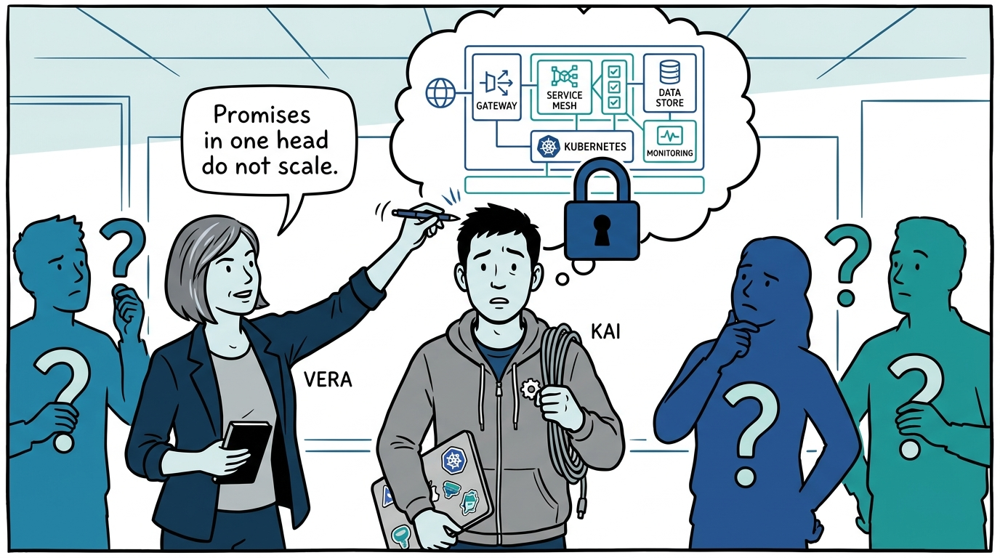
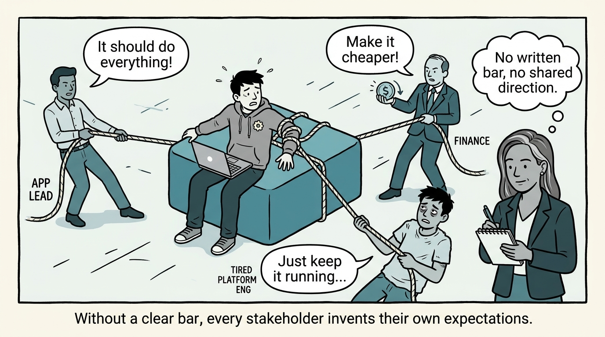
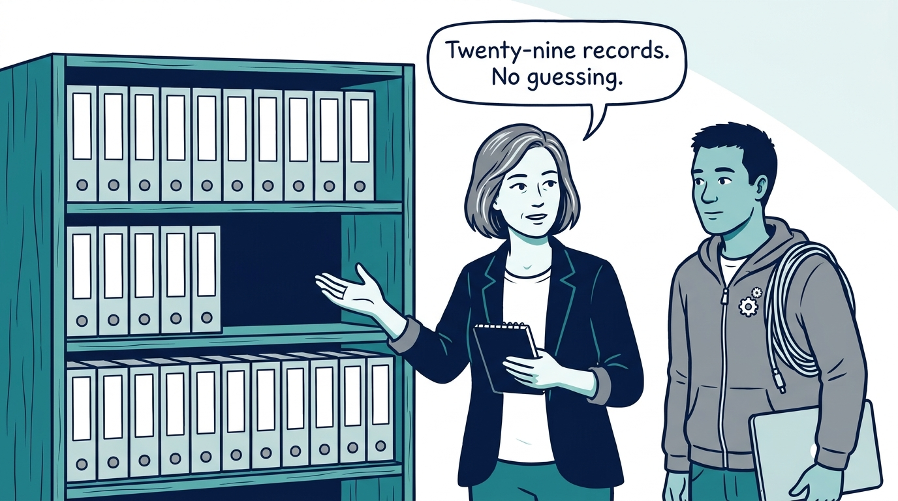
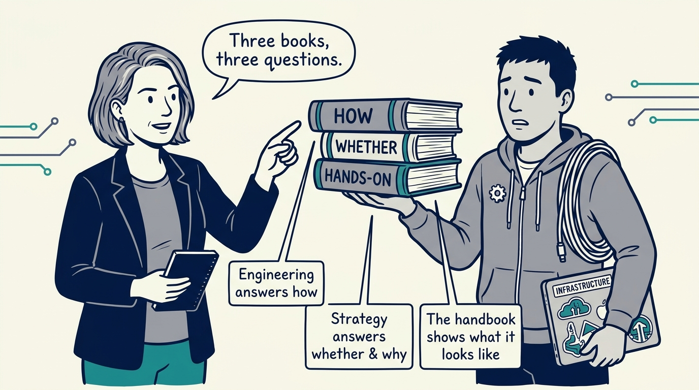
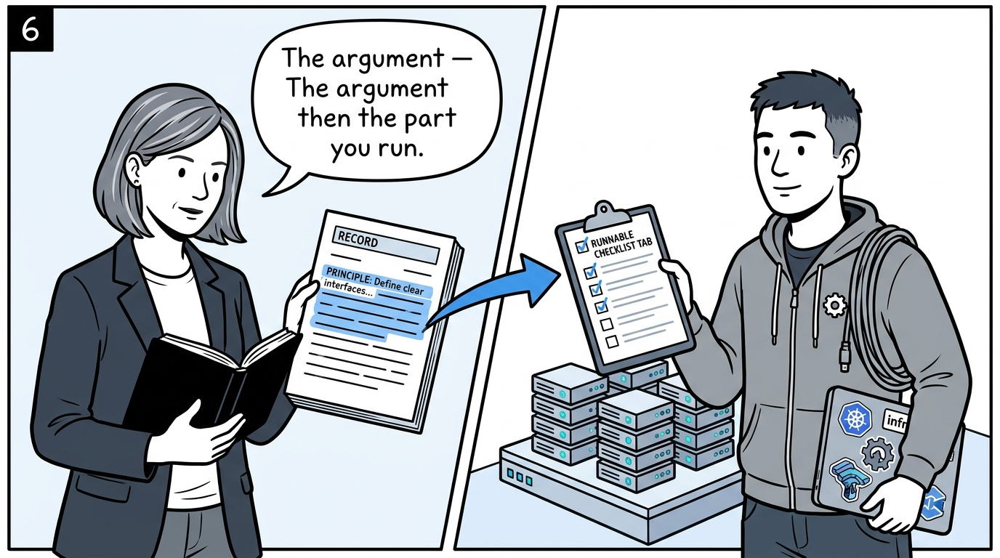
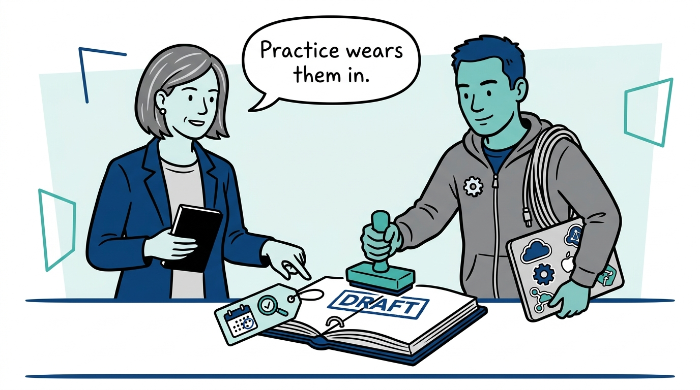
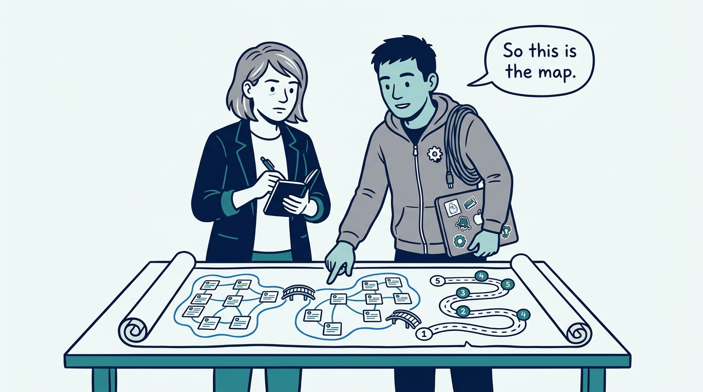

Why a platform operating model gets written down instead of lived in one head — in eight panels.

<!-- comic-style
{
  "cast": "VERA: a calm, seasoned engineering executive, short gray-streaked hair, dark blazer over a plain t-shirt, carries a small black notebook. KAI: a hands-on platform engineering lead, short dark hair, gray zip-up hoodie with a small gear pin, laptop covered in infrastructure stickers under one arm, a coil of cable slung over the shoulder.",
  "style": "Clean two-tone explainer comic, thick ink outlines, flat colors with deep blue and teal accents on a light background, generous white space, hand-lettered speech bubbles with SHORT readable text, no photorealism."
}
-->

**Panel 1:** *The hook: a platform is a promise other teams build on — roadmaps, budgets, and careers all bet on it.*

**Panel 2:** *The problem: when the model lives in someone's head, everyone who depends on the platform has to guess.*

**Panel 3:** *The wrong way: leave the bar unwritten and every stakeholder invents their own — including 'the platform should do everything.'*

**Panel 4:** *The principle: write the operating model down — twenty-nine records anyone can read, cite, and hold the platform to.*

**Panel 5:** *How it is built: three books, three questions — engineering answers how, strategy answers whether and why, and the reference implementation shows what it concretely looks like.*

**Panel 6:** *How it reads: every record states the principle in the article and ships the runnable self-assessment in its Checklist tab.*

**Panel 7:** *The cost: the records start as drafts, adopted ahead of being worn in — and each one names when it must be revisited.*

**Panel 8:** *The closer: this introduction is the map — stop guessing what the platform bar is, and read it.*
