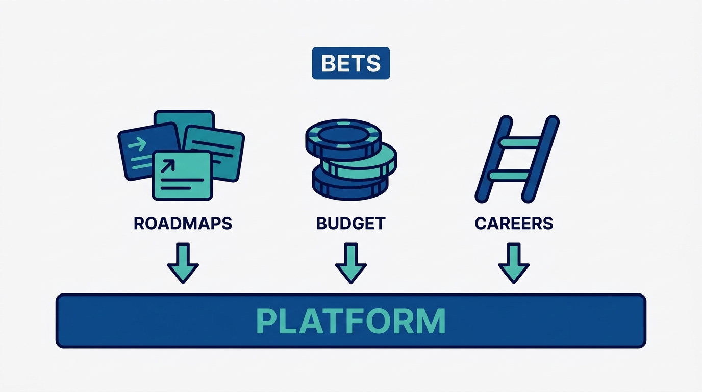
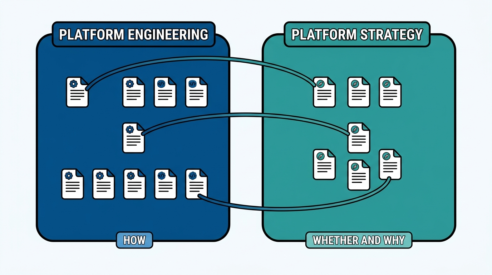

> **KEY POINTS:**
>
> * **This journal is my platform operating model, written down** — 16 records covering both how internal platforms are built and run (the four pillars, the team, the product mindset, operations, delivery, rearchitecting, stakeholders, success) and the strategy around them (what platforms really are, when they are the right move, how to design, organize for, implement, and grow them) — grounded in Camille Fournier and Ian Nowland's *Platform Engineering* and Gregor Hohpe's *Platform Strategy*.
> * **Every record ships its working checklist, not just the argument** — the article states the principle I commit to and why; the **Checklist** tab carries the runnable self-assessment distilled from the source, ready to run against a real platform.
> * **Read it as an operating manual, not a book report** — the material is adapted from books I trust through a practitioner-executive lens; where my practice differs from a source, the record says so, and every record names the conditions under which I would revise it.

 

If you build, run, fund, or depend on an internal platform in my organization, you should **not have to guess** what I think a good platform looks like. This journal writes it down: why platforms exist at all, the pillars a real platform stands on, why the platform is a product with customers rather than a mandate with captives, and what success actually looks like — plus the strategic frame that decides whether a platform should exist and how it grows. The Map below carries the full inventory. Each record states the operating principle in the article; the runnable checklist lives in the record's **Checklist** tab.

## Why an Executive Writes the Platform Model Down

Because a platform is **a promise other teams build on**, and promises that live in someone's head do not scale. Application teams bet their roadmaps on the platform being stable, self-service, and supported; finance bets real money on the platform being cheaper than every team solving the same problems alone; platform engineers bet their careers on the work being valued by something other than luck. Writing the model down does two things: it tells platform teams what I will hold them to — and it tells everyone else what they are entitled to expect from a platform, **including the right to hear "no, that does not belong in the platform."**

**Figure 1:** *A platform is a promise three parties bet on — application roadmaps, real budget, and platform engineers' careers — which is why the promise gets written down.*

The journal inherits its charter from its siblings: the [engineering-executive journal](../grounded-engineering-executive/introduction.html) commits me to an inspectable executive operating model, and the [engineering-management journal](../grounded-engineering-management/introduction.html) writes down the management ladder. This journal covers the platform: the discipline of building and running one, and the strategy that decides whether and where one should exist.

## What a Record Looks Like

Every record follows the same shape, so you always know where to look:

| Part | What it gives you |
| --- | --- |
| **Status / Principle** blockquote | The operating principle in one quotable paragraph. |
| **Statement → Rationale → Anti-Patterns** | The ADR-shaped body: what I commit to, why it holds, what it does *not* say, and the failure modes it guards against. |
| **Checklist** tab | The working self-assessment distilled from the source — the part you run against a real platform. |
| **View spec** link | The authoring contract behind the post — intent, success criteria, and a decision log, versioned like everything else. |

Every record carries `status: draft`, deliberately: the material is adopted from sources I trust and adapted ahead of being fully worn in at my current scope, and each record **names its own revisiting conditions**.

## Where the Material Comes From

Two books, credited openly and per record:

- **Camille Fournier & Ian Nowland, *Platform Engineering: A Guide for Technical, Product, and People Leaders*** (O'Reilly, 2024) — the discipline of building and running internal platforms. The ten records in that section follow the book's chapters.
- **Gregor Hohpe, *Platform Strategy: Innovation Through Harmonization*** (Leanpub, 2024) — the strategic frame: what platforms really are, and how to make them grow rather than be mandated.

The sources are chapter checklists distilled from these books; the records state **what *I* will run and hold platform work to**, in first person, with the adaptations I have made.

## The Map

Two sections after this one:

- **Platform Engineering** — building and running platforms: [[what-is-platform-engineering]], [[four-pillars]], [[getting-started]], [[building-platform-teams]], [[platform-as-a-product]], [[operating-platforms]], [[planning-and-delivery]], [[rearchitecting-platforms]], [[managing-stakeholders]], [[platform-success]].
- **Platform Strategy** — the strategic frame: [[understanding-platforms]], [[platform-strategy]], [[designing-platforms]], [[organizing-for-platforms]], [[implementing-platforms]], [[growing-platforms]].

**The two sections answer different questions about the same thing.** The strategy records decide *whether and why* a platform should exist — [[understanding-platforms]] is the conceptual ground under [[what-is-platform-engineering]], and [[growing-platforms]] is the demand-side view of the adoption that [[platform-success]] measures from the supply side. The engineering records decide *how* — [[organizing-for-platforms]] and [[building-platform-teams]] are the same team seen from org design and from hiring. Follow the links rather than the section order if a thread pulls you.

**Figure 2:** *One journal, two regions: the engineering records answer how, the strategy records answer whether and why — and the seams between them are cross-linked record to record.*

## How to Read This Journal

- **If you lead or work on a platform team here** — run the [[four-pillars]] checklist against your platform first; then take your rung of the lifecycle ([[getting-started]], [[operating-platforms]], [[rearchitecting-platforms]]) and the product records ([[platform-as-a-product]], [[platform-success]]).
- **If you lead an application team** — [[four-pillars]] and [[operating-platforms]] tell you what you are entitled to expect from a platform you depend on; [[managing-stakeholders]] tells you how the platform team should be dealing with you.
- **If you are my peer or my manager** — read the Status/Principle blockquotes across both sections; that is **the whole operating model in fifteen minutes**. The strategy section is where the investment arguments live.
- **If you are building your own model** — take the checklists and adapt them; that is what I did. Both books are worth your time in full, and disagreeing with my adaptations is a fine way to find your own.

## Status and Revisiting

This journal is **a living document**. Records move from `draft` to `accepted` **as practice wears them in**, each on the revisiting conditions it declares for itself — and this introduction gets updated whenever the journal's shape changes.

## Authoritative References

- Camille Fournier & Ian Nowland, *Platform Engineering: A Guide for Technical, Product, and People Leaders* (O'Reilly, 2024).
- Gregor Hohpe, *Platform Strategy: Innovation Through Harmonization* (Leanpub, 2024).
