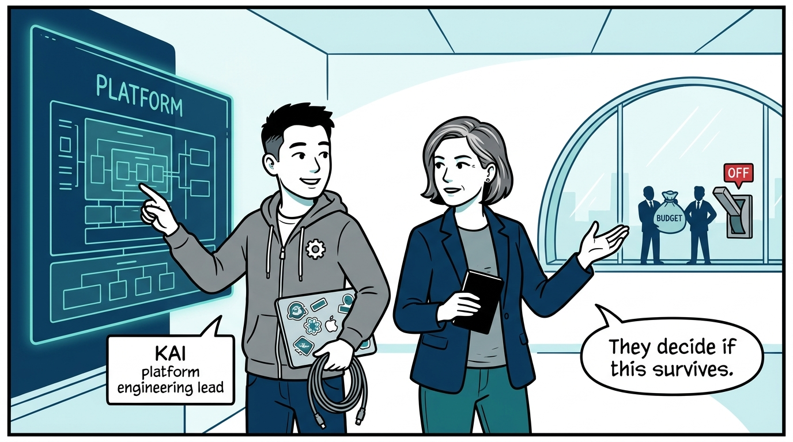
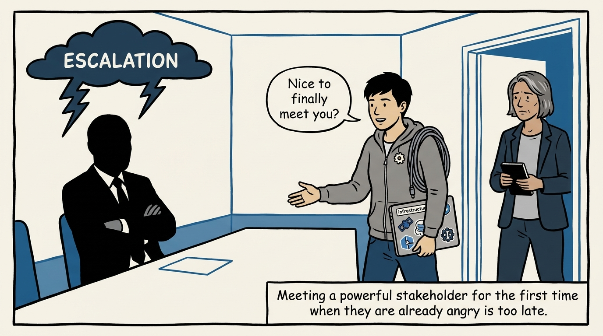
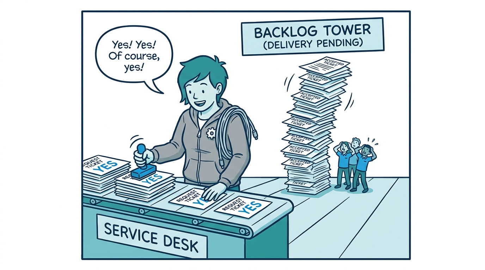
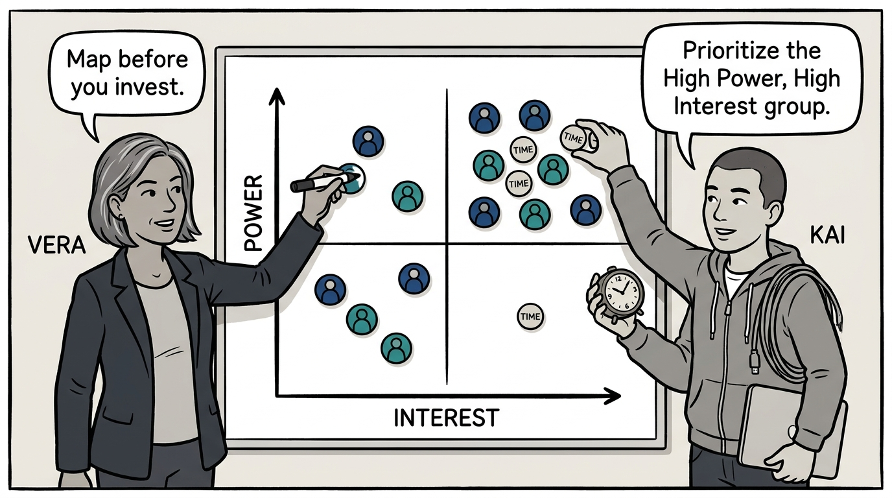
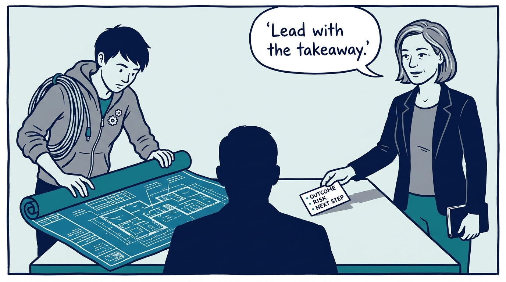
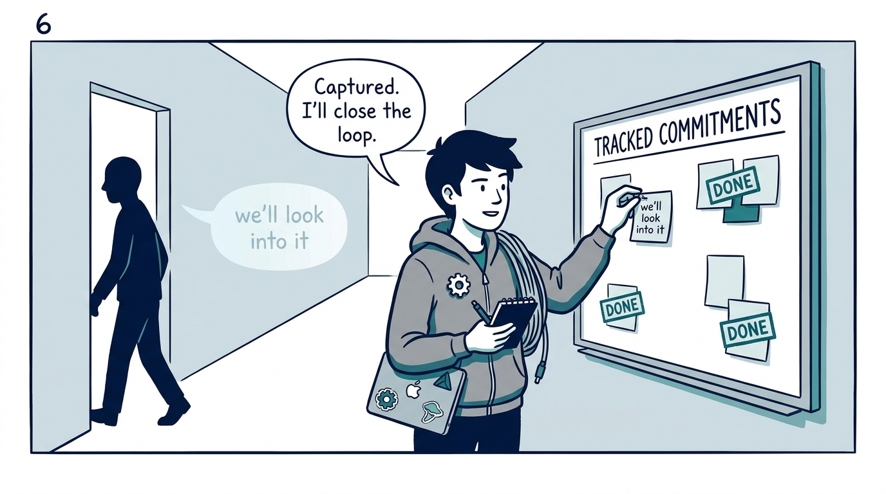
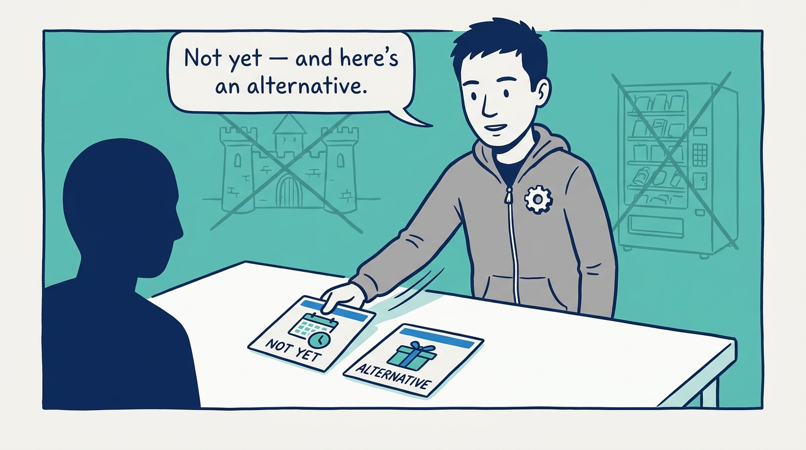
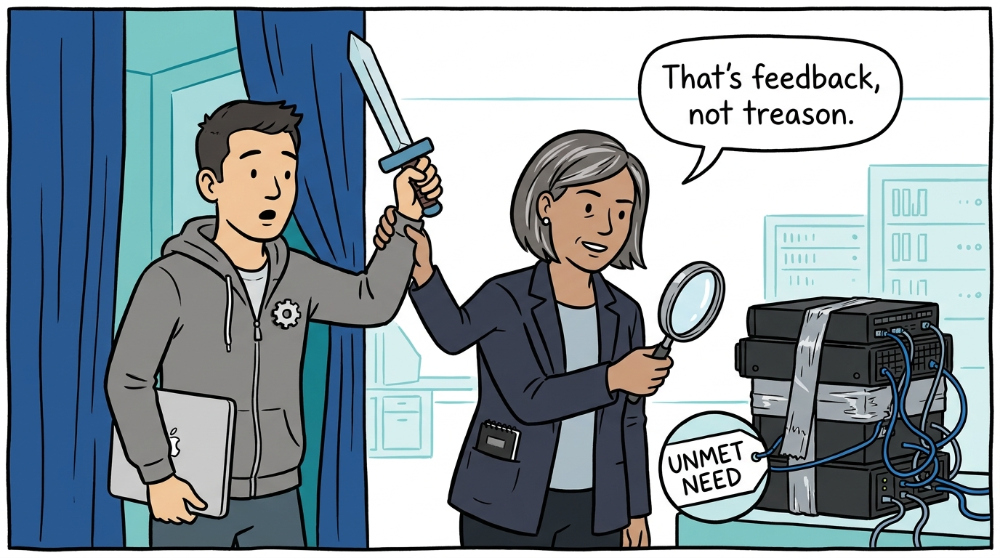
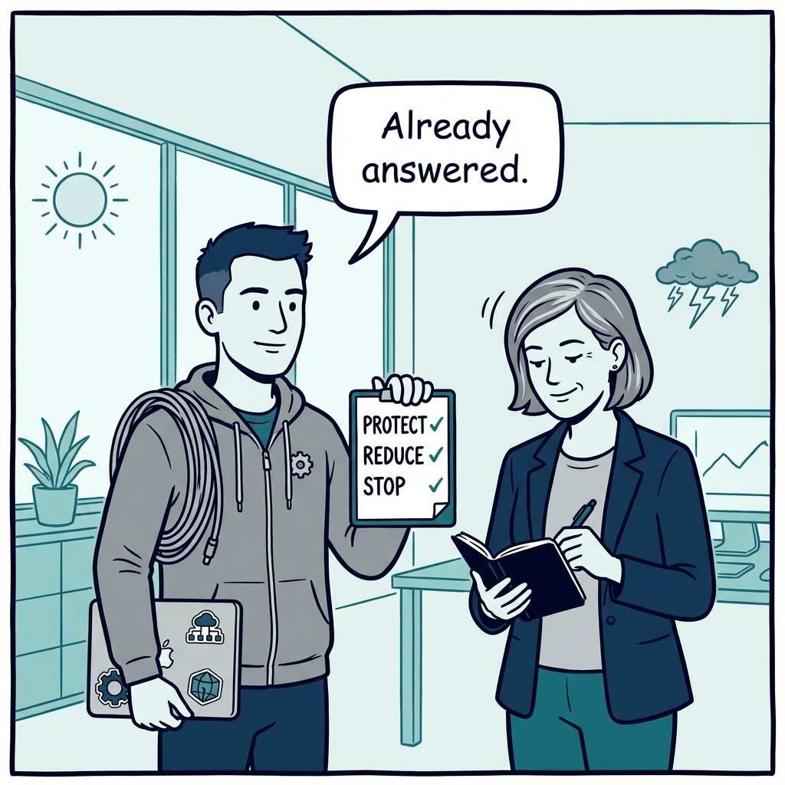

Why a platform's stakeholders decide its fate — and how to manage them before the storm — in nine panels.

<!-- comic-style
{
  "cast": "VERA: a calm, seasoned engineering executive, short gray-streaked hair, dark blazer over a plain t-shirt, carries a small black notebook. KAI: a hands-on platform engineering lead, short dark hair, gray zip-up hoodie with a small gear pin, laptop covered in infrastructure stickers under one arm, a coil of cable slung over the shoulder.",
  "style": "Clean two-tone explainer comic, thick ink outlines, flat colors with deep blue and teal accents on a light background, generous white space, hand-lettered speech bubbles with SHORT readable text, no photorealism."
}
-->

**Panel 1:** *The hook: a platform does not set its own budget, grant its own mandate, or vote on its own survival — stakeholders do.*

**Panel 2:** *The problem: the trust you need in the storm can only be built in the calm — the escalation meeting is too late for introductions.*

**Panel 3:** *The wrong way: the soft yes — accept everything to avoid conflict, then fail to deliver the pile and convert comfort into distrust.*

**Panel 4:** *The principle: map stakeholders by power and interest — manage closely, keep satisfied, keep informed, monitor — and spend scarce relationship time accordingly.*

**Panel 5:** *How it plays out: decide the takeaway first — outcomes, risks, next steps — with detail on request; engineering detail never fixes a trust problem.*

**Panel 6:** *How it plays out: capture every agreement in writing, review what is outstanding, and close every loop — no promise lives only in the air.*

**Panel 7:** *The trade-off: not every request gets a yes — but a no with reasons in the stakeholder's terms, plus an alternative, is a disagreement about priorities, not a rejection of the person.*

**Panel 8:** *Also this: a shadow platform is a signal — unmet urgency, novel demand, or broken collaboration — and the right response is diagnosis, not suppression.*

**Panel 9:** *The closer: arrive at budget season with your own cut proposal — what to protect, reduce, or stop — decided in the calm, before the storm asks.*
