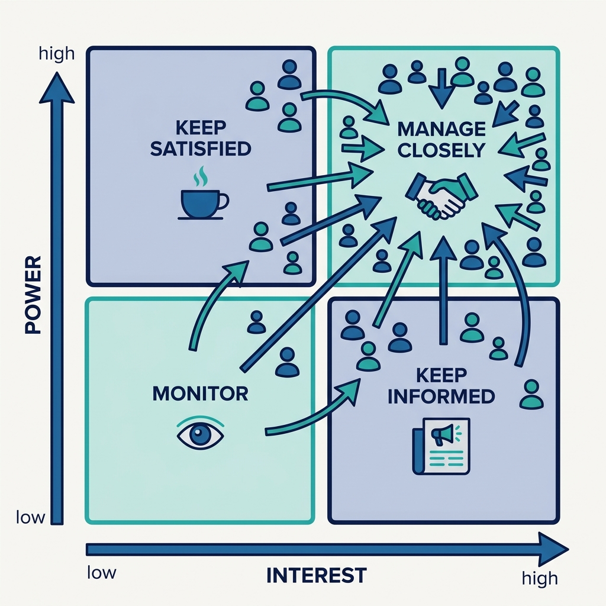
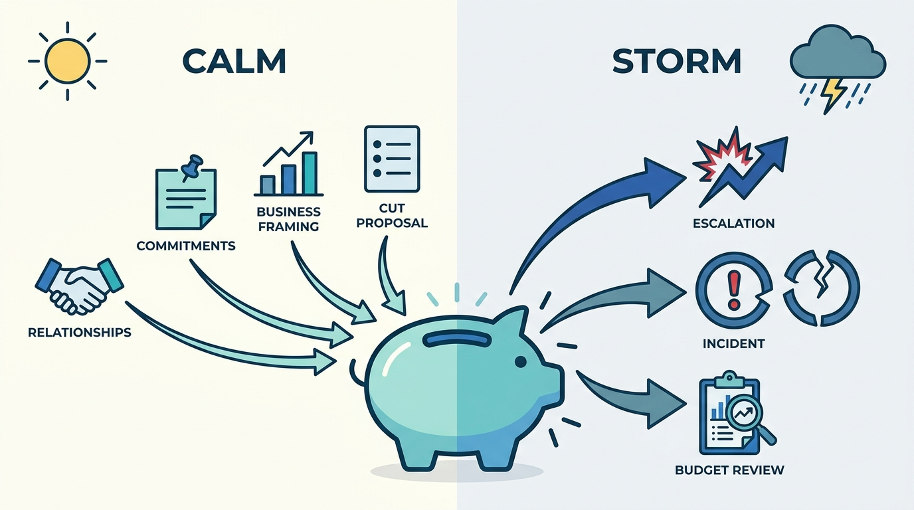
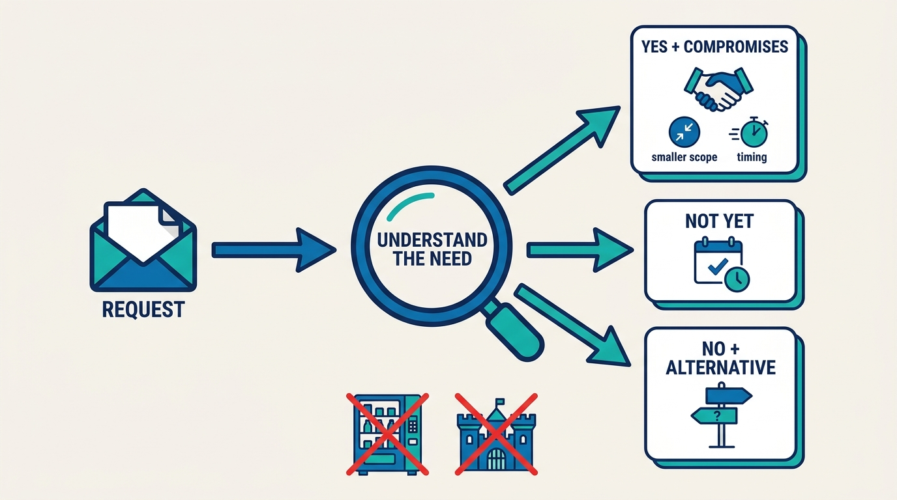

> **Status**: DRAFT
>
> **Principle**: A platform lives or dies by its stakeholders — they set its budget, its mandate, and its odds of surviving a difficult quarter — so I manage those relationships as deliberately as I manage the platform itself. I map stakeholders by power and interest and invest relationship time accordingly; I build trust before a crisis, not during one. I communicate in outcomes, risks, and business impact rather than engineering detail, capture every commitment and close every loop, and answer requests with either a yes shaped by explicit compromises or a no that keeps the relationship intact. And I prepare for budget pressure in the calm: I can always say what I would protect, reduce, or stop — before anyone asks.

## Statement

My operating model for stakeholder management as a platform leader has five disciplines.

**Map before you invest:**

- **Know who can affect your success.** I identify the stakeholders who materially affect the platform's fate and place them on a power–interest grid: manage closely (high/high), keep satisfied (high power, low interest), keep informed (low power, high interest), monitor (low/low).
- **Read the informal map too.** Who has the ear of senior leadership, which teams are considered indispensable, who is loudest and most respected — and how much it would matter if any of them strongly disliked my team.
- **Revisit the map.** Priorities and relationships shift; a stale map is a wrong map.

**Figure 1:** *The power–interest grid: four postures, one scarce resource — relationship time flows to the high-power, high-interest quadrant.*

**Invest in relationships before you need them:**

- **Spend the most time on high-power, high-interest stakeholders**, and build the relationship before a crisis or escalation — not during one.
- **Understand their world.** Each stakeholder's goals, pressures, incentives, and concerns. Disagreement is usually a difference in perspective, not "politics"; they are optimizing for a different part of the business.
- **React to patterns, not to every complaint.**

**Communicate at the right altitude:**

- **Decide the takeaway first**, then lead with outcomes, impact, risks, decisions, and next steps. Detail on request, adjusted to the audience.
- **Make business impact visible** rather than assuming it is understood — and never rely on engineering detail to fix a trust problem.
- **Scale the channel to the quadrant.** Roughly monthly 1:1s for manage-closely stakeholders, quarterly for keep-satisfied and keep-informed; an interlock forum or advisory board when individual 1:1s stop scaling. Turn communication up when reliability, delivery, cost, or confidence deteriorates — and keep it up until the rough patch has genuinely passed.

**Track every commitment:**

- **Capture agreements** in private notes and short written follow-ups that invite correction.
- **Review outstanding commitments** regularly and close the loop when work completes, slips, or changes. No promise lives only in the air.

**Answer requests and pressure with structure:**

- **Yes, with compromises** — a smaller first version, limited scope, negotiated timing, contributed engineering effort, explicit boundaries of what is and is not included.
- **No, without damage** — distinguish no from not yet, explain the constraint in the stakeholder's terms, offer alternatives, and escalate for backup when I lack the authority to hold the line.
- **Shadow platforms get diagnosed, not fought** — they are signals of unmet need, urgency, or broken collaboration; sometimes partnership, sometimes absorption, sometimes cleanup.
- **Budget pressure gets prepared for in advance** — work grouped into team-sized chunks, platform work connected to protected business outcomes, and my own cost-cutting proposal ready before executives make one for me.

## How to Read This

This journal is my platform operating model, one record per source checklist. This record is grounded in the "Managing Stakeholders" chapter of Camille Fournier and Ian Nowland's *Platform Engineering: A Guide for Technical, Product, and People Leaders* (O'Reilly, 2024) — the chapter on how platform leaders build, maintain, and defend the relationships their platform depends on, distilled here into **the five disciplines I hold every platform leader to**. The runnable version — the mapping steps, the communication and commitment practices, and the relationship health check — lives in the **Checklist** tab of this post.

## Rationale

**Stakeholders decide things about the platform that the platform cannot decide for itself.** A platform team does not set its own budget, grant its own mandate, or vote on its own survival in a downturn. Those decisions are made by people outside the team, based on what they believe about it. Fournier and Nowland's blunt framing: it matters enormously whether your team is considered indispensable or "nice to have," and whether a powerful stakeholder strongly dislikes you. Managing those beliefs deliberately is not a distraction from platform work — **it is the part of platform work that keeps the rest funded**.

**The power–interest grid exists because relationship time is scarce.** An earnest leader tries to keep every stakeholder equally happy and ends up with a meeting cadence that cannot scale and no deep relationships anywhere. The grid is a prioritization tool: manage the high-power, high-interest stakeholders closely; keep the others satisfied, informed, or merely monitored. It also has to be redrawn — reorganizations and shifting priorities move people between quadrants, and **relationship time allocated by last year's map is misallocated**.

**Trust is built in the calm and spent in the storm.** The moment you need a stakeholder's goodwill — an escalation, an incident, a budget review — is precisely the moment you can no longer build it. That asymmetry runs through the whole chapter: build relationships before the crisis, capture commitments before the misunderstanding, connect work to business outcomes before the downturn, know your own cuts before the CFO proposes theirs. Every discipline in this record is **cheap when things are calm and decisive when they are not**.

**Figure 2:** *The asymmetry behind every discipline in this record: deposits are only possible in the calm; withdrawals all happen in the storm.*

**Business framing is the only framing that lands.** Stakeholders do not distrust a platform because they lack architecture diagrams, and no quantity of engineering detail repairs a relationship problem. What they need is the takeaway: outcomes, impact, risks, decisions, next steps — with detail available on request rather than delivered by default. Over-communication has the same failure mode as silence: **when everything is sent, the important signal is lost**, and a stakeholder drowning in operational detail is being invited to micromanage.

**A structured no protects the relationship better than a soft yes.** The instinct under stakeholder pressure is to say yes to everything and become a feature factory, or to say no defensively and become a fortress. Both destroy trust. The chapter's alternative is structure: first understand the underlying business need — without assuming the existing roadmap is automatically right — then look for the compromise that serves it (smaller first version, later timing, contributed effort), and when the answer is genuinely no, say whether it is *no* or *not yet*, explain the constraint in the stakeholder's terms, and offer an alternative. A no delivered that way is a **disagreement about priorities, not a rejection of the person** — and it survives.

**Figure 3:** *Every request takes the same path: understand the underlying need first, then a yes shaped by compromises, an honest not-yet, or a no with an alternative — never the vending machine, never the fortress.*

**Shadow platforms are feedback, not treason.** When another team builds its own solution, something drove it: urgency my platform could not meet, novel demand, poor collaboration, cost disagreement, or engineers who simply want to build. Each driver has a different right response — partner, learn, absorb, or occasionally clean up — and none of them is reflexive suppression. A leader who treats every shadow platform as a turf violation **loses the early-warning signal and the relationship in one move**.

## What This Means in Practice

| What this record says | What it does **not** say |
| --- | --- |
| Map stakeholders by power and interest, and spend relationship time accordingly. | Treat every stakeholder identically — even-handedness is not the same as equal time. |
| Build relationships before crises and escalations. | Relationship-building is politics — understanding another leader's incentives is the job, not a game. |
| Lead with outcomes, impact, risks, and next steps; detail on request. | Hide problems behind a polished summary — during rough patches, transparency goes **up**, not down. |
| Capture every commitment and close every loop. | Bureaucratize every conversation — a private note and a short follow-up are enough. |
| Say yes with explicit compromises when the value justifies it. | Say yes to everything — a platform that never says no is a feature factory with no strategy. |
| Say no (or not yet) with reasons in the stakeholder's terms, plus alternatives. | Dress a technical impossibility up as a prioritization choice — infeasible means saying so. |
| Arrive at budget discussions with your own cut proposal. | Defend every project equally — that reads as not understanding the seriousness of the situation. |

Concretely: for every important stakeholder I can name what they care about, when we last spoke, and what I currently owe them. Commitments live in writing, not in memory. And at any moment — not just in budget season — I can answer the question **"what would you protect, reduce, or stop if the budget tightened tomorrow?"**

## Anti-Patterns

- **The escalation-day introduction.** Meeting a powerful stakeholder for the first time in the meeting where they are already angry — the relationship needed to defuse the escalation was never built.
- **The flat cadence.** Identical 1:1s with every stakeholder regardless of power or interest, until the calendar collapses and the important relationships get the same scraps as the unimportant ones.
- **The firehose update.** Sending everything to everyone so that nobody can find the signal — and mistaking that volume for transparency.
- **Engineering detail as trust repair.** Answering a confidence problem with an architecture deep-dive; the stakeholder needed outcomes and owners, not diagrams.
- **The uncaptured promise.** A corridor "we'll look into it" that the stakeholder remembers as a commitment and the team never heard about.
- **The soft yes.** Accepting every request to avoid conflict, then failing to deliver on the accumulated pile — converting short-term comfort into long-term distrust.
- **The disguised no.** Framing a technically infeasible request as "not prioritized this quarter," buying a fight that will simply return next quarter.
- **Turf war with shadow platforms.** Fighting a competing system as insubordination instead of asking what unmet need created it.
- **Budget-season passivity.** Walking into a cost review with a roadmap and hope, waiting for executives to choose the cuts — and losing the work that mattered most.

## Related Records

- [[platform-as-a-product]] — the product discipline that generates the roadmap this record defends and renegotiates with stakeholders.
- [[planning-and-delivery]] — the planning mechanics behind the commitments I capture and the trade-offs I explain in business terms.
- [[platform-success]] — trusted is one of its four success dimensions; this record is the relationship work that earns and keeps that trust.
- [[operating-platforms]] — operational rough patches are the moments this record's turn-up-the-communication discipline is written for.
- [[what-is-platform-engineering]] — why platforms exist at all; the business framing stakeholders need starts from that purpose.

## Scope and Revisiting

This record is `draft`. It applies to every platform leader in my organization who owns stakeholder relationships — engineering and product alike — and to me in the stakeholder conversations I hold personally. I revisit it if an escalation reaches senior leadership from a stakeholder we had no active relationship with, if commitments keep surfacing that nobody captured, or if a budget cycle catches us without a defensible view of what to protect, reduce, or stop.

## Authoritative References

- Camille Fournier & Ian Nowland, *Platform Engineering: A Guide for Technical, Product, and People Leaders* (O'Reilly, 2024) — the "Managing Stakeholders" chapter, whose checklist this record distills.
