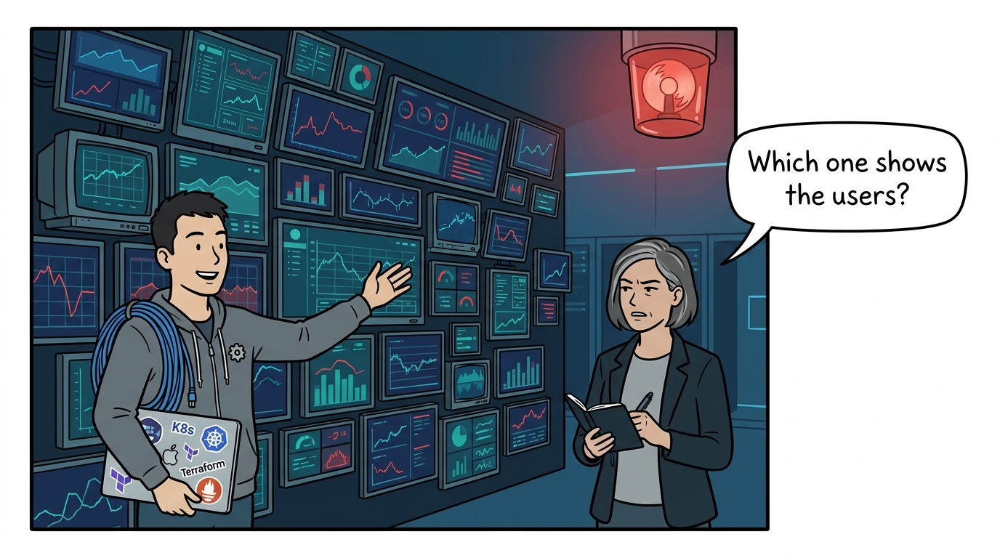
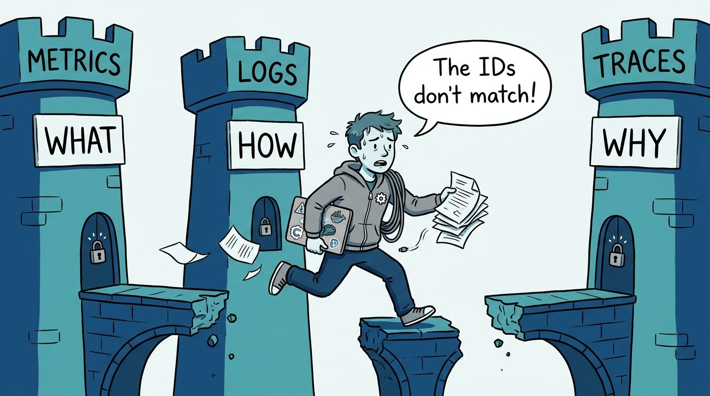
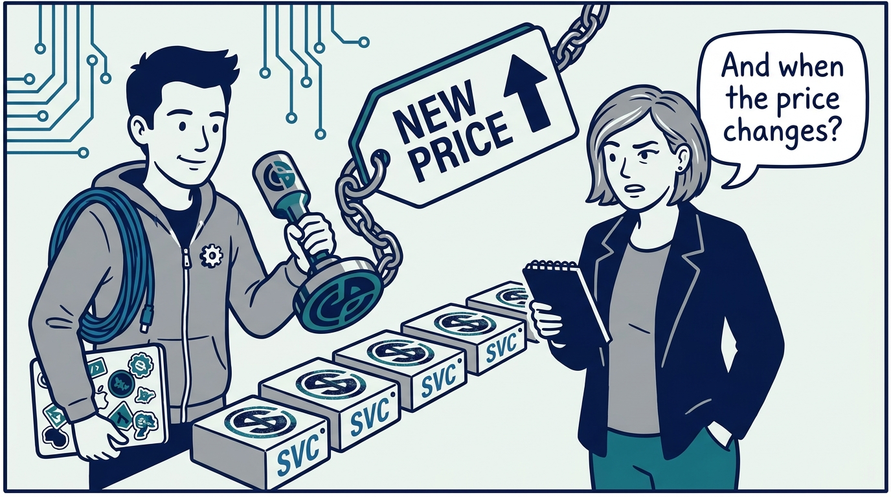
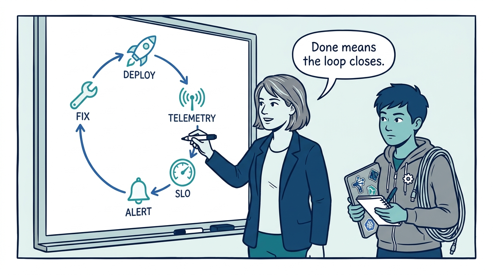
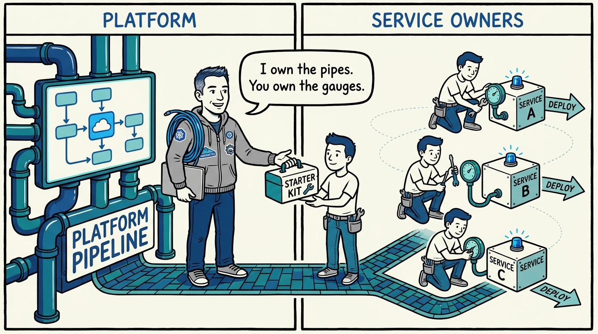
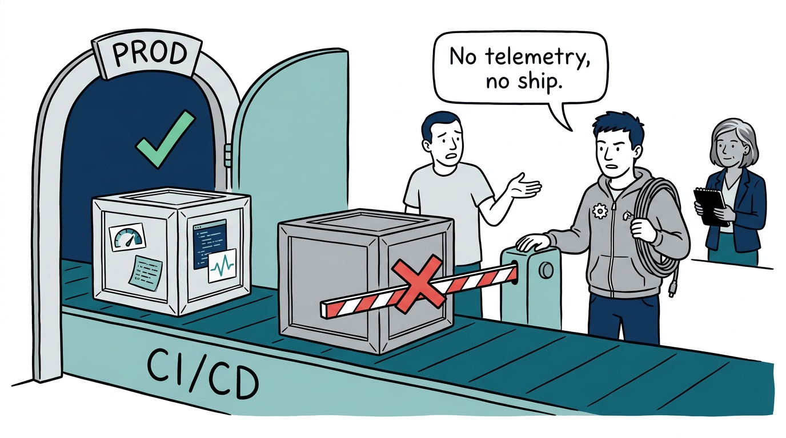
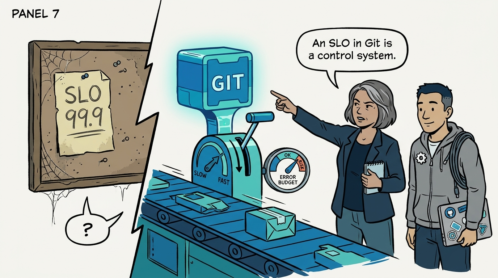
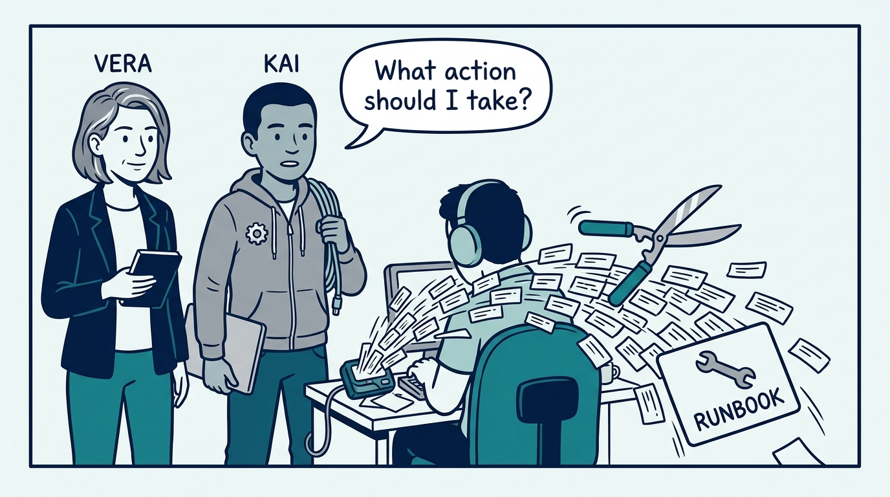
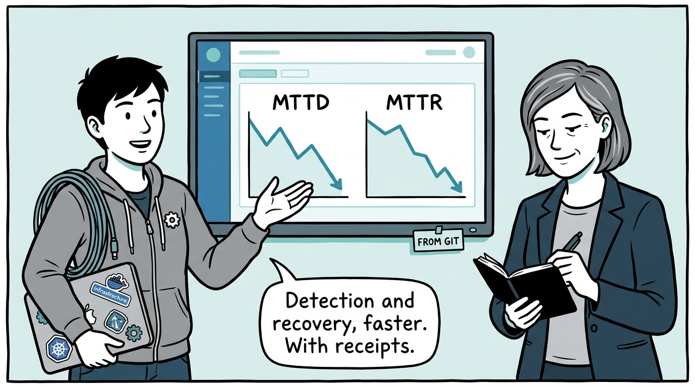

Why observability is done when the loop closes, not when the stack is installed — in nine panels.

<!-- comic-style
{
  "cast": "VERA: a calm, seasoned engineering executive, short gray-streaked hair, dark blazer over a plain t-shirt, carries a small black notebook. KAI: a hands-on platform engineering lead, short dark hair, gray zip-up hoodie with a small gear pin, laptop covered in infrastructure stickers under one arm, a coil of cable slung over the shoulder.",
  "style": "Clean two-tone explainer comic, thick ink outlines, flat colors with deep blue and teal accents on a light background, generous white space, hand-lettered speech bubbles with SHORT readable text, no photorealism."
}
-->

**Panel 1:** *The hook: a dozen excellent dashboards answer a dozen local questions — and fail the one that matters: what is happening to users right now?*

**Panel 2:** *The problem: metrics say what, logs say how, traces say why — and without common identifiers, the three answers can never be joined into one investigation.*

**Panel 3:** *The wrong way: the vendor tattoo — instrumenting directly against a commercial SDK couples every service to a backend decision that pricing will eventually reopen.*

**Panel 4:** *The principle: observability is a closed loop — deploy, telemetry, SLO violation, actionable alert, remediation — not a shopping list of tools.*

**Panel 5:** *How it plays out: the platform owns the shared pipeline and the contract; teams instrument their own code — with starter kits making the paved path the easy path.*

**Panel 6:** *How it plays out: CI/CD is the gate — builds fail on missing metrics endpoints, structured logs, or trace spans, so uninstrumented code never reaches production.*

**Panel 7:** *How it plays out: an SLO in a wiki is an opinion; an SLO in Git — reviewed, versioned, deployed through GitOps — is a control system with the error budget as governor.*

**Panel 8:** *What it costs: every alert that fires without producing action trains responders to ignore the pager — so alerts answer 'what action should I take', or they get pruned.*

**Panel 9:** *The closer: the build is done when the loop closes and the numbers prove it — MTTD and MTTR trending down, on a dashboard whose definition lives in Git.*
