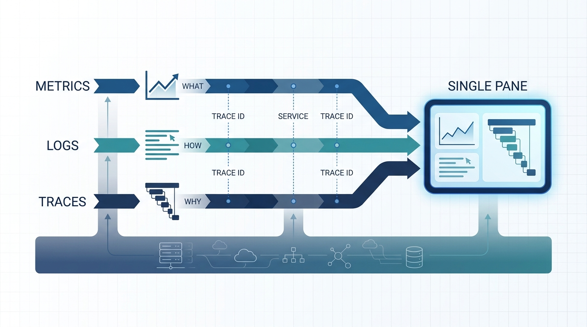
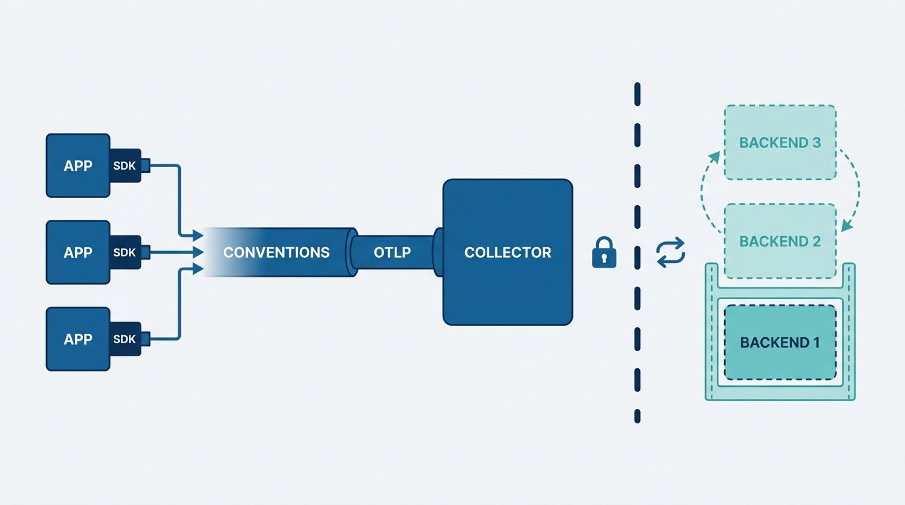
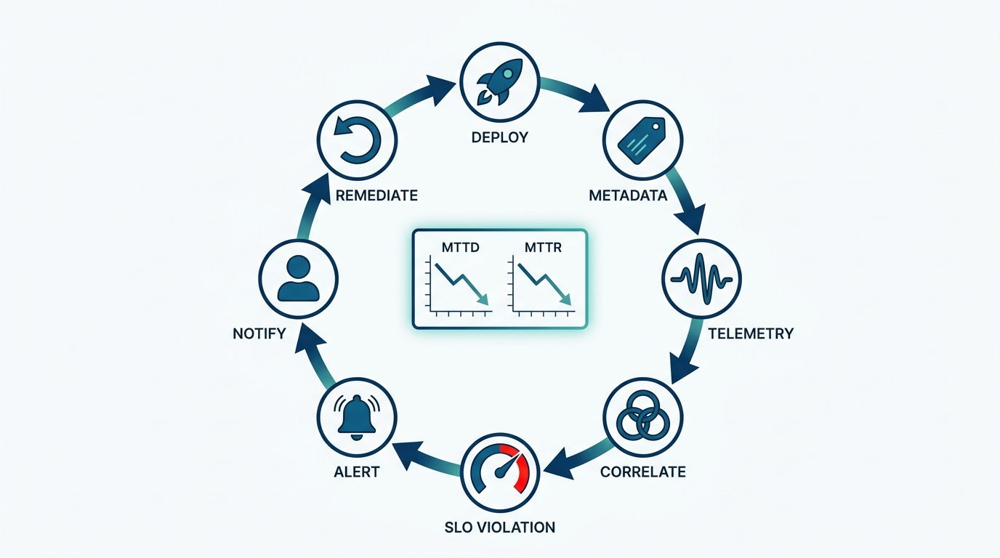

> **Status**: DRAFT
>
> **Principle**: Observability is a **first-class platform capability**, built once and consumed by every team — not a per-team hobby assembled after the first bad incident. When my platform teams build it, the shape is fixed: **metrics, logs, and traces** collected through **vendor-neutral instrumentation** and correlated by common identifiers into a single pane of glass; the **platform owns the shared pipeline**, development teams own instrumenting their code against an explicit contract; **dashboards serve named personas** and live in version control; **CI/CD refuses to promote code that cannot be observed**; alerts are symptom-based and answer *what action should I take*; and **SLOs with error budgets are defined as code**, deployed through GitOps, and allowed to govern deployment velocity. The build is done when the loop closes — a deployment degrades user experience, telemetry catches it, an actionable alert reaches the right team, remediation follows — and when MTTD and MTTR have measurably dropped.

## Statement

When a platform team in my organization builds observability, this is the shape of the build I hold them to.

**Strategy before stack:**

- **First-class capability.** Observability is designed into the platform from the start, with named business and engineering outcomes — reduced MTTD and MTTR above all — not bolted on after an outage.
- **One pane, not many panes.** A single-pane-of-glass strategy governs how signals come together; disconnected per-team dashboards are the failure mode, not the plan.
- **Three signals, three questions.** Metrics say *what* happened, logs say *how*, traces say *why* — and common identifiers (service names, trace IDs) stitch them into one investigation across applications *and* the infrastructure beneath them.

**Figure 1:** *Metrics answer what, logs answer how, traces answer why — common identifiers stitch the three into one investigation on a single pane of glass.*

**Vendor-neutral instrumentation:**

- **One standard.** Applications are instrumented with OpenTelemetry SDKs under consistent semantic conventions, exporting over vendor-neutral OTLP. Instrumentation is independent of whatever backend we run this year.
- **Collectors as infrastructure.** Telemetry flows through collectors configured for batching, buffering, retries, and high availability — ingestion that neither loses signals nor loads down the workloads it watches, and that crosses the network boundaries it has to cross.
- **Right transport per signal.** Pull for metrics where appropriate, push for traces, a hybrid for logs — chosen deliberately, not inherited.
- **The backends are operated like production.** Time-series storage has service discovery, retention policies, backups, and a scaling plan — and tracks the metrics that reveal degradation *before* complete failure.

**A clean responsibility split:**

- **Platform owns the pipeline; teams own their instruments.** The platform team runs the shared observability infrastructure; development teams instrument their own applications — against explicit observability contracts and non-functional requirements, with reusable SDK configurations, starter kits, and self-service capabilities so the paved path is the easy path.
- **Build versus buy is a decision, not a default.** Assessed on maturity, service count, budget, staffing, compliance, and data residency — and revisited as the organization changes.

**Consumption by persona:**

- **Every consumer gets a view.** Customers get service health; executives get business KPIs; developers get debugging depth; QA gets release validation; DevOps and SRE get incident diagnostics; security gets forensics; compliance gets immutable audit trails.
- **Dashboards are code.** Preconfigured per persona, templated with variables, stored in version control, annotated with deployment and incident markers, edit-restricted to owners, and kept fast.
- **Security is a telemetry consumer too.** Policy violations, RBAC denials, and vulnerabilities surface as metrics — sanitized aggregates broadly, sensitive detail restricted, security events joinable to traces.

**Enforcement and the closed loop:**

- **CI/CD is the gate.** Pipelines fail when required metrics endpoints, structured logs, or trace spans are missing; telemetry is verified in staging before promotion; deployment metadata is published as telemetry and correlated automatically. Uninstrumented code does not reach production — and the pipeline itself is measured: build duration, test time, deployment frequency, flakiness.
- **Alerts demand action.** Alerting is symptom-based, answers *what action should I take*, carries severity and a runbook, uses fast-burn and slow-burn SLO alerts, groups and routes by business impact, silences during maintenance, and gets pruned when it fires without producing action.
- **SLOs as code.** SLIs reflect actual user experience; SLOs and error budgets are defined for customer-facing *and* internal platform services, published on dashboards in real time, allowed to govern deployment velocity — and stored in Git, code-reviewed, rollback-capable, deployed through GitOps, synchronized with recording rules, dashboards, and alerts, with deployments validated against SLOs before promotion to production.

## How to Read This

This record is part of the **Reference Implementation** section of this journal — the how-it-concretely-looks companion to the Platform Engineering records, grounded in the *Platform Engineer's Handbook*, a companion that builds one internal developer platform end to end. It is [[operating-platforms]] and pillar 3's user observability from [[four-pillars]] made executable. The full working checklist — all sixteen sections plus the final readiness check — lives in the **Checklist** tab; the **TL;DR** tab carries the management summary; the **Conversation** tab talks it through.

The handbook's stack is the worked example, not the mandate. The commitments hold at capability level:

| Role | Reference tool | The property that matters |
| --- | --- | --- |
| Instrumentation | OpenTelemetry SDKs | Vendor-neutral, consistent conventions; apps independent of the backend |
| Telemetry transport | OpenTelemetry Collector (OTLP) | Batching, buffering, retries, high availability |
| Metrics store | Prometheus | Pull-based service discovery; retention, backup, and scaling policies |
| Visualization | Grafana | One layer over many backends; dashboards defined in version control |
| SLO delivery | Flux (GitOps) | SLO definitions deployed, versioned, and rolled back like code |
| Enforcement | CI/CD pipeline (CircleCI in the reference) | Fails builds missing metrics endpoints, structured logs, or trace spans |

Swap any tool; keep every property.

## Rationale

**Observability is a platform capability because correlation is.** Any team can install an agent; no team alone can make its telemetry line up with everyone else's. The value of observability lives in the joins — the trace ID that connects a customer-facing error to a pod eviction three layers down — and joins require shared conventions, shared identifiers, and a shared pipeline. That is platform work by definition. It is also why the single pane of glass is a strategy, not a purchase: a dozen excellent disconnected dashboards answer a dozen local questions and fail the one that matters, *what is happening to users right now, and why*.

**Vendor neutrality is the platform's hedge on its own future.** Observability backends change — pricing changes, scale changes, the build-versus-buy answer changes as the organization matures. The chapter's quiet masterstroke is separating what must be stable from what may churn: instrumentation, conventions, and the OTLP wire format are forever; the backend behind the collector is a procurement decision. Teams that instrument directly against a vendor's SDK tattoo that vendor onto every service, and the eventual migration bill is priced in engineer-years.

**Figure 2:** *The stability boundary: instrumentation, conventions, and the OTLP wire format are forever; the backend behind the collector is a procurement decision.*

**The responsibility split keeps both failure modes off the table.** Centralize everything and the platform team becomes the bottleneck instrumenting other people's code, badly. Decentralize everything and you get archipelago observability — every team its own stack, no correlation, no economies. The split holds: the platform owns pipes, storage, dashboards-as-a-service, and the contract; teams own emitting good telemetry into it. Starter kits and self-service make honoring the contract cheaper than evading it.

**Enforcement belongs in the pipeline, because afterwards is too late.** An observability standard that is not machine-checked is a suggestion, and suggestions lose to deadlines. Failing the build on a missing metrics endpoint, absent structured logs, or missing trace spans converts the contract from documentation into physics — and verifying telemetry in staging catches the instrumentation that compiles but says nothing. The same principle points inward: a pipeline that measures build duration, test flakiness, and deployment frequency is how the platform team finds its own bottlenecks instead of hearing about them.

**Alerts are for action; everything else is a dashboard.** The chapter's alerting test is the one I quote: every alert must answer *what action should I take?* Symptom-based alerting keeps the pager tied to user impact rather than internal noise; fast-burn and slow-burn SLO alerts distinguish the outage from the slow leak; grouping, routing, and maintenance silencing protect the signal; and regular pruning retires alerts that fire without producing action — because every one of those trains responders to ignore the pager, and that training is expensive to undo.

**SLOs as code close the loop.** An SLO in a wiki is an opinion; an SLO in Git — reviewed, versioned, rollback-capable, deployed through GitOps, synchronized with its recording rules, dashboards, and alerts — is a control system. Error budgets displayed in real time give deployment velocity a governor that no release-review meeting can match. And defining SLOs for internal platform services, not just customer-facing applications, is the platform holding itself to the bar it sets for its tenants. The final proof is the lifecycle running end to end: deploy, emit metadata, emit telemetry, correlate, detect the SLO violation, fire the actionable alert, notify the owning team, roll back or remediate — with MTTD and MTTR trending down as the receipts.

**Figure 3:** *The closed loop, end to end: deploy, metadata, telemetry, correlation, SLO violation, actionable alert, notification, remediation — with falling MTTD and MTTR as the receipts.*

## What This Means in Practice

| What this record says | What it does **not** say |
| --- | --- |
| Observability is designed in as a first-class platform capability. | Every service needs maximal telemetry from day one — coverage follows the contract, and the contract follows real outcomes. |
| Instrumentation is vendor-neutral; the backend may churn. | We build everything ourselves — build versus buy is assessed honestly and revisited as maturity changes. |
| The platform owns the shared pipeline and the contract. | The platform instruments applications for teams — instrumentation is the development team's job, made easy. |
| CI/CD fails builds that cannot be observed. | The gate is negotiable per team — the contract is enforced in the pipeline, uniformly. |
| Alerts are symptom-based and demand an action. | More alerts mean more safety — alerts that fire without action get pruned or redesigned. |
| SLOs live in Git and govern deployment velocity. | SLO thresholds are identical everywhere — definitions stay consistent across environments while thresholds may differ. |
| The build is proven by measurably better MTTD and MTTR. | Installing the stack is the finish line — the loop closing is. |

Concretely: no service my organization runs in production is unobservable by construction — the pipeline will not let it through — and the platform team can show me, on a dashboard whose definition is in Git, this quarter's MTTD and MTTR against last quarter's.

## Anti-Patterns

- **The retrofit.** Observability budgeted after the first serious incident, wired in under pressure, forever partial — the afterthought the strategy section exists to forbid.
- **The dashboard graveyard.** Dozens of disconnected dashboards, each once useful to someone, collectively unable to say what users are experiencing right now.
- **The vendor tattoo.** Instrumenting directly against a commercial SDK, coupling every service to a backend decision that pricing will eventually reopen.
- **The three silos.** Metrics, logs, and traces in three systems with no common identifiers — three answers to *what*, *how*, and *why* that cannot be joined into one investigation.
- **The unwatched watcher.** An observability stack with no retention policy, no backups, no scaling plan — the system that watches production operated like a science project.
- **The optional endpoint.** A pipeline that ships services with no metrics endpoint, no structured logs, no spans — and a team that discovers this during the incident.
- **The pager firehose.** Cause-based alerts on every internal wobble, unrouted, ungrouped, never pruned — training responders to ignore the one page that matters.
- **The wiki SLO.** Targets written in a document nobody reviews, attached to no alert, governing nothing — an opinion wearing an SLO's clothes.

## Related Records

- [[four-pillars]] — pillar 3's user observability and pillar 4's operational discipline; this record is both made concrete for the observability capability.
- [[operating-platforms]] — the operating discipline (incidents, on-call, support) that runs on the telemetry this record builds.
- [[platform-creation]] — the environments, GitOps machinery, and mesh this telemetry watches — and the delivery path SLOs-as-code ride on.
- [[platform-security]] — securing the platform itself; this record only surfaces security signals as telemetry.
- [[cicd-as-a-platform-service]] — the full CI/CD service; this record takes only its observability gates and pipeline metrics.
- [[cost-performance-scalability]] — cost telemetry and optimization; this record stops at making degradation visible.
- [[platform-success]] — the organization-level scorecard; MTTD and MTTR here are this capability's own proof.

## Scope and Revisiting

This record is `draft`. It applies to every observability build a platform team in my organization undertakes, whatever stack they choose. I revisit it if the reference architecture shifts materially (for instance, OpenTelemetry absorbing more of the backend layer, or the build-versus-buy balance moving as we scale), if the CI/CD gates prove too blunt for a class of workloads and need a principled exception model, or if a year of operation shows MTTD and MTTR flat — which would mean we built the stack and not the capability.

## Authoritative References

- *Platform Engineer's Handbook* — the Observability Implementation chapter, whose checklist this record distills; the reference implementation's stack is OpenTelemetry, Prometheus, Grafana, and Flux GitOps.
