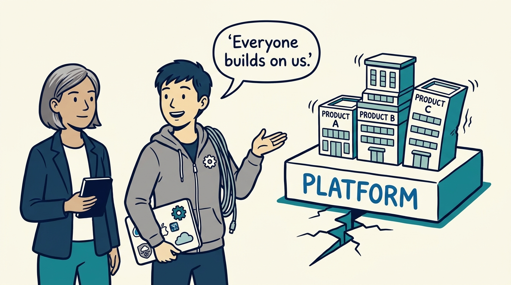
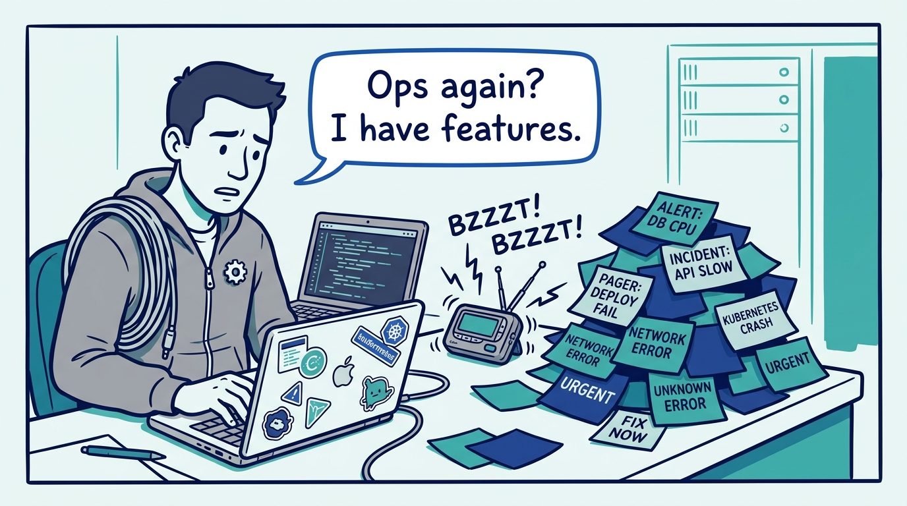
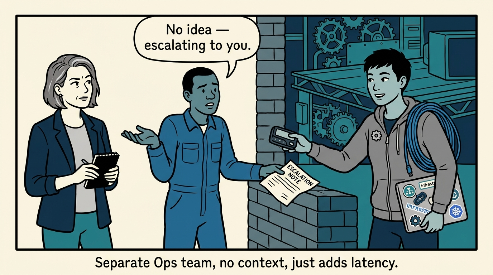
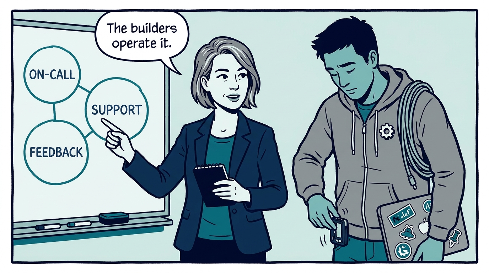
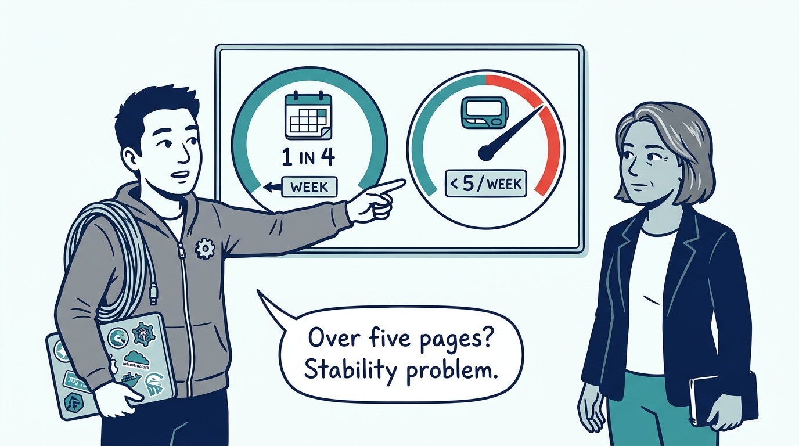
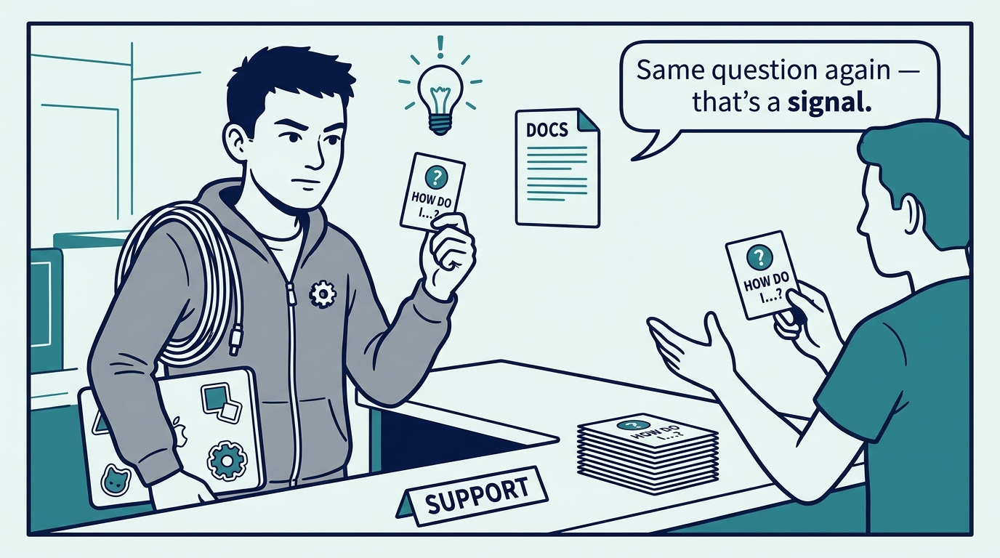
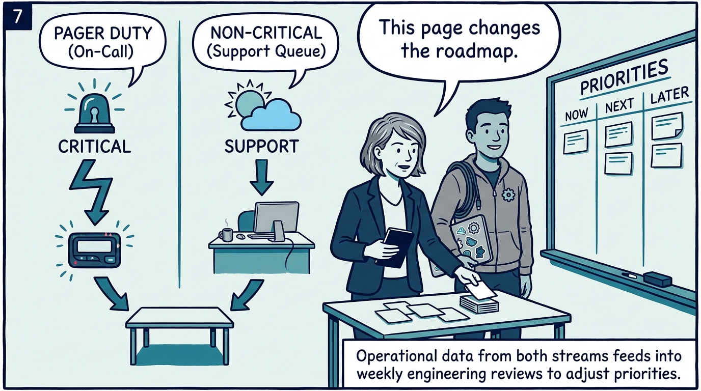
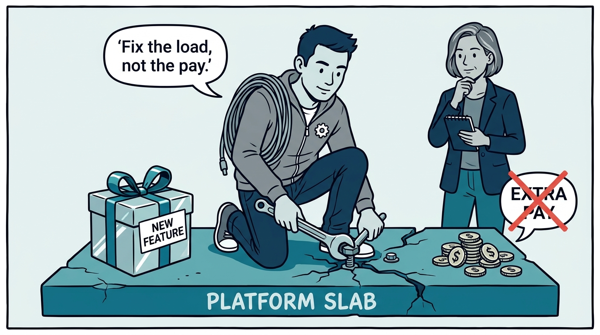
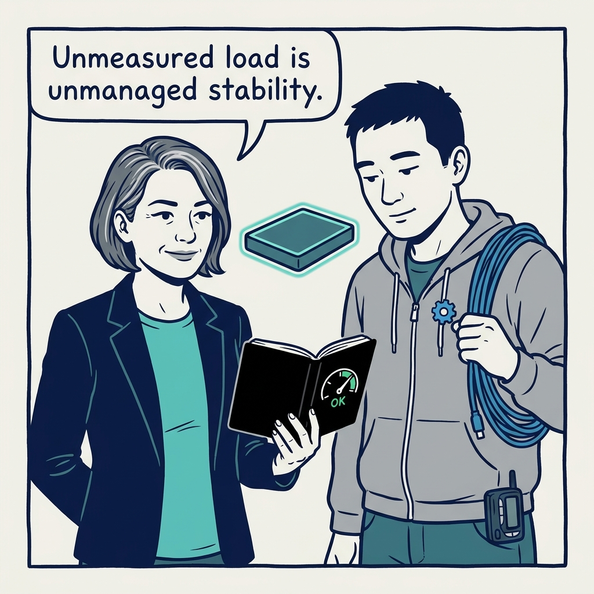

Why the engineers who build a platform operate it — and why operational load gets real numbers — in nine panels.

<!-- comic-style
{
  "cast": "VERA: a calm, seasoned engineering executive, short gray-streaked hair, dark blazer over a plain t-shirt, carries a small black notebook. KAI: a hands-on platform engineering lead, short dark hair, gray zip-up hoodie with a small gear pin, laptop covered in infrastructure stickers under one arm, a coil of cable slung over the shoulder.",
  "style": "Clean two-tone explainer comic, thick ink outlines, flat colors with deep blue and teal accents on a light background, generous white space, hand-lettered speech bubbles with SHORT readable text, no photorealism."
}
-->

**Panel 1:** *The hook: a platform is a promise to be there — every team on top inherits every outage.*

**Panel 2:** *The problem: operations treated as an interruption — and an operational load nobody measures.*

**Panel 3:** *The wrong way: hand the pager to a context-free ops team and every incident becomes an escalation chain.*

**Panel 4:** *The principle: the engineers who build the platform operate it — on-call, support, and operational feedback are core work.*

**Panel 5:** *How it plays out, on-call: load has numbers — at most one week in four, fewer than five meaningful pages — and a breach is a stability problem.*

**Panel 6:** *How it plays out, support: engineers hear users directly — a repeated question is a product defect with a name and a frequency.*

**Panel 7:** *How it plays out, feedback: noncritical support runs in its own lane, and the weekly review turns operational signals into engineering priorities.*

**Panel 8:** *The cost: when the numbers breach, stability work outranks new features — extra pay is never the fix for an unsustainable pager.*

**Panel 9:** *The closer: a platform whose operational load is unmeasured is a platform whose stability is unmanaged.*
