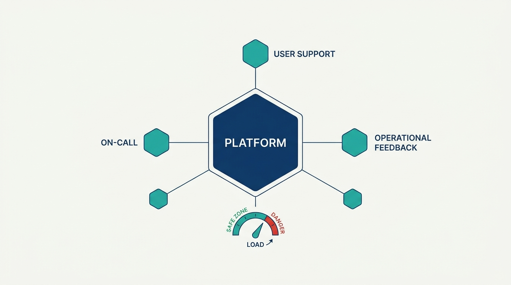
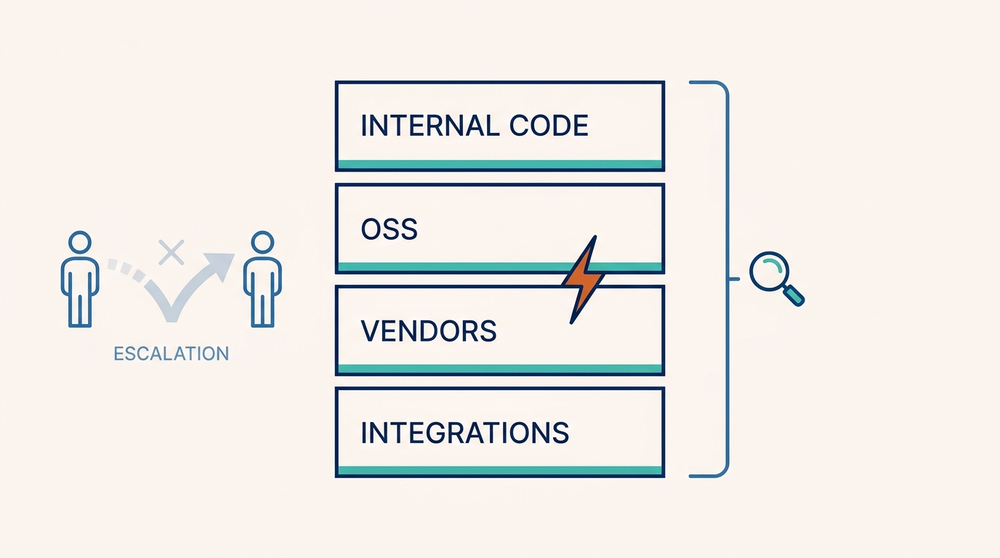
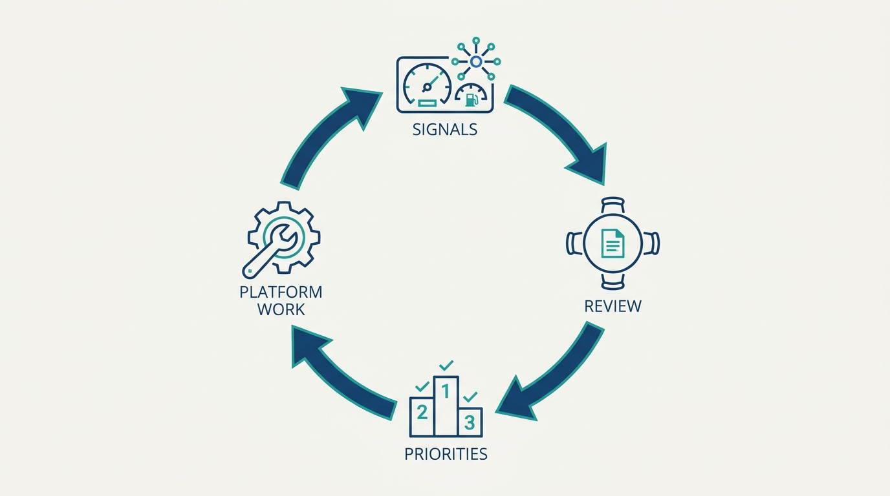

> **Status**: DRAFT
>
> **Principle**: The engineers who build a platform operate it, and operational work is a core part of platform engineering — not an interruption to it. Every platform team owns three practices: on-call, user support, and operational feedback. On-call runs as a merged DevOps rotation with explicit load limits — no more than one week in four, fewer than five meaningful pages per engineer per week — and more than that is treated as a platform-stability problem, not an on-call problem. Noncritical support is separated from critical on-call and structured by defined levels, and operational signals — a handful of meaningful customer-facing SLOs, change management, synthetic monitoring, and regular operational reviews — close the loop back into engineering priorities. A platform whose operational load is unmeasured is a platform whose stability is unmanaged.

## Statement

My operating model for operating platforms has three practices and one rule about limits.

**On-call, sustainable by design:**

- **The builders operate it.** On-call is a merged DevOps rotation providing 24×7 coverage where the business needs it — software developers and systems engineers in the same rotation, with enough platform expertise to diagnose issues across internal code, OSS, vendors, and integrations. No handing operations to a separate team that lacks deep platform context.
- **Load has numbers.** Each engineer is on-call at most one week in four, ideally one in six to eight; pager load is tracked, and the target is fewer than five meaningful pages per engineer per week. More business-impacting pages than that is a **platform-stability problem** — stability work then outranks new features.
- **Alerts earn their noise.** False alarms are hunted down, alerts stay tied to customer or business impact, and secondary rotations that merely forward pages are avoided. Fairness first: reduce unnecessary after-hours work before compensating for it — extra pay is never a substitute for fixing unsustainable load.

**Support, structured and separated:**

- **Engineers hear users directly.** Support work exposes usability problems, confusing abstractions, and missing capabilities; repeated questions are product and documentation signals, not noise to route away.
- **Levels, not heroics.** Requests are categorized — production troubleshooting, bugs, help, feature requests, reviews, design questions — with defined service levels, a definition of what counts as a **critical incident**, and clarity on when users may page the team.
- **Noncritical support is not on-call.** Critical after-hours incidents stay on the rotation; noncritical volume moves to a business-hours support rotation. Total operational load is tracked across both, and staffing is reassessed when operations consume roughly half of engineering capacity. Support specialists, distant time zones, and a Tier 1 support organization are deliberate scaling moves — never a way to shield engineers from users entirely.

**Operational feedback, closing the loop:**

- **Few, meaningful, customer-facing SLOs** — with broader internal SLOs for coverage; change management on every production change until safe automation is mature; synthetic monitoring that exercises end-to-end customer workflows so we detect failures before customers report them.
- **Reviews that change priorities.** A lightweight weekly operational review per team and organization-level reviews of the highest-impact incidents — feeding postmortem remediation, recurring-page root causes, and support trends back into engineering priorities, with leaders in the room and engineers accountable for operating what they build.

**Figure 1:** *The operating model: three practices every platform team owns, governed by one measured load limit.*

## How to Read This

This journal is my platform operating model, one record per source checklist. This record is grounded in the "Operating Platforms" chapter of Camille Fournier and Ian Nowland's *Platform Engineering* (O'Reilly, 2024) — the chapter on the operational disciplines a platform team owes its users, distilled here into **the operational bar and load limits I hold every platform team to**. The runnable version — the on-call limits, support levels, SLO discipline, review cadence, and the quick health check — lives in the **Checklist** tab of this post.

## Rationale

**A platform is a promise to be there, and operations is how the promise is kept.** Product teams can occasionally ship and move on; a platform team cannot, because other teams build on top of it and inherit every outage. That is why operational work is an ongoing responsibility rather than something addressed during incidents, and why Fournier and Nowland name three practices every platform team must own — on-call, user support, operational feedback — while favoring **essential practices over rigid processes**. The practices are non-negotiable; their exact shape adapts to the team.

**The merged rotation exists because platform failures cross layers.** A platform incident might live in internal code, an OSS dependency, a vendor system, or the integration seams between them — and a separate operations team without deep platform context can only escalate, adding latency to every incident. Putting builders on the rotation shortens diagnosis and does something subtler: it makes the pain of operating bad software land on the people **best positioned to fix it**.

**Figure 2:** *Platform failures cross layers — a merged rotation spans them all, where a context-free ops team can only escalate.*

**On-call limits are stability metrics in disguise.** The limits protect people, but their sharper function is diagnostic: a team that cannot meet them is not understaffed for on-call, it is **operating an unstable platform**. Treating the breach as a stability problem — pausing features for reliability work — is the whole discipline. Paying people more to absorb an unsustainable pager, or adding a forwarding layer of secondary on-call, treats the symptom and preserves the disease.

**Support is a sensor, not a tax.** The instinct is to shield engineers from support so they can "focus on real work" — and it is exactly wrong. Support is where usability problems, confusing abstractions, and missing capabilities announce themselves; a repeated question is a documentation or product defect with a name and a frequency. The structure — categorized requests, defined levels, a crisp critical-incident definition — exists so the signal can be read and the noise reduced, not so engineers never hear a user again. Even a Tier 1 support organization, at scale, keeps feedback sessions flowing back to platform engineers.

**Separating noncritical support from on-call keeps both honest.** When help requests and pages share a channel, either everything becomes urgent — burning the rotation — or nothing is, and real incidents drown in questions. Splitting them lets on-call defend the platform while a business-hours rotation serves users at a sustainable pace — and tracking total load across both is what surfaces the moment operational work consumes half of engineering capacity and staffing has to be rethought.

**Feedback loops are what make operations engineering rather than firefighting.** A handful of meaningful customer-facing SLOs, synthetic monitoring that catches failures before customers do, change management on every production change, and a weekly review that is lightweight but rigorous — none of it matters if the loop stays open. The closing move is converting operational data into engineering priorities: postmortem actions tracked to completion, recurring pages investigated to root cause, and leaders with enough operational context to change investment decisions. Reviews that change nothing are **process theater**, and the chapter is explicit about refusing them.

**Figure 3:** *The closed loop: operational signals pass through review into priorities and platform work, then back into signals.*

## What This Means in Practice

| What this record says | What it does **not** say |
| --- | --- |
| Platform engineers build and operate their systems in a merged rotation. | A separate SRE/ops team absorbs operations — context-free operations just adds escalation latency. |
| On-call load is bounded: at most 1 week in 4, fewer than five meaningful pages per week. | The numbers are aspirations — a sustained breach is a stability problem that outranks features. |
| Noncritical support moves to a business-hours rotation with defined service levels. | Everything urgent to a user is urgent to the platform — urgency is tied to business impact. |
| Engineers regularly hear directly from users through support. | Engineers handle all support forever — specialists and Tier 1 are legitimate scaling moves. |
| Customer-facing SLOs are few and meaningful; internal SLOs are broader. | More SLOs mean more reliability — a noisy dashboard hides the platform's real health. |
| Every production change is documented, reviewed, and tested until safe automation is mature. | Change management is permanent bureaucracy — it is scaffolding until automation earns trust. |
| Operational reviews feed engineering priorities, with leaders present. | Reviews are a reporting ritual — a review that never changes a priority is process theater. |

Concretely: every platform team here can state its current pages-per-engineer-per-week number, runs a weekly operational review that leaders actually attend, and **can point to an engineering priority that operational feedback changed this quarter**. When the on-call numbers breach, the next conversation is about platform stability — **never about who else could carry the pager**.

## Anti-Patterns

- **Operations as interruption.** Treating operational work as what happens between feature sprints — addressed only during incidents, resented the rest of the time.
- **The context-free ops team.** Handing the pager to a separate SRE or operations team without deep platform knowledge, converting every incident into an escalation chain.
- **Paying for the pager instead of fixing it.** Using compensation to make an unsustainable on-call load tolerable rather than treating the load as the stability defect it is.
- **The forwarding secondary.** A secondary rotation that exists only to relay pages to the primary team — latency dressed up as coverage.
- **The fully shielded engineer.** Routing all support away from engineers until nobody who builds the platform has heard a user question in months — and empathy, usability signals, and product insight quietly die.
- **Answering instead of eliminating.** Handling the same support question week after week without ever converting it into documentation, diagnostics, or a product change.
- **SLO sprawl.** Dozens of customer-facing SLOs, each individually defensible, collectively hiding whether the platform is healthy.
- **Process theater.** Operational reviews that happen on schedule, review the same dashboards, and change no priorities — rigor's costume without its function.

## Related Records

- [[platform-as-a-product]] — reliability as part of the product experience; this record is the operational machinery that keeps that promise.
- [[four-pillars]] — the pillar model where "operated as a foundation" sits; this record unpacks that pillar into daily practice.
- [[building-platform-teams]] — the staffing model behind the rotation and the support-specialist roles this record's scaling moves depend on.
- [[planning-and-delivery]] — the planning discipline that has to absorb the reliability work this record's feedback loops keep generating.
- [[platform-success]] — what platform success looks like; sustainable operational load and trusted SLOs are among its leading indicators.

## Scope and Revisiting

This record is `draft`. It applies to every platform team in my organization that runs production systems other teams depend on — including those whose "production" is the development infrastructure itself. I revisit it if **pager load stays above five meaningful pages per engineer per week for more than a quarter** despite stability work, if operational work consumes roughly half of a team's engineering capacity (the staffing-reassessment trigger), or if operational reviews stop producing changes to engineering priorities.

## Authoritative References

- Camille Fournier and Ian Nowland, *Platform Engineering: A Guide for Technical, Product, and People Leaders* (O'Reilly, 2024) — the "Operating Platforms" chapter, whose checklist this record distills.
