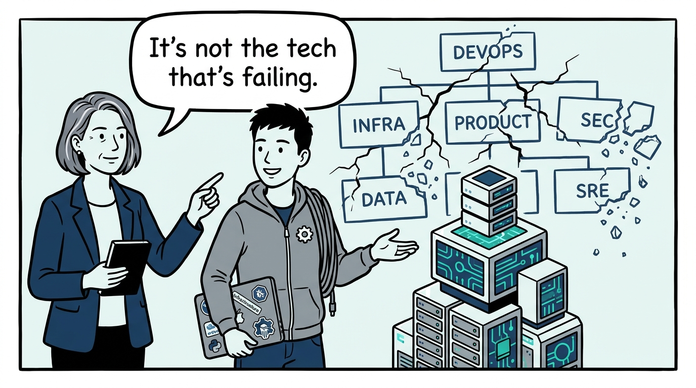
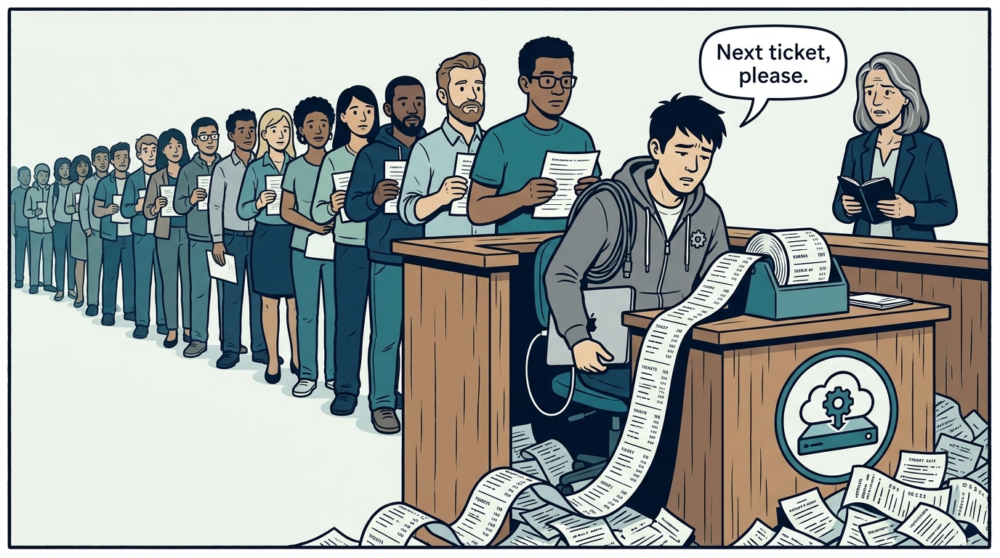
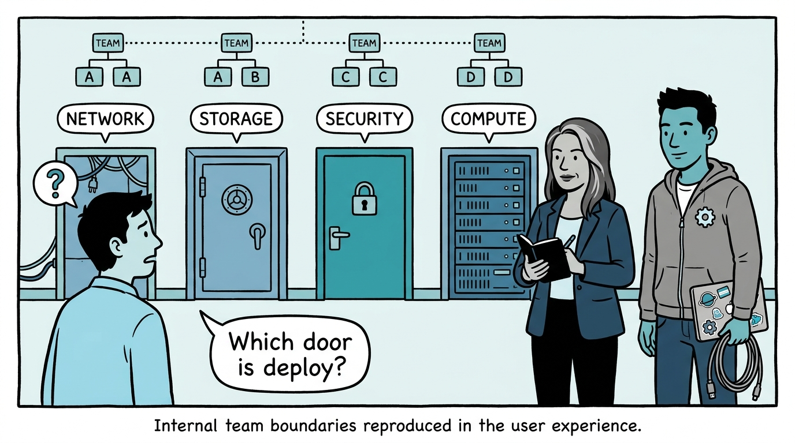
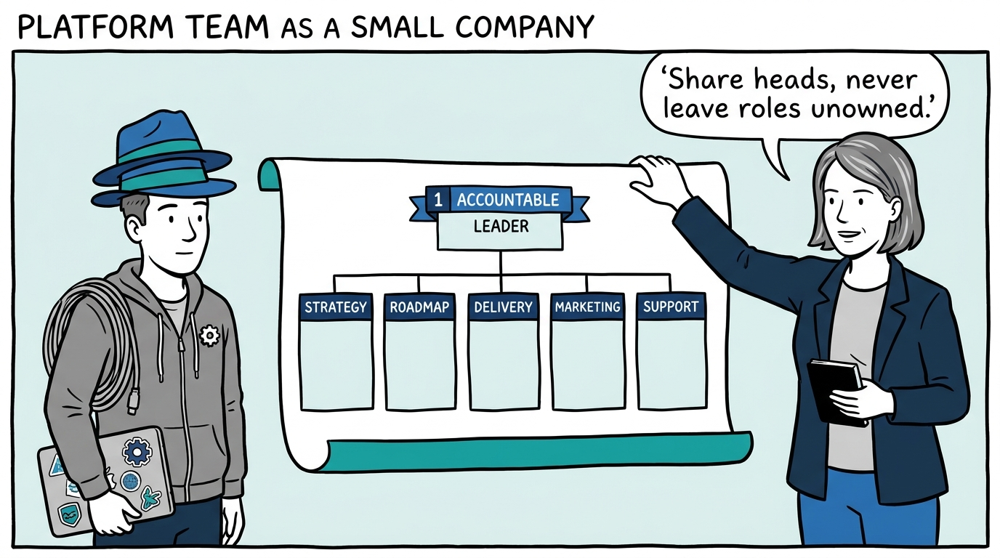
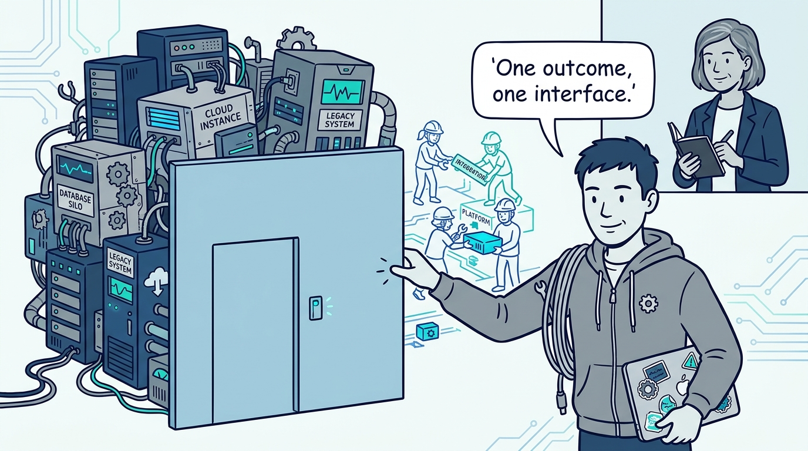
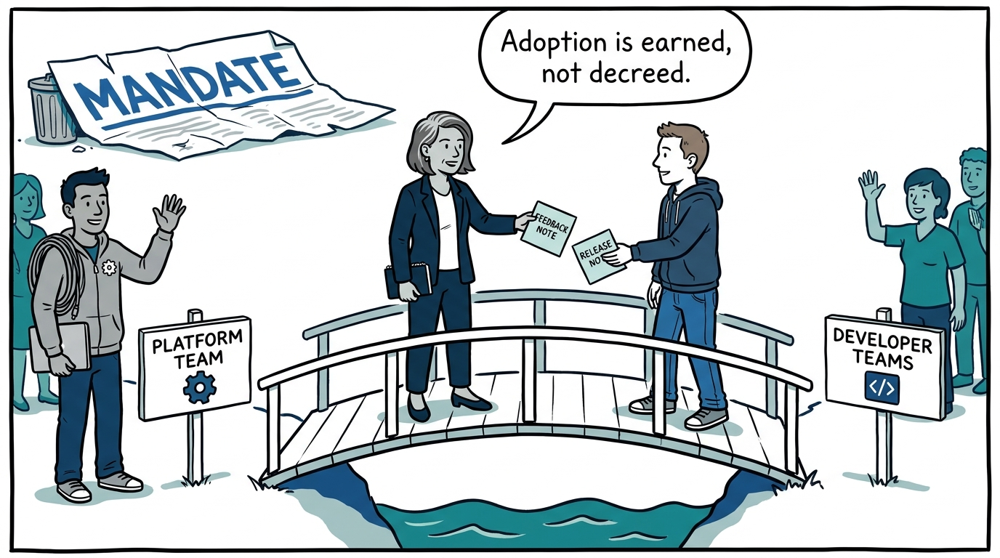
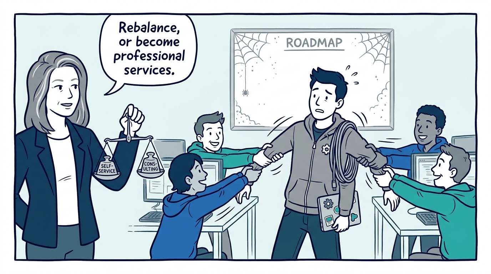
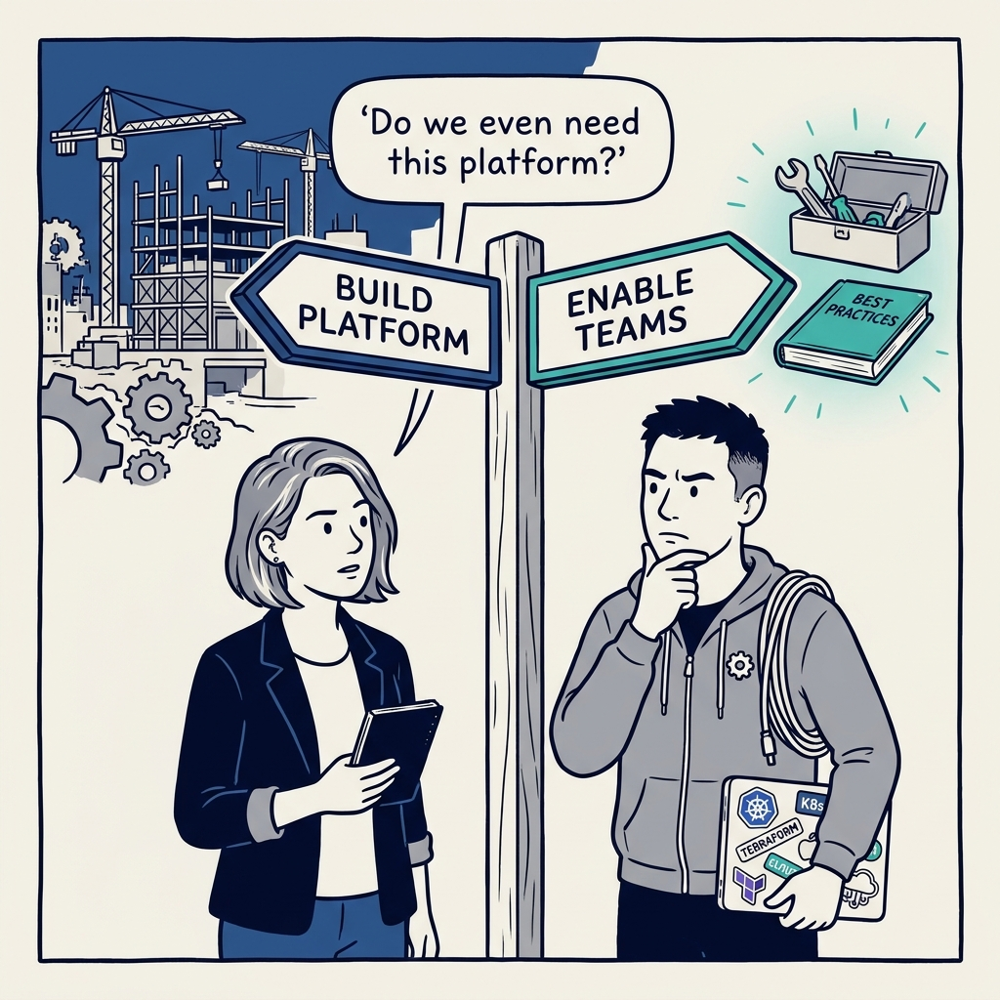

Why a platform team is a small product company, not a ticket queue — in eight panels.

<!-- comic-style
{
  "cast": "VERA: a calm, seasoned engineering executive, short gray-streaked hair, dark blazer over a plain t-shirt, carries a small black notebook. KAI: a hands-on platform engineering lead, short dark hair, gray zip-up hoodie with a small gear pin, laptop covered in infrastructure stickers under one arm, a coil of cable slung over the shoulder.",
  "style": "Clean two-tone explainer comic, thick ink outlines, flat colors with deep blue and teal accents on a light background, generous white space, hand-lettered speech bubbles with SHORT readable text, no photorealism."
}
-->

**Panel 1:** *The hook: platforms fail organizationally before they fail technically.*

**Panel 2:** *The problem: the gravitational pull is toward a ticket queue with a logo — doing work for teams instead of enabling them.*

**Panel 3:** *The wrong way: ship the org chart, and users navigate your internal seams instead of one platform.*

**Panel 4:** *The principle: run the platform team as a small product company — every role owned, even when one person wears several hats.*

**Panel 5:** *East–west: infrastructure functions align on common outcomes behind one interface — and the seams stay inside.*

**Panel 6:** *North–south: adoption is a relationship earned through value — mandates buy compliance, not commitment.*

**Panel 7:** *The cost: high-touch help eats the team — the engagement portfolio needs deliberate rebalancing, or consulting wins by default.*

**Panel 8:** *The closer: confirm the platform is needed at all — sometimes enablement and a thinner platform win.*
