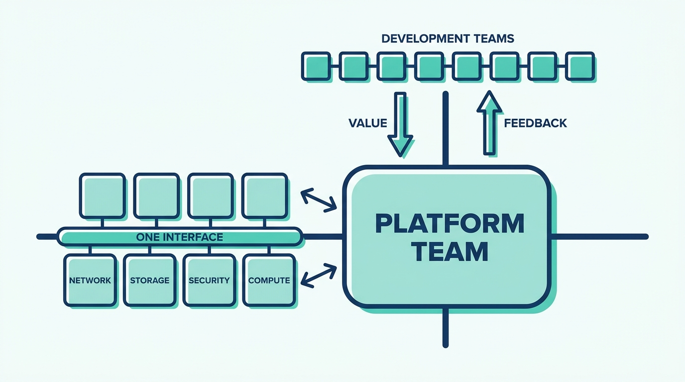
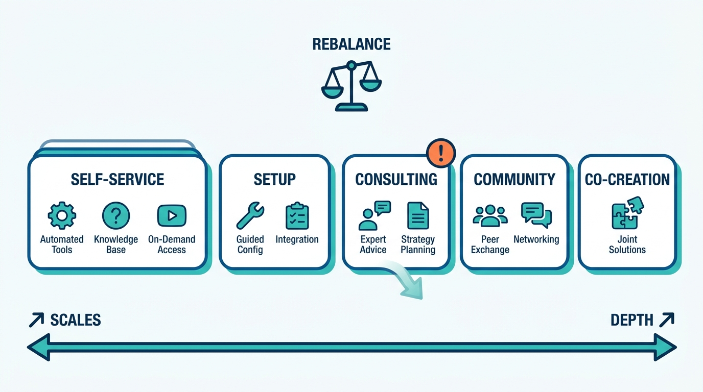
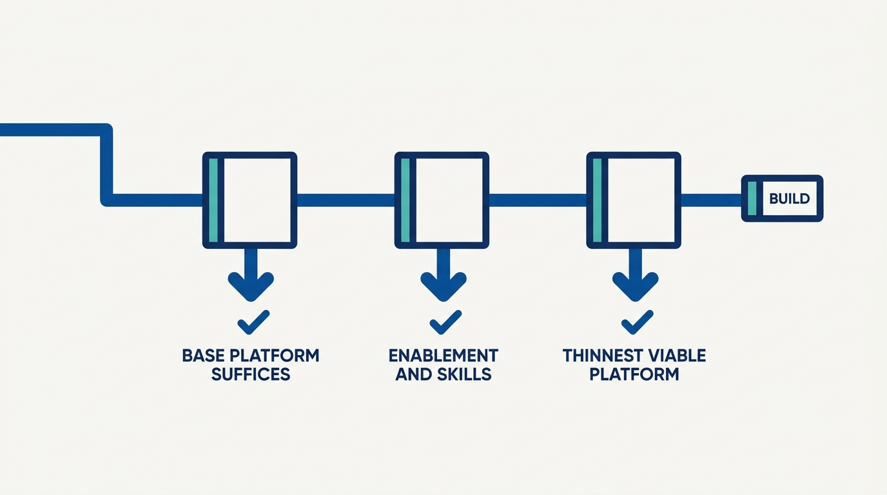

> **Status**: DRAFT
>
> **Principle**: I organize for platforms the way one runs a small product company inside the organization: a cross-functional team with an accountable leader and named ownership of technology strategy, product roadmap, engineering delivery, marketing and adoption, and support — roles that may share people but must never go unowned. The team aligns east–west across infrastructure silos so the org chart never ships in the platform experience, and north–south with its consumers so adoption is an ongoing relationship earned through value, not a mandate rolled out once. And the whole apparatus is subject to one standing question: do we actually need this platform — or would enablement, skills, and a thinner platform serve better? Platforms fail organizationally before they fail technically.

## Statement

My operating model for organizing around platforms has six commitments.

- **The platform is a product, and the team is a small product company.** A cross-functional platform team — not a technical silo, not a one-time project — owns the platform's vision, value proposition, and continuous evolution, and enables development teams rather than processing their tickets.
- **Every role is owned, even when heads are shared.** One accountable platform leader, plus named ownership of technology strategy, product roadmap, engineering delivery, marketing and adoption, and support. In a small team one person covers several roles; as the team grows, responsibilities get revisited and split. What is never acceptable is a role nobody holds.
- **Align east–west: no org chart in the platform.** Infrastructure, operations, networking, security, storage, and compute work toward common outcomes behind one cohesive interface. Discussions start from the outcome needed, not the implementation preferred — and where collaboration is impossible, we explicitly decide to fix, wrap, or work around the dependency.
- **Align north–south: adoption is a relationship.** Platform builders and platform consumers communicate transparently. We understand developers' need for speed and operations' need for stability, refuse us-versus-them framing, and treat adoption as ongoing — never a one-time rollout.
- **Know the customers; balance the engagement model.** Real customer needs come before solutions — observed workflows, investigated bottlenecks, distinct personas — developers, administrators, operators, and end users. Engagement is deliberately balanced across self-service, setup, consulting, community, and co-creation — and consulting never quietly turns the team into a professional-services shop.
- **Confirm the platform is needed at all.** Before building: does the base platform already suffice? Would enablement and skills development solve the problem? Would a Thinnest Viable Platform do? We build only what is genuinely unique or valuable to us — and we invest in skills and cognitive-load reduction either way.

**Figure 1:** *Two alignment axes: east–west joins infrastructure functions behind one interface; north–south keeps builders and consumers in a two-way relationship.*

## How to Read This

This journal is my platform operating model, one record per source checklist. This record is grounded in the "Platform Team Organization" chapter checklist of Gregor Hohpe's *Platform Strategy: Innovation Through Harmonization* (Leanpub, 2024) — the chapter on the people side of platforms: leadership roles, team alignment, customer engagement, and the discipline of asking whether a platform is warranted at all. The runnable version — the role assignments, both alignment axes, the engagement-model balance, and the final platform health check — lives in the **Checklist** tab of this post. The checklist also reproduces the chapter's recruiting-and-retention section; as an operating concern, hiring and growing platform engineers belongs to [[building-platform-teams]].

## Rationale

**The small-product-company metaphor is a staffing instruction, not a slogan.** Hohpe frames the platform team's responsibilities like the functions of a small company: someone accountable for value and direction (CEO-style), someone owning technology strategy (CTO-style), plus product, engineering, marketing, and support functions. The point is not to hire six executives for a five-person team — one person can cover several roles. The point is that **an unowned role does not disappear; it just fails silently**. Platforms without a marketing owner get no adoption; platforms without a support owner burn their engineers; platforms without a product owner become whatever the loudest customer demands.

**Ticket queues are how platform teams die.** The founding stance — platform as product, team as enabler — exists because the gravitational pull goes the other way: toward a ticket-processing function that does things *for* development teams instead of making them capable themselves. Every organizational choice in this record pushes against that pull: a roadmap built from vision plus customer input rather than accepted requests, self-service as the default engagement mode, enablement that increases team autonomy rather than permanent staff augmentation, and recurring support requests treated as product defects to automate away.

**East–west alignment decides what users experience.** A platform assembled from infrastructure, networking, security, and storage teams that never aligned will faithfully reproduce those boundaries: duplicate portals, inconsistent terminology, hand-offs mid-workflow. That is shipping the org chart. The fix is organizational before it is technical — common outcomes across the participating teams, outcome-first discussions, preserved autonomy where possible — and an honest escape hatch: where collaboration genuinely cannot be had, we consciously choose whether to fix, wrap, or work around the dependency rather than letting the seam show.

**North–south alignment is why mandates fail.** Developers want speed and flexibility; operations wants stability, security, and compliance. A platform team that picks one side inherits an us-versus-them relationship with the other, and a mandated platform gets malicious compliance at best. So I prefer earning voluntary adoption through value — a recognizable identity, a clear value proposition, regular updates, real feedback channels, internal events — while still protecting the product vision from being dictated by any single customer. Adoption is a two-way conversation that never ends, which is precisely why it needs owners.

**The engagement model is a portfolio that drifts if unmanaged.** Self-service scales best but cannot cover the unusual cases; consulting covers them but eats the team if unchecked; community scales support and surfaces design weaknesses through repeated questions; co-creation builds the best features and the deepest buy-in. The discipline is periodic rebalancing — deliberately deciding how much effort goes to self-service, setup, consulting, community, and co-creation — rather than discovering after a year that the platform team has become a professional-services organization with a roadmap it never touches.

**Figure 2:** *The engagement model is a portfolio: self-service scales, co-creation deepens — and consulting drifts into professional services unless deliberately rebalanced.*

**The strongest organizational move can be not building the platform.** The chapter's most countercultural checklist item sits near the end: confirm a platform is necessary before creating one. Sometimes the base platform already suffices; sometimes enablement and skills development reduce cognitive load better than another abstraction layer; sometimes a Thinnest Viable Platform beats the grand custom build. Observing development teams before committing, and keeping expert teams free enough to respond to paradigm shifts, protects me from the most expensive failure mode in this space: **a beautifully organized team building a platform nobody needed**.

**Figure 3:** *The gate before building: three cheaper answers get a chance first — and a full custom platform is the last resort, not the default.*

## What This Means in Practice

| What this record says | What it does **not** say |
| --- | --- |
| The platform team runs like a small product company with an accountable leader. | Every role needs a dedicated head — **roles can share people; they cannot go unowned**. |
| The team enables development teams toward autonomy. | The team does the work for them — that is a ticket queue with better branding. |
| Infrastructure functions align on common outcomes behind one interface. | Internal team boundaries may show through the platform — users never navigate our org chart. |
| Adoption is earned through value and treated as an ongoing relationship. | Adoption is mandated and rolled out once — mandates buy compliance, not commitment. |
| The roadmap blends customer input with the platform vision. | The loudest customer sets the direction — **listening is not obeying**. |
| Consulting, community, and co-creation complement self-service, in managed balance. | High-touch help scales — unmanaged consulting turns the team into professional services. |
| A platform is built only after confirming it is needed. | Every organization needs a custom platform — sometimes enablement or a thinner platform wins. |

Concretely: for every platform we run, I can name the accountable leader and the owner of each of the five functions — strategy, roadmap, delivery, marketing, support — even where two hats sit on one head. Platform users complete common tasks through self-service and cannot tell from the experience which internal team owns which layer. And once a year we re-ask the founding question — **is this platform still the simplest, most valuable solution to the problem?** — with retirement as an acceptable answer.

## Anti-Patterns

- **The ticket queue with a logo.** A "platform team" that processes requests for development teams instead of making them autonomous — measured by throughput, drowning in backlog, enabling nothing.
- **The unowned role.** No one owns marketing, so adoption never happens; no one owns support, so engineers burn out covering it invisibly; no one owns the roadmap, so the platform becomes a wish-list archive.
- **The shipped org chart.** Duplicate portals, one identity per subsystem, and terminology that changes at every internal team boundary — the organization's seams faithfully reproduced in the user experience.
- **The mandate rollout.** Adoption by decree, announced once, followed by malicious compliance, shadow tooling, and a platform team confused about why nobody loves them.
- **The professional-services drift.** Consulting engagements quietly consuming the team until there is no capacity left for the product — high-touch help everywhere, platform progress nowhere.
- **The copied platform.** Rebuilding another company's stack because it worked there, without observing our own teams' workflows or validating against our actual needs.
- **The platform nobody needed.** A well-staffed, well-organized team building an abstraction layer the base platform already provides — when enablement and skills would have solved the real problem.

## Related Records

- [[building-platform-teams]] — hiring and growing the platform engineers themselves; this record defines the team shape and role structure those people fill.
- [[platform-as-a-product]] — the full product-management discipline for platforms; this record installs the organizational stance that makes that discipline possible.
- [[managing-stakeholders]] — the platform leader's stakeholder tactics; the east–west and north–south axes here are the map those tactics navigate.
- [[understanding-platforms]] — what platforms are and the harmonization philosophy; this record is how I arrange people to deliver on it.
- [[getting-started]] — when and how to start platform engineering; the confirm-you-need-a-platform gate here is the question that record's timing decisions depend on.

## Scope and Revisiting

This record is `draft`. It governs how platform teams are structured, led, and connected to the rest of the organization wherever I am the accountable executive — from a five-person team wearing all the hats to a platform organization with dedicated functions. I revisit it if the platform team's support and consulting load crowds out product work for more than a quarter (the professional-services signal), if adoption stalls while the mandate pressure rises (the north–south signal), or if the annual health check cannot confirm the platform is still the simplest and most valuable solution to the problem.

## Authoritative References

- Gregor Hohpe, *Platform Strategy: Innovation Through Harmonization* (Leanpub, 2024) — the "Platform Team Organization" chapter, whose checklist this record distills.
