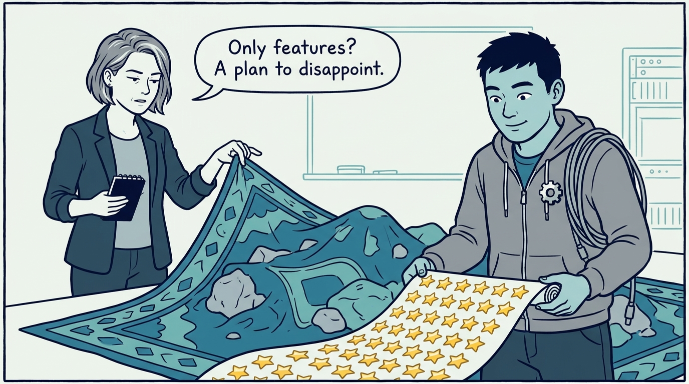
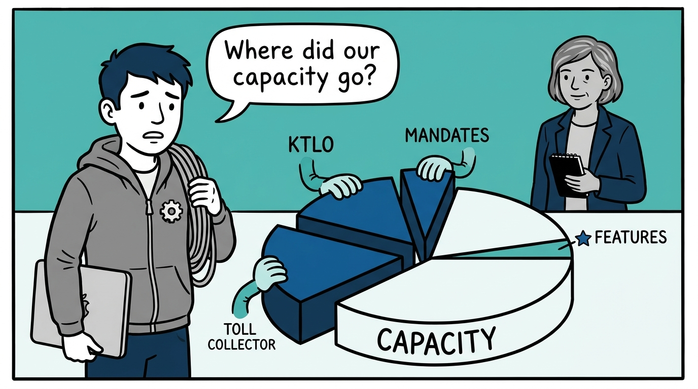
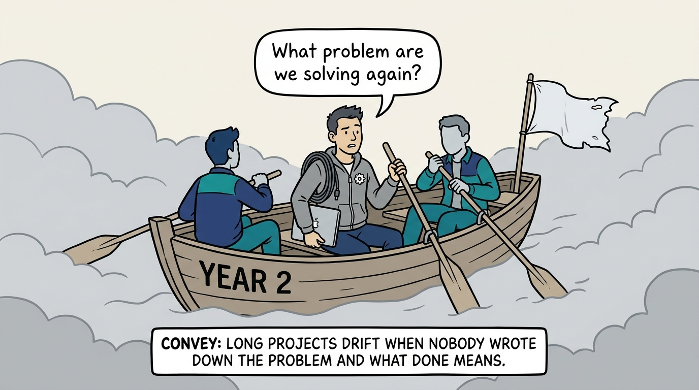
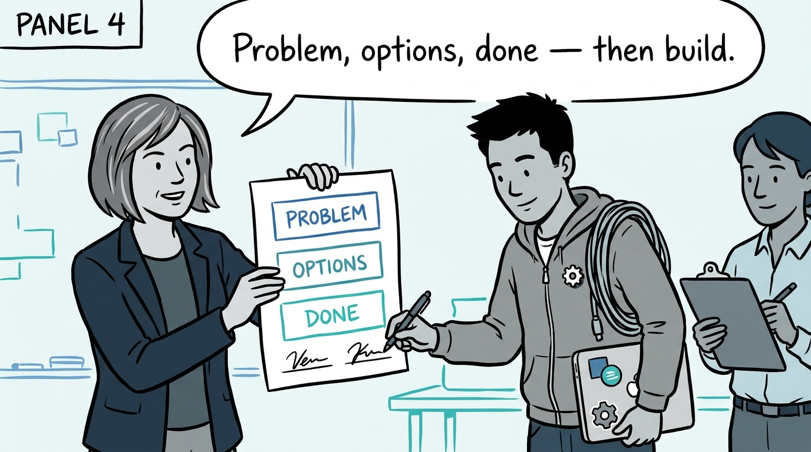
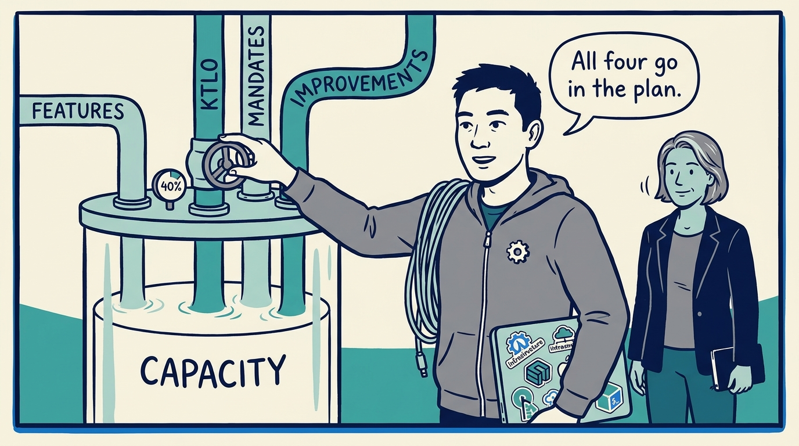
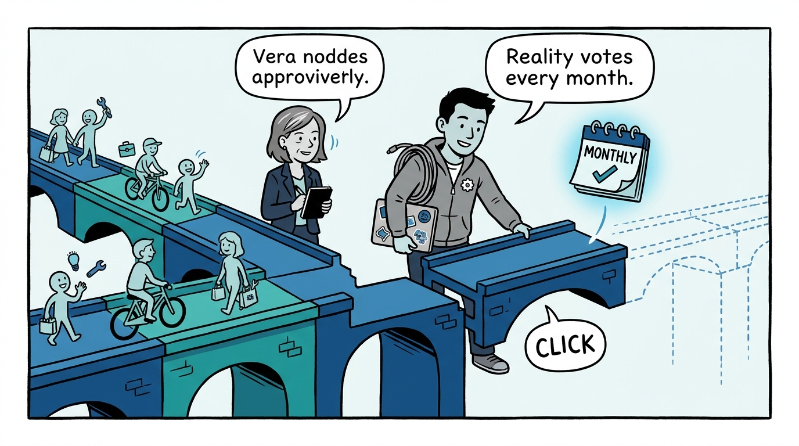
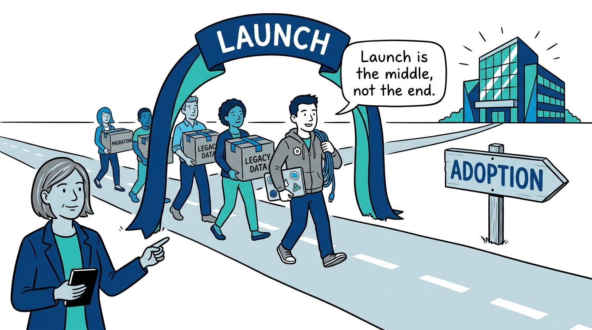
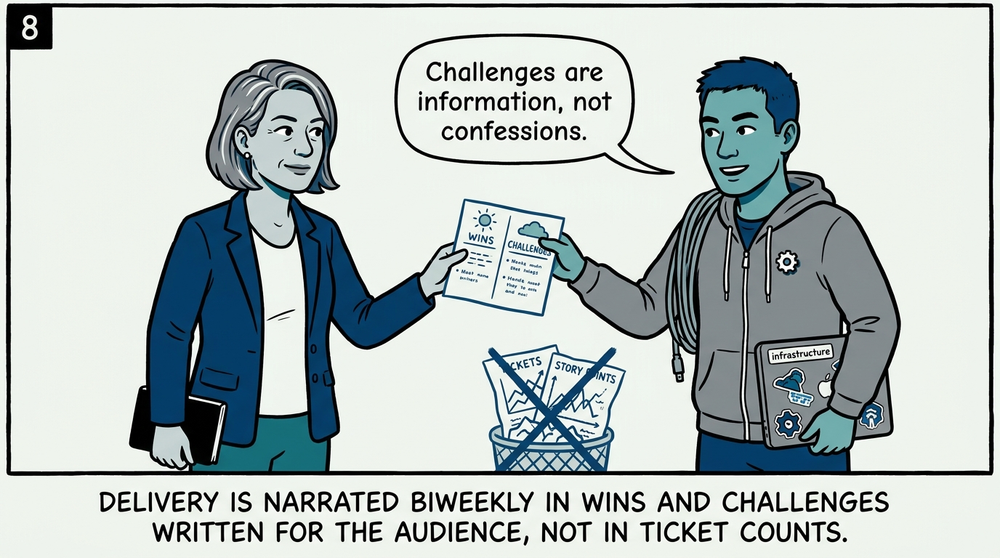
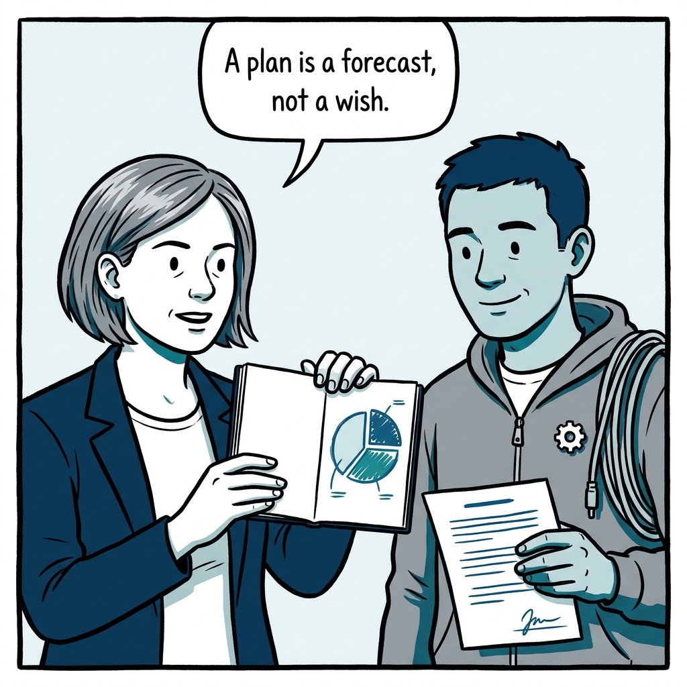

Why a plan that only lists features is a plan to disappoint — and why launch is not the finish line — in nine panels.

<!-- comic-style
{
  "cast": "VERA: a calm, seasoned engineering executive, short gray-streaked hair, dark blazer over a plain t-shirt, carries a small black notebook. KAI: a hands-on platform engineering lead, short dark hair, gray zip-up hoodie with a small gear pin, laptop covered in infrastructure stickers under one arm, a coil of cable slung over the shoulder.",
  "style": "Clean two-tone explainer comic, thick ink outlines, flat colors with deep blue and teal accents on a light background, generous white space, hand-lettered speech bubbles with SHORT readable text, no photorealism."
}
-->

**Panel 1:** *The hook: a plan that only lists features is a plan to disappoint — the other work exists whether the plan admits it or not.*

**Panel 2:** *The problem: KTLO, mandates, and system improvements are real all along — a feature-only budget just makes them invisible, unfunded, and late.*

**Panel 3:** *The wrong way: the multi-year project that was never quite about anything — no written problem, no definition of done, just drift.*

**Panel 4:** *The principle, part one: no long-running project starts without a written proposal — problem first, options with trade-offs, a measurable 'done', and buy-in before the first commit.*

**Panel 5:** *The principle, part two: the roadmap is built bottom-up from all four work categories — with KTLO measured from history and capped near 40%.*

**Panel 6:** *How it plays out: value-bearing milestones — monthly in year one — give reality a regular vote, so scope creep and dead ends surface early.*

**Panel 7:** *How it plays out: launch is a milestone, not the goal — migration and adoption are first-class, staffed project work.*

**Panel 8:** *The cost worth paying: narration is part of delivery — biweekly wins and challenges, situation–action–result, written for the people who read them.*

**Panel 9:** *The closer: honest capacity accounting turns the plan from a wish into a forecast — and honest narration proves what it produced.*
