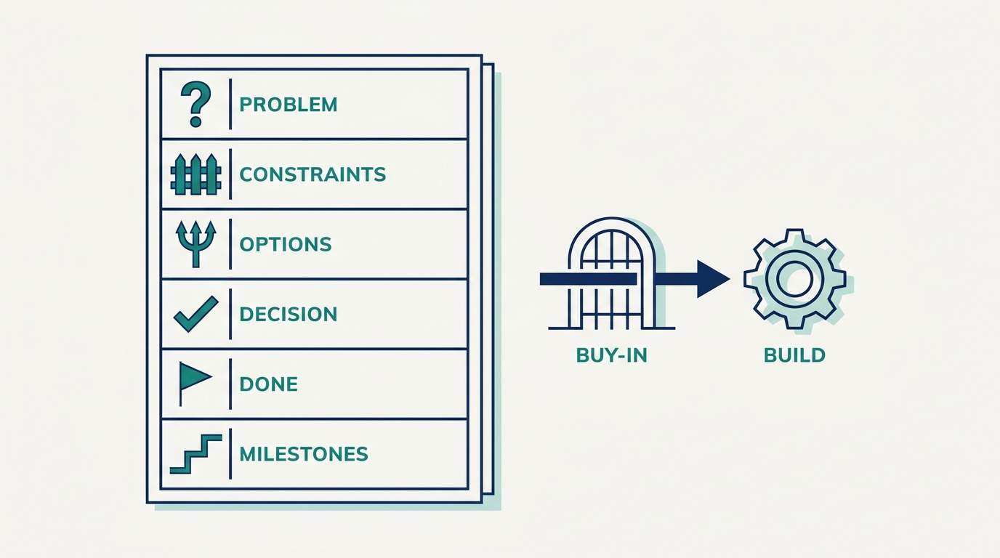
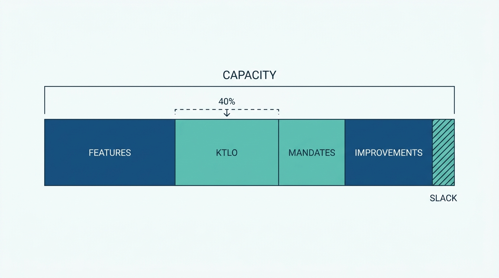
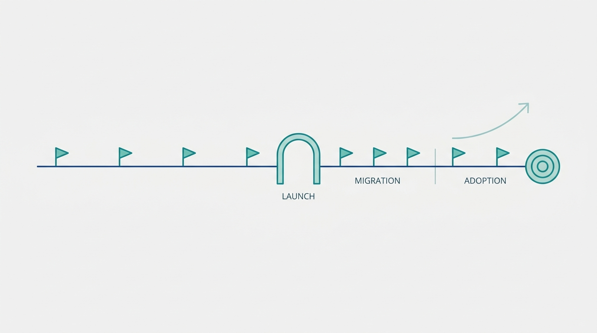

> **Status**: DRAFT
>
> **Principle**: Platform planning is honest capacity accounting, and platform delivery is honest communication about what that capacity produced. No long-running project starts here without a written proposal that defines the problem, the options considered, and what "done" looks like — with buy-in secured before implementation, not after. The roadmap is built bottom-up from all four real consumers of engineering capacity — features, keep-the-lights-on work, mandates, and system improvements — because a plan that only lists features is a plan to disappoint. Launch is not the finish line: migration and adoption are first-class project work. And progress is narrated every two weeks in wins and challenges written for the people who read them, not in ticket counts.

## Statement

My operating model for planning and delivering platform work makes three commitments: what happens before a long project starts, how the roadmap is built, and how delivery is run and narrated.

Before a long project starts:

- **A written proposal, problem first.** The current situation, constraints, the problem being solved, the realistic options with their trade-offs, the chosen solution and why — and a definition of "done" with measurable success criteria and early milestones.
- **Buy-in before implementation.** The proposal is reviewed with engineering leads, product management, and stakeholders; major disagreements are resolved before the first commit, not discovered at launch.
- **An action plan that counts everything.** Technical design, an owned testing strategy, acceptance criteria, dependencies confirmed with the teams behind them — and customer migration treated as a first-class project dependency, staffed like one. Project managers join when coordination risk becomes substantial, never to compensate for unclear technical planning.

How the roadmap is built:

- **Bottom-up, from four categories.** Features, KTLO (keep the lights on), mandates from leadership, and system improvements — all four are real consumers of capacity and all four appear in the plan.
- **KTLO capped near 40%.** Estimated from historical data with one-time events removed; when it exceeds that level, work that reduces operational burden jumps the queue.
- **Mandates listed and costed.** Migrations, compliance, expansion, integration work — each with its actual engineering cost, with trade-offs surfaced and early escalation when the mandate load exceeds realistic capacity.
- **Heuristics, not entitlements.** Roughly 70/20/10 across core work, adjacent innovation, and transformation — as a discussion tool; system-improvement projects kept to about three developer-months; slack left for the unplanned.

How delivery is run and narrated:

- **Milestones that deliver value.** Long projects are broken into increments that a customer or the business can see — monthly in the first year, quarterly later — with migration, testing, adoption, and operational readiness inside the milestone plan, not after it.
- **Adoption as project work.** Early adopters identified and actually talked to, documentation and enablement planned, adoption metrics defined — launch is a milestone, not the goal.
- **Biweekly wins and challenges.** Each one a short bold summary plus situation, action, result — rewritten so the intended audience understands it, focused on outcomes and impact, with challenges treated as useful information rather than confessions.

## How to Read This

This journal is my platform operating model, one record per source checklist. This record is grounded in the "Planning & Delivery" chapter of Camille Fournier and Ian Nowland's *Platform Engineering: A Guide for Technical, Product, and People Leaders* (O'Reilly, 2024) — the chapter on how platform teams plan a year of work and prove they delivered it, distilled here into **the planning contract I hold every platform team to**. The runnable version — proposal review, roadmap construction, KTLO estimation, and the wins-and-challenges process — lives in the **Checklist** tab of this post.

## Rationale

**Long platform projects die of unclear problems, not hard ones.** The expensive failures I have seen were not defeated by technical difficulty; they drifted because nobody could state crisply what problem was being solved and what "done" meant. Writing the proposal first — problem, options, trade-offs, success criteria — is cheap insurance against the most expensive failure mode there is: **a multi-year project that was never quite about anything**. If the problem is not clear enough to write a concrete proposal, it is not clear enough to staff.

**Figure 1:** *The proposal is cheap insurance: problem before solution, options with trade-offs, a measurable 'done' — and buy-in gates the build.*

**A plan that only lists features is fiction.** Platform teams carry four kinds of work whether the plan admits it or not: features, KTLO, mandates, and system improvements. A plan that budgets only for features does not make the other three disappear — it makes them **invisible, unfunded, and late**, and then makes the team look slow when reality collects its tax. Building the roadmap bottom-up from all four categories is what makes the plan a forecast instead of a wish.

**KTLO grows silently until it is measured.** On-call, support, and remediation expand to fill whatever space nobody is watching. Estimating KTLO from historical data — and holding it near 40% of capacity — turns a slow suffocation into a visible number with a rule attached: **when the number is breached, reducing operational burden becomes the roadmap**, not a lament in retrospectives.

**Figure 2:** *Honest capacity accounting: all four consumers of capacity appear in the plan, slack is real, and KTLO carries an explicit ceiling.*

**Launch is the middle of a platform project, not the end.** A platform nobody migrates to is a cost, not an asset. That is why adoption work — naming, early adopters, documentation, enablement, internal marketing, adoption metrics — belongs inside the project plan, and why customer migration is a first-class dependency rather than "the users' problem." The chapter's sharpest planning question is not "when do we ship?" but **"who moves, when, and who does the work of moving them?"**

**Figure 3:** *Launch is the middle of the project: value-bearing milestones run before it, and staffed migration and adoption run after it, ending at an adoption target.*

**Value-bearing milestones keep long projects honest.** A multi-year effort measured only by technical completion can be "on track" for two years and still deliver nothing. Milestones that put something in a customer's hands — monthly in the first year, while trust is still being earned — create regular moments where **reality gets a vote**: scope creep becomes visible, dead ends surface early, and projects that have become open-ended slogs can be stopped or reshaped instead of quietly renewed.

**Platform work is invisible when it works, so narration is part of delivery.** Nobody notices the infrastructure that did not fail. The biweekly wins-and-challenges rhythm — short, situation–action–result, rewritten for the audience — is how platform work stays legible to the people who fund it. And challenges are half of the value: **surfacing a blocking dependency early is delivery work**, provided the partner team hears it from us before they read it in a report.

## What This Means in Practice

| What this record says | What it does **not** say |
| --- | --- |
| Long-running projects start with a written proposal and secured buy-in. | Every task needs a document — this is for long-running commitments, not bug fixes. |
| The roadmap includes features, KTLO, mandates, and system improvements. | All four get equal share — they get **honest** share, measured and traded off explicitly. |
| KTLO stays near or under 40% of capacity, measured from history. | 40% is an entitlement — it is a ceiling that triggers burden-reduction work when breached. |
| Migration and adoption are planned, staffed project work. | Adoption can be mandated — people are talked to before we assume they will come. |
| Milestones deliver customer or business value on a regular cadence. | Every milestone ships a feature — a completed migration or retired system is value too. |
| Delivery is narrated biweekly in wins and challenges, situation–action–result. | Reporting is theater — when the process stops producing useful information, the format changes. |
| Project managers join when coordination risk is substantial. | A PM can compensate for unclear technical planning — nobody can. |

Concretely: every long-running platform project here can show its proposal and who signed off; every team's plan shows all four work categories with KTLO as a number, not a feeling; every active project can name its next value-bearing milestone and its adoption metric; and every stakeholder gets a biweekly update they can actually understand — **"I did not know that was happening" is a planning failure**, and I treat it as one.

## Anti-Patterns

- **Launch as the finish line.** Declaring victory when the platform ships, then watching adoption flatline because migration was "the customers' problem" and nobody was staffed to help them move.
- **The feature-only plan.** A roadmap that budgets 100% of capacity for features, then delivers 60% of it — because KTLO, mandates, and improvements were real all along.
- **The silent mandate tax.** Absorbing compliance work, migrations, and executive initiatives without costing them or surfacing the trade-off, then being held to the original roadmap anyway.
- **The two-year dark period.** A rearchitecture with no value-bearing milestone in sight — "on track" by its own reckoning, invisible by everyone else's, and unprotectable when budgets tighten.
- **Scope creep by accretion.** Nice-to-have goals and every-customer generality bolted onto a project until the original problem is a minority of the work.
- **Innersourcing as an escape hatch.** Assuming consumer teams will build the features we deprioritized — forgetting the platform team still owns every contributed line, and that contributions are not a substitute for prioritization conversations.
- **Story-point status.** Updates that report ticket counts and velocity to executives who needed to hear what changed for customers and why it matters.
- **Planning as headcount competition.** Teams inflating estimates and hoarding requests because the planning process rewards the biggest ask instead of the most honest one.

## Related Records

- [[platform-as-a-product]] — how the platform decides what to build; this record governs how that direction becomes a plan that survives contact with capacity.
- [[operating-platforms]] — the operating model behind the KTLO line: on-call, support, and incident response that this record only budgets for.
- [[rearchitecting-platforms]] — the special case of a long project that rebuilds the foundations; it inherits this record's milestone and migration discipline and adds its own guardrails.
- [[managing-stakeholders]] — the relationship work that the wins-and-challenges rhythm feeds; updates are an input to stakeholder trust, not a substitute for it.
- [[platform-success]] — what the adoption metrics and milestone outcomes in this record ultimately add up to.

## Scope and Revisiting

This record is `draft`. It governs planning and delivery for every platform team where I am the accountable executive: annual deep planning, quarterly refreshes, long-project proposals, and the delivery-communication rhythm. I revisit it if plans keep missing because KTLO or mandates were underestimated (the signal that the capacity accounting has gone soft), if a launched platform shows flat adoption two quarters running, or if the wins-and-challenges process degrades into low-value bureaucracy that nobody reads.

## Authoritative References

- Camille Fournier and Ian Nowland, *Platform Engineering: A Guide for Technical, Product, and People Leaders* (O'Reilly, 2024) — the "Planning & Delivery" chapter, whose checklist this record distills.
