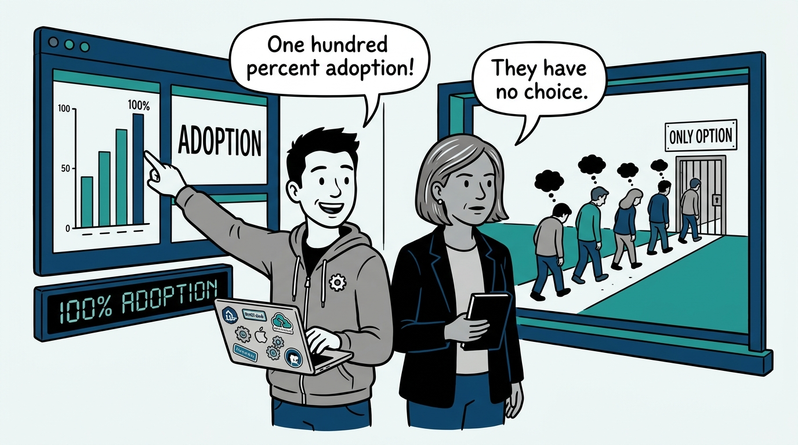
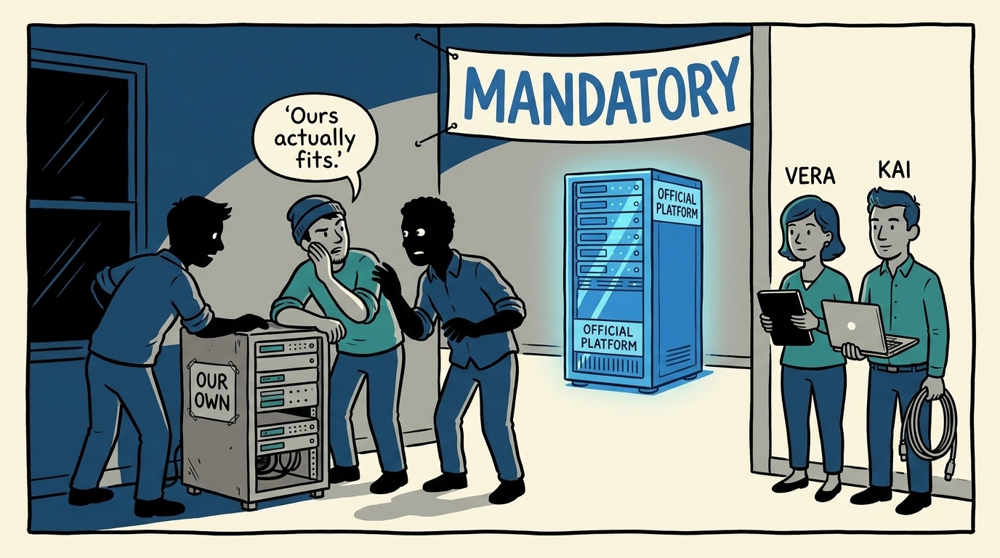
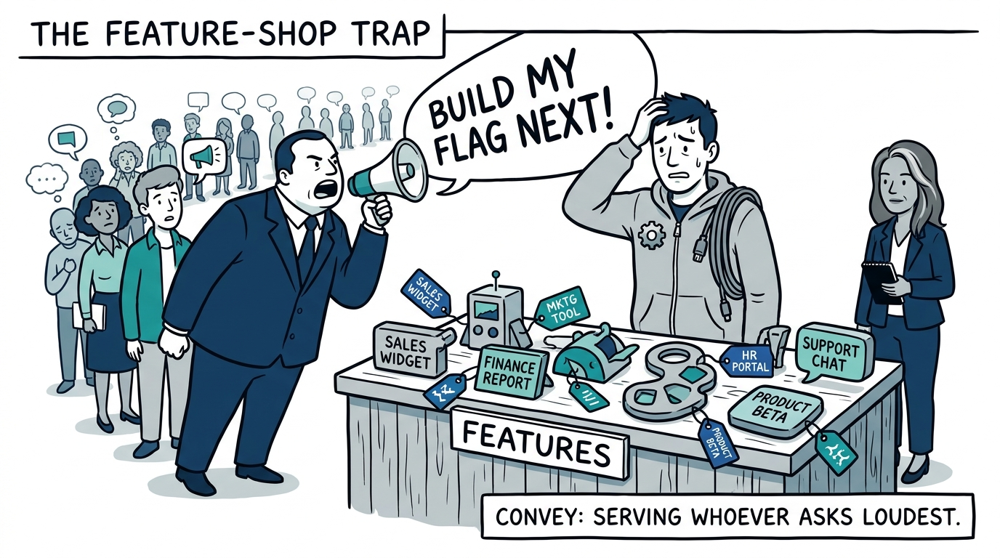
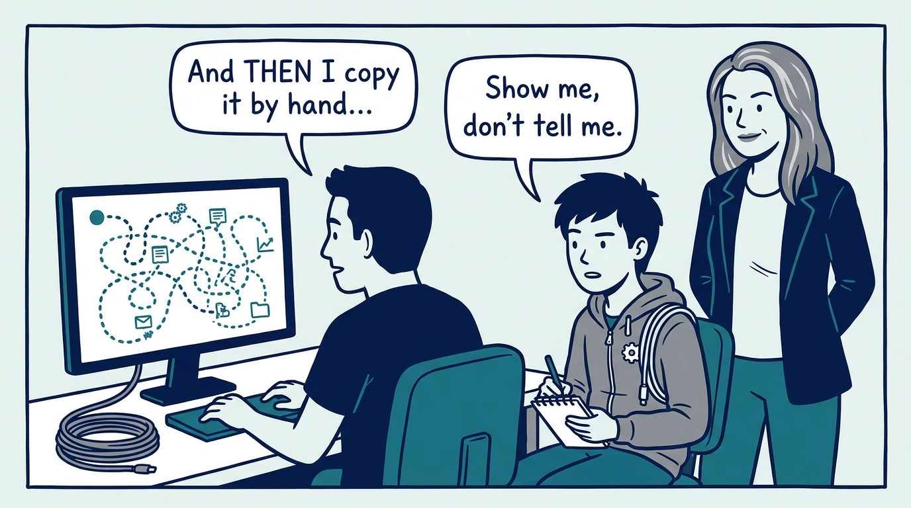
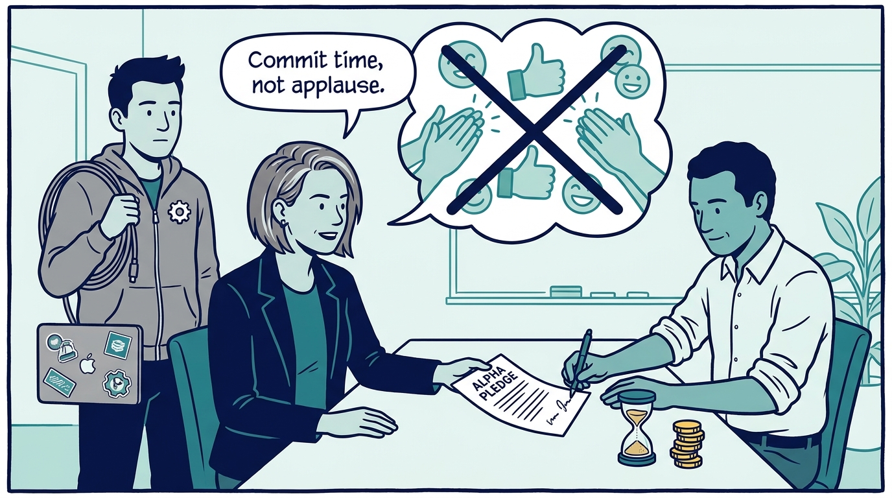
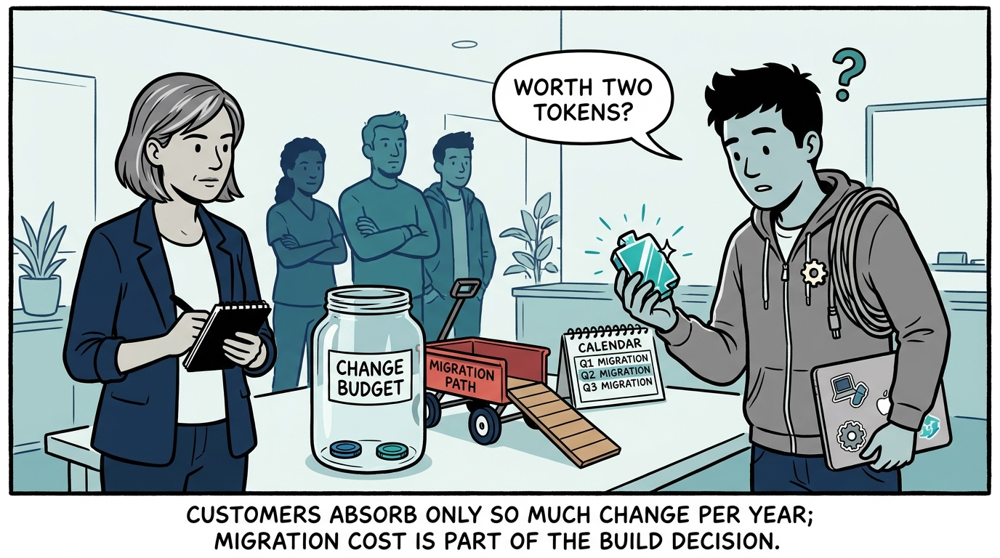
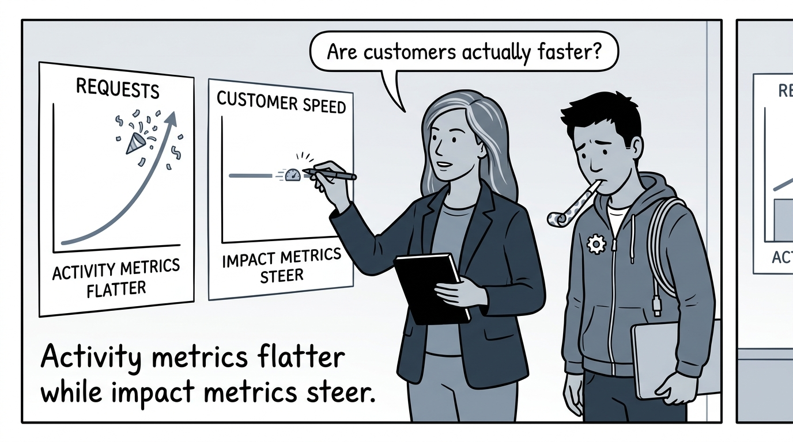
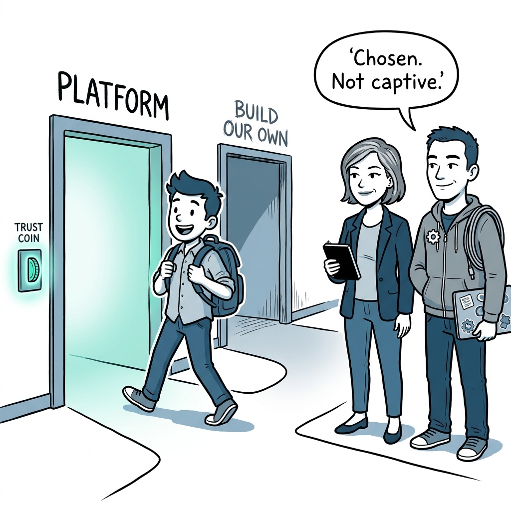

Why mandatory usage is not product success — in eight panels.

<!-- comic-style
{
  "cast": "VERA: a calm, seasoned engineering executive, short gray-streaked hair, dark blazer over a plain t-shirt, carries a small black notebook. KAI: a hands-on platform engineering lead, short dark hair, gray zip-up hoodie with a small gear pin, laptop covered in infrastructure stickers under one arm, a coil of cable slung over the shoulder.",
  "style": "Clean two-tone explainer comic, thick ink outlines, flat colors with deep blue and teal accents on a light background, generous white space, hand-lettered speech bubbles with SHORT readable text, no photorealism."
}
-->

**Panel 1:** *The hook: the dashboard says 100% adoption — but mandatory usage proves nothing about the product.*

**Panel 2:** *The problem: captivity hides dissatisfaction until a customer team builds a competing solution in anger.*

**Panel 3:** *The wrong way: the feature shop — building every request as specified, for whoever asks loudest, until no common capability ever emerges.*

**Panel 4:** *The principle: internal engineers are customers — observe how they actually work, not what they say they want.*

**Panel 5:** *How it plays out: product-market fit is validated with real commitments of time, effort, or budget — enthusiasm in a meeting is not validation.*

**Panel 6:** *The constraint: every migration spends the customer's finite change budget — plan adoption, coordinate launches, and never assume the technically better thing wins.*

**Panel 7:** *The measure: request counts can rise while customers get no faster — write the impact hypothesis down and let evidence steer the strategy.*

**Panel 8:** *The closer: the bar is a platform customers would choose if they had a choice — anything less is failing slowly.*
