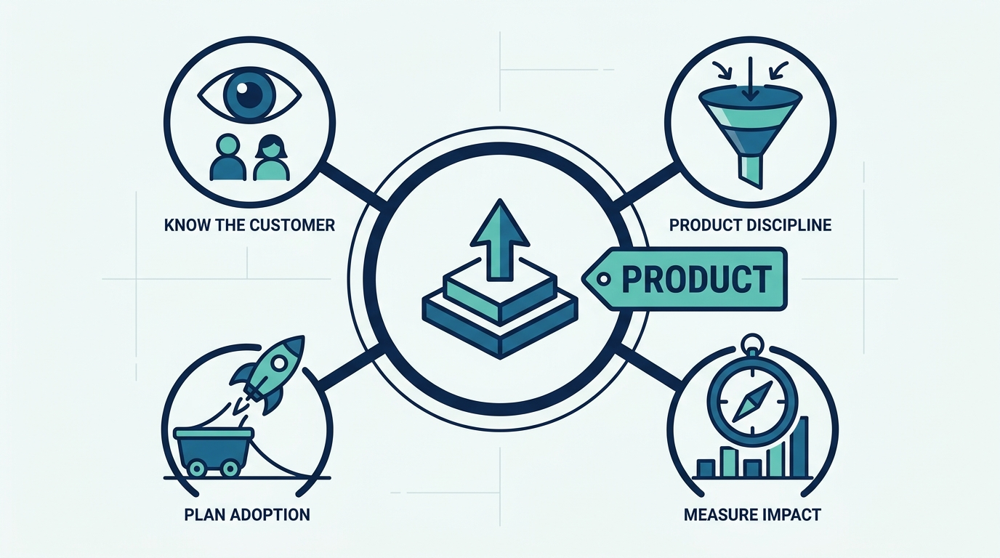
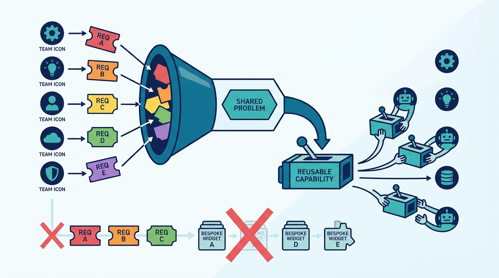
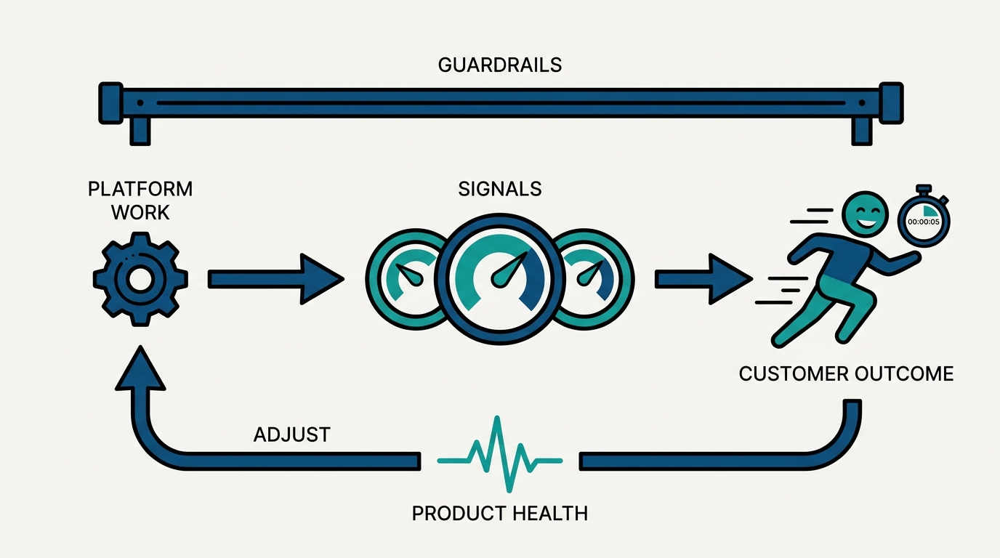

> **Status**: DRAFT
>
> **Principle**: An internal platform is a product with customers, and I hold platform teams to a product bar, not an infrastructure bar. Mandatory usage is not success; a captive audience is a risk, not a moat. Platform teams learn how their customers actually work rather than what they say they want, refuse to become a feature shop for the loudest team, and validate product–market fit internally — real commitments, not hypothetical enthusiasm — before committing serious investment. Adoption and migration are part of the product strategy from the beginning, impact metrics rather than activity metrics guide that strategy, and reliability is part of the product experience. A platform that customers would not choose if they had a choice is not done; it is failing slowly.

## Statement

My operating model for running platforms as products has four commitments.

**Know the customer as a customer:**

- **Internal engineers are customers, not stakeholders.** Platform teams identify who their customers are, observe their real workflows, pain points, and workarounds, and interview them regularly — instead of relying on what customers say they want.
- **Customer empathy is everyone's job.** Engineers participate in customer support and hear customer research; customer engagement is shared between product managers and engineers, and goals include adoption, satisfaction, and productivity.
- **The captive audience is a trap.** Mandatory usage proves nothing; internal customers may have no realistic alternative, and dissatisfied teams will eventually build competing solutions. I read metrics with that in mind and design beyond the loudest, largest team.

**Practice product discipline:**

- **No feature shop.** We separate the customer's underlying problem from their proposed solution, look for common needs across teams, and prefer reusable, self-service capabilities over a growing backlog of bespoke requests only the platform team can implement.
- **Discover, then validate.** Promising platform products often start as tools internal teams already built and love; we generalize from proof, prototype with a partner team, consider buying instead of building, and validate internal product–market fit with real commitments of time, effort, or budget.
- **Rethink the problem, not just the interface.** The best platform work eliminates a task or operates it centrally rather than making everyone's copy of it slightly easier.

**Plan adoption like a product launch:**

- **Migration cost is part of the build decision.** Onboarding effort, compatibility problems, hidden dependencies, and a clear path off the old product are estimated up front — and no new generation launches without a retirement plan for the old one.
- **Respect the customer's change budget.** Teams can absorb only so much change per year; we coordinate migrations, prioritize offerings with enough immediate benefit to justify the effort, and never assume adoption just because something is technically better — and the platform is marketed internally, so customers know an offering exists before they build their own.

**Measure and staff it honestly:**

- **Impact metrics guide strategy.** We separate impact, guardrail, and product-health metrics, write down the hypothesis linking platform work to customer outcomes, and adjust when evidence contradicts the theory.
- **Reliability is product experience.** Instability burns the trust every future launch depends on; no new features on an unreliable foundation.
- **Product and engineering stay distinct and healthy.** Product managers own customer problems, outcomes, and strategy; engineering managers own execution; engineers keep shaping solutions rather than implementing specifications — features are defined by the customer outcomes they should create, not by prescriptive specs.

**Figure 1:** *The operating model in one view: a platform run as a product stands on four commitments — customer knowledge, product discipline, adoption planning, and honest measurement.*

## How to Read This

This journal is my platform operating model, one record per source checklist. This record is grounded in the "Platform as a Product" chapter of Camille Fournier and Ian Nowland's *Platform Engineering* (O'Reilly, 2024) — the chapter on what it actually takes to run an internal platform with product discipline, distilled here into **the product bar I hold every platform team to**. The runnable version — the culture practices, the validation gates, the metrics discipline, and the final pre-investment review — lives in the **Checklist** tab of this post.

## Rationale

**Captive customers make product discipline harder, not optional.** An external product that stops serving its customers loses them and knows it immediately. An internal platform with mandated usage can fail for years while its dashboards look fine — usage stays high because there is no alternative, until suddenly there is one, built in anger by a customer team. Fournier and Nowland's sharpest warning is exactly this: **do not interpret mandatory usage as proof of success**. The discipline of treating internal engineers as customers exists to surface the dissatisfaction that captivity hides.

**What customers say they want and what they need are different products.** Internal customers arrive with proposed solutions — "add this flag", "support this framework" — and a platform team that builds each one becomes a feature shop: a growing backlog of bespoke work only it can implement, serving whoever asks loudest. The product move is to **separate the problem from the proposed solution**, find the need shared across teams, and build the reusable, self-service capability. Feature requests are signals for product opportunities, not a work queue.

**Figure 2:** *Product discipline as a funnel: separate the problem from the proposed solution, find the need shared across teams, and ship the reusable self-service capability — not five bespoke widgets.*

**Validation before investment is cheaper than migration after failure.** Internal platforms fail most expensively at adoption: the product works, and nobody moves. So I require product–market fit to be validated internally the way a startup would — named customer segments, alpha customers willing to commit **real time, effort, or budget rather than hypothetical enthusiasm**, and honest estimates of onboarding and migration cost — before serious investment. The chapter's most underrated instruction is to include migration cost in the decision of whether a product is worth building at all.

**The customer's change budget is a real budget.** Every migration a platform team ships spends its customers' capacity to absorb change, and that capacity is finite and shared with everything else the organization is doing. A technically better product that lands in a year already full of migrations will be rationally ignored. Coordinating launches, prioritizing offerings with immediate benefit, and making new things easy to learn is not marketing polish — it is **how a platform stays welcome**.

**Activity metrics flatter; impact metrics steer.** Request counts and adoption curves can all rise while customers get no faster. I expect platform teams to write down the hypothesis — this improvement causes that customer outcome — identify intermediate signals, and check whether reality agrees; when it does not, the strategy changes, not the metric. Guardrails stop one metric being improved at another's expense, and surveys confirm the numbers still mean what we think they mean.

**Figure 3:** *Impact metrics steer: write down the hypothesis linking work to customer outcomes, watch guardrails and product health alongside it, and change the strategy — not the metric — when evidence disagrees.*

**Trust is the platform's real currency, and reliability is how it is earned.** Customers who were burned by an unstable offering will reject the next valuable one; every launch is priced in the trust earned or lost by the last. That is why reliability work outranks new features on an unreliable foundation, and why the product/engineering split matters: product managers reduced to backlog grooming, or engineers reduced to implementation contractors, both produce platforms nobody would choose.

## What This Means in Practice

| What this record says | What it does **not** say |
| --- | --- |
| Internal engineers are customers whose workflows we observe and interview. | Customers spec the product — we solve the underlying problem, not the proposed solution. |
| Mandatory usage proves nothing; measure voluntary adoption and satisfaction where possible. | Mandates are never legitimate — sometimes they are, but they are not evidence of product success. |
| Build reusable, self-service capabilities for common needs. | Build every feature requested — a feature shop is a failure mode, not responsiveness. |
| Validate product–market fit with real commitments before serious investment. | Enthusiasm in a meeting counts as validation — only committed time, effort, or budget does. |
| Migration cost and a retirement plan are part of the decision to build. | Shipping the new thing is the finish line — multiple live generations without a retirement plan is a debt. |
| Impact metrics, with guardrails, guide the roadmap. | Activity metrics are impact — request counts rising is not customers succeeding. |
| Reliability is part of the product experience and outranks new features on a shaky foundation. | Reliability is an ops concern separate from product — instability is a product defect. |

Concretely: every platform team here can name its customer segments, has observed real customer workflows within recent memory, and **can state the impact hypothesis behind its current roadmap**. Before significant new platform investment, the final pre-investment review in the Checklist tab gets answered honestly — and "we have a captive audience" is **never accepted as an adoption strategy**.

## Anti-Patterns

- **The captive-audience fallacy.** Reading mandated usage as product success while dissatisfaction accumulates invisibly — until a customer team ships a competing solution.
- **The feature shop.** Building every request as specified, for whoever asks loudest, until the backlog is bespoke work only the platform team can do and no common capability ever emerges.
- **Loudest-team design.** Shaping the platform around the largest or most influential customer while everyone else's workflows go unobserved.
- **Hypothetical validation.** Counting enthusiastic meetings as demand; real validation is customers committing time, effort, or budget.
- **Big-tech cargo culting.** Copying a large company's internal product without checking whether its assumptions — scale, staffing, culture — fit this organization.
- **Migration as an afterthought.** Deciding to build on engineering cost alone, then discovering the customer-side migration is more expensive than the product — or never retiring the old generation at all.
- **Change-budget blindness.** Launching every improvement the moment it is ready, into teams already saturated with migrations, then blaming customers for slow adoption.
- **PM as backlog admin.** Letting product ownership collapse into grooming and project administration while engineers become implementation contractors — the org chart says product, the behavior says feature shop.

## Related Records

- [[four-pillars]] — the pillar model where "taking a curated product approach" sits; this record is that pillar unpacked into a full operating discipline.
- [[operating-platforms]] — reliability appears here as part of the product experience; that record carries the operational machinery — on-call, support, and operational feedback — behind it.
- [[platform-success]] — what platform success looks like overall; the impact-metric discipline in this record is the product-side instrument for it.
- [[managing-stakeholders]] — the stakeholder side of the same relationships; this record covers customers, that one covers the leaders and partners around the platform.
- [[growing-platforms]] — Hohpe's view on growing adoption; complementary to this record's adoption-and-migration planning.

## Scope and Revisiting

This record is `draft`. It applies to every internal platform team in my organization that ships capabilities to other engineering teams — infrastructure, developer tooling, data, and shared services alike. I revisit it if a customer team builds a competing solution to a mandated platform (the captive-audience alarm), if **platform backlogs fill with bespoke single-team requests**, or if a significant platform investment reaches build without surviving the final pre-investment review in the Checklist tab.

## Authoritative References

- Camille Fournier and Ian Nowland, *Platform Engineering: A Guide for Technical, Product, and People Leaders* (O'Reilly, 2024) — the "Platform as a Product" chapter, whose checklist this record distills.
