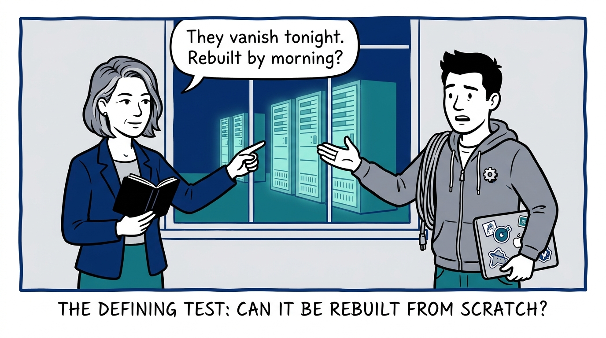
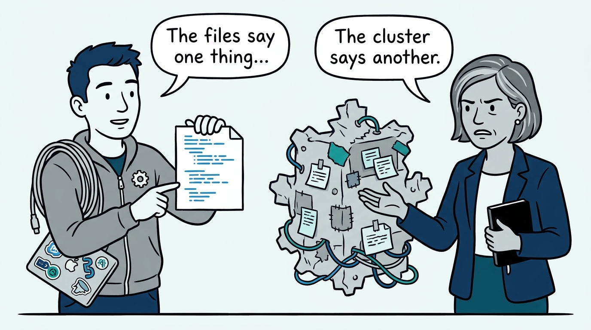
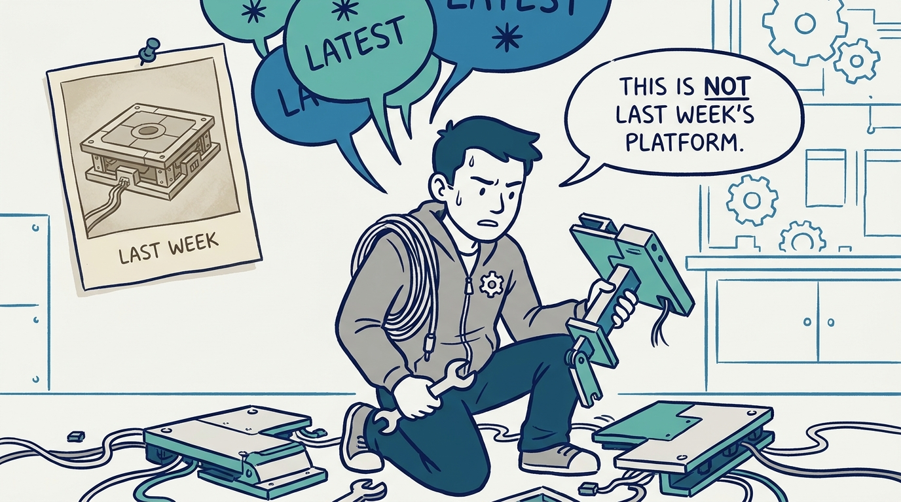
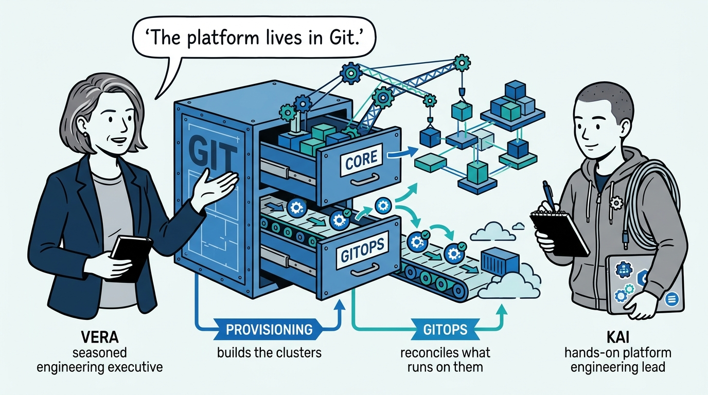
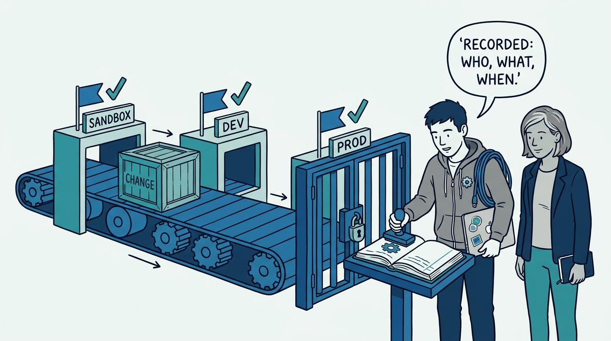
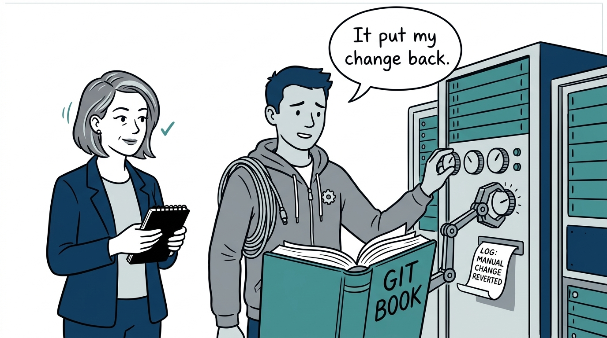
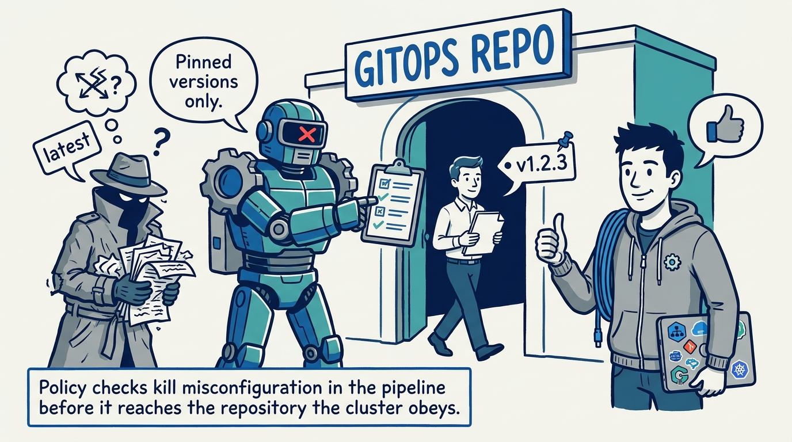
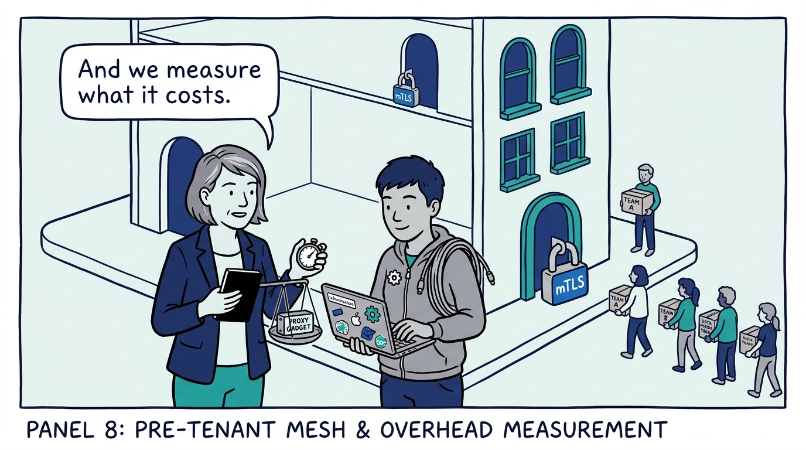
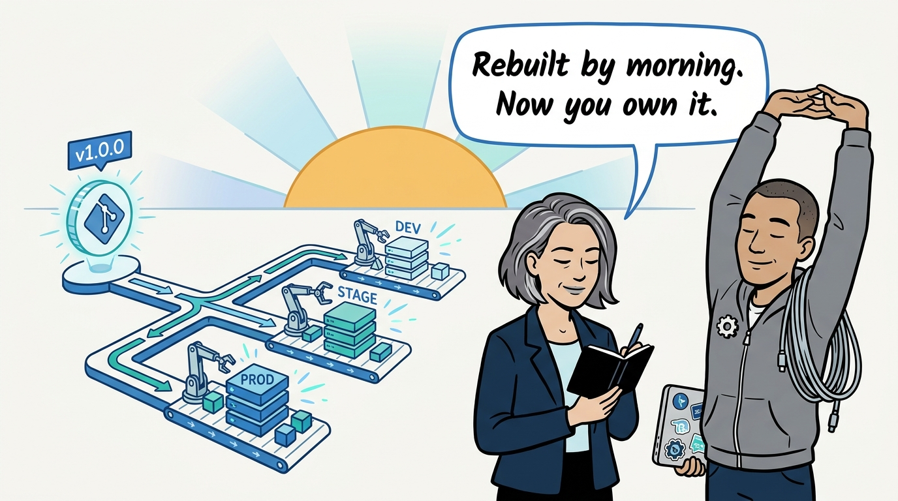

Why the platform must exist in Git, not in the clusters — in nine panels.

<!-- comic-style
{
  "cast": "VERA: a calm, seasoned engineering executive, short gray-streaked hair, dark blazer over a plain t-shirt, carries a small black notebook. KAI: a hands-on platform engineering lead, short dark hair, gray zip-up hoodie with a small gear pin, laptop covered in infrastructure stickers under one arm, a coil of cable slung over the shoulder.",
  "style": "Clean two-tone explainer comic, thick ink outlines, flat colors with deep blue and teal accents on a light background, generous white space, hand-lettered speech bubbles with SHORT readable text, no photorealism."
}
-->

**Panel 1:** *The hook: the only test that matters — if the clusters vanished tonight, could the pipeline rebuild every environment by morning?*

**Panel 2:** *The problem: the snowflake environment — patched by hand until production no longer resembles what was tested, and Git history is fiction.*

**Panel 3:** *The wrong way: floating latest tags and wildcard versions — a platform that cannot be rebuilt, only re-discovered, one incident at a time.*

**Panel 4:** *The principle: the platform exists in Git, not in the clusters — provisioning in one repository, runtime configuration in another.*

**Panel 5:** *How it plays out: one pipeline promotes every change — sandbox first, then dev, then a recorded approval before production.*

**Panel 6:** *How it plays out: drift is corrected, visibly — a Git commit is what changes the cluster, and break-glass fixes are reversed and logged.*

**Panel 7:** *How it plays out: misconfiguration dies in the pipeline — policy-as-code rejects floating tags before they ever reach the GitOps repository.*

**Panel 8:** *What it costs: the mesh goes in before the tenants — mTLS is configuration on an empty platform, a migration on a full one — and its overhead is measured from day one.*

**Panel 9:** *The closer: a semantic version tag rebuilds every environment by morning — a platform you cannot rebuild is a platform you do not own.*
