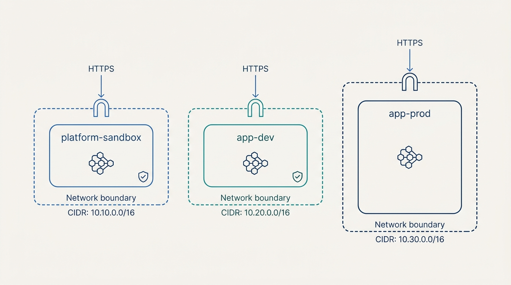
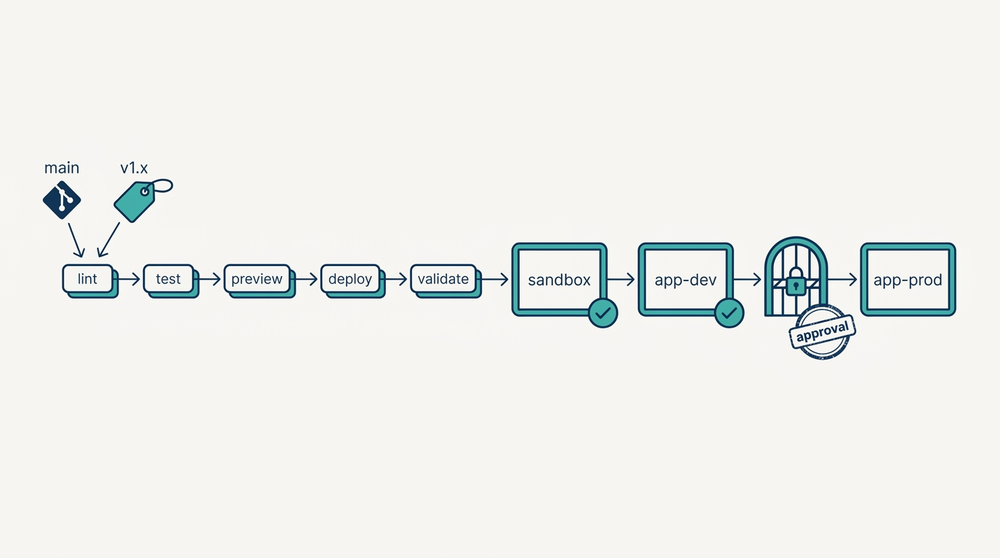
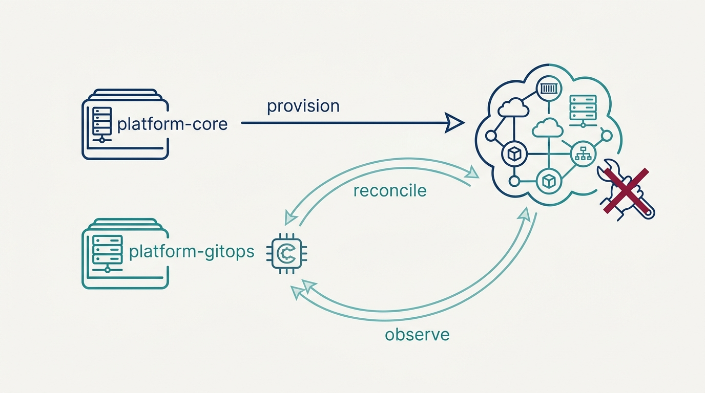

> **Status**: DRAFT
>
> **Principle**: When a platform team in my organization creates a platform, the finished build has one defining property: **the platform exists in Git, not in the clusters**. Environments are declarative stacks — a platform sandbox, an application dev, an application prod — with isolated, planned networks and pinned versions, provisioned as code and proven by tests. Provisioning and runtime configuration live in **two deliberately separated repositories**: infrastructure-as-code builds the clusters; GitOps continuously reconciles everything that runs on them, correcting drift visibly. Every change promotes through **one pipeline** — lint, test, preview, deploy, validate — sandbox first, then dev, then a recorded approval before production. Service-to-service traffic runs through a **mesh with controlled ingress and mTLS**, and misconfiguration is **blocked by policy checks before it ever reaches the GitOps repository**. The test I keep running: if the clusters vanished tonight, could the pipeline rebuild every environment from a tagged commit by morning?

## Statement

When my organization builds a platform, this is the shape of the build, end to end.

**Environments are declarative stacks.**

- **Three environments minimum, each a named stack.** A platform sandbox, an application dev, an application prod — each with its own configuration file, a unique cluster name, a pinned runtime image, and explicit readiness settings.
- **Consistent where it matters, smaller where it can be.** Non-production environments run reduced capacity; security and governance settings stay identical across all of them. What was tested is what ships.
- **Platform environments and application environments are separate SDLC concepts.** The platform team needs a place to break the platform that is not where application teams work.

**Networks are designed, not defaulted.**

- **Isolation by construction.** Every environment gets its own network with non-overlapping CIDR ranges — checked against VPN and host-network ranges before anything is provisioned. Cluster, pod, and service ranges are all explicit.
- **Ingress is a deliberate, minimal port map.** HTTP and HTTPS enter where the configuration says they enter; everything else stays closed. Zero trust starts with not exposing what nothing needs.
- **Ordering is code.** Network creation completes before cluster creation depends on it; the generated kubeconfig feeds the provider; cluster name, network, and kubeconfig are exported as stack outputs.

**Figure 1:** *Three environments, three isolated networks: non-overlapping CIDR ranges planned up front, minimal ingress, smaller non-production capacity — identical security everywhere.*

**One pipeline promotes every change, and tests prove every environment.**

- **Quality gates on every commit.** Formatting, type checking, import order, static analysis, and security scanning — tuned so real violations fail the pipeline and false positives do not drown the signal.
- **Fixed promotion order.** Lint → pre-deployment tests → preview → deploy → post-deployment validation. Sandbox deploys from commits to main; production-oriented releases ride Git tags; app-dev deploys only after sandbox validates; app-prod deploys only after a manual approval, recorded in the CI/CD system.
- **Validation after every environment, gates only where they govern.** An infrastructure test suite reads the stack outputs and verifies the build black-box — network exists, API reachable, nodes ready — and fails clearly when it should. Approval gates exist only where they provide meaningful governance value.

**Figure 2:** *One pipeline, fixed order: every change validates in sandbox, then app-dev, and reaches production only through a recorded approval on a tagged release.*

**Provisioning and runtime configuration are separated — and Git is the source of truth.**

- **Two repositories, two jobs.** Infrastructure provisioning lives in the platform-core repository; runtime and application configuration live in a separate GitOps repository. Application Kubernetes manifests are never managed directly by IaC — application lifecycle uses Kubernetes-native tooling.
- **Continuous reconciliation.** A version-pinned GitOps controller, installed from the provisioning layer, watches the configuration repository per environment — with explicit reconciliation intervals, health waits, and pruning policy. Manual drift is corrected; failed reconciliations are visible; a Git commit is what changes the cluster.
- **Onboarding is declarative.** New team repositories and platform services join through configuration, with versions explicitly pinned — never through manual installation.

**Figure 3:** *Two repositories, two jobs: provisioning flows one way from platform-core, while the GitOps controller loops forever between platform-gitops and the clusters, correcting drift.*

**Service traffic runs through a mesh.**

- **Controlled ingress and declared routing.** Traffic enters through a gateway; routing rules are resources, not tribal knowledge.
- **Encrypted by default.** mTLS between services is enabled and verified; workloads that need isolation get authorization and network policies.
- **Costs measured, hooks confirmed.** The mesh's resource and latency overhead is monitored honestly, and its telemetry — metrics, traces, logs — is confirmed consumable before the full observability build in [[observability-implementation]].

**Misconfiguration dies in the pipeline.**

- **Policy checks before the GitOps repository.** Policy-as-code rejects floating `latest` tags, wildcard chart versions, and unpinned deployments before a manifest ever reaches the repository the cluster obeys.
- **Policies are tested code.** Every policy has tests for allowed and rejected cases; enforcement is identical in every environment; violations fail the pipeline early.

**The finished platform is a versioned baseline.**

- **A final validation sweep** — stacks, deployments, networks, tests, scans, policies, reconciliation, mesh health, gateway routing, mTLS, telemetry, approval gates, drift correction — before the platform is called done.
- **A semantic version tag** triggers the release pipeline across every environment, and the working version is recorded as the baseline all future development builds on.

## Reference Stack

This record is grounded in a concrete build. The tools are the worked example, not the mandate — every commitment above holds at the level of the capability, and any tool below can be swapped for an equivalent that preserves the property that matters. The handbook's build is deliberately laptop-scale: Kind gives it disposable clusters on Docker, a teaching runtime that a real deployment swaps for managed Kubernetes.

| Role | Reference tool | The property that matters |
| --- | --- | --- |
| Infrastructure as code | Pulumi (Python) | Environments are stacks: one configuration file per environment, provisioning as reviewable, testable code |
| Kubernetes runtime | Kind on Docker | Disposable clusters with pinned node images — cheap to destroy and rebuild |
| CI/CD | CircleCI | One pipeline: lint → test → preview → deploy → validate, staged promotion, recorded production approval |
| GitOps controller | Flux | Runtime configuration continuously reconciled from Git; drift corrected; pruning explicit |
| Application lifecycle | Helm / Kustomize | Kubernetes-native application management, kept out of the IaC layer |
| Service mesh | Istio (Envoy) | Controlled ingress, declared routing, mTLS between services |
| Policy checks | OPA / Rego + conftest | Misconfiguration fails the pipeline before reaching the GitOps repository |
| Infrastructure tests | BATS | Black-box verification of stack outputs: network, API, nodes |
| Quality and scanning | Black, mypy, isort, Semgrep, Trivy | Formatting, types, static analysis, and security scanning gate every commit |

## How to Read This

This journal is my platform operating model, one record per source checklist. This record belongs to the **Reference Implementation** section — the how-it-concretely-looks companion to the conceptual records: where [[four-pillars]] states the test a platform must pass, these records state the shape of the build that passes it. It is grounded in the Platform Creation chapter of the *Platform Engineer's Handbook*, the hands-on companion that constructs an internal developer platform end to end. The runnable build — all seventeen stages plus the definition of done — lives in the **Checklist** tab; the **TL;DR** tab carries the management summary; the **Conversation** tab talks the reasoning through.

## Rationale

**Two repositories, because two change cadences.** Provisioning changes rarely and carefully; runtime configuration changes daily and broadly. Fusing them means every application change rides the machinery built for infrastructure change — slow, privileged, and reviewed by the wrong people. Splitting them puts each kind of change on rails matched to its risk, and the GitOps repository becomes the platform's front door: the place where new services, new versions, and new team repositories arrive declaratively.

**Reconciliation is the difference between documented state and actual state.** A cluster that accepts manual changes is a cluster whose Git history is fiction. Continuous reconciliation makes Git the source of truth in the only sense that counts: drift gets corrected, failed reconciliations are visible, and deletions follow a stated pruning policy rather than someone's memory. The build is not done until this is demonstrated — a controlled change applied, deliberate drift reconciled, a deletion pruned as configured.

**Staged promotion is how confidence compounds.** The sandbox proves the platform before application environments see the change; app-dev proves applications before production sees them; and production opens only on an approval that the CI/CD system records — who, what, when. But the record is equally deliberate about restraint: **approval gates exist only where they provide meaningful governance value**. A gate at every step trains everyone to click through — including at the one gate that matters.

**Pinning is what makes "rebuildable" true.** A platform of floating `latest` tags and wildcard chart versions cannot be rebuilt, only re-discovered — this week's rebuild is not last week's platform. Pinning is a rule humans agree with and violate weekly, which is why it is enforced as policy-as-code in the pipeline: mechanical, early, and identical in every environment. The cheapest place to kill a bad manifest is before it reaches the repository the cluster obeys.

**The mesh goes in before the tenants do.** Retrofitting mTLS, controlled ingress, and authorization policies onto a populated platform is a migration project; installing them into an empty one is configuration. That is why the mesh is part of creation, not a later hardening phase. The honesty requirement cuts the other way too: mesh proxies tax every request, so their resource and latency overhead is measured from day one rather than assumed away.

**Networks are the part you cannot patch later.** Overlapping CIDRs do not fail in the sandbox; they fail months later when a VPN range collides with a pod range and half the organization cannot reach the cluster. Address ranges are the platform decision with the worst retrofit cost per minute of planning — so they are planned once, checked against everything they could collide with, and verified non-overlapping across environments before anything ships.

## What This Means in Practice

| What this record says | What it does **not** say |
| --- | --- |
| Build with the reference stack as the worked example. | These tools are mandatory — every commitment holds at capability level; swap tools, keep properties. |
| Separate provisioning from runtime configuration. | Split repositories for their own sake — the line sits exactly where change cadence and ownership change. |
| Git is the source of truth; drift is reconciled. | Nobody may ever touch a cluster — break-glass access exists, but reconciliation puts the cluster back and makes the intervention visible. |
| Record a manual approval before production. | Put gates everywhere — a gate that provides no governance value is ceremony, and ceremony trains click-through. |
| Enable mTLS and gateway ingress at creation. | The mesh is free — its resource and latency overhead is measured, not assumed away. |
| Block misconfiguration with pipeline policy checks. | This is the whole policy story — admission-time enforcement inside the clusters is [[policy-as-code]]. |
| Confirm metrics, traces, and logs are consumable. | Build the observability platform now — that is [[observability-implementation]], on these hooks. |
| Run non-production environments smaller. | Run non-production environments looser — security and governance settings stay consistent everywhere. |

Concretely: any platform build in my organization can be asked two questions at review — *show me the commit that produced this environment*, and *show me the last time drift was reconciled*. If either answer involves a person's recollection rather than a pipeline log, the build is not done. **A platform you cannot rebuild is a platform you do not own.**

## Anti-Patterns

- **The snowflake environment.** Environments provisioned or patched by hand until production no longer resembles what was tested — the stack files say one thing, the clusters another.
- **The kubectl backdoor.** Manual cluster changes the reconciler is never allowed to correct — the clusters drift ever further from what the repository claims, with an audit trail that audits nothing.
- **IaC all the way up.** Managing application manifests from the provisioning layer, coupling every application change to infrastructure machinery and every application team to the platform team's release cadence.
- **The floating latest.** Unpinned images, wildcard chart versions, an unpinned controller — every rebuild produces a slightly different platform, and you learn the differences one incident at a time.
- **The ceremonial gate.** Approval steps nobody reads at every stage — governance theatre that makes clicking through a habit, and habits do not pause at the production approval.
- **Mesh as ornament.** Installing the mesh but never enforcing mTLS, never routing through the gateway, never measuring proxy overhead — paying the tax without collecting the property.
- **The overlapping CIDR.** Network ranges chosen by default and discovered in production, when the VPN and the pod network fight over the same addresses.
- **The untested policy.** Policy-as-code with no tests for allowed and rejected cases — enforcing you-don't-know-what, and finding out from the teams it blocks.

## Related Records

- [[groundwork]] — the stage before this one: repository conventions, secrets management, and release discipline that this build assumes.
- [[platform-security]] — the stage after: end-to-end hardening of what this record creates; here, security means mesh mTLS and pipeline checks.
- [[observability-implementation]] — the telemetry hooks confirmed here become the full observability platform there.
- [[cicd-as-a-platform-service]] — this record's pipeline builds the platform itself; that record turns CI/CD into a product for application teams.
- [[policy-as-code]] — pipeline-time checks here; admission-time enforcement inside the clusters there.
- [[four-pillars]] — this build is pillars two and four made concrete: software abstractions that manage complexity, operated as a foundation.
- [[implementing-platforms]] — the strategy-side view of build, harvest, and buy choices that a build like this one embodies.

## Scope and Revisiting

This record is `draft`. It applies to every platform my organization creates or substantially rebuilds, everywhere I am the accountable executive. I revisit it if a rebuild-from-tag exercise fails or takes longer than the recovery objectives allow, or if drift-correction exceptions accumulate until reconciliation is decorative. I also revisit it if measured mesh overhead stops earning its security and routing value for our workload profile, or if the two-repository split starts generating more coordination than it removes — the latter a sign the line between provisioning and runtime configuration is drawn in the wrong place, not that the line should go.

## Authoritative References

- *Platform Engineer's Handbook* — the Platform Creation chapter, whose checklist this record distills: environments, network foundation, Kubernetes runtime, CI/CD, GitOps structure, the Istio service mesh, pipeline policy checks, and release.
- Camille Fournier and Ian Nowland, *Platform Engineering: A Guide for Technical, Product, and People Leaders* (O'Reilly, 2024) — the conceptual frame this reference implementation serves, distilled in [[four-pillars]].
