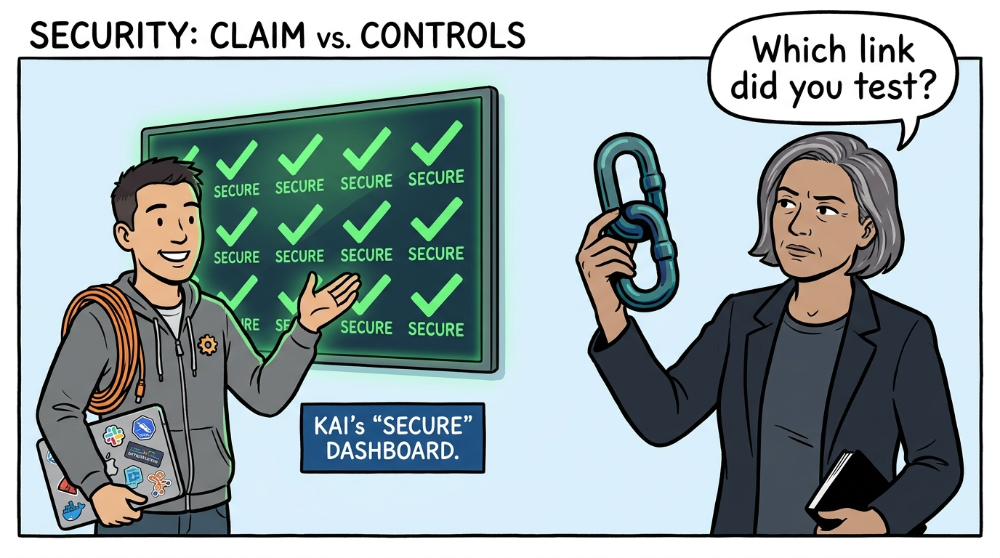
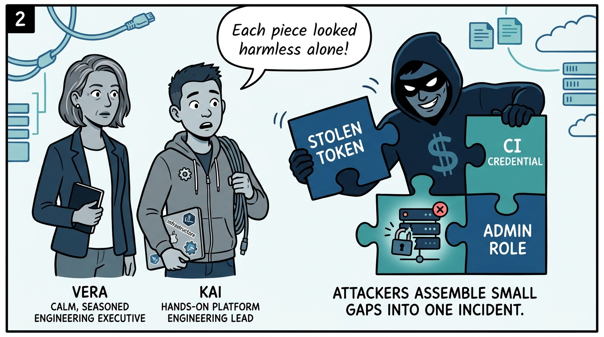
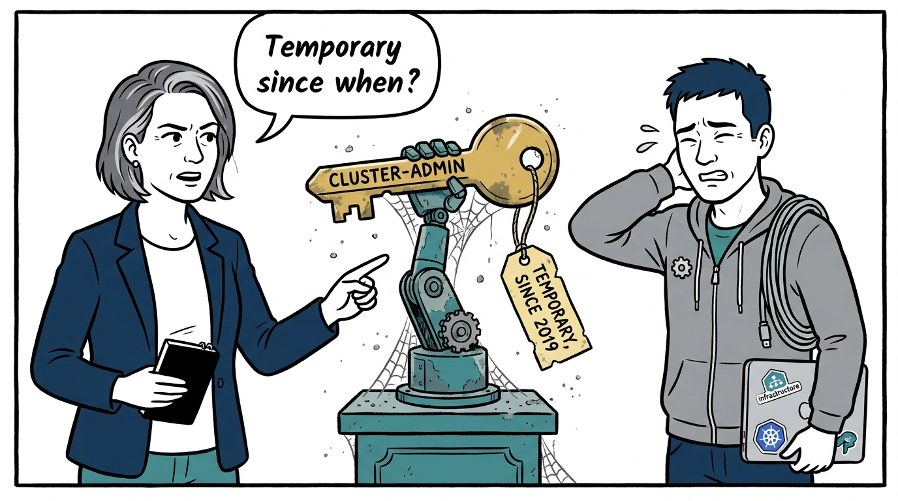
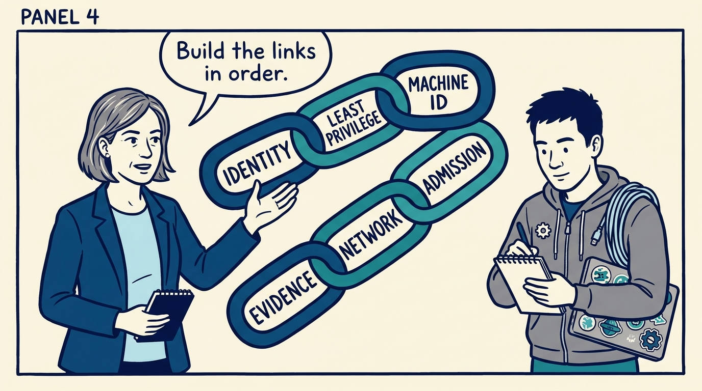
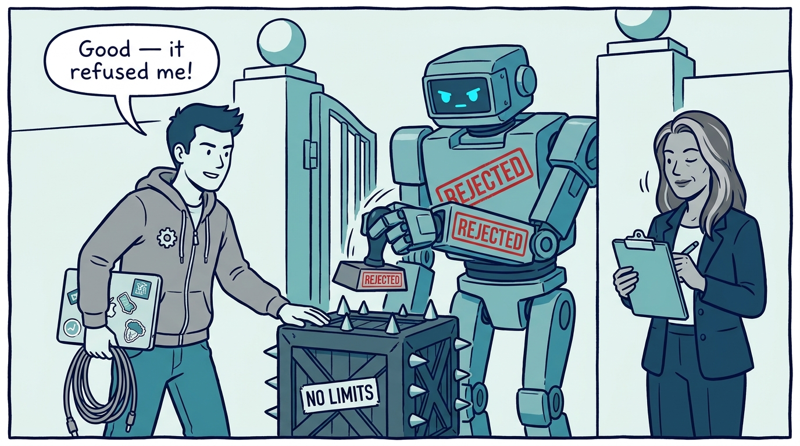
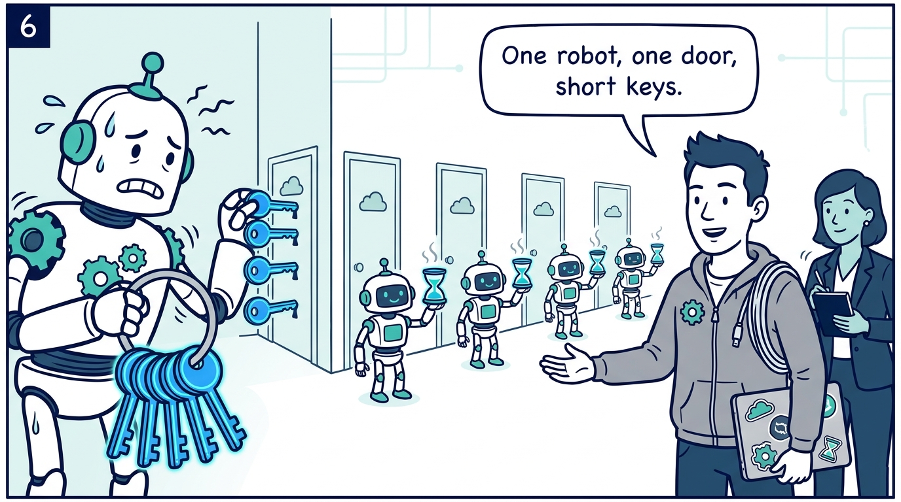
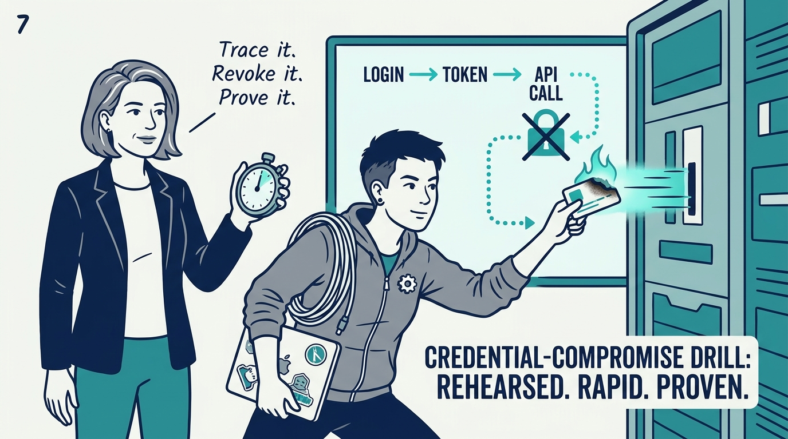
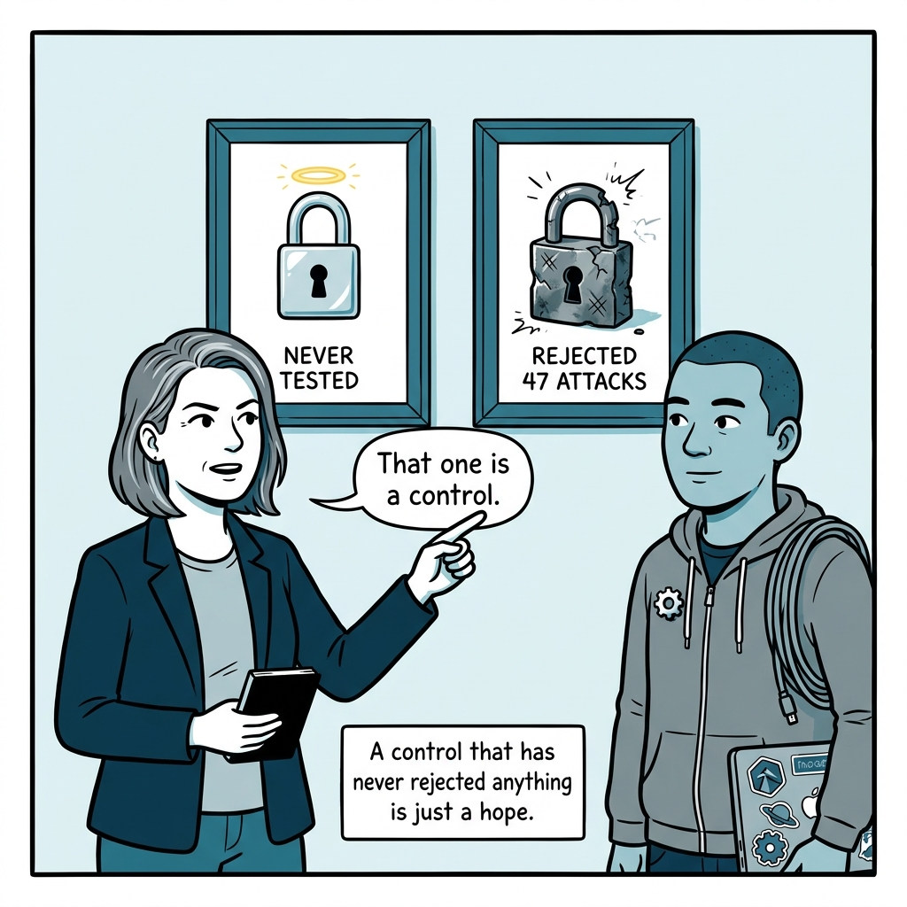

Why platform security is a chain proven by breaking it — not a list of green checkboxes — in eight panels.

<!-- comic-style
{
  "cast": "VERA: a calm, seasoned engineering executive, short gray-streaked hair, dark blazer over a plain t-shirt, carries a small black notebook. KAI: a hands-on platform engineering lead, short dark hair, gray zip-up hoodie with a small gear pin, laptop covered in infrastructure stickers under one arm, a coil of cable slung over the shoulder.",
  "style": "Clean two-tone explainer comic, thick ink outlines, flat colors with deep blue and teal accents on a light background, generous white space, hand-lettered speech bubbles with SHORT readable text, no photorealism."
}
-->

**Panel 1:** *The hook: 'the platform is secure' is either a claim or a chain of verified controls — the executive asks which link was tested.*

**Panel 2:** *The problem: a stolen token, a leaked CI credential, and an over-permissive role are the same incident waiting to assemble itself.*

**Panel 3:** *The wrong way: the convenience admin and the immortal token — the platform's real posture is whatever the oldest credential can still do.*

**Panel 4:** *The principle: six links, in order — human identity, least-privilege authorization, machine identity, admission control, network and transport, evidence.*

**Panel 5:** *How it plays out: nothing counts as done until someone tried to break it — the noncompliant deployment must be rejected, the forbidden action must fail.*

**Panel 6:** *Machine identity: one narrowly scoped service account per pipeline with short-lived tokens — when the shared robot leaks, the blast radius is everything.*

**Panel 7:** *What it takes: the drill — simulate the leak, revoke, verify dead, trace login to token to API call in the audit logs, fix, and re-test on a schedule.*

**Panel 8:** *The closer: a control that has never rejected anything is a hope, not a control.*
