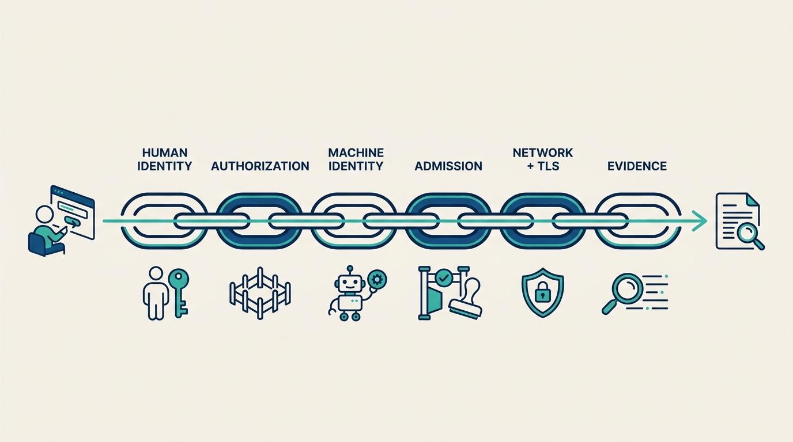
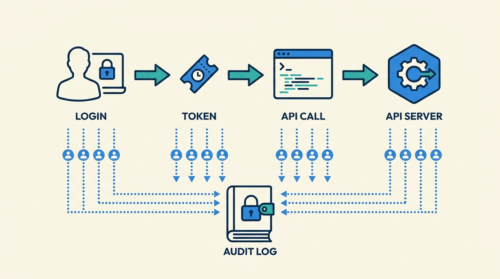
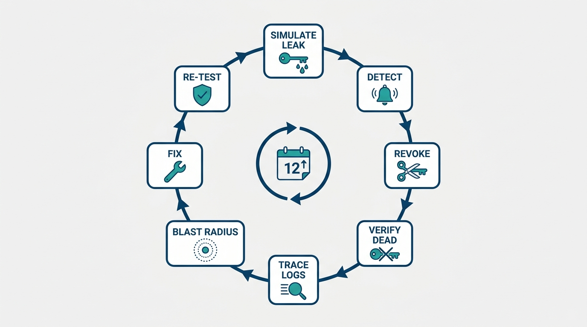

> **Status**: DRAFT
>
> **Principle**: When my organization secures an internal Kubernetes platform, security is built as **one chain, end to end**: human identity through central OIDC with short-lived tokens; **least-privilege authorization** scoped to team namespaces; **machine identity** as narrowly scoped, per-pipeline service accounts with projected tokens; **admission control** that rejects noncompliant workloads before they run; **network and transport protection** — deny-unnecessary network paths, strict mTLS inside, automated TLS outside; and **evidence** — tamper-protected audit logs that correlate identity with cluster activity. Two tests run through the whole build: every control is proven by deliberately trying to violate it, and any user action can be traced from login through token to Kubernetes API call. No human and no pipeline holds cluster-admin without a reason its owner can defend. **A control that has never rejected anything is a hope, not a control.**

## Statement

My operating model holds every platform security build to six links, in order.

**Figure 1:** *The six links of the platform security chain, built in order — from human identity through to the audit evidence that reconstructs any action.*

**Link 1 — Human identity:**

- **One identity provider, one realm.** The platform authenticates people through a central OIDC provider with a dedicated realm for the platform; the Kubernetes API server trusts it directly (issuer URL, client ID, username claim, groups claim).
- **Groups carry authorization.** Platform admins and platform users are identity-provider groups, mapped to Kubernetes RBAC groups — membership changes in one place.
- **Tokens expire fast.** Access tokens are short-lived — on the order of fifteen minutes — so a leaked token is a small problem, not a standing credential.
- **Proven, not assumed.** Login is tested through the provider, and group membership is confirmed in the issued JWT before anyone relies on it.

**Link 2 — Least-privilege authorization:**

- **Namespaces are the boundary.** Each team or application gets a namespace carrying governance labels — team, environment, cost center — and developers get a namespace-scoped Role bound to their identity group.
- **Admins get troubleshooting, not omnipotence.** Platform administrators hold the cluster-level permissions troubleshooting requires; nobody holds cluster-admin as a convenience.
- **Boundaries are verified.** Developers cannot view or modify system namespaces, and every claim about who can do what is checked with `kubectl auth can-i`, not assumed from the manifest.

**Link 3 — Machine identity:**

- **One service account per pipeline.** Each application or pipeline gets its own service account, scoped to a single namespace, granted only what the pipeline actually does.
- **No permanent credentials.** Pipelines use short-lived projected tokens; credentials never appear in build logs.
- **Verified both ways.** The account demonstrably can perform its permitted deployments — and demonstrably cannot reach other namespaces or perform create/delete operations it was never granted.

**Link 4 — Admission control:**

- **Policy runs at admission.** An admission controller (OPA/Gatekeeper in the reference build) enforces the baseline: approved container registries, CPU and memory limits, no privileged containers, no root containers where the standard forbids them, required namespace labels with permitted values, and PodDisruptionBudgets — with explicit system-namespace exclusions.
- **Rejection is tested.** A deliberately noncompliant deployment is submitted and rejected — unauthorized image, missing limits — before the policy is declared live. Violations are monitored, not just blocked.

**Link 5 — Network and transport:**

- **Deny the unnecessary.** Ingress and egress rules are defined per workload; NetworkPolicies restrict cross-namespace traffic and host-level network access to what is justified.
- **Encrypted inside and out.** Service-to-service traffic runs under strict mTLS (Istio in the reference build), verified — not just configured. External traffic terminates at the gateway on certificates issued and renewed automatically (cert-manager in the reference build); expiry and renewal state are monitored.

**Link 6 — Evidence and rehearsal:**

- **The audit trail reconstructs actions.** API audit logging records user identity, timestamps, authentication and authorization decisions, secrets access, RBAC modifications, privileged operations, and request outcomes; identity-provider login and token events are captured alongside. Logs are centralized, protected from modification, and retained by policy.
- **Alerts watch the watchers.** Security-sensitive changes and policy violations page someone; identity events correlate with cluster activity.
- **The drill is part of the build.** The team simulates a leaked service-account credential and runs the full loop — detect, revoke, verify dead, trace in the audit logs, size the blast radius, document the timeline, fix the gap, and prove the fix in a repeat test. Permission reviews, policy updates, and drills recur on a schedule.

## Reference Stack

This record is grounded in a concrete reference build. The commitments above are stated at the capability level; the tools below are the worked example, not the mandate.

| Role in the chain | Reference tool | The property that matters |
| --- | --- | --- |
| Human identity | Keycloak (OIDC) | One realm, group claims in the JWT, ~15-minute tokens |
| Authorization | Kubernetes RBAC | Namespace-scoped roles bound to identity groups |
| Machine identity | Kubernetes service accounts | Per-pipeline, single-namespace, projected tokens |
| Admission control | OPA/Gatekeeper | Noncompliant workloads rejected before they run |
| Network policy | Kubernetes NetworkPolicies | Unnecessary paths blocked by default |
| Service-to-service encryption | Istio strict mTLS | Encryption verified, not assumed |
| External TLS | cert-manager + Istio Gateway | Certificates issued, renewed, and monitored automatically |
| Evidence | Kubernetes audit logging + centralized logs | Login → token → API call reconstructable |

## How to Read This

This record is part of the **Reference Implementation** section of this journal — the how-it-concretely-looks companion to the Platform Engineering records. Where [[four-pillars]] states that a platform must be operated as a foundation, this record is one slice of that foundation made concrete: the security build I hold a platform team to, grounded in the End-to-End Kubernetes Platform Security checklist of the *Platform Engineer's Handbook*. The runnable version — every link, every verification, the final security review — lives in the **Checklist** tab. The **TL;DR** tab carries the management summary; the **Conversation** tab talks through the objections.

## Rationale

**Security is a chain because attackers do not respect layer boundaries.** A stolen browser token, a leaked CI credential, an over-permissive role, and an unpoliced registry are all the same incident waiting to assemble itself. Building the links in order — identity, authorization, machine identity, admission, network, evidence — means each layer assumes the previous one fails. Short-lived tokens assume credentials leak; namespace-scoped RBAC assumes tokens are stolen; admission policy assumes a compromised pipeline pushes a bad image; NetworkPolicies and mTLS assume a workload is breached; the audit trail assumes all of the above and answers *what happened*.

**Every control is proven by a violation, or it is decoration.** The checklist's most distinctive discipline is that nothing counts as done until someone tried to break it: the noncompliant deployment that Gatekeeper must reject, the service account that must fail to cross a namespace, the `kubectl auth can-i` that must return `no`, the unauthorized network path that must be blocked. Configuration drift, typos in selectors, and forgotten exclusions are invisible in a green dashboard and obvious in a failed violation test. **The negative test is the control.**

**Least privilege is cheapest at build time.** Cluster-admin handed out during setup "temporarily" becomes the permanent topology of the platform; clawing it back later is an organizational project. Scoping every human to a namespace role and every pipeline to a single-namespace service account on day one costs minutes. The final review question — *does any human or service account hold unnecessary cluster-admin?* — is binary and non-negotiable.

**Machine identity is where platforms are most exposed.** Human logins get MFA and reviews; the CI service account with a permanent token in a build log gets neither, and it deploys to production every day. Treating pipelines as first-class identities — one account per pipeline, projected short-lived tokens, credentials scrubbed from logs, negative tests for what the account must *not* do — closes the gap between how we guard people and how we guard automation.

**The audit trail is a security control, not an observability feature.** Without the login → token → API call trace, an incident response is archaeology; with it, the drill's questions — what did the credential touch, when, on whose authority — have answers in minutes. That is why the logs must be centralized, tamper-protected, and retained: an audit log the attacker can edit is testimony from the defendant.

**Figure 2:** *The running trace: any user action reconstructable from login through token to Kubernetes API call, correlated in one tamper-protected audit log.*

**The drill is what converts architecture into capability.** A team that has rotated a burned credential under a stopwatch, traced it through the audit logs, and re-tested the preventive fix has an incident response capability. A team with the same architecture and no drill has a diagram. Scheduling the drills — with the permission reviews and policy updates — is what keeps the chain true as the platform evolves.

**Figure 3:** *The drill loop: simulate a leaked credential, detect, revoke, verify it is dead, trace it, size the blast radius, fix, and re-test — on a schedule.*

## What This Means in Practice

| What this record says | What it does **not** say |
| --- | --- |
| One central OIDC identity with short-lived tokens for all platform access. | Keycloak specifically — any OIDC provider with realms, groups, and short token lifetimes qualifies. |
| Developers are confined to namespace-scoped roles, verified with negative tests. | Developers are locked out of production — they hold exactly the permissions their work requires, provably. |
| Every pipeline gets its own narrowly scoped service account with projected tokens. | CI/CD is distrusted — machine identity is held to the same standard as human identity, no lower. |
| A baseline admission policy set rejects noncompliant workloads at the door. | The full policy-as-code practice lives here — authoring, testing, and lifecycle belong to [[policy-as-code]]. |
| Strict mTLS inside, automated TLS outside, unnecessary network paths denied. | The mesh is built here — [[platform-creation]] builds it; this record switches it to strict and verifies. |
| Audit logs reconstruct any action from login to API call, tamper-protected. | The full telemetry stack lives here — that is [[observability-implementation]]; this is the security slice. |
| A credential-compromise drill is run, documented, and repeated on a schedule. | Drills are a launch-time ceremony — they recur, with permission reviews and policy updates. |

Concretely: a platform in my organization is not declared secure by architecture review. It is declared secure when the validation pass has run — admin, user, and CI identities each tested for what they can and cannot do; policies rejecting real noncompliant deployments; mTLS and TLS verified; one action traced end to end — and when the first incident drill has produced a documented timeline and a re-tested fix.

## Anti-Patterns

- **The convenience admin.** Cluster-admin granted during setup to make things work, never revoked — the platform's real security posture is whatever the oldest kubeconfig can do.
- **The immortal token.** A permanent service-account credential in a CI variable (or worse, a build log), outliving the engineer who created it and every rotation policy on paper.
- **The shared robot.** One service account for every pipeline — when it leaks, the blast radius is the whole platform, and the audit log says only "the robot did it."
- **Policy as documentation.** Security standards that live in a wiki while the admission controller admits everything — complexity documented, nothing enforced.
- **The untested control.** Policies, roles, and network rules deployed but never exercised by a deliberate violation — green until the day they matter.
- **The soft interior.** TLS at the edge, plaintext everywhere inside — one compromised pod away from reading the platform's east-west traffic.
- **The write-only audit log.** Audit logging enabled, shipped nowhere, correlated with nothing, editable by the workloads it watches — evidence that cannot testify.
- **The paper drill.** An incident-response runbook that has never been run — the first real credential leak becomes the first rehearsal.

## Related Records

- [[four-pillars]] — pillar 4 (operated as a foundation) is what this record makes concrete on the security axis; guardrails with safe defaults are pillar 3's promise, enforced here.
- [[platform-creation]] — the sibling record that builds the environments, GitOps machinery, and mesh this record hardens.
- [[groundwork]] — repositories, secrets, and release hygiene; the platform-level secrets discipline that precedes cluster identity.
- [[policy-as-code]] — the deep dive on the policy practice; this record installs admission control as one link, that record owns the policy lifecycle.
- [[cicd-as-a-platform-service]] — the pipeline capability whose identities this record scopes and verifies.
- [[observability-implementation]] — the full telemetry build; this record's audit and alerting layer is its security slice.
- [[resilience-automation]] — the sibling that generalizes the drill discipline from security incidents to failure at large.
- [[operating-platforms]] — the operating model that consumes this record's evidence layer and drill cadence.

## Scope and Revisiting

This record is `draft`. It applies to every Kubernetes-based platform my organization runs, everywhere I am the accountable executive; for non-Kubernetes platforms the chain holds even where the reference tools do not. I revisit it if a real incident shows a link the chain does not cover, if the scheduled drills or permission reviews stop happening (the evidence link failing quietly), or if the platform's identity, admission, or mesh technology changes enough that the reference build no longer describes what teams actually operate.

## Authoritative References

- *Platform Engineer's Handbook* — the End-to-End Kubernetes Platform Security chapter, whose checklist this record distills (filed in this journal's sources as the PEH 03 checklist).
