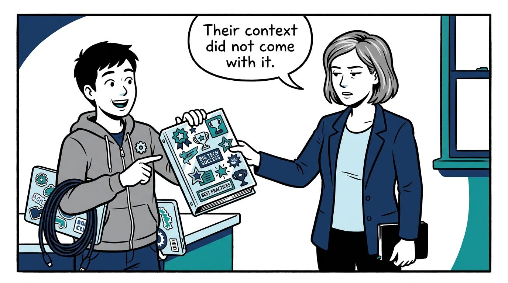
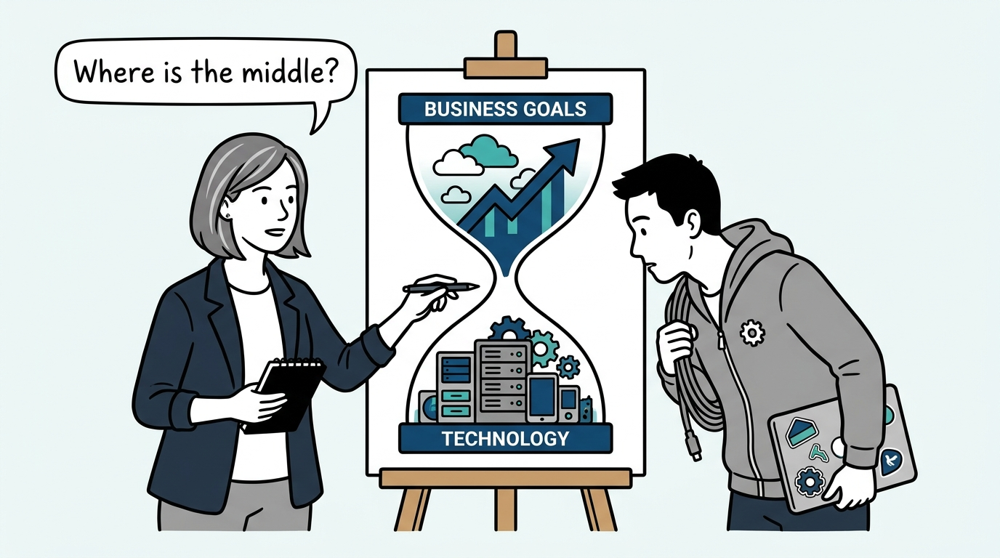
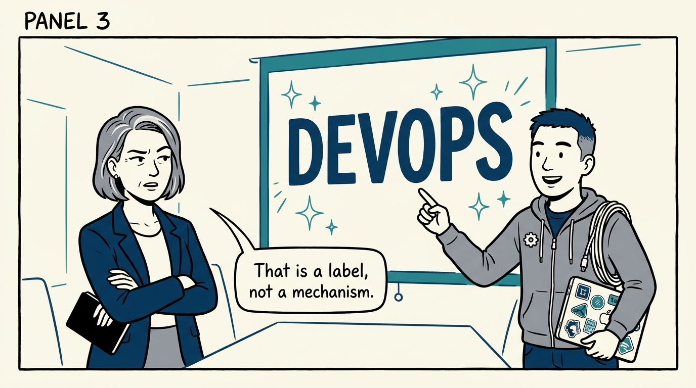
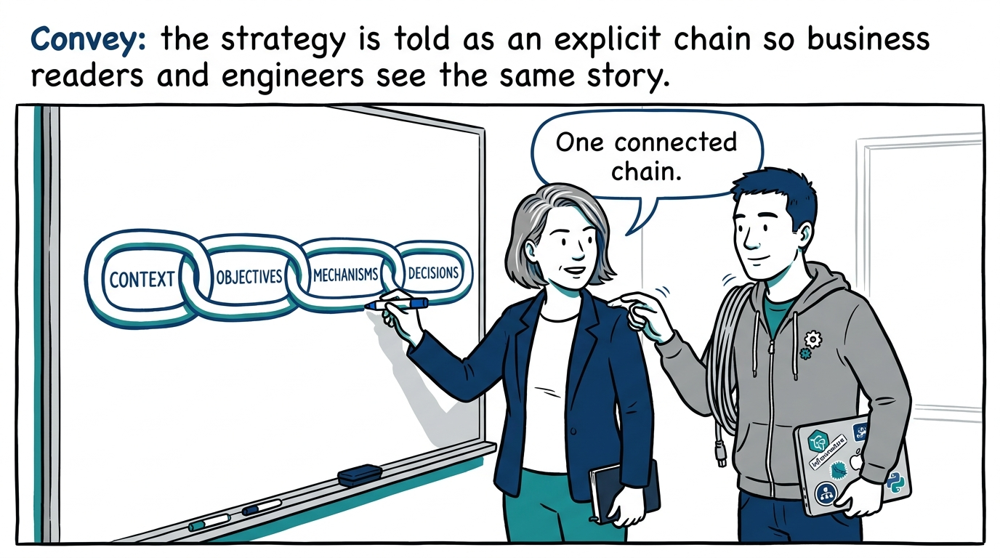
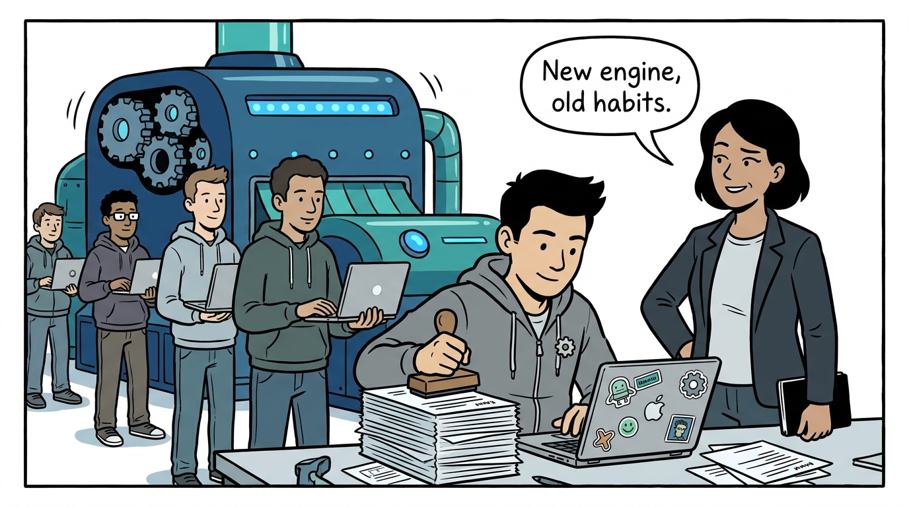
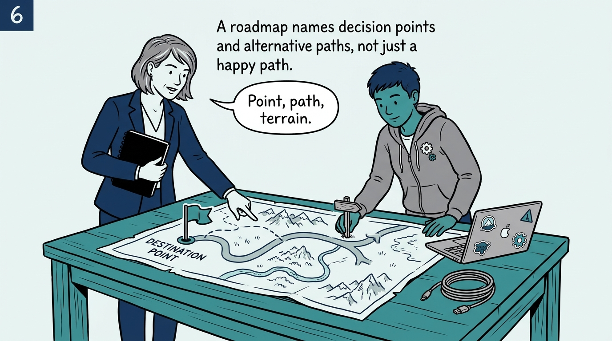
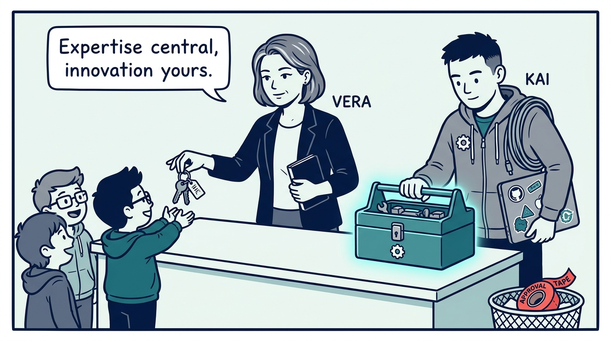
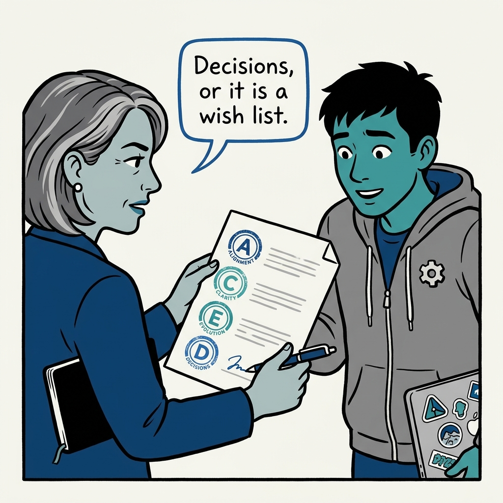

Why a platform strategy must make actual choices — in eight panels.

<!-- comic-style
{
  "cast": "VERA: a calm, seasoned engineering executive, short gray-streaked hair, dark blazer over a plain t-shirt, carries a small black notebook. KAI: a hands-on platform engineering lead, short dark hair, gray zip-up hoodie with a small gear pin, laptop covered in infrastructure stickers under one arm, a coil of cable slung over the shoulder.",
  "style": "Clean two-tone explainer comic, thick ink outlines, flat colors with deep blue and teal accents on a light background, generous white space, hand-lettered speech bubbles with SHORT readable text, no photorealism."
}
-->

**Panel 1:** *The hook: the most common platform strategy is someone else's — and the context that made it work does not copy.*

**Panel 2:** *The problem: the IT hourglass — business outcomes at the top, a technology inventory at the bottom, and nothing where the reasoning should be.*

**Panel 3:** *The wrong way: buzzword mechanisms — 'we will do DevOps' is a label where an explanation should be.*

**Panel 4:** *The principle: context, objectives, mechanisms, design decisions — four layers with explicit connections, so no hourglass can form.*

**Panel 5:** *How it fails quietly: new technology under old ways of working is optimization sold as transformation.*

**Panel 6:** *How it plays out: the roadmap is point, path, and terrain — with named decision points, alternative paths, and the data needed to choose.*

**Panel 7:** *The cost: governance earns autonomy or it is just control — centralizing expertise means relinquishing some central control so users can innovate.*

**Panel 8:** *The closer: the ACED gate — Alignment, Clarity, Evolution, Decisions. A strategy that decides nothing does not get signed.*
