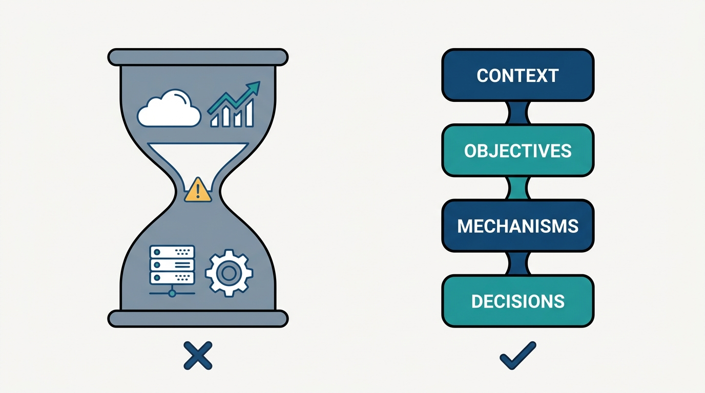
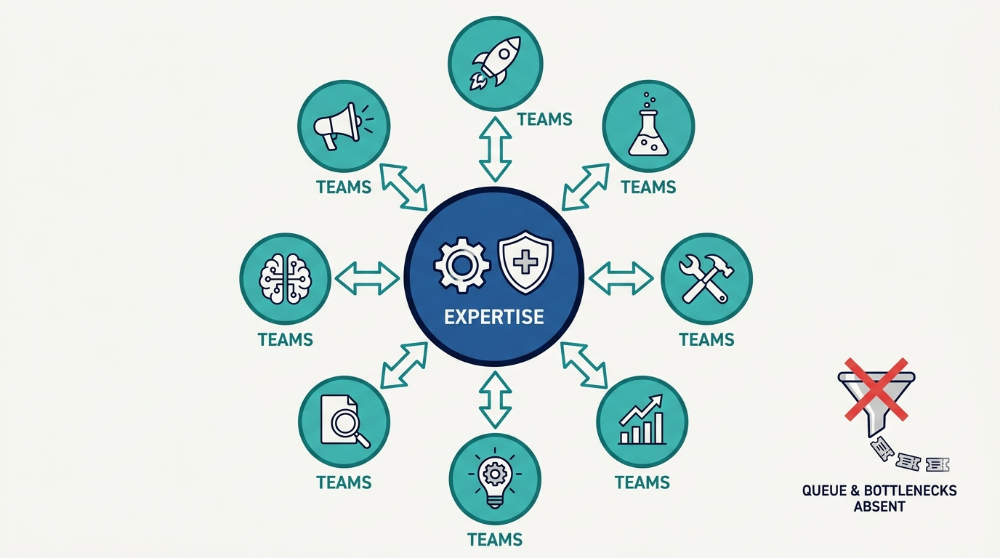
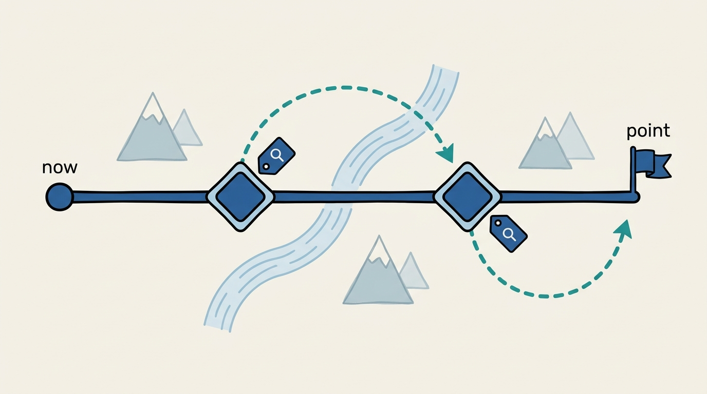

> **Status**: DRAFT
>
> **Principle**: A platform strategy is a real strategy or it is not approved. It starts from why *we* need a platform — our business strategy, our assets, our constraints — never from a copied success story, and it aims at increasing our rate of change, not at reaching a fixed target state. It is told as an explicit chain — context, objectives, mechanisms, design decisions — so that business readers and engineers see the same story and no "IT hourglass" hides the reasoning in the middle. It describes transformation (changed ways of working), not optimization (new technology under old habits). And before I sign it, it passes ACED: it Aligns with the business strategy, a broad audience finds it Clear, it can Evolve as constraints change, and it makes actual Decisions — because a strategy without trade-offs is a wish list wearing a strategy's clothes.

## Statement

My operating model for platform strategy has five parts.

What the strategy is grounded in:

- **Our why, not someone else's.** The strategy defines why *this* organization needs a platform, connected to the business strategy, accounting for our unique assets, constraints, and competitive environment. Copying another organization's platform strategy without adapting it is disqualifying.
- **A two-way relationship.** Business strategy shapes technology strategy, and technology capabilities reshape what the business can attempt. The strategy is written to serve both directions.
- **Rate of change over target state.** The goal is to increase how fast we can change, not to arrive at a fixed architecture and stop.

How the strategy is told — four connected layers:

| Layer | Answers |
| --- | --- |
| **Context** | Why are we pursuing a platform strategy at all? |
| **Objectives** | Which business outcomes matter most, in priority order? |
| **Mechanisms** | How will platform capabilities actually produce those outcomes? |
| **Design decisions** | Which implementation trade-offs did we make, and why? |

The connections between layers are explicit; buzzwords ("DevOps", "microservices") never stand in for mechanisms; and technical decisions are written so both business and technology stakeholders can follow them. The four layers exist specifically to avoid the **IT hourglass** — a document with business goals at the top, technology at the bottom, and nothing connecting them.

**Figure 1:** *The IT hourglass versus the four-layer chain: the layers are there to force the middle of the argument — the mechanisms — to exist.*

What the strategy must change:

- **Ways of working, not just technology.** The strategy names which existing ways of working must change, and which old constraints the platform removes. Upgrading technology without changing how we work is optimization, not transformation.
- **"And", not "or".** The platform pursues speed *and* quality through automation, speed *and* compliance through guardrails — and rejects the assumption that innovation and harmonization are opposites.

How design and governance appear in the strategy:

- **Commodity separated from differentiator**, clear reusable components, common interfaces where they enable reuse, complexity hidden, onboarding friction low — and enough user freedom to build solutions we did not anticipate. No all-encompassing "IT pyramid" that tries to predict every use case.
- **Centralized expertise, decentralized innovation.** Reusable expertise is centralized where it creates economies of scale; usage and innovation are decentralized to teams; operational control is separated from user control; automation and shared responsibility replace approvals and tickets as the governance mechanism.

**Figure 2:** *Centralized expertise, decentralized innovation: automation and shared responsibility do the governing — not approval queues and tickets.*

How the strategy meets reality:

- **A mapped landscape.** User needs anchor the platform; components are mapped and classified (genesis, custom-built, product, commodity); commoditization candidates and componentization opportunities are identified — a Wardley Map or similar model, refreshed as usage data comes in.
- **Point, path, terrain.** The roadmap states where we are going, how we intend to get there, and what the terrain holds — starting from our *actual* current state, naming decision points and alternative paths, specifying what data future decisions need, and letting tactics change while direction holds.
- **The ACED gate.** Before approval: **A**lignment with business and IT strategy, **C**larity for a broad audience, ability to **E**volve, and actual **D**ecisions with trade-offs.

**Figure 3:** *Point, path, and terrain: the roadmap starts from the actual current state, names its decision points and alternative paths, and states what data each choice will need.*

## How to Read This

This journal is my platform operating model, one record per source checklist. This record is grounded in the "Strategy for Platforms" chapter of Gregor Hohpe's *Platform Strategy: Innovation Through Harmonization* (Leanpub, 2024) — the chapter about what makes a platform strategy an actual strategy, distilled here into **the standard every platform strategy I approve has to meet**. It sits directly on [[understanding-platforms]]: first we agree what a platform is, then this record governs how we decide why and where to build one. The runnable version — the four layers, the transformation tests, the roadmap questions, and the ACED gate — lives in the **Checklist** tab of this post.

## Rationale

**Copied strategies fail because the context that made them work does not copy.** The most common platform strategy I see is someone else's: Spotify's, Amazon's, a conference talk's. Hohpe's opening demand — define why *we* need a platform, from *our* assets, constraints, and competitive environment — is the antidote. A strategy is a bet placed from a position, and our position is the one thing no benchmark can supply. This is also why I treat business and technology strategy as a **two-way relationship**: the platform is not an implementation detail of a finished business plan; it changes what business plans are possible.

**The four layers exist because strategy documents fail in the middle.** The classic failure is the IT hourglass: lofty business outcomes at the top, an inventory of technologies at the bottom, and a thin waist where the reasoning should be. Context → objectives → mechanisms → design decisions forces the middle to exist: **mechanisms are the testable claim that the platform capabilities will produce the outcomes**, and design decisions record the trade-offs that claim rests on. The discipline that keeps the waist honest is refusing buzzwords as mechanisms — "we will do DevOps" explains nothing; "automated compliance checks let teams deploy without waiting for review board slots, which shortens cycle time on our regulated products" is a mechanism.

**Rate of change beats target state because the target will be wrong.** A strategy aimed at a fixed end-state architecture is obsolete the day the environment shifts — and the environment always shifts. Aiming instead at increasing the organization's rate of change means the platform's job is to make the *next* change cheaper, which is also what justifies harmonizing at all. That is why the strategy carries a mapped landscape: classifying components from genesis to commodity shows where commoditization is coming — and therefore where harmonization will pay next — and refreshing the map with usage data keeps those bets current. The same logic drives the roadmap discipline: not a happy path, but **point, path, and terrain** — with named decision points, alternative paths, and the data we will need when we get there. Tactics flex; direction holds.

**Transformation is measured in changed ways of working, not upgraded technology.** Hohpe's line is one I enforce in every strategy review: technology upgrades without changed ways of working are optimization, not transformation. So a platform strategy must name the working habits that will change and the old constraints that disappear — and it must claim the "and": speed *and* quality through automation, speed *and* compliance through guardrails. A strategy that still treats innovation and harmonization as opposites has not understood why we are building a platform in the first place.

**Governance earns autonomy or it is just control.** The strategy commits us to centralizing reusable expertise where scale economics are real, while decentralizing usage and innovation to teams — with automation and shared-responsibility models doing the governing, not approval queues and tickets. That includes the uncomfortable half: **being willing to relinquish some central control so users can innovate**. A platform whose governance model is a ticket funnel has centralized the wrong thing.

**ACED keeps me from approving wish lists.** Alignment, Clarity, Evolution, Decisions. The last letter is the sharp one: does the strategy make actual choices and trade-offs, or does it merely list desirable properties? A document everyone agrees with instantly is usually a document that decided nothing. Clarity is its quiet partner — if a broad human audience cannot follow the argument, the strategy will be executed by rumor — and clarity includes saying what the strategy does *not* include.

## What This Means in Practice

| What this record says | What it does **not** say |
| --- | --- |
| The strategy starts from our context and connects to our business strategy. | A proven playbook from another company can be adopted wholesale. |
| Context, objectives, mechanisms, and design decisions form one explicit chain. | Business goals plus a technology list make a strategy — that is the IT hourglass. |
| Mechanisms explain *how* capabilities produce outcomes. | "DevOps" or "microservices" on a slide counts as a mechanism. |
| The platform changes ways of working and removes old constraints. | Rolling out new technology under old habits is transformation — that is optimization. |
| Standardize underneath to enable diversity and autonomy on top. | The platform predicts every use case — the all-encompassing IT pyramid is the anti-goal. |
| The roadmap names decision points, alternative paths, and the data to choose. | Execution will follow the happy path drawn at approval time. |
| Approval requires passing ACED — including actual decisions and trade-offs. | A strategy can be a list of wishes nobody would ever argue against. |

Concretely: every platform strategy I review arrives as the four-layer chain, and my first read is the waist of the hourglass — **I look for the mechanism sentences and the design trade-offs before I look at anything else**. If I cannot find a decision someone might reasonably have made differently, the document goes back; it has described a destination, not a strategy.

## Anti-Patterns

- **The copied strategy.** Adopting another organization's platform story without adapting it to our assets, constraints, and competitive position.
- **The IT hourglass.** Business outcomes on top, technology inventory below, and no mechanisms connecting them — the reasoning is missing exactly where it matters.
- **Buzzword mechanisms.** "We will adopt DevOps/microservices/GitOps" presented as the *how* — a label where an explanation should be.
- **The target-state strategy.** A fixed end architecture with a date, blind to the fact that the environment will move; no attention to rate of change.
- **Optimization sold as transformation.** New platform, same ways of working, same constraints — a technology refresh wearing transformation language.
- **The IT pyramid.** An all-encompassing design that tries to anticipate every use case, leaving users no freedom to build what we did not foresee.
- **Ticket-based guardrails.** Governance implemented as approval queues and tickets instead of automation and shared responsibility — friction dressed up as safety.
- **The happy-path roadmap.** A linear plan from an idealized current state, with no decision points, no alternative paths, and no idea what data future choices will need.

## Related Records

- [[understanding-platforms]] — the vocabulary this record builds on: what a platform is and where the harmonized/variable line runs, before any strategy is written.
- [[designing-platforms]] — where the design-decision layer of the strategy becomes concrete platform design work.
- [[organizing-for-platforms]] — the organizational half of the governance stance taken here: who centralizes expertise, who keeps autonomy.
- [[implementing-platforms]] — execution of the roadmap this record requires; the decision points named here get exercised there.
- [[planning-and-delivery]] — the Fournier/Nowland planning discipline that operates inside the strategic direction this record sets.

## Scope and Revisiting

This record is `draft`. It governs every platform strategy written, reviewed, or approved where I am the accountable executive — internal developer platforms and business capability platforms alike. I revisit it if **approved strategies keep failing in execution at unnamed decision points** (the signal that the roadmap discipline is theater), if strategy documents pass review without containing a single contestable decision (ACED's D has stopped biting), or if the business strategy shifts enough that the context layer of our current platform strategies no longer describes the organization we are.

## Authoritative References

- Gregor Hohpe, *Platform Strategy: Innovation Through Harmonization* (Leanpub, 2024) — the "Strategy for Platforms" chapter, whose checklist this record distills.
