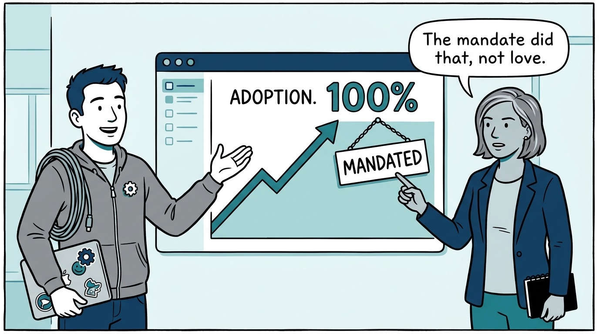
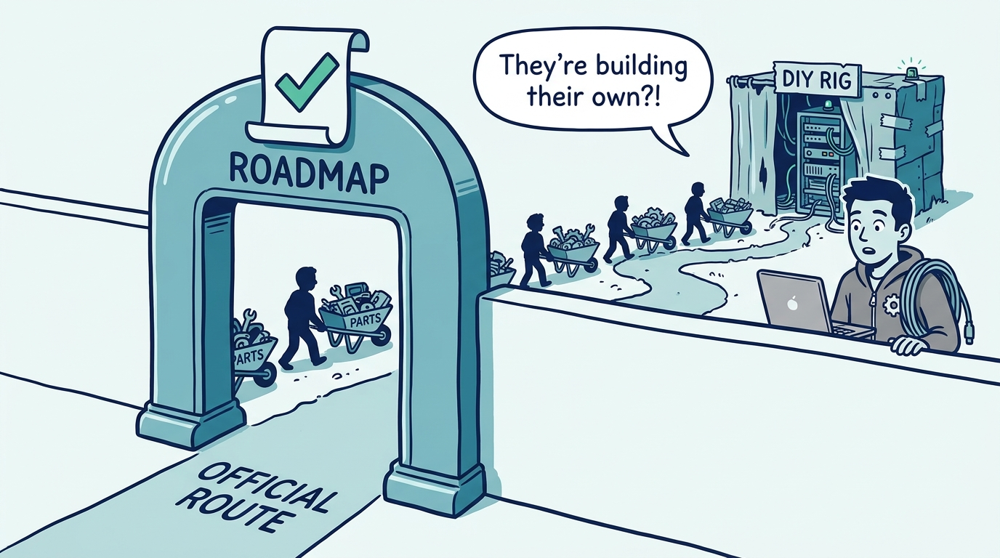
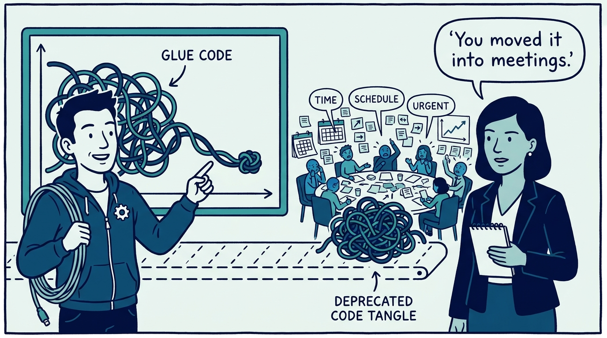
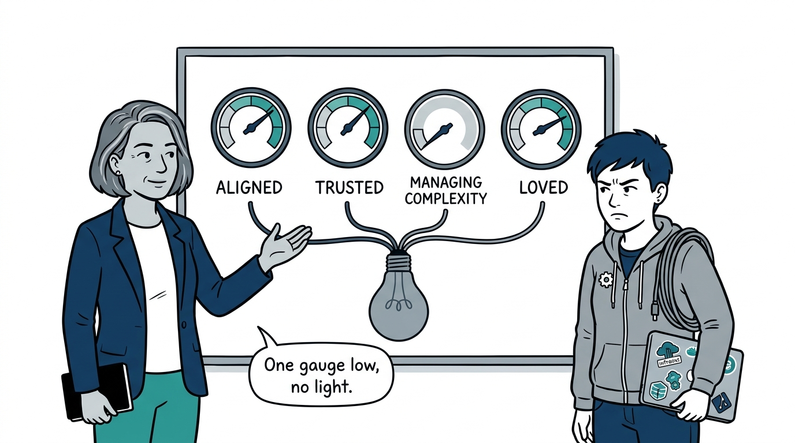
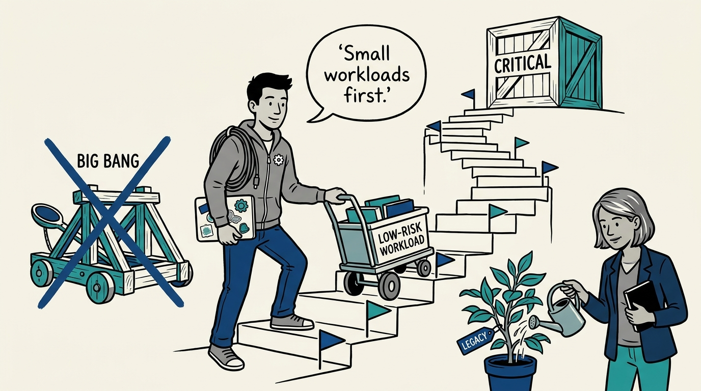
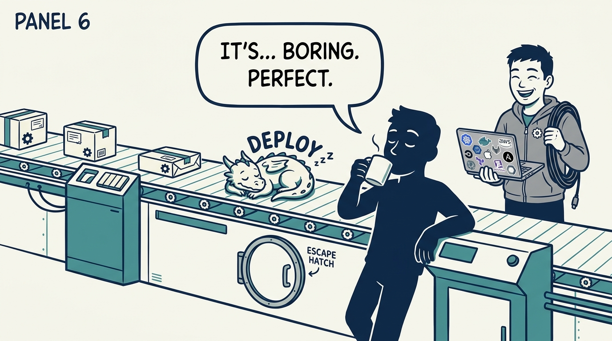
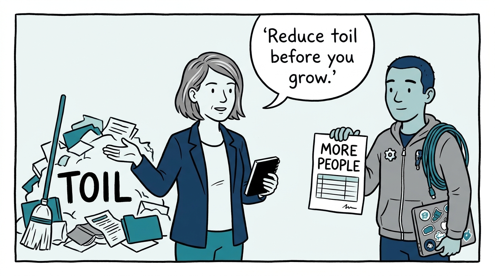
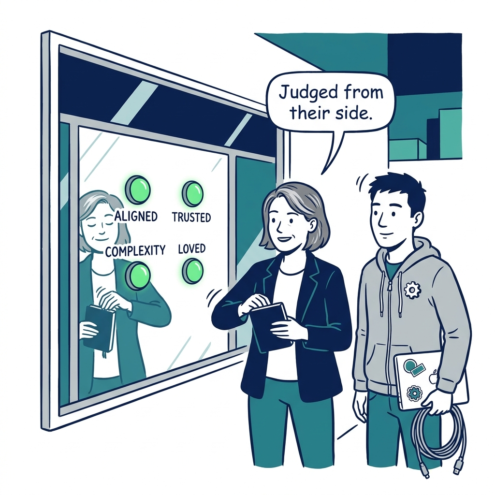

Why platform success is four questions answered at once — not an adoption dashboard — in eight panels.

<!-- comic-style
{
  "cast": "VERA: a calm, seasoned engineering executive, short gray-streaked hair, dark blazer over a plain t-shirt, carries a small black notebook. KAI: a hands-on platform engineering lead, short dark hair, gray zip-up hoodie with a small gear pin, laptop covered in infrastructure stickers under one arm, a coil of cable slung over the shoulder.",
  "style": "Clean two-tone explainer comic, thick ink outlines, flat colors with deep blue and teal accents on a light background, generous white space, hand-lettered speech bubbles with SHORT readable text, no photorealism."
}
-->

**Panel 1:** *The hook: adoption climbs when a migration is mandated, whatever users think — the dashboard proves nothing on its own.*

**Panel 2:** *The problem: roadmaps ship and surveys come back fine — while customers quietly build shadow platforms around you.*

**Panel 3:** *The wrong way: glue code goes down, meetings and escalations go up — the platform's dashboard improves while the organization's cost of change grows.*

**Panel 4:** *The principle: success has four dimensions — aligned, trusted, managing complexity, loved — and the test is conjunctive: one weak axis keeps the light off.*

**Panel 5:** *How it plays out, trust: earned in stages with incremental checkpoints and maintained legacy — never staked on a distant big bang.*

**Panel 6:** *How it plays out, loved: the platform makes difficult things feel boring — opinionated enough to be easy, pierceable enough to escape.*

**Panel 7:** *The cost: restraint — headcount is not the default answer; toil gets reduced first, and growth funds genuinely new areas, not poor abstractions.*

**Panel 8:** *The closer: four yeses, judged from the customer's side of the platform — that is what success looks like, whatever the dashboard says.*
