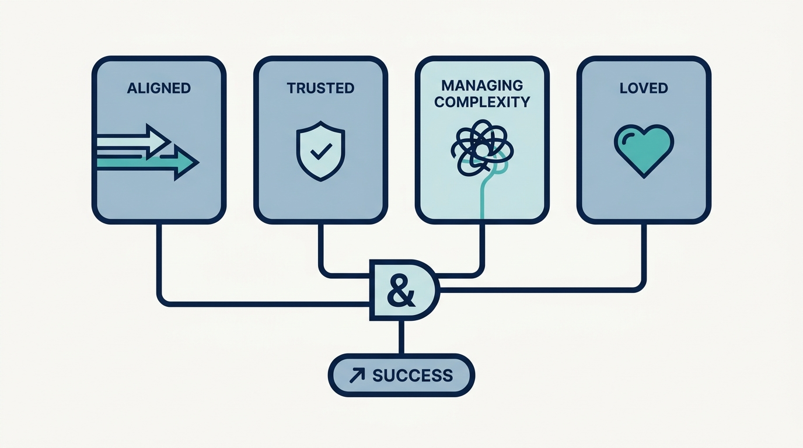
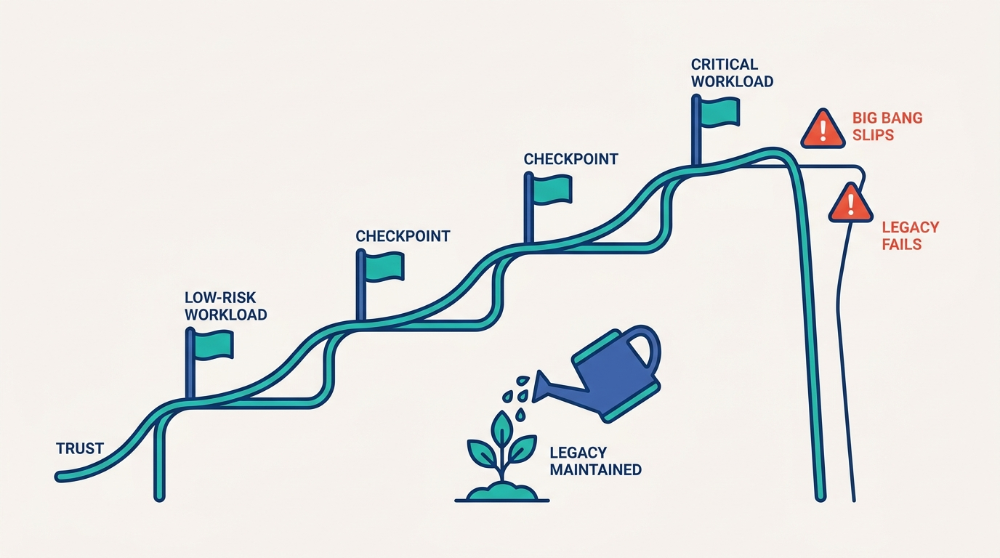
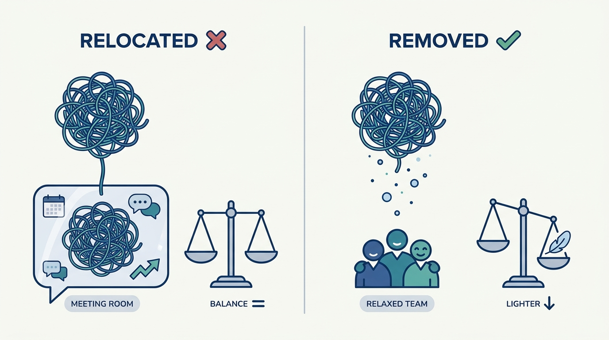

> **Status**: DRAFT
>
> **Principle**: I judge a platform organization on four dimensions at once, and none of them is adoption for adoption's sake. **Aligned**: platform teams work toward a shared purpose, a coordinated product strategy, and jointly planned priorities. **Trusted**: customers believe the platform can operate reliably, make sound long-term investments, and deliver when they need it. **Managing complexity**: the platform makes the organization's technology easier to operate and evolve, rather than relocating complexity from machines into human coordination. **Loved**: the platform makes users materially better at their jobs — ideally by making difficult things feel boring, reliable, and easy. A platform that cannot answer yes to all four is not succeeding, whatever its dashboard says.

## Statement

My success test for a platform organization has four dimensions.

**Figure 1:** *The four-dimensional test: aligned, trusted, managing complexity, loved — joined by an AND, not an OR.*

**Aligned** — the platforms pull in one direction:

- **Shared purpose, product mindset.** Teams tie their purpose to business and developer outcomes, provide curated abstractions rather than raw complexity, and serve a base broad enough to create leverage. Success is measured by customer outcomes and reduced pain.
- **Coordinated strategy.** Strategies are coordinated across teams, overlapping platforms are differentiated or deliberately consolidated, and no team competes for customers just to justify headcount.
- **Joint planning.** Major investments are planned together, dependencies made explicit, conflicts surfaced openly rather than approved-and-hoped, and teams can disagree and commit. Reorganization is a last resort, used only when the cost of misalignment clearly exceeds the disruption.

**Trusted** — customers believe the platform will hold:

- **Operationally**: reliability demonstrated at the customer's scale and risk level, operational excellence a measurable objective, adoption staged so confidence is earned before critical workloads move.
- **In major investments**: rearchitectures with explicit stakeholder buy-in, business outcomes in every proposal, incremental checkpoints instead of a distant big bang, and legacy systems maintained while replacements mature.
- **In delivery**: the platform is not a recurring bottleneck; repeated requests become self-service; customers can unblock themselves; capacity remains for the unplanned.
- **Architecturally**: composable, incrementally replaceable building blocks with escape hatches — never stability sacrificed to make the happy path look effortless.

**Managing complexity** — removed, not relocated:

- **Less glue, both kinds.** Application teams need progressively less custom glue code *and* less human glue — meetings, manual coordination, tribal knowledge, escalation.
- **Shadow platforms read as signals** of unmet need, learned from and sometimes absorbed — with a deliberate plan for the added complexity.
- **Controlled growth.** Headcount is not the default answer; toil is reduced before teams grow; growth funds genuinely new areas, not poor abstractions.
- **Product discovery** finds narrower abstractions that solve most customer problems, and platforms are rearchitected, consolidated, or sunset when complexity warrants it.

**Loved** — users are materially better at their jobs:

- **It just works.** Dependable enough that users rarely think about it; opinionated enough to make common cases easy; opinions **pierceable** through escape hatches.
- **Friction disappears.** The team hunts recurring friction and removes it, and understands why users love an existing system before replacing it.
- **Easy to embrace.** Users know it exists, understand what it solves, and migration is part of the product — not homework left to customers.
- **Metrics reflect reality.** Voluntary adoption distinguished from mandated adoption, surveys that discover rather than validate, quantitative metrics paired with qualitative feedback — improvements in users' ability to do their jobs, not vanity numbers.

## How to Read This

This journal is my platform operating model, one record per source checklist. This record is grounded in the "What Success Looks Like" chapter of Camille Fournier and Ian Nowland's *Platform Engineering: A Guide for Technical, Product, and People Leaders* (O'Reilly, 2024) — the chapter that defines success for a platform organization across alignment, trust, complexity management, and user value, distilled here into **the four-dimensional test I judge every platform by**. The runnable version — the full assessment across all four dimensions, the leadership check, and the overall success test — lives in the **Checklist** tab of this post.

## Rationale

**Success needs a definition because the default proxies all lie.** Adoption climbs when a migration is mandated, whatever users think. Roadmaps ship while customers quietly build shadow platforms. Surveys validate decisions already made when the questions are written that way. That is why this record insists on the distinction between voluntary and forced adoption, on representative survey populations, and on measuring **improvements in users' ability to do their jobs** rather than vanity metrics. Without a real definition of success, a platform organization optimizes its dashboard instead of its customers.

**Four dimensions, because each one fails independently.** An aligned organization can build a platform nobody trusts; a beloved platform can be a complexity bomb held together by heroics; a reliable platform can serve so narrow a base that it creates no leverage. The four questions — aligned, trusted, managing complexity, loved — are separate axes, and **the test is conjunctive**: weakness on any one eventually drags down the others. That is also why the record resists collapsing them into a single score.

**Trust is the slowest asset and the fastest liability.** It is earned in stages — less critical workloads first, capabilities demonstrated under realistic conditions before anyone is asked to depend on them — and spent in an instant when a big-bang migration slips or a neglected legacy system fails while its replacement is still a promise. The chapter's discipline of **incremental checkpoints and maintained legacy systems** exists because a platform that loses operational trust loses the argument for every future investment at the same time.

**Figure 2:** *Trust is earned in slow, staged steps — and lost off a cliff. The checkpoints and the maintained legacy system are what keep the curve climbing.*

**Relocated complexity is the failure mode that hides best.** A platform can genuinely reduce glue code while the coordination cost explodes — more meetings, more tribal knowledge, more escalations, more "human glue." From the platform team's dashboard this looks like success; from the customer's calendar it is the opposite. The honest question is whether the *organization's total* cost of operating and evolving its technology went down, which is why I weigh human glue as heavily as custom code, and why **a single pane of glass is no substitute for coherent underlying APIs**.

**Figure 3:** *The hidden failure mode: less glue code is only success if the organization's total complexity went down — not if the tangle moved into calendars and escalations.*

**Loved is a real requirement, not sentiment.** "Loved" has an engineering definition: the normal experience is boring, the primary workflow is hard to misuse, opinions are strong but pierceable, and migration tooling is part of the product. Users love platforms that **make difficult things feel boring** — and a team that cannot say why users love an existing system has no business deprecating it.

**Headcount growth is where platform success quietly dies.** The default answer to every platform problem is another team, and every team then justifies its existence — which is how organizations end up with overlapping platforms competing for the same internal customers. Success includes restraint: toil reduced before growth is requested, growth reserved for genuinely new areas, and existing features **periodically re-justified against their maintenance cost**.

## What This Means in Practice

| What this record says | What it does **not** say |
| --- | --- |
| Success is judged on four dimensions at once: aligned, trusted, managing complexity, loved. | A strong score on one dimension compensates for the others — the test is conjunctive. |
| Adoption is an input to product strategy. | Adoption is the definition of success — mandated migrations make it a vanity metric. |
| Trust is earned in stages, with less critical workloads first. | Customers should trust capabilities not yet demonstrated under realistic conditions. |
| The platform removes complexity from the organization as a whole. | Moving complexity from machines into meetings and tribal knowledge counts as removing it. |
| Platforms are opinionated, with pierceable opinions and escape hatches. | Every use case deserves support — simplifying the product surface beats supporting every variation. |
| Growth funds genuinely new areas after toil is reduced. | Headcount is the default answer to platform pain. |
| Migration and adoption are part of the product. | Migration is homework left to customers once the new thing ships. |

Concretely: every platform team in my organization can answer the four questions — aligned, trusted, managing complexity, loved — with evidence from the customer's side, not the team's dashboard. Reviews of platform investments ask for **business outcomes and incremental checkpoints**, surveys are designed to discover rather than confirm, and a request for headcount is expected to arrive **after** the toil-reduction work, not instead of it.

## Anti-Patterns

- **Adoption theater.** Reporting mandated-migration numbers as if they were customer enthusiasm — and discovering the difference only when the mandate lifts.
- **Platform Darwinism.** Overlapping platforms competing for the same internal customers to justify their headcount, while product managers are trapped inside engineering silos.
- **The big-bang bet.** A multi-year rearchitecture with no incremental checkpoints, sold on technology rather than business outcomes, while the legacy system it replaces rots from neglect.
- **Complexity relocation.** Glue code goes down, meetings and escalations go up — the platform's dashboard improves while the organization's total cost of change grows.
- **The single pane of glass.** A unifying UI presented as the fix for incoherent, undocumented, unstable underlying APIs.
- **Effortless-happy-path worship.** Sacrificing operational stability and future flexibility so the demo looks magical — until an edge case meets a wall with no escape hatch.
- **Deprecating what users love.** Replacing a "hacky" system without ever understanding the customer value that made people love it — then wondering why the elegant replacement fails.
- **Survey confirmation.** Questions designed to validate decisions already made, answered by an unrepresentative sliver, filed without action.
- **Headcount as first resort.** Growing the team to compensate indefinitely for poor abstractions instead of fixing them.

## Related Records

- [[four-pillars]] — the pillars define what a platform is; this record defines how I judge whether the platform organization built on them is succeeding.
- [[managing-stakeholders]] — the relationship work behind the trusted dimension; trust with stakeholders is earned there and measured here.
- [[platform-as-a-product]] — the product discipline whose discovery loop produces the narrower abstractions this record's complexity dimension demands.
- [[operating-platforms]] — the operational practice behind operational trust; reliability is demonstrated there, not claimed here.
- [[rearchitecting-platforms]] — the record for the moments when this test says a platform must be rearchitected, consolidated, or sunset.

## Scope and Revisiting

This record is `draft`. It applies to every platform organization I am accountable for, and it is the rubric I bring to platform reviews, investment decisions, and annual planning. I revisit it if the four dimensions stop discriminating — if every team scores well while customers still complain — if a platform passes the test yet loses its funding argument in a downturn, or if new practice (for example, AI-assisted development changing what "developer pain" means) shifts what any dimension should measure.

## Authoritative References

- Camille Fournier & Ian Nowland, *Platform Engineering: A Guide for Technical, Product, and People Leaders* (O'Reilly, 2024) — the "What Success Looks Like" chapter, whose checklist this record distills.
