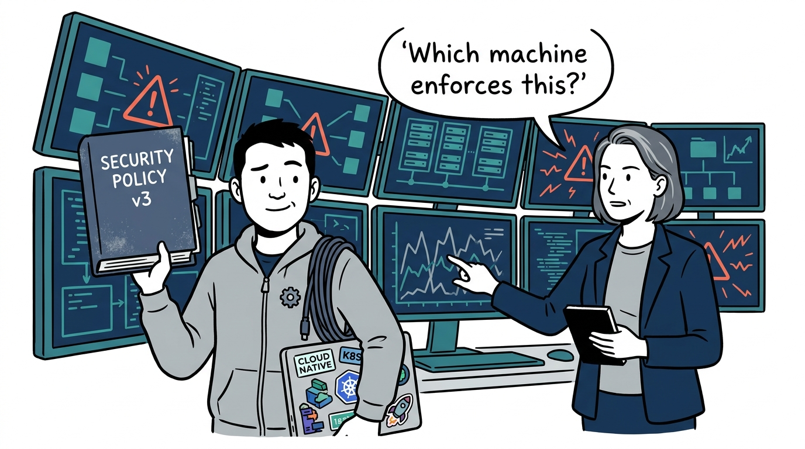
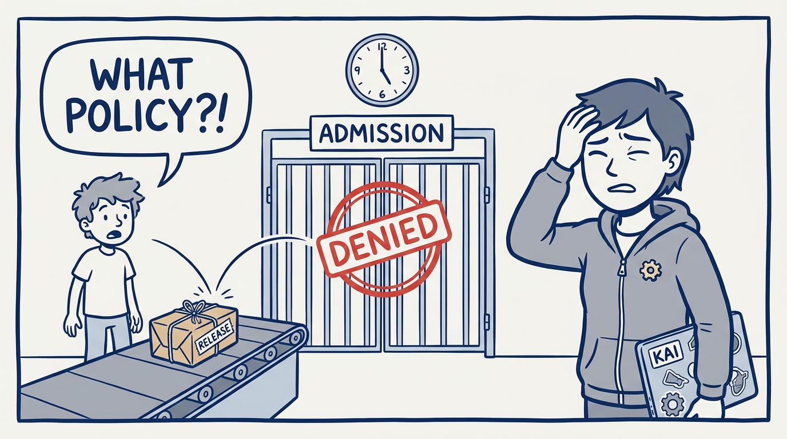
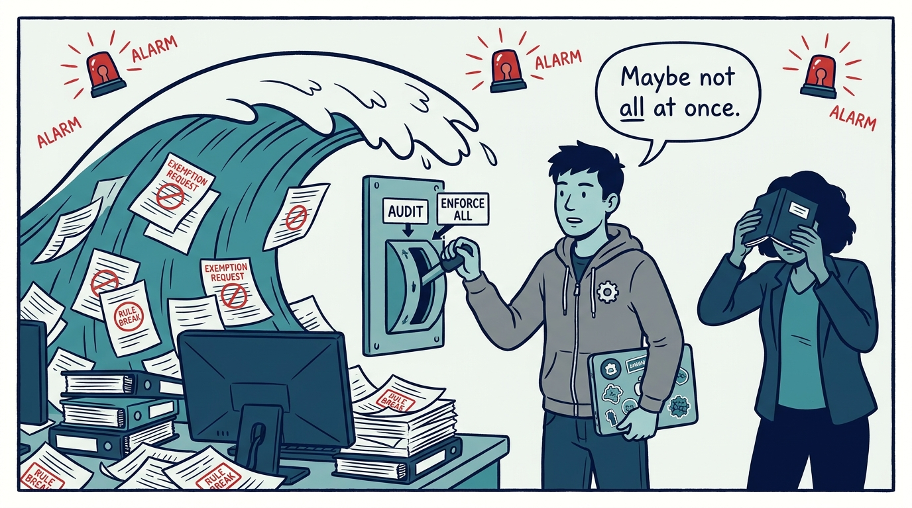
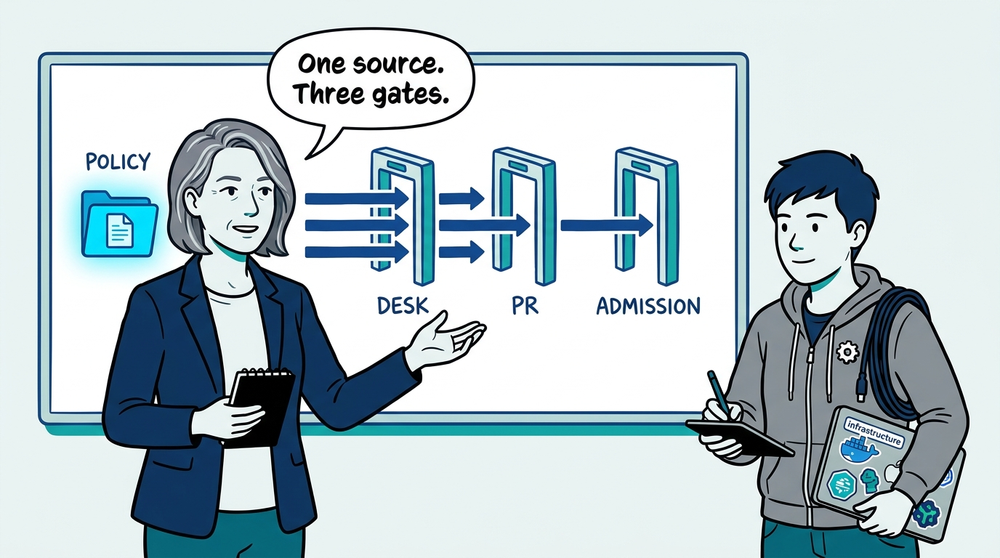
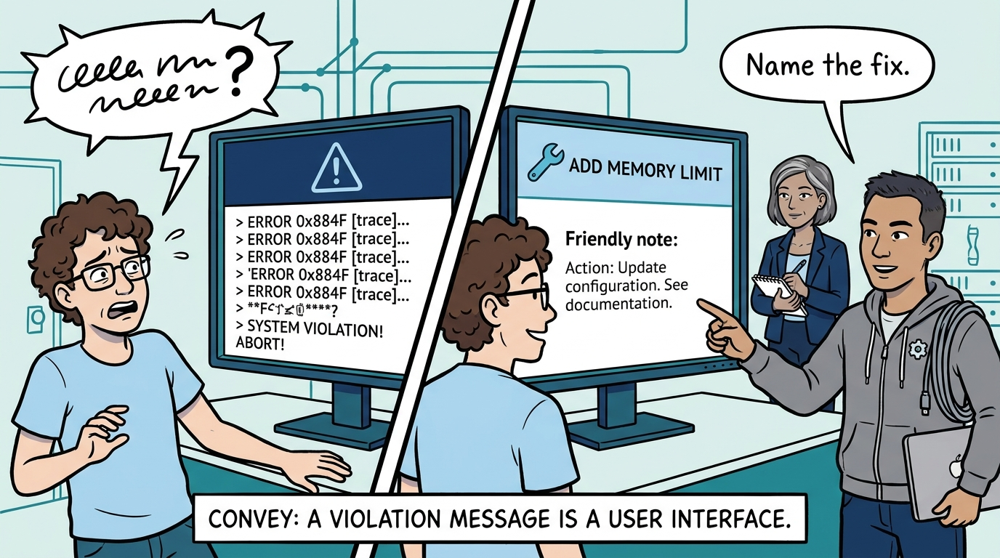
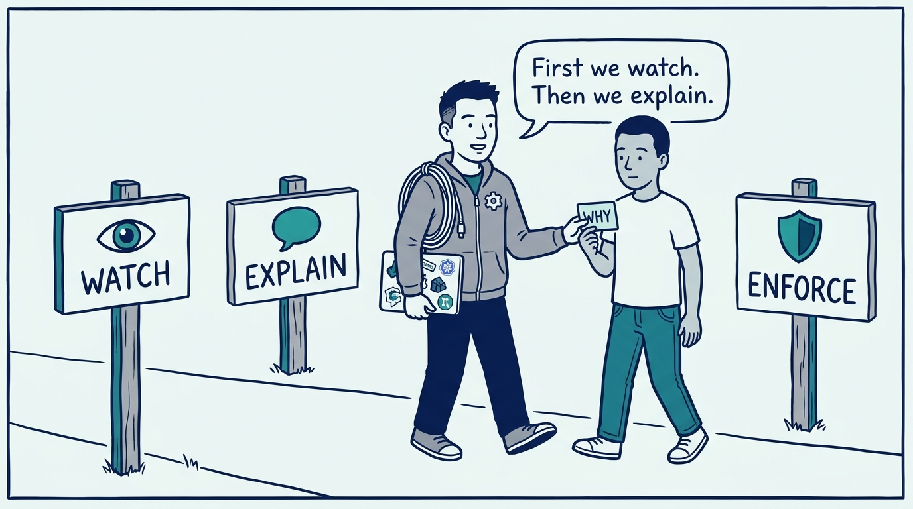
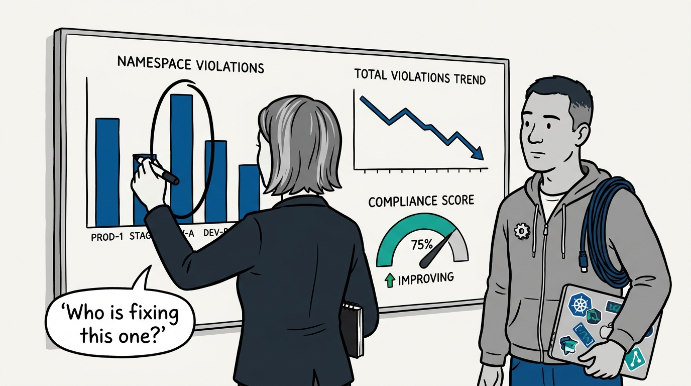
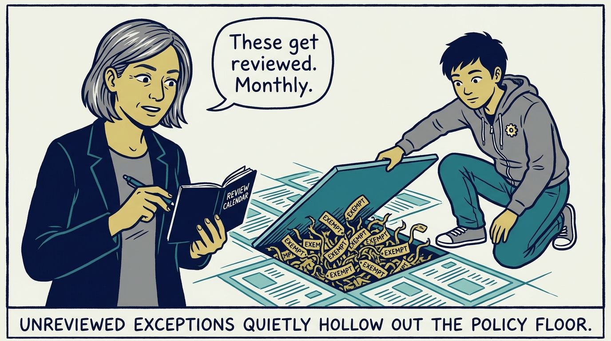
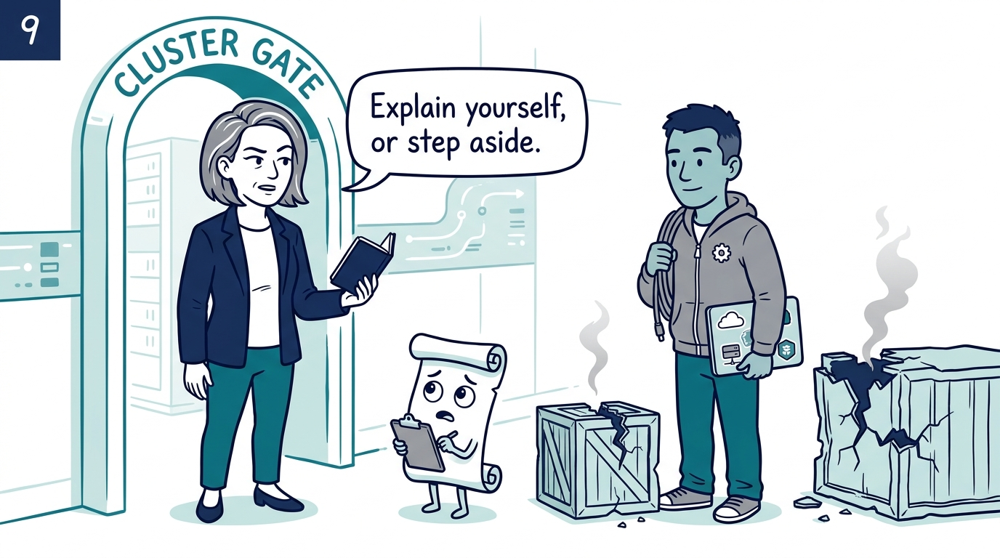

How policy becomes code — one source, three gates, and a message a developer can act on — in nine panels.

<!-- comic-style
{
  "cast": "VERA: a calm, seasoned engineering executive, short gray-streaked hair, dark blazer over a plain t-shirt, carries a small black notebook. KAI: a hands-on platform engineering lead, short dark hair, gray zip-up hoodie with a small gear pin, laptop covered in infrastructure stickers under one arm, a coil of cable slung over the shoulder.",
  "style": "Clean two-tone explainer comic, thick ink outlines, flat colors with deep blue and teal accents on a light background, generous white space, hand-lettered speech bubbles with SHORT readable text, no photorealism."
}
-->

**Panel 1:** *The hook: 'we have guardrails' — but a policy that lives in a document and a review meeting is a hope with a signature line.*

**Panel 2:** *The problem: when developers first meet a policy at admission, you built a tollbooth, not a guardrail — the most expensive place to learn.*

**Panel 3:** *The wrong way: the big-bang deny — every rule enforced on day one, and the organization learns that policy is an outage with a committee attached.*

**Panel 4:** *The principle: one policy source, evaluated at three gates — the desk in seconds, the PR in minutes, admission as the backstop that cannot be bypassed.*

**Panel 5:** *How it plays out: a violation message is a user interface — one sentence naming the fix is the difference between a guardrail and a grievance.*

**Panel 6:** *Enforcement is progressive: audit first, educate on the why, then enforce what genuinely matters — risk sets the pace, not the rollout plan.*

**Panel 7:** *Compliance you cannot see is compliance you do not have: continuous audit, violations by constraint and namespace, remediation tracked over time.*

**Panel 8:** *What it costs: exceptions granted once and never revisited become the unofficial paved path around policy — review them, or the floor turns decorative.*

**Panel 9:** *The closer: every enforced policy has a documented reason and a named owner — a policy that cannot explain itself does not get to block a deployment.*
