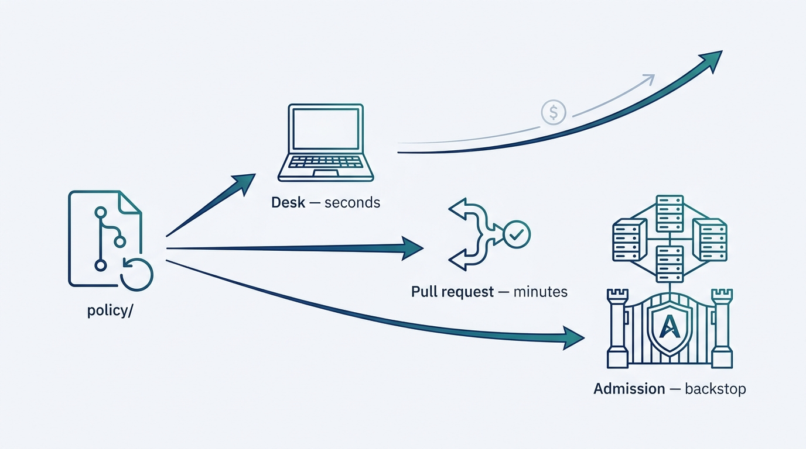
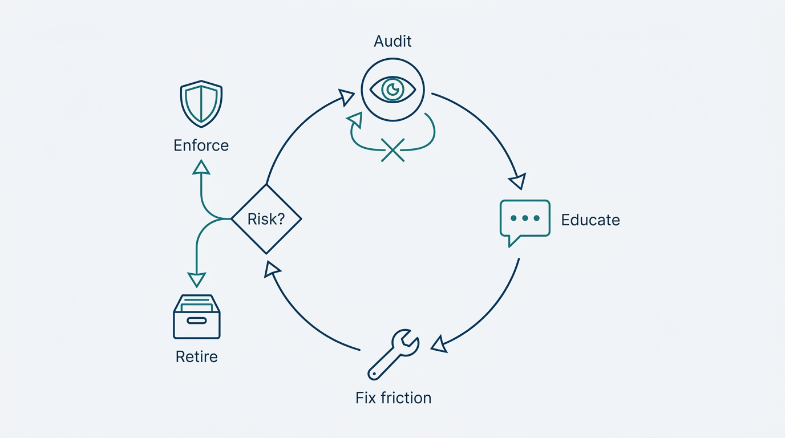
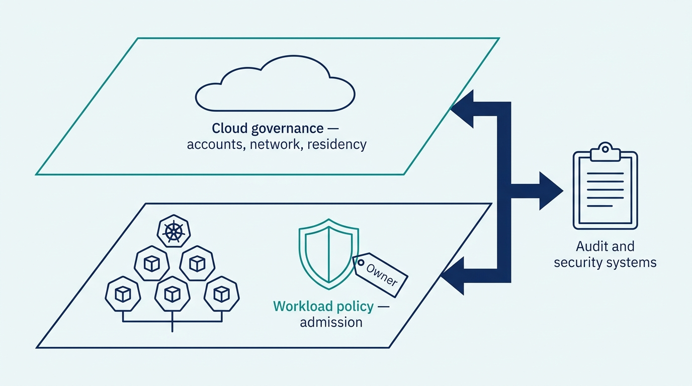

> **Status**: DRAFT
>
> **Principle**: In my organization, platform policy is **code** — versioned, tested, and held by machines, with **one policy source evaluated at three gates**: at the developer's desk before commit, in the pipeline on every pull request, and at cluster admission as the final backstop. The core floor is non-negotiable — resource requests and limits, no root, no privileged containers, no dangerous capabilities, images from approved registries — and **every violation explains itself** in language a developer can act on. Enforcement is **progressive**: policies start in audit mode, earn their place through education and feedback, and move to enforce when the risk is genuine. Compliance is visible on a dashboard, exceptions are reviewed instead of becoming permanent workarounds, and every enforced policy has a documented reason and a named owner. A policy that cannot explain itself does not get to block a deployment.

## Statement

When a platform team in my organization builds policy as code, the finished capability has this shape.

**One policy source, three gates:**

- **Policies are code.** Every rule lives as versioned policy code in a `policy/` directory — reviewed, tested, and released like any other platform software, never as a document enforced by meetings.
- **Gate one: the desk.** Developers run the same policies locally against their manifests and in pre-commit hooks, so violations surface in seconds, before anything is committed.
- **Gate two: the pull request.** A policy-validation job runs on every pull request, fails the pipeline when required policies are violated, and puts the violation feedback directly in the PR — not in a log a developer has to go digging for.
- **Gate three: admission.** A validating admission webhook is the backstop: critical violations are rejected at the cluster boundary, with system namespaces deliberately and explicitly excluded.
- **The same source at every gate.** All three gates evaluate the same policy code, so what the pipeline checks and what the cluster enforces can never drift apart.

**Figure 1:** *One policy source, three gates: the same policy code answers in seconds at the desk, in minutes at the pull request, and as the unbypassable backstop at admission.*

**A core policy floor:**

- **Resource discipline.** CPU and memory requests and limits are required for all containers.
- **Workload security.** Containers do not run as root, privileged containers are blocked, root filesystems are read-only where appropriate, and dangerous Linux capabilities such as `SYS_ADMIN` are blocked.
- **Supply-chain hygiene.** Container images come from approved registries only.
- **Messages a human can act on.** Every policy carries a clear, human-readable violation message that names the fix, not the rule's internals.

**Progressive enforcement:**

- **Audit before enforce.** New policies start in audit mode where appropriate; developers are told why each policy exists before it starts blocking them.
- **Feedback shapes the rules.** Exemption requests and developer feedback are reviewed; policies that create unnecessary friction get fixed, not defended.
- **Risk decides the pace.** Policies covering genuine security risks move to enforcement; lower-risk standards stay monitored until the data supports enforcing them.

**Compliance made visible:**

- **Continuous audit.** The policy engine audits what is already running, not only what is being admitted; metrics are collected by constraint and by namespace.
- **A compliance dashboard.** Total violations, violations by constraint, violations by namespace, compliance rate, and remediation progress over time — accessible to the stakeholders who need it.
- **Surfaced where developers look.** Optionally, violation counts, audit recency, and policy status appear in the developer portal, with a service-level compliance scorecard.

**Policy in the wider governance map:**

- **The right layer for each rule.** Kubernetes-level policies are enforced in the cluster; policies better handled by cloud-provider governance tools live there instead — with portability watched where lock-in matters.
- **Compliance data flows outward.** Where audit or security systems require it, compliance data is exported to them.
- **Named ownership.** Policy creation, review, and remediation each have a named owner; the reason behind every enforced policy is documented and communicated.

## How to Read This

This record is part of the **Reference Implementation** section of this journal — the how-it-concretely-looks companion to the conceptual records. It is grounded in the Policy-as-Code Implementation chapter of the *Platform Engineer's Handbook*, which builds this capability end to end on a concrete stack. That stack is the worked example, not the mandate: the commitments above hold whatever engine a team picks. The full working checklist — install, policies, constraints, shift-left, CI/CD, monitoring, dashboard, governance, demo exercise — lives in the **Checklist** tab; the **TL;DR** tab carries the management summary and the **Conversation** tab the podcast-style discussion.

**Reference stack** (the PEH worked example):

| Role | Reference tool | The property that matters |
| --- | --- | --- |
| Admission control and audit | OPA Gatekeeper | Policies evaluated in-cluster at admission; continuous audit of what is already running |
| Policy language | Rego (ConstraintTemplates + Constraints) | One policy source, parameterized and scoped per resource type |
| Shift-left testing | Conftest | The same policies run on a laptop against manifests, before any commit |
| Pre-commit and PR gates | pre-commit hooks + CI policy job | Violations fail the pipeline and appear directly in pull-request feedback |
| Compliance metrics | Prometheus (+ exporter where needed) | Violations by constraint and namespace as time series, production-grade collection |
| Compliance visibility | Grafana | Dashboard: totals, by constraint, by namespace, compliance rate, remediation trend |
| Developer portal (optional) | Backstage | Violation count, audit recency, policy status, and a service-level scorecard where developers already look |

## Rationale

**Guardrails are only real when machines hold them.** [[four-pillars]] demands guardrails with safe defaults as part of serving a broad developer base; this record is that demand made executable. A policy that lives in a document and a review meeting is not a guardrail — it is a hope with a signature line. Policy as code is what turns the standard into something that holds at three in the morning, on the hundredth deployment, for the team that never read the wiki.

**Three gates, because the cost of feedback rises at every stage.** A violation caught at the desk costs seconds; caught in the pull request, minutes; caught at admission, a broken deployment and an interrupted afternoon. The admission webhook must exist — it is the only gate that cannot be bypassed — but it is the backstop, not the interface. A platform whose developers first learn about a policy when the cluster rejects their release has built a tollbooth, not a guardrail. And the three gates must evaluate the **same policy source**: the moment CI checks one rule set and the cluster enforces another, developers get pipelines that pass and deployments that bounce, and trust in both gates dies together.

**A violation message is a user interface.** The difference between a guardrail and an obstacle is usually one sentence: the one that tells the developer what to change. `Container web-app has no memory limit; add resources.limits.memory` teaches; a raw policy-engine trace punishes. The source checklist makes human-readable messages a core-policy requirement, and the final validation makes understandable remediation feedback a condition of being done — I hold the build to both.

**Progressive enforcement is what keeps policy from becoming the enemy.** Switching every rule to enforce on day one breaks running teams, floods the platform team with exemption requests, and teaches the organization that policy is something to route around. Audit mode first gives the team data — which workloads would fail, how loudly — and gives developers the why before the wall. Then risk sets the pace: genuine security exposures move to enforcement; style-level standards wait until the audit data and the education have done their work. The discipline cuts both ways, though — audit mode is a phase, not a destination, and every audit-mode policy carries an implicit decision date: enforce it, or retire it.

**Figure 2:** *Progressive enforcement as a lifecycle: audit collects the data, education carries the why, feedback fixes friction — and every policy exits the loop to enforce or retire.*

**Compliance you cannot see is compliance you do not have.** Admission control tells you what was stopped; only continuous audit tells you what is already running in violation — the workloads deployed before the policy existed. That is why the build includes scraping the policy engine's metrics, breaking violations down by constraint and by namespace, and a dashboard that tracks remediation over time and is readable by the stakeholders who answer for compliance. The same visibility is what makes exceptions governable: an exemption on a dashboard gets reviewed; an exemption in a YAML annotation becomes permanent by default.

**The cluster is one layer of governance, not the whole map.** An admission controller is the right home for workload-level policy; it is the wrong hammer for account-level, network-perimeter, or data-residency rules that cloud-provider governance tools handle natively. The build therefore includes an explicit decision about which policies live where, an eye on lock-in where portability matters, export paths into audit and security systems, and — least glamorous, most important — named ownership for policy creation, review, and remediation. A rule nobody owns is a rule nobody can change, explain, or safely delete.

**Figure 3:** *The right layer for each rule: workload policy in the cluster, account- and perimeter-level rules in cloud governance, compliance data exported outward — and a named owner on every rule.*

## What This Means in Practice

| What this record says | What it does **not** say |
| --- | --- |
| Policy is code, enforced by machines at three gates. | Every rule blocks immediately — new policies start in audit mode where appropriate. |
| A core security floor is enforced at admission. | Every convention becomes a hard deny — lower-risk standards are monitored before they are enforced. |
| The same policy runs at the desk, in the PR, and at admission. | Developers need a cluster to find out whether they comply — the desk gate answers in seconds. |
| Exceptions are reviewed. | Exceptions never happen — system-namespace exclusions are explicit and deliberate. |
| Compliance is visible on a dashboard, tracked over time. | The dashboard replaces enforcement — visibility complements the gates, it does not substitute for them. |
| The cluster enforces Kubernetes-level policy. | Everything belongs in the cluster — some policies are better handled by cloud-provider governance tools. |
| Every enforced policy has a documented reason and a named owner. | Policy count is a success metric — a rule that only creates friction gets fixed or retired. |

Concretely: a platform team building this capability is **done** when the source's final validation holds — non-compliant resources are detected before production, critical violations are blocked at admission, developers receive understandable remediation feedback, compliance posture is visible on dashboards, enforcement is progressive rather than indiscriminate, exceptions are reviewed instead of becoming permanent workarounds, and the reason behind every enforced policy is documented and communicated. The proof is operational, not on paper: a deliberately non-compliant workload is rejected with a message its author can act on.

## Anti-Patterns

- **The compliance PDF.** Policies living in documents and review boards — complexity relocated and annotated, never enforced. If no machine holds the rule, there is no rule.
- **The big-bang deny.** Flipping every policy to enforce on day one. Deployments break, exemption requests flood in, and the organization learns that policy is an outage with a committee attached.
- **The cryptic rejection.** Admission denials that quote the policy engine's internals instead of naming the fix. Every rejection without remediation guidance converts a guardrail into a grievance.
- **The last-gate discovery.** Policies that exist only at admission, so developers first meet them when a release bounces. The backstop became the interface; the desk and PR gates were never built.
- **The split brain.** CI validates one rule set while the cluster enforces another. Green pipelines, red deployments, and no gate anyone trusts.
- **The permanent exemption.** Exceptions granted once and never revisited — the unofficial paved path around policy, growing quietly until the floor is decorative.
- **The eternal audit.** Policies parked in audit mode indefinitely, feeding a dashboard of violations nobody remediates. Audit is a phase with an exit decision, not a parking lot.
- **The Kubernetes hammer.** Forcing account-level and provider-level governance through the admission controller because that is where the tooling lives — the right engine at the wrong layer.
- **The orphan policy.** Rules with no named owner for creation, review, or remediation — impossible to change, explain, or safely delete, and therefore obeyed resentfully or ignored entirely.

## Related Records

- [[four-pillars]] — guardrails with safe defaults are part of pillar 3; this record is that guardrail bar made executable.
- [[platform-security]] — the end-to-end security build this policy engine enforces workload standards for; identity, network, secrets, and supply chain live there.
- [[platform-creation]] — the cluster, GitOps, and mesh baseline these policies protect; that record's pipeline-level provisioning checks are the sibling of the admission-time enforcement here.
- [[cicd-as-a-platform-service]] — the pipeline architecture the policy-validation gate rides in.
- [[observability-implementation]] — the metrics and dashboard stack the compliance panels extend.
- [[self-service-onboarding]] — the developer portal where per-service policy status and the compliance scorecard surface.
- [[operating-platforms]] — the operating discipline that compliance reporting and exception review feed into.

## Scope and Revisiting

This record is `draft`. It applies to every Kubernetes-based platform build in my organization where the platform team enforces workload policy — whatever policy engine they choose. I revisit it if the exemption list grows without a review cadence (the permanent-exemption pattern surfacing), if violations are predominantly discovered at admission rather than at the desk or in the PR (the shift-left gates failing), if audit-mode policies persist for quarters without an enforce-or-retire decision, or if the compliance dashboard shows the same violations recurring without remediation — which means visibility exists but the loop back into enforcement and education is broken.

## Authoritative References

- *Platform Engineer's Handbook* — the Policy-as-Code Implementation chapter, whose checklist this record distills: OPA Gatekeeper setup, core policies, progressive enforcement, Conftest shift-left testing, CI/CD integration, compliance monitoring and dashboards, and governance integration.
- Open Policy Agent / Gatekeeper documentation — the reference implementation's admission-control and audit machinery.
