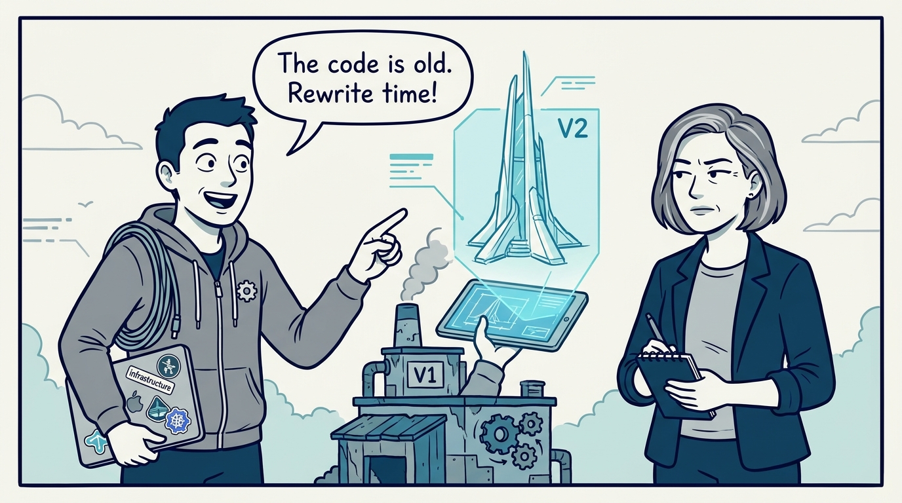
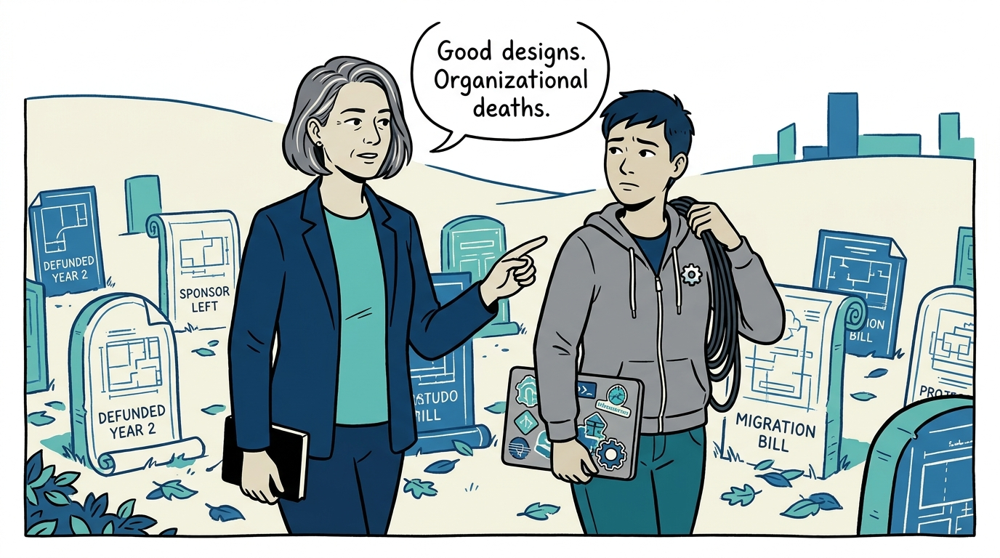
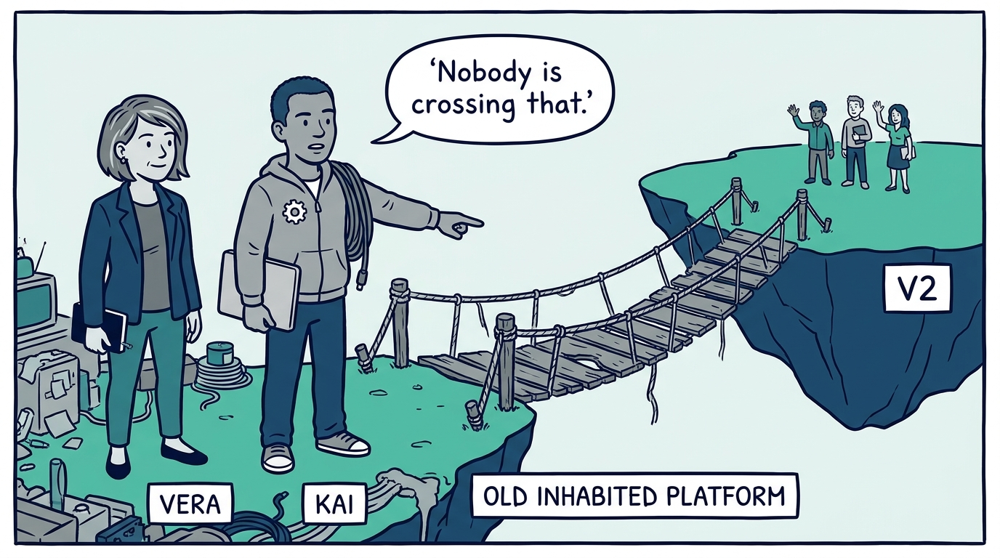
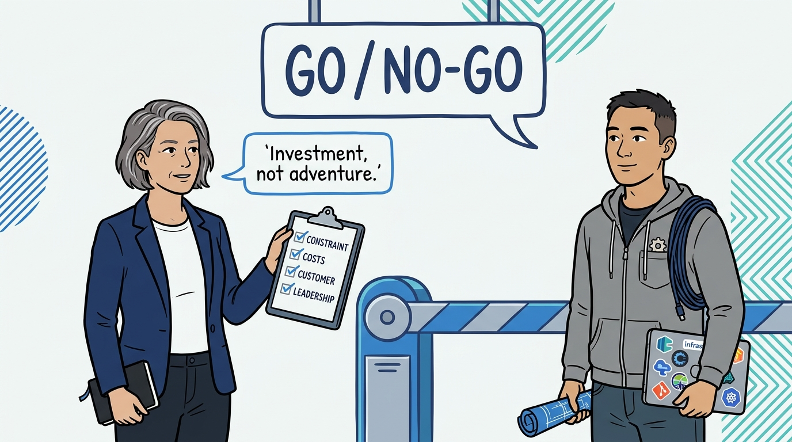
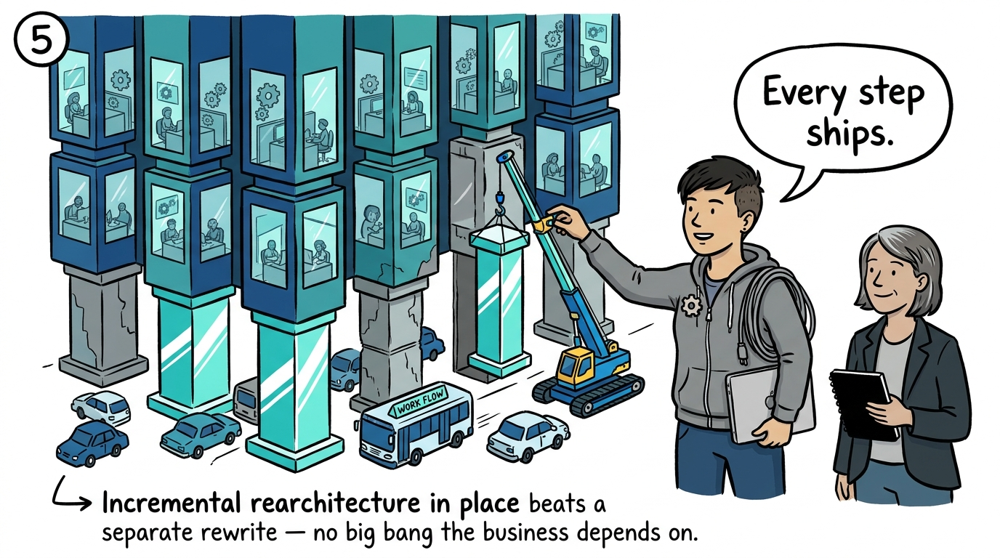
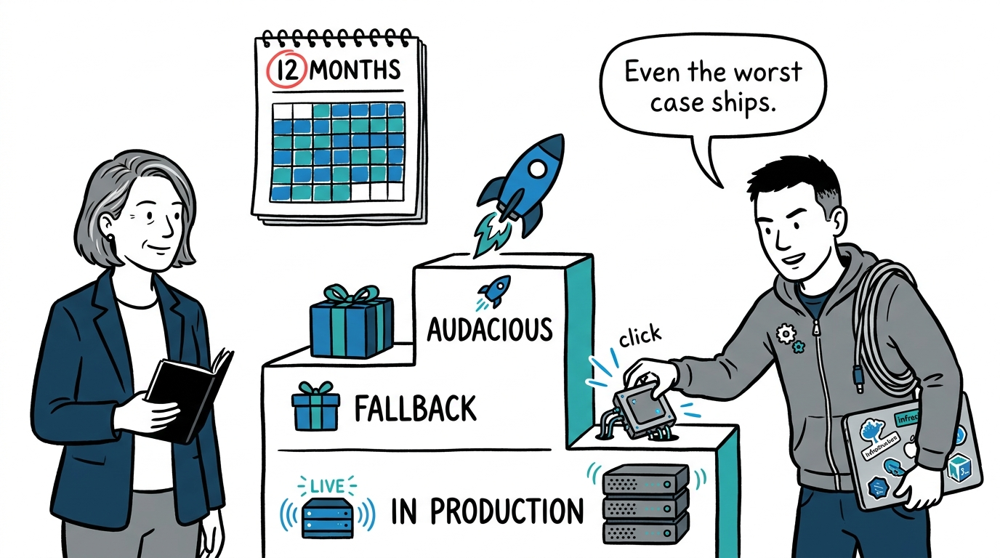
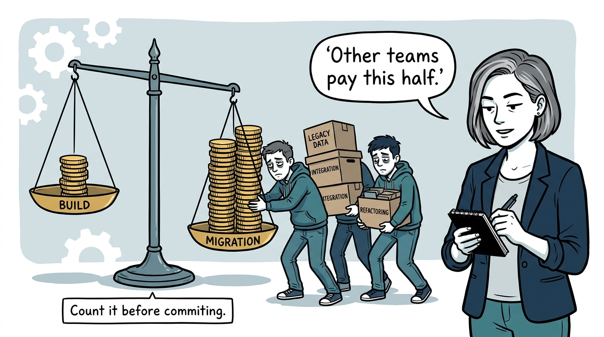
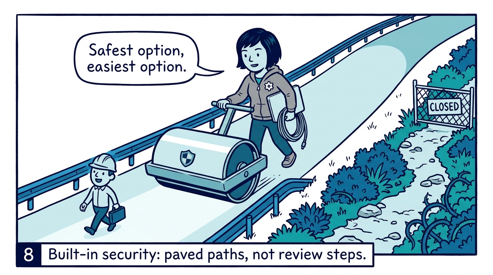
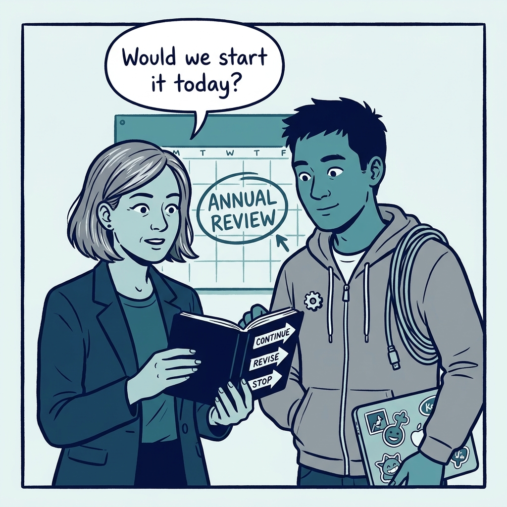

Why a platform rearchitecture is a business investment, not a technical adventure — in nine panels.

<!-- comic-style
{
  "cast": "VERA: a calm, seasoned engineering executive, short gray-streaked hair, dark blazer over a plain t-shirt, carries a small black notebook. KAI: a hands-on platform engineering lead, short dark hair, gray zip-up hoodie with a small gear pin, laptop covered in infrastructure stickers under one arm, a coil of cable slung over the shoulder.",
  "style": "Clean two-tone explainer comic, thick ink outlines, flat colors with deep blue and teal accents on a light background, generous white space, hand-lettered speech bubbles with SHORT readable text, no photorealism."
}
-->

**Panel 1:** *The hook: the rewrite urge — but age is not a constraint, and a rearchitecture is not a technical adventure.*

**Panel 2:** *The problem: the graveyard of platform rewrites is full of good designs that lost their funding, their sponsors, or their customers.*

**Panel 3:** *The wrong way: the v2 island and the big bang — years of building with nothing in production, then a migration cliff nobody climbs.*

**Panel 4:** *The principle: gate it like a business investment — real constraint, honest costs, a committed customer, and leadership that will protect the work.*

**Panel 5:** *How it plays out: incremental over 'v2' — rebuild in place, every step tested against real load, no big bang to land.*

**Panel 6:** *How it plays out: twelve-month wins with three levels of success — audacious goal, valuable fallback, production proof. The effort cannot have a zero year.*

**Panel 7:** *How it plays out: honest migration accounting — the larger half of the cost is paid by other people, so it is counted before commitment.*

**Panel 8:** *How it plays out: security by design and by default — protections that depend on structure, not on human behavior, and paved paths where the safest option is the easiest.*

**Panel 9:** *The closer: once a year, in writing — would we still start this knowing what we now know? Stop, revise, or delay without shame.*
