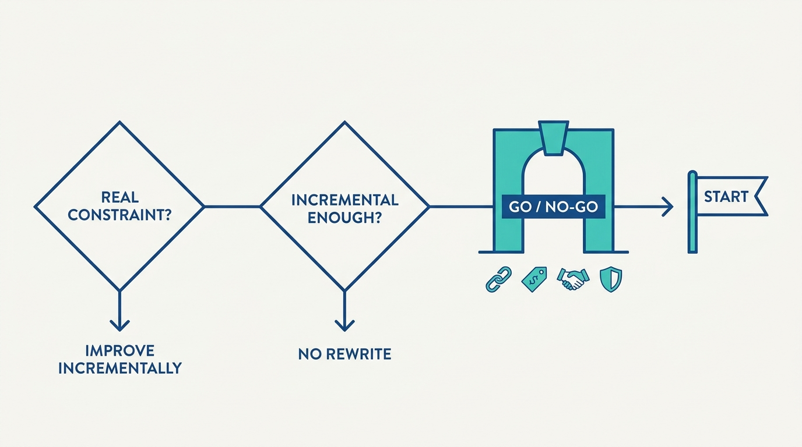
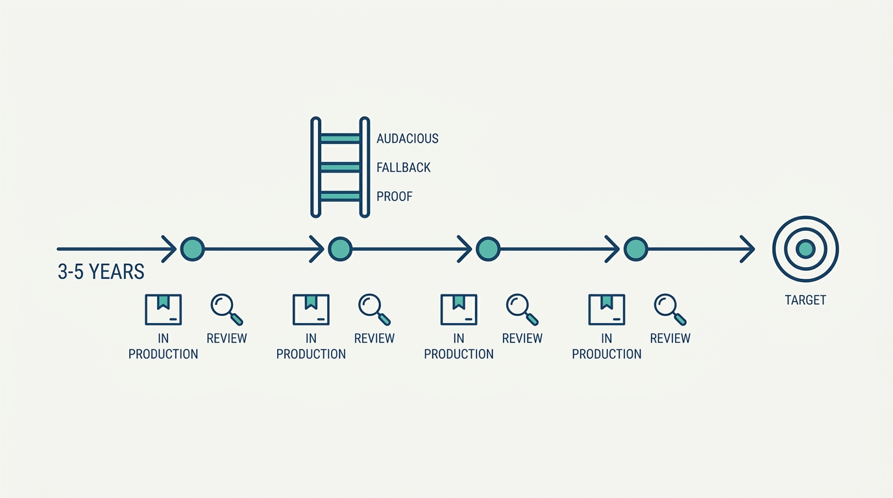
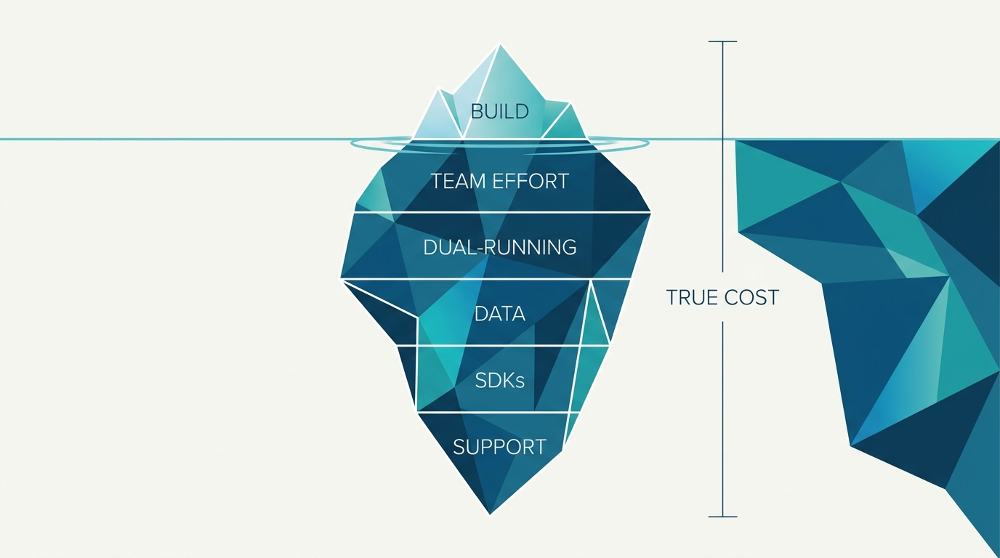

> **Status**: DRAFT
>
> **Principle**: A platform rearchitecture is a business investment, not a technical adventure, and I gate it like one. It starts only when the current architecture genuinely constrains feature delivery, reliability, security, or efficiency — and incremental rearchitecture is preferred over a separate "v2" unless there is a compelling reason otherwise. The target is set on a 3–5-year horizon, but the work must earn its funding continuously: every major phase delivers at least one valuable capability into production within 12 months, serving real load for a real customer. Migration costs are counted honestly before commitment, security is built in by design and by default, leadership commits to protecting the effort through reorganizations and changing priorities — and when the evidence stops supporting the architecture hypothesis, the work is stopped, revised, or delayed without shame.

## Statement

My operating model for rearchitecting platforms has four gates: a genuine constraint, a full go/no-go review before the work starts, a valuable production deliverable every 12 months, and an annual review with a stop option.

Before the work starts:

- **A genuine constraint, not an aesthetic itch.** The current architecture must be demonstrably limiting feature delivery, reliability, security, or efficiency — and beyond what incremental improvement can fix.
- **Incremental over "v2".** Rearchitect the platform in place unless there is a compelling reason to build a separate system; never combine a new-product bet with a major redesign if it can be avoided.
- **Maturity and mindset matched.** Know whether the platform is scrappy, scalable, or robust, and whether the moment calls for pioneers (rapid discovery), settlers (operationalizing), or town planners (long-term robustness) — and staff accordingly.
- **A full go/no-go review.** Constraint confirmed, migration costs understood, a credible 3–5-year direction, a meaningful 12-month deliverable, at least one committed customer partner, and leadership prepared to fund and protect the effort.

**Figure 1:** *The decision path: most rewrite urges exit early — only a genuine constraint that incremental work cannot fix reaches the go/no-go gate.*

How the target is set:

- **A 3–5-year horizon, ambitiously.** Think about the desired end state before filtering for feasibility, with substantial improvements defined across features, efficiency, reliability, and security.
- **Simplification as a goal.** Absorb overlapping and shadow platforms where possible; replace in-house components that duplicate mature open-source or vendor solutions — and evaluate any major external bet for ecosystem trajectory and 5–10-year viability, never for fashion.
- **Security by design and by default.** Security is a core platform capability: protections that do not depend on human behavior, hazards eliminated or reduced architecturally, and paved paths that make the safest option the easiest option.

How the work stays honest:

- **Twelve-month wins, three levels of success.** Every major phase carries an audacious goal, a valuable fallback, and a production proof — components of the new architecture serving real load. If no incremental production value is deliverable within 12 months, the architecture itself is reassessed.
- **Guardrails on the transition.** Backward compatibility by default, breaking changes run as major-version migrations, strong testing that does not lean on "we can roll back quickly," stable lower environments, and gradual canary-style rollouts.
- **Honest migration accounting.** Every user group that must move, the effort required from their teams, the cost of running old and new simultaneously, data migration, SDK and tooling changes, and support work — confirmed to be smaller than the expected business value.
- **Annual review with a stop option.** Goals reassessed yearly, real improvements measured, old architecture retired as customers migrate — and the work stopped, revised, or delayed when evidence no longer supports the hypothesis.

## How to Read This

This journal is my platform operating model, one record per source checklist. This record is grounded in the "Rearchitecting Platforms" chapter of Camille Fournier and Ian Nowland's *Platform Engineering: A Guide for Technical, Product, and People Leaders* (O'Reilly, 2024) — the chapter on when and how to rebuild the foundations of a platform that is already carrying load, distilled here into **the investment gates I hold every rearchitecture to**. The runnable version — the go/no-go review, the architecture-goal worksheets, the guardrails, and the annual review — lives in the **Checklist** tab of this post.

## Rationale

**Rearchitectures fail organizationally more often than technically.** The graveyard of platform rewrites is not full of bad designs; it is full of good designs that lost their funding in year two, their sponsors in a reorganization, or their customers to an uncounted migration bill. That is why the gates in this record are mostly not technical: committed leadership, a committed customer partner, honest costs, and **a plan that survives the people who approved it changing jobs**.

**The 12-month win is the survival mechanism, not a nice-to-have.** A multi-year rearchitecture that goes dark is a standing invitation to be cancelled — and deserves to be, because it is also epistemically dark: nothing in production means nothing has been learned about whether the new architecture actually works. The three levels of success — audacious goal, valuable fallback, production proof — mean the effort **cannot have a zero year**. Even the worst case leaves new components carrying real load, which is both political capital and engineering evidence.

**Figure 2:** *The delivery rhythm: a 3–5-year target that earns its funding every 12 months — a production deliverable and a review at every yearly checkpoint.*

**Migration is usually the largest cost, and it is paid by other people.** The platform team builds the new system; the consumer teams pay the migration tax — engineering effort, retraining, dual-running, data movement. A rearchitecture costed only by the building team's headcount is **missing the larger half of the bill**, and the error lands on the teams least consulted. Counting migration honestly before commitment is what separates an investment case from a pitch.

**Figure 3:** *The true cost: the build effort is the visible tip — the larger half is migration, paid by consumer teams, and it is counted before commitment.*

**Incremental rearchitecture beats the seductive "v2".** The separate-system rewrite promises freedom from legacy constraints and delivers two platforms to operate, a migration cliff nobody climbs, and a team split between the past and the future. Rebuilding in place is less glamorous and more survivable: every step ships, every step is testable against real load, and **there is never a moment where the business depends on a big bang landing**.

**Security is an architecture property, not a review step.** A rearchitecture is the rare moment when security can be moved from human vigilance into structure: hazards eliminated rather than documented, protections that do not depend on anyone remembering anything, and paved paths where **the safest option is the easiest option**. Bolting security review onto a finished design forfeits exactly the leverage the rewrite existed to create.

**The people who know why the old system is shaped that way are the asset, not the obstacle.** Handing the rewrite to enthusiastic new hires — unburdened by history and unaware of the constraints that history encodes — is how organizations pay twice for the same lessons. New hires challenge assumptions; long-tenured engineers carry the context; **ownership transfers only after the relationship between them is built**. The same discipline applies to pioneer teams: they may run ahead of the platform, but with an explicit integration path, so the experiment never hardens into a permanent shadow platform.

## What This Means in Practice

| What this record says | What it does **not** say |
| --- | --- |
| Rearchitect when the architecture genuinely constrains the business. | Rearchitect when the code is old, unfashionable, or unloved — age is not a constraint. |
| Prefer incremental rearchitecture over a separate "v2". | Never build anew — a compelling reason can justify it, but it must be argued, not assumed. |
| Plan on a 3–5-year horizon, ambitiously. | Wait 3–5 years for value — every 12 months puts something real into production. |
| Count migration costs, including consumer teams' effort, before committing. | The platform team's estimate is the cost — the larger half is usually paid elsewhere. |
| Secure leadership commitment that survives reorgs and changing priorities — and be willing to wait if the case is not yet strong. | Approval in one budget meeting is commitment — protection is the test. |
| Build security in by design and by default, via paved paths. | Add a security review at the end — by then the architectural leverage is spent. |
| Stop, revise, or delay when evidence no longer supports the hypothesis. | Sunk cost is a reason to continue — the annual review exists to ask the question. |

Concretely: no rearchitecture starts here without a written go/no-go review I can point to; every active rearchitecture can name its current-year audacious goal, fallback, and production proof — and which customer team is running on the new components today; every migration plan shows the consumer-side cost next to the platform-side cost; and once a year we ask, in writing, **whether we would still start this project knowing what we now know**.

## Anti-Patterns

- **The resume-driven rewrite.** A rearchitecture justified by technology fashion — the new stack everyone is hiring for — rather than a constraint anyone can name. The 5–10-year viability test exists precisely for this.
- **The big bang.** Years of building with nothing in production, followed by a single heroic cutover. No production proof means no evidence, no political capital, and no survivable fallback.
- **The uncounted migration.** A business case built on the platform team's effort alone, discovered to be half the true cost when consumer teams present their bill — after commitment.
- **The v2 island.** A separate greenfield system that never absorbs the old one: two platforms to operate, a migration cliff nobody climbs, and a team split against itself.
- **The shadow platform.** A pioneer experiment that quietly becomes permanent infrastructure — no integration path, no operational ownership, duplicating the platform it was meant to feed.
- **The new-hire rewrite.** Handing architectural ownership to newcomers before they understand the customers, constraints, and history the current system encodes — and losing the engineers who do.
- **The unprotected investment.** Starting on enthusiasm without leadership commitment that survives reorganizations — so the first budget squeeze orphans the work mid-migration, leaving the worst of both worlds.
- **The zombie project.** A rearchitecture whose original hypothesis has been contradicted by evidence, kept alive by sunk cost and the awkwardness of stopping.

## Related Records

- [[planning-and-delivery]] — the general planning and milestone discipline this record builds on; a rearchitecture is a long project with extra gates, not an exemption from planning.
- [[four-pillars]] — the definition of the platform being rebuilt; the rearchitecture must strengthen the pillars, not trade them away for novelty.
- [[operating-platforms]] — the operational bar the new architecture must meet from its first production tranche; rollout guardrails here exist to protect that bar.
- [[building-platform-teams]] — the staffing side of this record in full: the mix of tenure and fresh perspective a rearchitecture depends on.
- [[managing-stakeholders]] — how leadership commitment and consumer-team participation are actually won and kept through a multi-year effort.

## Scope and Revisiting

This record is `draft`. It governs every major architectural rebuild of a platform where I am the accountable executive — anything with a multi-year horizon, a migration obligation on consumer teams, or a request for protected funding. I revisit it if a gated rearchitecture fails anyway (the signal that the gates test the wrong things), if the 12-month-win rule starts producing theater deliverables that demonstrate nothing about the architecture, or if teams begin routing around the go/no-go review by labeling rewrites as incremental improvements.

## Authoritative References

- Camille Fournier and Ian Nowland, *Platform Engineering: A Guide for Technical, Product, and People Leaders* (O'Reilly, 2024) — the "Rearchitecting Platforms" chapter, whose checklist this record distills.
