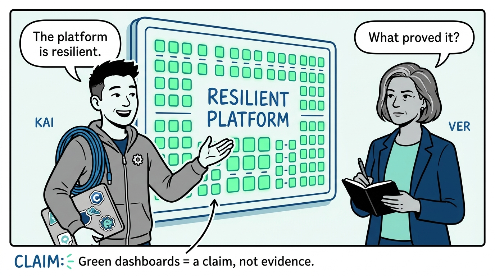
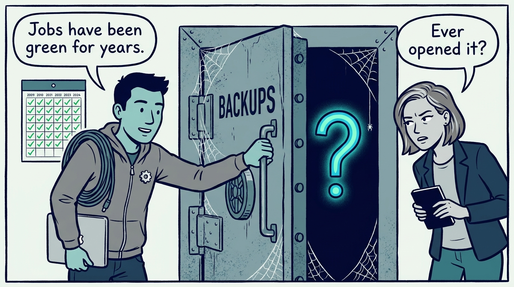
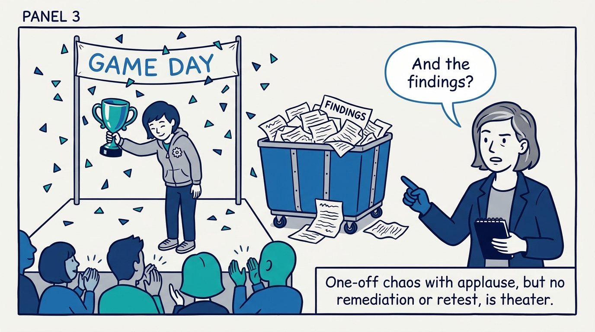
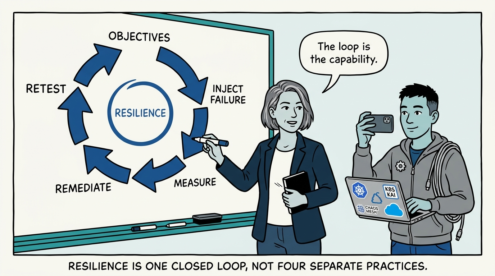
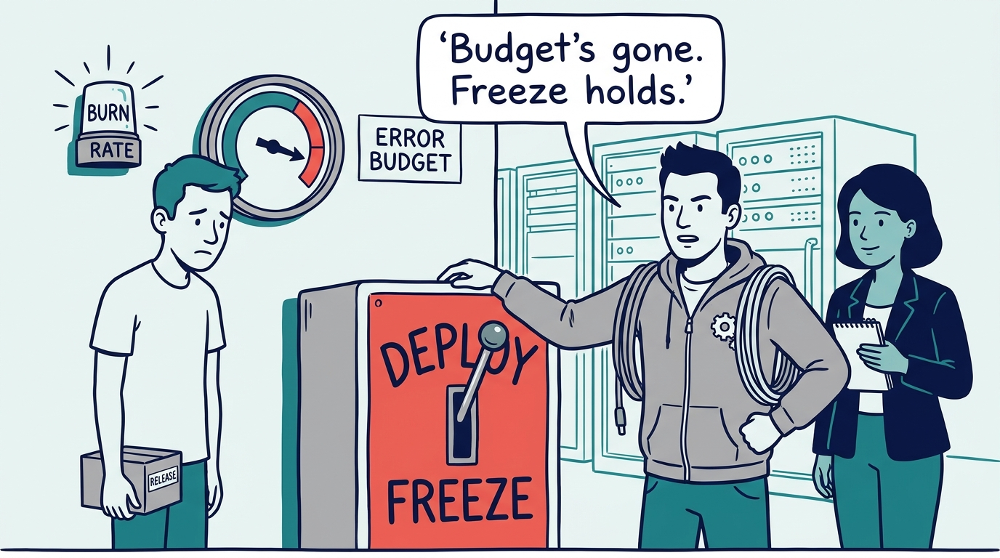
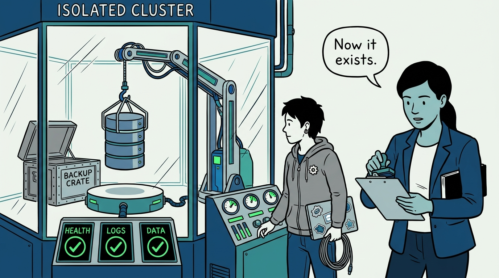
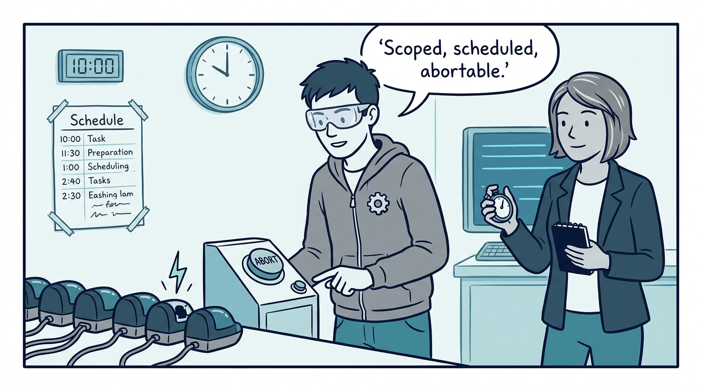
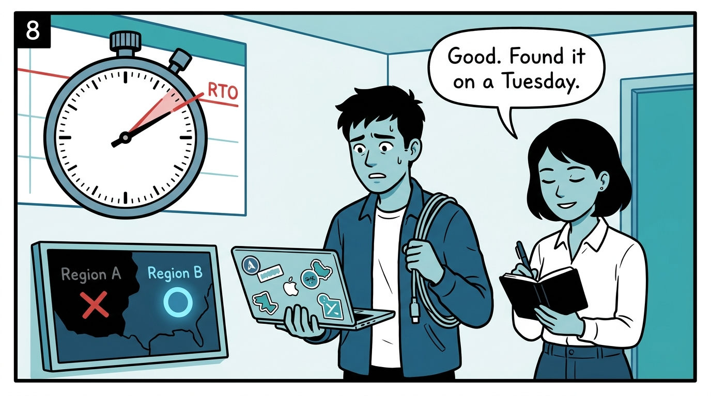
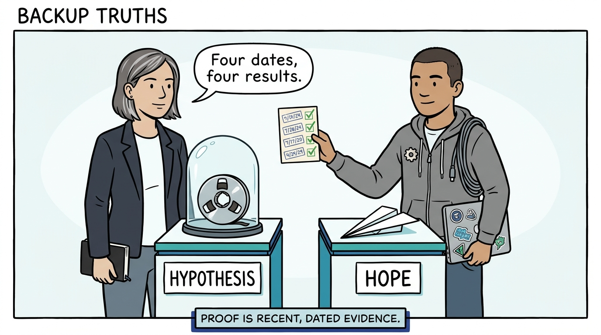

Why resilience is proven, never assumed — the closed loop, in nine panels.

<!-- comic-style
{
  "cast": "VERA: a calm, seasoned engineering executive, short gray-streaked hair, dark blazer over a plain t-shirt, carries a small black notebook. KAI: a hands-on platform engineering lead, short dark hair, gray zip-up hoodie with a small gear pin, laptop covered in infrastructure stickers under one arm, a coil of cable slung over the shoulder.",
  "style": "Clean two-tone explainer comic, thick ink outlines, flat colors with deep blue and teal accents on a light background, generous white space, hand-lettered speech bubbles with SHORT readable text, no photorealism."
}
-->

**Panel 1:** *The hook: 'resilient' is a claim — the first question is always what proved it.*

**Panel 2:** *The problem: the Schrödinger backup — jobs green for years, restore never attempted, simultaneously working and broken.*

**Panel 3:** *The wrong way: chaos theater — failure injected for the story, findings binned, nothing remediated, nothing retested.*

**Panel 4:** *The principle: one closed loop — objectives, controlled failure, measurement, remediation, retest — and it closes on every practice.*

**Panel 5:** *How it plays out: budgets with consequences — the exhaustion policy is written before anyone is angry, and the freeze is the SLO doing its job.*

**Panel 6:** *How it plays out: restore is the product — regular restore tests in an isolated cluster, validated for health, logs, and data integrity.*

**Panel 7:** *How it plays out: controlled science, not vandalism — expected steady state, scope, abort conditions, and a communicated business-hours schedule.*

**Panel 8:** *What it costs: drills against the numbers — a missed RTO in a rehearsal is a win, because the gap surfaced on a Tuesday, not during the incident.*

**Panel 9:** *The closer: a backup never restored is a hypothesis; a failover never run is a hope — 'resilient' means four dates and four results.*
