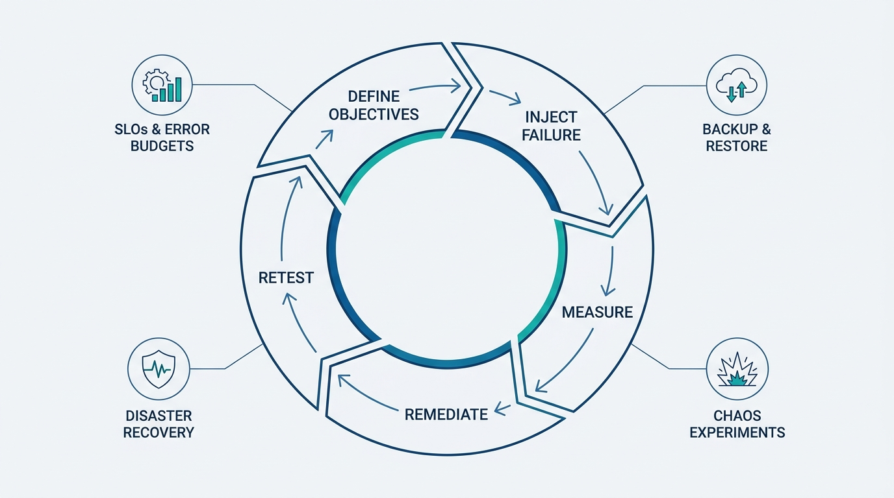
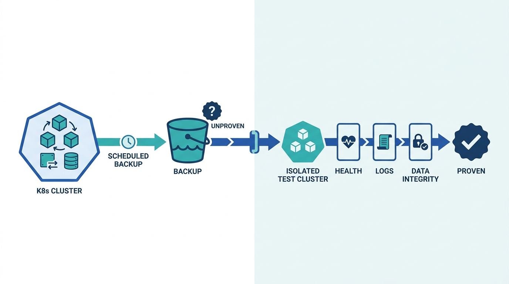
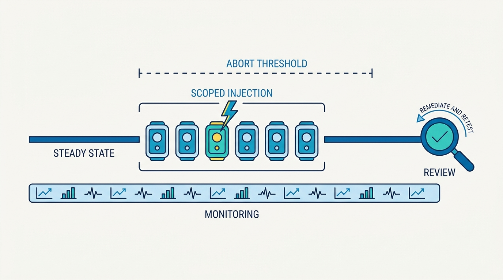
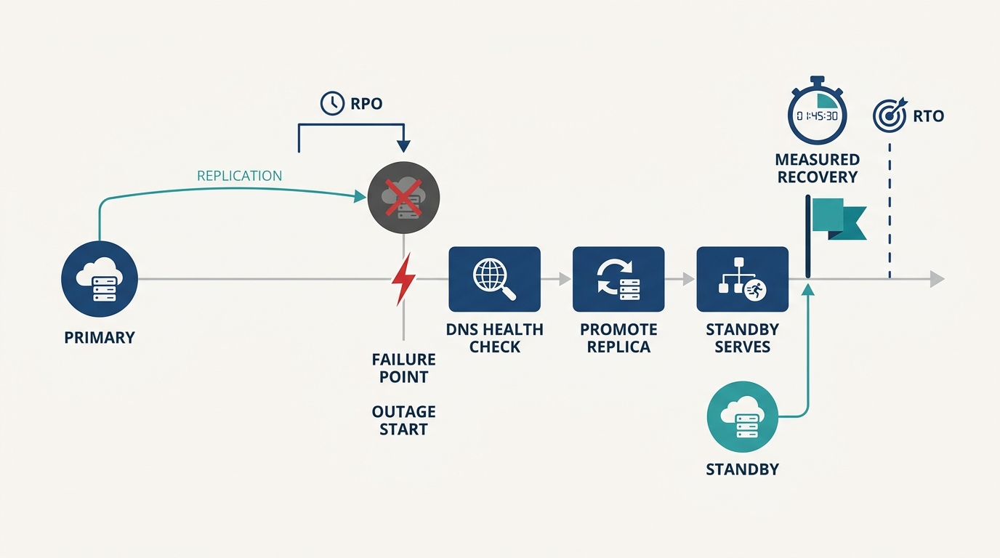

> **Status**: DRAFT
>
> **Principle**: Resilience is **proven, never assumed**. When a platform team in my organization builds the resilience capability, the build closes one loop: **define objectives** — SLOs with error budgets, RTO and RPO per service, tiered by business criticality; **inject failure deliberately** — pods, networks, resources, and managed dependencies, under explicit scope, expected behavior, and abort conditions; **measure against the objectives** — did the SLO hold, did recovery beat the RTO, did the restore preserve the data; **remediate and retest** — every gap becomes work, every fix is verified by running the experiment again. Backups exist only when restores are exercised. Disaster recovery exists only when failover is rehearsed. **A backup that has never been restored is a hypothesis; a failover that has never been run is a hope.**

## Statement

My operating model holds the resilience capability of every internal platform to four proven practices, closed by one loop.

**Figure 1:** *One loop, four practices: each practice — SLOs, backups, chaos, DR — is only real when the objectives–failure–measurement–remediation–retest loop closes on it.*

**Objectives before automation:**

- **SLOs as the reliability contract.** The most critical services are identified; each has SLIs (availability, error rate, request success rate, latency), a target over a defined window (typically rolling 30 days), and a calculated error budget. Targets are **tiered by business criticality** — one uniform number for everything is a vanity metric.
- **Budgets with consequences.** What happens when the error budget nears exhaustion is written down before it happens, including deployment-freeze criteria where appropriate.
- **Definitions as code.** SLO definitions are version-controlled configuration in a vendor-neutral form; alerting and recording rules are generated from them, not hand-written; SLO status — compliance, budget remaining, burn rate, remaining allowable downtime — is published on dashboards, with alerts on violations and excessive burn.
- **RTO and RPO per important service.** Recovery time and data-loss tolerances are explicit, tiered by business impact — and they drive the automation: backup frequency is tuned to the RPO, recovery automation to the RTO, never the reverse.

**Backups proven by restores:**

- **Automated, complete, durable.** Kubernetes resources — CRDs, Secrets, ConfigMaps, persistent volumes — are backed up automatically, with CSI snapshots where applicable, stored in durable object storage with defined retention and cross-region replication where DR requires it. Scheduled and on-demand.
- **Restore is the product.** Restoration of resources and volumes is automated; every restore validates application health, logs, and data integrity. Restore tests run regularly in isolated clusters, with functional and performance tests against the restored environment.
- **Self-service.** Development teams configure their own backups; resources opt in through labels or configuration — the platform provides the capability, not a ticket queue.

**Failure injected deliberately:**

- **Designed experiments.** Every chaos experiment has a meaningful failure scenario, a scope, a target workload, a duration, a schedule, an expected steady state established before the run, and abort conditions with safety boundaries. Controlled injection — pod failures, network latency, packet loss, CPU and memory stress, dependency failures — never uncontrolled breakage; and the run verifies that failed pods are replaced and measures recovery time against the SLO.
- **Predictable and humane scheduling.** Schedules are communicated to affected teams, prefer business hours when engineers are available to respond, and avoid peak traffic unless peak-load resilience is the explicit objective. Aggressive experiments are reserved for dedicated DR drills and low-traffic windows.
- **Managed services are not exempt.** Slow queries, connection-limit exhaustion, database failover, cross-region latency, graceful degradation, retry and backoff, circuit breakers — all tested before the real outage arrives.

**Recovery rehearsed, loop closed:**

- **DR as a rehearsed procedure.** Systems that must survive catastrophe are identified with recovery priorities; the multi-region decision is explicit; replication (databases, object storage, caches), standby environments, DNS health checks, failover and replica-promotion procedures are configured and documented — and monitoring keeps operating through the failover.
- **Drills against the numbers.** Regular DR drills measure actual recovery time against RTO/RPO targets, and procedures are updated from the results.
- **Continuous improvement.** Every test captures metrics, logs, and observations; discovered failure modes are documented; weaknesses are remediated; experiments repeat after fixes. Recovery is practiced before incidents, not during them.

## Reference Stack

This record is grounded in a build-it-end-to-end reference implementation. The tools are the worked example, not the mandate — the commitment is the property in the right-hand column.

| Role | Reference tool | The property that matters |
| --- | --- | --- |
| SLO specification | OpenSLO | Vendor-neutral, version-controlled SLO definitions — reliability targets live in git, not in someone's head |
| SLO rule generation | Sloth | Prometheus recording and alerting rules generated from the definitions — no hand-written burn-rate math |
| Measurement and alerting | Prometheus | SLO compliance, burn rates, and recovery failures measured and alerted on continuously |
| Dashboards | Grafana | Compliance, budget remaining, burn rate, and remaining allowable downtime visible to everyone |
| Backup and restore | CSI volume snapshots + S3/GCS object storage | Automated, durable, cross-region replicable — and exercised by actual restores |
| Failure injection | Chaos Mesh | Kubernetes-native, controlled, abortable experiments with observable `chaos_mesh_` metrics |

## How to Read This

This record is part of the **Reference Implementation** section of this journal — the how-it-concretely-looks companion to the Platform Engineering records. It is grounded in the Resilience Automation chapter checklist of the *Platform Engineer's Handbook* (the source PDF's filename says "Cost, Performance, and Scalability"; its title page says Resilience Automation — the title page is right). Where [[operating-platforms]] argues the operating discipline and [[four-pillars]] demands that a platform be operated as a foundation, this record is that pillar made executable: the automation and rehearsal that make the foundation claim testable. The full working checklist — all ten sections, including the hands-on Chaos Mesh validation exercise — lives in the **Checklist** tab. The **TL;DR** tab carries the management summary; the **Conversation** tab talks it through.

## Rationale

**An SLO without a consequence is a dashboard.** Defining targets is the easy half; the chapter's discipline is in the other half — the error budget, the written policy for what happens when it nears exhaustion, and deployment-freeze criteria agreed before anyone is angry. A burn-rate alert that interrupts a release conversation is the SLO doing its job. And tiering matters: giving an internal batch tool the same target as the payment path makes the budget meaningless for one and extortionate for the other.

**A backup that has never been restored is a hypothesis.** Backup jobs succeed silently for years while producing archives that cannot actually rebuild a cluster. That is why the record puts the weight on the restore side: automated restoration, health and data-integrity validation, regular restore tests in an isolated cluster, functional tests against the restored environment. The scheduled restore test is the only evidence that the backup capability exists at all — everything before it is a job that writes to object storage.

**Figure 2:** *The restore side carries the burden of proof: a backup is a hypothesis until a scheduled restore into an isolated cluster validates health, logs, and data integrity.*

**Chaos engineering is controlled science, not vandalism.** The difference is the protocol: an expected steady state stated before the run, explicit scope and abort conditions, schedules that are communicated and land in business hours — because the point of injecting failure is to have engineers watching when it happens, not to reproduce a 3 a.m. page voluntarily. The monitoring during the experiment is as designed as the experiment itself: latency percentiles, restart counts, success rates, connection-pool behavior, burn-rate alerts — correlated, where possible, with users and revenue impacted, so the result reads in business terms as well as technical ones.

**Figure 3:** *A designed experiment, not vandalism: steady state stated before the run, a scoped and abortable injection window, monitoring as designed as the failure — and a review that feeds the loop.*

**Managed does not mean immune.** The dependencies most teams never test are the ones they pay a cloud provider to run. But slow queries, connection-limit exhaustion, failovers, and cross-region latency happen to managed services too — and when they do, what is actually being tested is *your* retry logic, *your* backoff, *your* circuit breakers, *your* graceful-degradation path. The provider's SLA is a refund policy, not a resilience strategy. Test the degradation before an outage tests it for you.

**A failover that has never been run is a hope.** DR documents age instantly: the replica-promotion command that changed, the DNS record nobody updated, the monitoring that goes dark exactly when the region does. Only drills that measure actual recovery time against the stated RTO and RPO turn the document into a capability — and a drill that misses its target is a successful drill, because it found the gap on a Tuesday instead of during the incident.

**Figure 4:** *Drills against the numbers: the rehearsal measures actual recovery and data loss against the stated RTO and RPO — the two targets the automation is tuned to.*

**The loop is the capability.** Every practice above ends the same way: review the results, identify the gaps, create the remediation work, and retest after the fix. A discovered weakness that is fixed but never retested is a gap that reopens silently. Resilience testing is an ongoing engineering practice with a schedule — error-budget reviews, restore validations, chaos runs, DR drills — not a milestone the platform passed once.

## What This Means in Practice

| What this record says | What it does **not** say |
| --- | --- |
| Every critical service has an SLO, an error budget, and a written exhaustion policy. | Every service gets the same aggressive target — targets are tiered by business criticality. |
| Backups are automated and proven by scheduled restore tests in isolated clusters. | The platform backs up everything by default — resources opt in via labels, and teams configure their own backups self-service. |
| Chaos experiments run on a predictable, communicated schedule with abort conditions. | Break production at random — every experiment has scope, an expected steady state, and safety boundaries. |
| Prefer business hours, when engineers can respond. | Never touch peak traffic — peak runs are fine when peak-load resilience is the explicit objective, and aggressive runs belong in DR drills. |
| Test managed cloud services for degradation, failover, and limits. | Trust the provider's SLA as your resilience strategy. |
| DR drills measure actual recovery against RTO/RPO, and procedures update from results. | A documented DR plan counts as DR. |
| Every finding becomes remediation work, and the experiment repeats after the fix. | A passed experiment closes the topic — the schedule continues. |

Concretely: for every platform my organization runs, the platform lead can show me the date and outcome of the last error-budget review, the date and result of the last restore test, the date and findings of the last chaos run, and the last DR drill's measured recovery time against its RTO. **Four dates and four results — that is what "resilient" means here.**

## Anti-Patterns

- **The Schrödinger backup.** Backups scheduled, jobs green, restore never attempted — simultaneously working and broken until the day you need it collapses the wave function.
- **The decorative SLO.** Targets defined and dashboarded, budget burning, and no consequence ever triggered — a reliability contract nobody enforces is wall art.
- **The uniform nine.** One ambitious target for every service regardless of criticality — meaningless for the payment path, extortionate for the batch job, and evidence that nobody made a decision.
- **Chaos theater.** A one-off game day with slides and applause, no remediation backlog, no retest — failure injected for the story, not the loop.
- **Midnight chaos.** Experiments scheduled when no engineer is around to respond, voluntarily reproducing the worst conditions of a real incident — or run at peak without peak-load being the stated objective.
- **The trusted dependency.** Managed services exempted from testing because "that's the provider's problem" — until their slow queries exhaust your connection pool and the untested degradation path is the outage.
- **The paper failover.** Replica promotion documented, DNS failover configured, nothing ever executed — a DR plan whose first rehearsal is the disaster.
- **Fix and forget.** A discovered weakness remediated but never retested — the loop left open, the gap free to return.

## Related Records

- [[four-pillars]] — pillar 4, operated as a foundation; this record is the automated proof of the foundation claim.
- [[operating-platforms]] — the conceptual operating discipline (incidents, on-call, support); this is its self-testing counterpart on the reference stack.
- [[observability-implementation]] — builds the telemetry pipeline this record consumes; SLO dashboards and burn-rate alerts assume it exists.
- [[cost-performance-scalability]] — the sibling chapter: that record injects load and watches cost; this one injects failure and watches recovery.
- [[platform-creation]] — the clusters, GitOps flow, and mesh whose resilience is being proven here.
- [[cicd-as-a-platform-service]] — where error-budget deployment freezes actually land: in the delivery pipelines.
- [[self-service-infrastructure]] — the self-service pattern the backup opt-in follows.

## Scope and Revisiting

This record is `draft`. It applies to every platform team in my organization building or operating a resilience capability, on this reference stack or any other. I revisit it if a real incident exceeds an RTO or RPO that drills claimed we could meet, if restore validation quietly lapses while backup jobs stay green, if error budgets burn repeatedly without a freeze ever triggering, or if the chaos and drill schedule stalls because remediation work is piling up unretested — each of those is the loop breaking in a different place.

## Authoritative References

- *Platform Engineer's Handbook* — the Resilience Automation chapter, whose checklist this record distills (source PDF filed under "Cost, Performance, and Scalability"; the checklist's own title page reads Resilience Automation).
