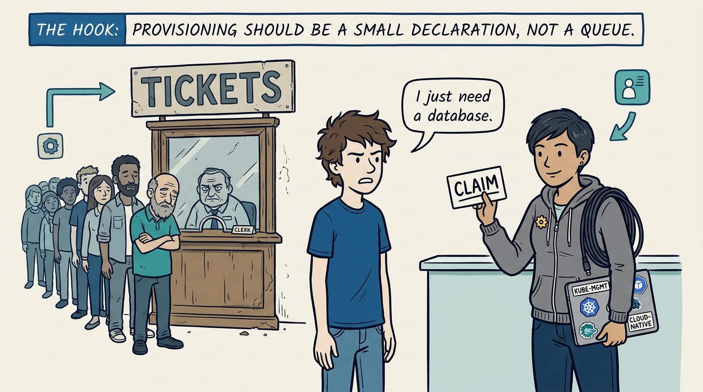
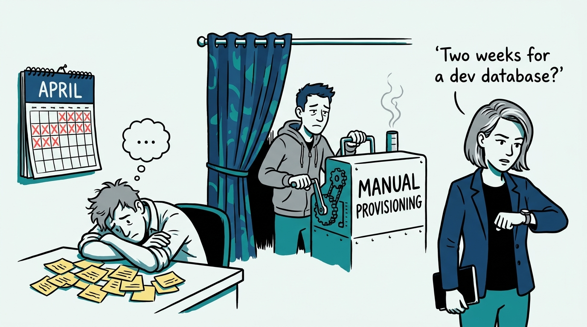
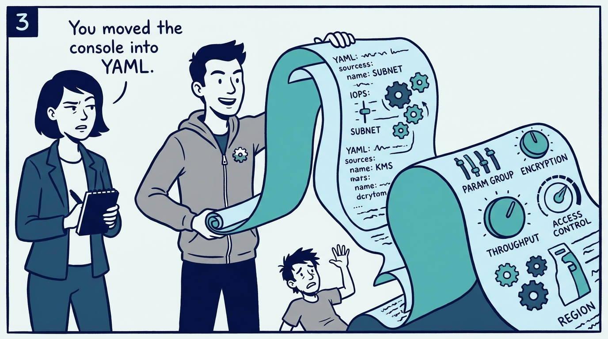
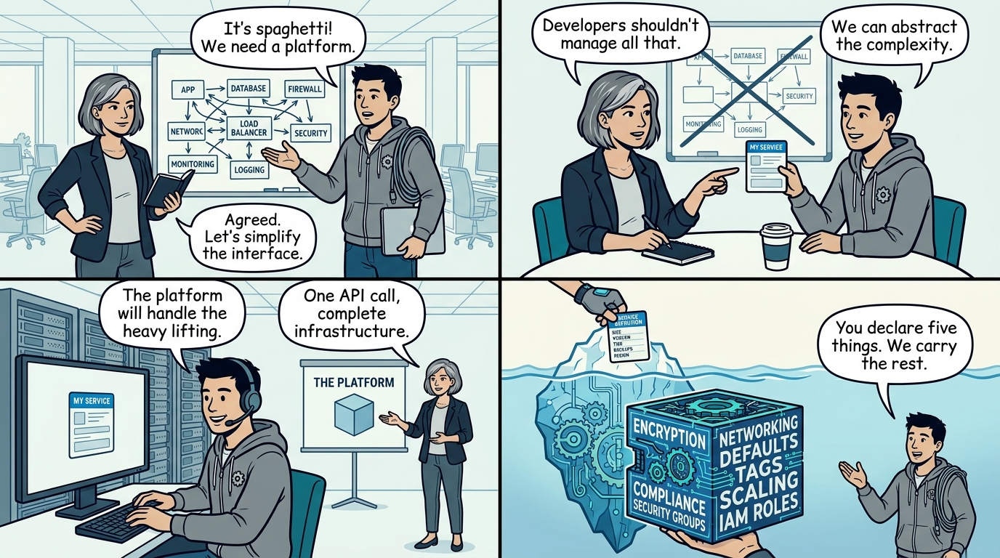
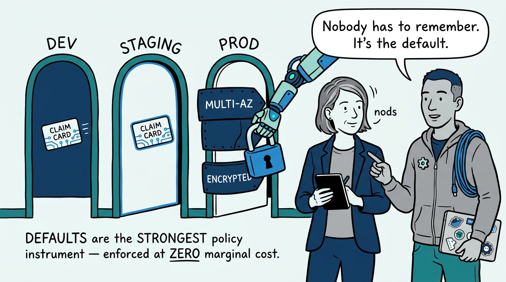
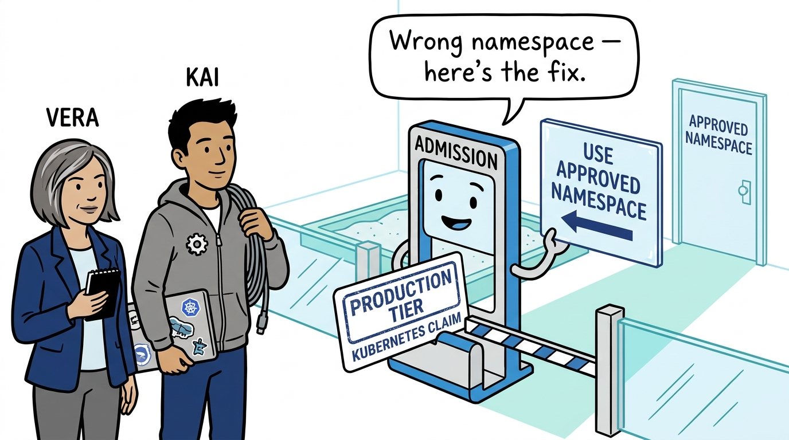
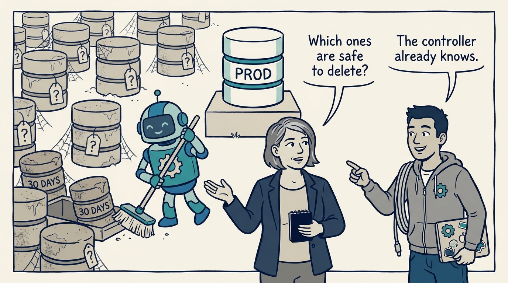
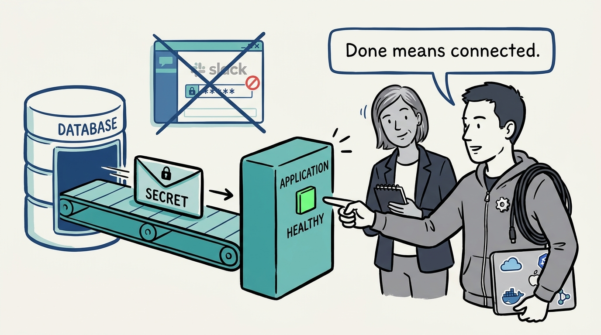
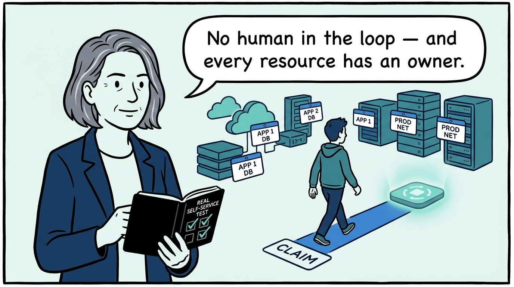

Why infrastructure self-service means a small claim on top of a platform-owned blueprint — in nine panels.

<!-- comic-style
{
  "cast": "VERA: a calm, seasoned engineering executive, short gray-streaked hair, dark blazer over a plain t-shirt, carries a small black notebook. KAI: a hands-on platform engineering lead, short dark hair, gray zip-up hoodie with a small gear pin, laptop covered in infrastructure stickers under one arm, a coil of cable slung over the shoulder.",
  "style": "Clean two-tone explainer comic, thick ink outlines, flat colors with deep blue and teal accents on a light background, generous white space, hand-lettered speech bubbles with SHORT readable text, no photorealism."
}
-->

**Panel 1:** *The hook: 'I just need a database' — and the answer is either a queue or a claim.*

**Panel 2:** *The problem: the ticket behind the curtain — the interface changed, the queue did not, and the platform team is still the bottleneck.*

**Panel 3:** *The wrong way: the thousand-knob blueprint — every provider parameter exposed 'for flexibility' is the cloud console relocated, not complexity managed.*

**Panel 4:** *The principle: the blueprint is the product — the developer declares intent in a handful of parameters, and the composition compiles the organization's standards into everything beneath.*

**Panel 5:** *How it plays out: policy that lives in defaults cannot be forgotten under deadline pressure — production gets Multi-AZ and deletion protection because the composition says so.*

**Panel 6:** *The gate runs before anything is created — and a rejection that explains trains teams to fix the claim, not to route around the platform.*

**Panel 7:** *What easy provisioning costs: resources nobody remembers creating — so owner labels are required, dev and staging expire automatically, and production keeps human judgment.*

**Panel 8:** *Provisioning is not the product; a connected application is — credentials arrive by generated secret, never by Slack.*

**Panel 9:** *The test that never stops running: claim to connected application without a human — while every resource can still answer who owns it and why it exists.*
