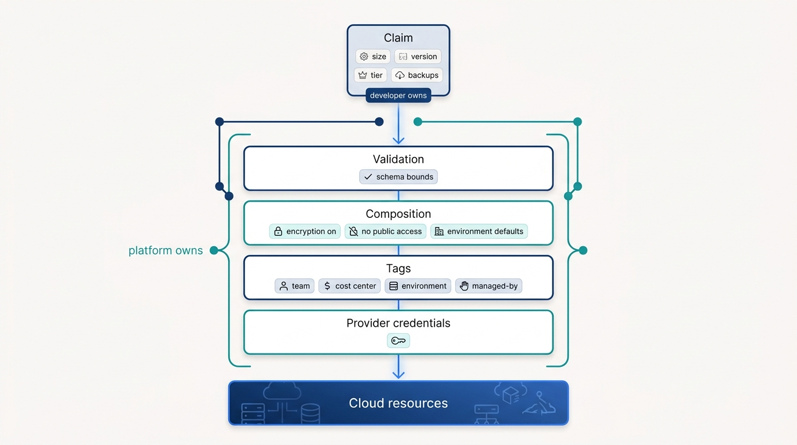
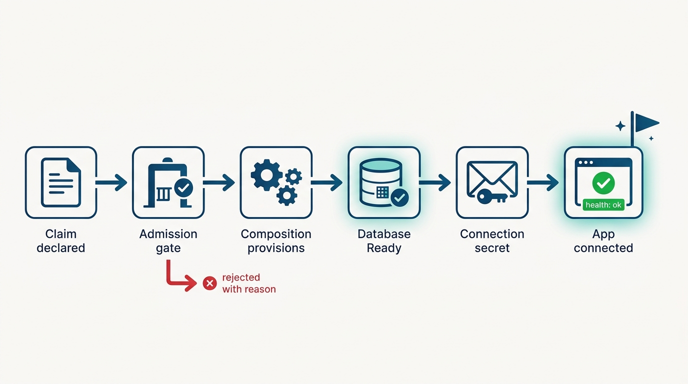
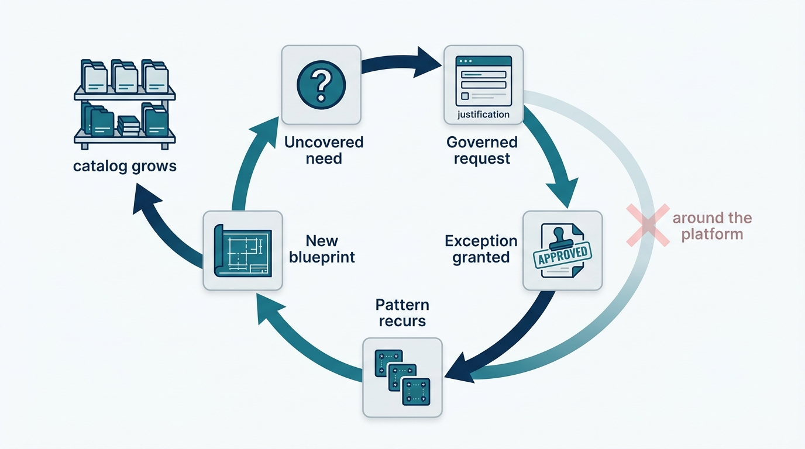

> **Status**: DRAFT
>
> **Principle**: Application teams in my organization provision infrastructure by **declaring a claim, not by filing a ticket** — a small, validated request (size, version, tier, backups) in their own namespace. Everything beneath the claim is a **platform-owned blueprint**: a composition that translates the request into provider-specific infrastructure with the security non-negotiables and environment defaults compiled in, tags that make every resource attributable, an admission gate that validates tier and namespace **before creation**, lifecycle automation that expires what teams forget, and a control plane that continuously reconciles declared and actual state. Needs the blueprints don't cover get a **governed escape hatch**, not a workaround. The test I keep running: can a developer go from claim to connected application without a human in the loop — and can I still answer who owns every resource and why it exists?

## Statement

When a platform team in my organization builds self-service infrastructure management, the finished capability has this shape:

**The developer interface is a blueprint, deliberately small:**

- **A claim, not a console.** Developers request infrastructure by declaring a claim in their own namespace — kind, storage, version, tier, backups — never by clicking through a cloud console or filing a ticket.
- **Bounded parameters, enforced by validation.** The blueprint's schema carries the platform's opinion: storage within sanctioned bounds (15–500 GB in the reference build), only supported engine versions (PostgreSQL 13–16), named environment tiers (development, staging, production), a backup toggle.
- **Connection status is part of the contract.** The claim reports endpoint and port back; the developer never asks the platform team "where is my database?"

**The platform owns everything beneath the claim:**

- **The composition carries the standards.** Tier maps to instance class (db.t3.micro / db.t3.small / db.r6g.large in the reference build), storage and version map through, backup toggles convert to retention periods — and the non-negotiables ride along on every claim: public access disabled, storage encrypted, networking and subnet references set by the platform.
- **Environment defaults are baked into the blueprint.** Development gets minimal backup retention; staging gets 7-day backups and performance insights; production gets 30-day backups, Multi-AZ, and deletion protection — selected by composition labels, without the developer asking for any of it.
- **Provider credentials never leave the platform.** The control plane authenticates with the cloud; application teams authenticate with the control plane.

**Governance and hygiene are automated, not reviewed:**

- **Validation runs before creation.** An admission gate checks tier against namespace — each tier only in the namespaces approved for it, production the strictest: production-tier resources only in approved production namespaces — and rejects bad claims with an actionable error, tested in both directions.
- **Every resource is owned and attributable.** Team, cost center, environment, and a managed-by identifier are required tags; every resource can answer who owns it, why it exists, and where its cost lands.
- **Lifecycle is enforced by a controller.** Owner labels are required; development resources expire (30 days in the reference build), staging resources expire (90 days), production has no automatic limit; eligible dev resources are cleaned up automatically and violations are reported.
- **Drift converges back to the declaration.** The control plane continuously reconciles declared and actual state; a manual edit to managed infrastructure is drift to be corrected, not a change of record.

**The edges are governed, not forbidden:**

- **Escape hatches exist.** Needs no blueprint covers get a governed request path with a captured business justification — and recurring exceptions become new blueprints (specialized GPU blueprints, with cost controls and scheduling restrictions, are the canonical example).

**Figure 1:** *The ownership split: the developer declares a small claim; validation, composition, tags, and cloud credentials are platform-owned layers beneath it.*

## Reference Stack

This record is grounded in the *Platform Engineer's Handbook* build, which implements the capability with a concrete stack. The tools are the worked example, not the mandate — what binds is the property in the right-hand column.

| Role | Reference tool | The property that matters |
| --- | --- | --- |
| Infrastructure control plane | Crossplane on Kubernetes | Declared state, continuously reconciled against actual cloud resources |
| Developer interface | Composite Resource Definition + namespaced claim (`PostgreSQLClaim`) | Few parameters, validated ranges, platform defaults enforced by schema |
| Translation layer | Crossplane Composition (AWS RDS) | Tier-to-instance mapping and security non-negotiables decided once, applied on every claim |
| Cloud integration | Crossplane providers + ProviderConfig | Platform holds the cloud credentials; resource limits and package versions reviewed |
| Governance gate | Validating admission webhook | Tier/namespace policy checked before creation; rejections carry actionable errors |
| Hygiene | Lifecycle controller | Owner labels required; age limits on dev/staging; automatic cleanup and violation reports |
| Credential delivery | Generated connection secrets | Applications consume endpoint and credentials from a secret — never hand-copied |

## How to Read This

This record is part of the **Reference Implementation** section of this journal — the how-it-concretely-looks companion to the Platform Engineering records. Where [[four-pillars]] states that a platform must serve a broad developer base through self-service with guardrails, this record is that pillar made concrete for infrastructure, end to end: blueprint, composition, governance, lifecycle, and the demo application that proves the loop closes. It is grounded in the Self-Service Infrastructure Management chapter checklist of the *Platform Engineer's Handbook*. The full working checklist — prerequisites through the final completion check — lives in the **Checklist** tab; the **TL;DR** tab carries the management summary; the **Conversation** tab argues it out loud.

## Rationale

**The blueprint is the product.** The chapter's core move is compressing an infrastructure decision that has dozens of parameters — instance class, subnet groups, encryption, retention, networking — into a claim with about five. That compression is where the platform earns its keep: the developer states intent (a development-tier PostgreSQL 15 with 20 GB and backups), and the composition compiles the organization's standards into everything the developer did not say. This is the difference between self-service and self-configuration. A "self-service" offering that exposes every provider knob has merely moved the cloud console into YAML — the complexity is relocated, not managed, which is the exact failure [[four-pillars]] warns against.

**Defaults are the strongest policy instrument I have.** Production gets Multi-AZ, deletion protection, and 30-day backups because the production composition says so — not because a reviewer remembered to ask. Encryption is on and public access is off on every database because no claim can express otherwise. Policy that lives in defaults is enforced at a marginal cost of zero and cannot be forgotten under deadline pressure. Policy that lives in review meetings is enforced at the speed of meetings. The flip side is accountability: a wrong default ships to every claim, so the platform team owns each default as deliberately as any written policy.

**Governance must run before creation, and rejection must teach.** The admission gate evaluates tier against namespace before any resource exists — a production-tier claim in a sandbox namespace never gets far enough to cost money or leak data. Just as load-bearing: rejections return actionable messages, and the build is not done until both accepted and rejected claims have been tested. **A guardrail that rejects without explaining trains teams to route around the platform**; a guardrail that explains trains them to fix the claim. The blueprint-scoped gate here complements, not replaces, the cluster-wide policy engine in [[policy-as-code]].

**Self-service without lifecycle automation is a cost incident on a delay timer.** Making provisioning easy multiplies the number of resources nobody remembers creating. The reference build pairs the easy front door with an automated back door: owner labels required, 30-day limits on development resources, 90-day limits on staging, automatic cleanup for what expires, violations reported. That cleanup will sometimes delete a resource a team forgot it wanted — the friction is the policy working, which is why it is paired with clear violation reporting. Production is deliberately exempt from auto-expiry — the asymmetry is the policy: aggressive hygiene where forgetting is cheap, human judgment where deletion is catastrophic. The required tags — team, cost center, environment, managed-by — are what make the cleanup, and the cost conversation in [[cost-performance-scalability]], possible at all.

**The loop is only closed when an application connects.** The chapter does not stop at "claim goes Ready." It ends with a demo application consuming the generated connection secret — host, port, user, password, database name — behind a readiness probe, and a health endpoint reporting database connectivity. That last mile is where most self-service efforts quietly fail: the database exists, but credentials travel by Slack. **Provisioning is not the product; a connected application is.** And the validation goes further than the happy path: invalid storage, unsupported versions, wrong-namespace claims, and deliberate manual drift all get tested. A control plane that reconciles drift has failure modes of its own — composition errors, stuck claims — so the build practices debugging down the claim → composite → managed-resource chain, and validates compositions in a development cluster before promotion.

**Figure 2:** *The loop closes at the application's health check, not at 'claim Ready' — with governance running before anything is created and credentials arriving as a generated secret.*

**Escape hatches keep the governance honest.** Some team will need infrastructure no blueprint covers — the question is only whether they go through a governed path or around the platform. The chapter's answer is explicit: a request process that captures business justification, organizational governance for the exception, and a feedback loop where recurring exceptions become new blueprints — GPU workloads, with their own cost controls and scheduling restrictions, being the canonical next one. **An escape hatch is how the blueprint catalog learns.**

**Figure 3:** *The escape-hatch loop: uncovered needs pass through a governed path, and recurring exceptions become the catalog's next blueprints.*

| What this record says | What it does **not** say |
| --- | --- |
| Developers provision infrastructure through small, validated claims. | Developers get raw cloud-console or provider-credential access with tagging guidelines. |
| The composition bakes in security and environment defaults on every claim. | Every workload gets identical infrastructure — tiers exist precisely so dev, staging, and production differ deliberately. |
| Governance validates tier and namespace before creation, with actionable errors. | A platform engineer reviews each request — the gate is software, and humans review blueprints, not claims. |
| Dev and staging resources expire automatically; production does not. | Production is unmanaged — it has owners, tags, and backups; it just is not auto-deleted. |
| The capability is proven by a connected application, failure tests, and drift tests. | "The claim went Ready" is done — done is a health endpoint reporting database connectivity. |
| Uncovered needs get a governed escape hatch and may become new blueprints. | The catalog is frozen — or, conversely, that any team can bypass governance by calling their need special. |

Concretely: when a platform team in my organization ships this capability, I expect to watch one demo — a claim applied in an application namespace, the claim reaching Ready, the connection secret appearing, the application's health endpoint confirming connectivity — and one rejection: a production-tier claim in the wrong namespace bouncing with an error message a developer could act on. If either demo needs a human in the loop, the capability is not done.

## Anti-Patterns

- **The ticket behind the curtain.** A self-service portal that opens a ticket a platform engineer resolves by hand — the interface changed, the queue did not, and the platform team is still the bottleneck.
- **The thousand-knob blueprint.** An interface exposing every provider parameter "for flexibility" — the console relocated into YAML, hiding nothing, standardizing nothing.
- **Console keys under the doormat.** Handing teams cloud credentials with a tagging convention and hoping — every team relearns the same security and cost mistakes at production prices.
- **The immortal dev database.** No lifecycle limits, no owner labels — eighteen months later, nobody can say which of four hundred databases are safe to delete, so none are.
- **The silent no.** Governance that rejects claims without actionable messages — teams stop fixing claims and start routing around the platform.
- **Drift by hand.** "Quick" manual fixes to managed infrastructure that the control plane reverts — or worse, that force reconciliation to be disabled, at which point declared state is fiction.
- **The sealed catalog.** No escape hatch for uncovered needs — teams with real requirements go around the platform entirely, and the catalog never learns what to build next.
- **Ready-means-done.** Declaring victory when the claim goes Ready, while credentials travel by Slack and the first failure mode is discovered in production.

## Related Records

- [[four-pillars]] — the structural test; this record is pillar 3 (broad self-service base with guardrails) made concrete for infrastructure.
- [[self-service-onboarding]] — the sibling record that gets teams onto the platform; this one governs what they can provision once there.
- [[policy-as-code]] — the cluster-wide policy engine; the admission gate here is blueprint-scoped tier/namespace validation, not a replacement for it.
- [[cost-performance-scalability]] — where the tagging and lifecycle discipline built here pays out as cost allocation and optimization.
- [[platform-creation]] — the cluster, GitOps, and mesh substrate this capability runs on.
- [[starter-kits]] — the application scaffolding that consumes these claims from a project's first day.
- [[platform-as-a-product]] — the operating mechanics behind treating the blueprint catalog as a product with customers.

## Scope and Revisiting

This record is `draft`. It applies to every internal platform in my organization that offers infrastructure provisioning to application teams, whatever control plane implements it. I revisit it if the escape-hatch rate climbs — many exceptions mean the blueprints no longer match real needs; if lifecycle reports show violations accumulating without cleanup — automation that only reports is not automation; or if teams begin provisioning around the platform despite the blueprints existing, which means the paved path has stopped being the easiest path and the capability is failing in public.

## Authoritative References

- *Platform Engineer's Handbook* — the Self-Service Infrastructure Management chapter, whose checklist this record distills: the Crossplane-based PostgreSQL blueprint, composition, governance, lifecycle automation, and end-to-end demo workflow.
- Camille Fournier and Ian Nowland, *Platform Engineering: A Guide for Technical, Product, and People Leaders* (O'Reilly, 2024) — the conceptual frame this journal's [[four-pillars]] record draws from; this record is its self-service pillar in executable form.
