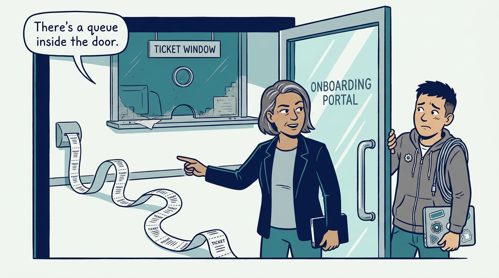
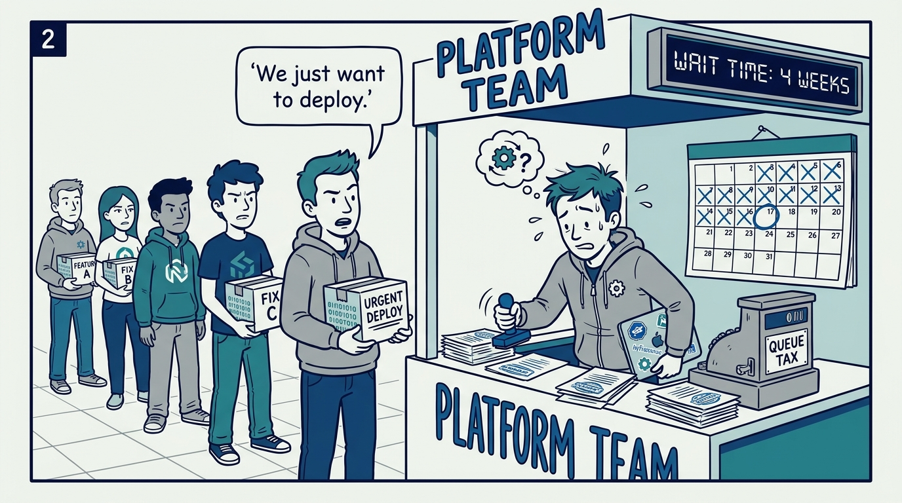
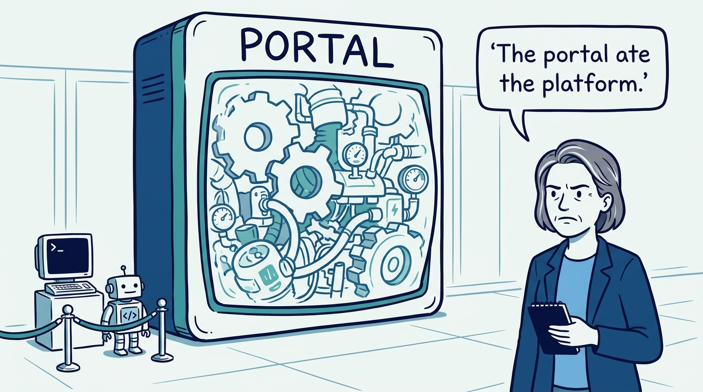
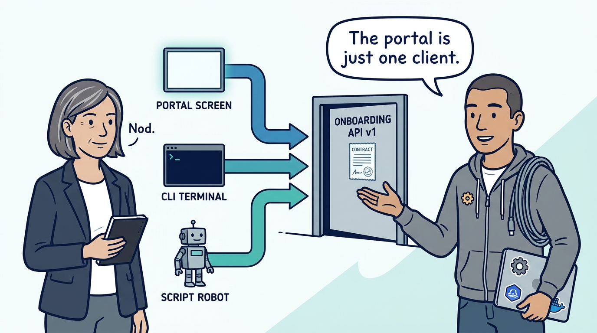
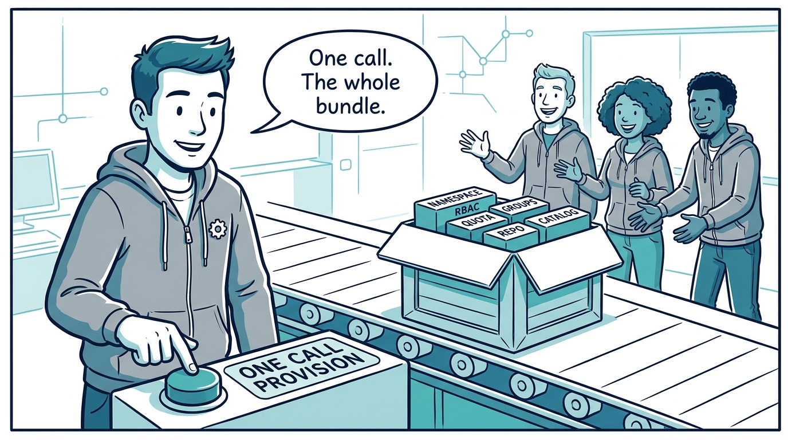
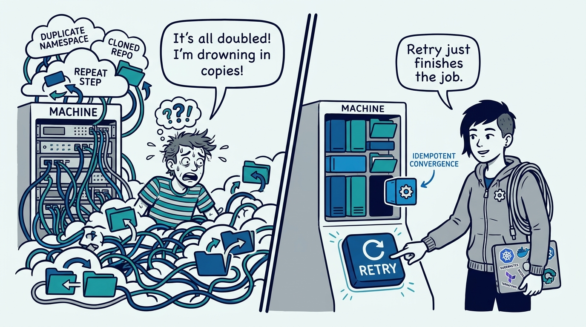
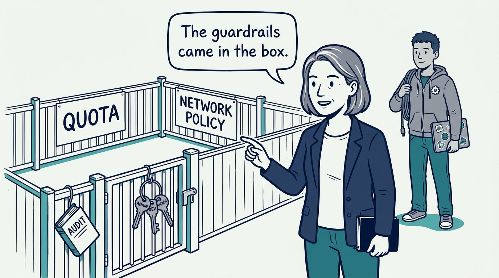
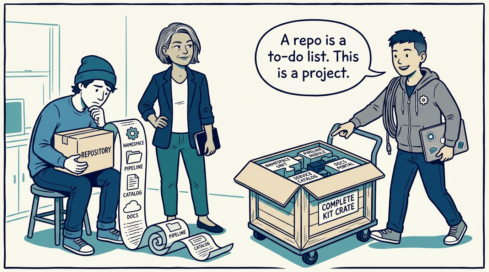
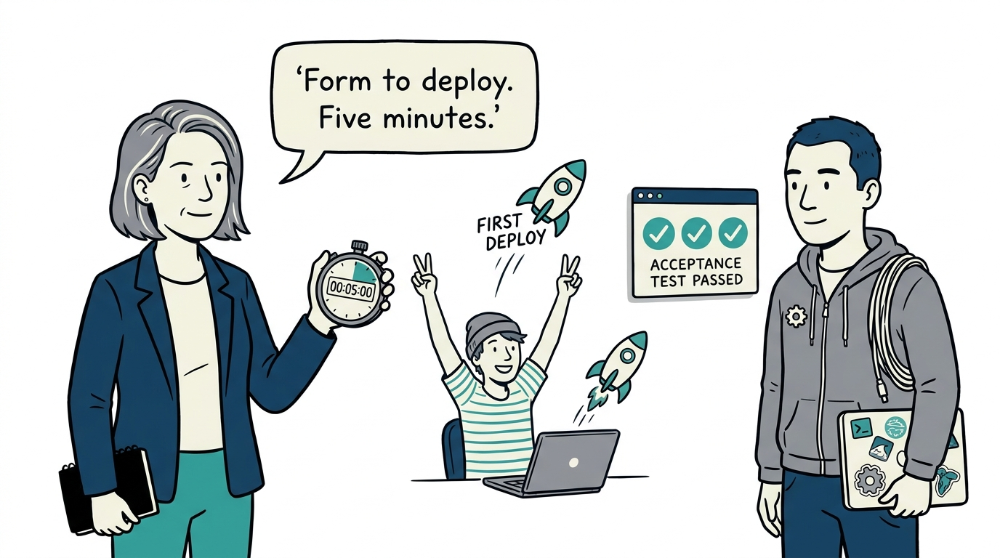

Why the front door of a platform is an API and not a portal — in nine panels.

<!-- comic-style
{
  "cast": "VERA: a calm, seasoned engineering executive, short gray-streaked hair, dark blazer over a plain t-shirt, carries a small black notebook. KAI: a hands-on platform engineering lead, short dark hair, gray zip-up hoodie with a small gear pin, laptop covered in infrastructure stickers under one arm, a coil of cable slung over the shoulder.",
  "style": "Clean two-tone explainer comic, thick ink outlines, flat colors with deep blue and teal accents on a light background, generous white space, hand-lettered speech bubbles with SHORT readable text, no photorealism."
}
-->

**Panel 1:** *The hook: the ticket behind the portal — a shiny front door with a queue hidden inside is self-service theater, not self-service.*

**Panel 2:** *The problem: every new team pays the queue tax — the platform team becomes the bottleneck it was built to remove.*

**Panel 3:** *The wrong way: the portal that ate the platform — logic buried in the portal is untestable, unswappable, and closed to every other client.*

**Panel 4:** *The principle: API-first, portal second — provisioning logic lives behind a versioned, schema-validated API, and the portal is one swappable client.*

**Panel 5:** *How it plays out: a team is one call, fully provisioned — namespace, RBAC, quotas, identity groups, repository, and catalog entry arrive together.*

**Panel 6:** *The safeguard: every step idempotent — retrying a partial failure converges on the desired state instead of minting duplicates.*

**Panel 7:** *The guardrails ship in the bundle: tiered quotas, three standing roles, network policies, and an audit trail arrive with the namespace — never retrofitted.*

**Panel 8:** *The unit: a repository is not a project — a project ships repo, namespaces, pipeline, catalog entry, and docs together, from a template, in one go.*

**Panel 9:** *The closer: the five-minute test — portal form to first deployment, no ticket, no platform engineer in the loop, re-run whenever the path changes.*
