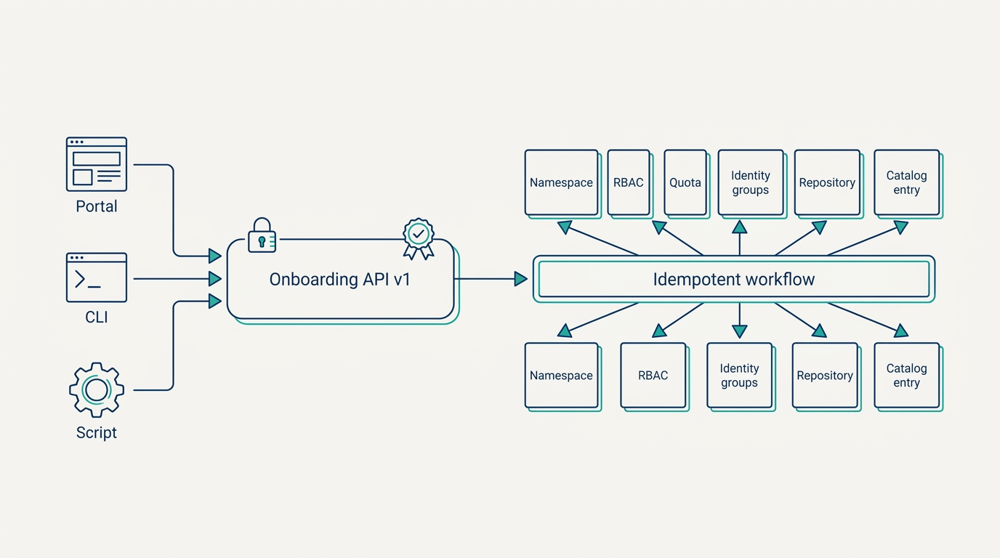
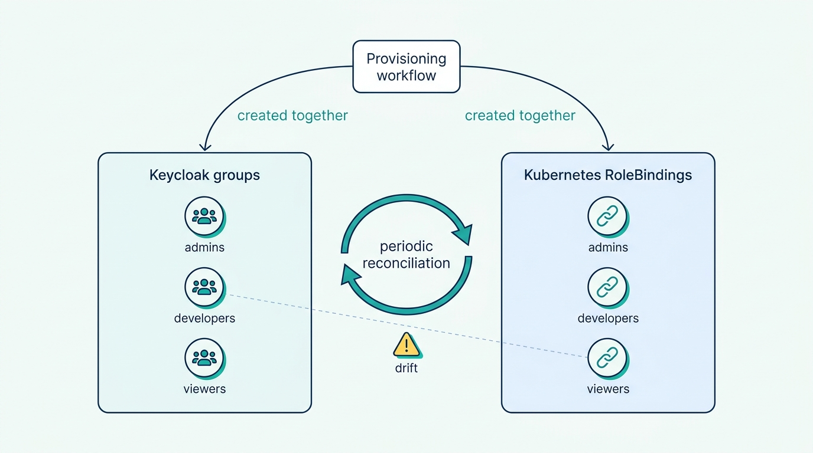
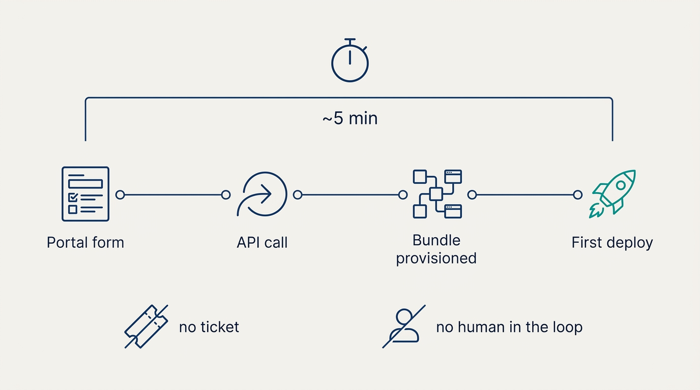

> **Status**: DRAFT
>
> **Principle**: When a platform team in my organization builds self-service onboarding, the front door is an **API, not a portal**: the developer portal is one client of a versioned, schema-validated onboarding API that owns the provisioning logic. A new team is **one authenticated call** that provisions the whole bundle — namespace, RBAC, resource quotas, identity groups, source repository, catalog entry — with **every step idempotent**, so a retried half-failure converges instead of duplicating resources. Guardrails ship inside the bundle: tiered quotas, three standing roles, network policies, and an audit trail that records who asked, when, and why. A project is a **complete developer unit** — repository, namespaces, pipeline, catalog entry, documentation — never just a repo. The bar the build is held to: **portal form to first deployment in about five minutes**, without a ticket and without a platform engineer in the loop.

## Statement

When my organization builds self-service onboarding, this is the shape of the build, end to end.

**The front door is an API:**

- **API-first, portal second.** Provisioning logic lives in an onboarding API (`POST /api/v1/teams`), never inside the developer portal. Backstage's scaffolder is a client of that API — swappable, like every other client.
- **Authenticated and authorized.** Every request is authenticated and requires the `platform:teams:create` permission; authorization is validated before any infrastructure is touched.
- **Schema-validated, contract-documented.** Requests are validated against an OpenAPI/JSON Schema — team name, display name, and team-lead email required; names lowercase alphanumeric with hyphens, capped at 63 characters; resource tier defaulting to `starter`. The OpenAPI specification is the source of truth for clients and documentation.
- **Accountable by design.** The API tracks who submitted each request, when, and why, and returns provisioning status to the caller.

**A team is one call, fully provisioned:**

- **The whole bundle, one workflow.** The workflow creates the team's namespace, applies RBAC roles and the correct resource quota, creates the source repository and the Keycloak groups, registers the team in the Backstage catalog, and returns namespace, repository, and status.
- **Every step idempotent.** Retrying a partially failed request converges on the desired state — no duplicate namespaces, groups, repositories, or catalog entities.
- **Namespaces carry their metadata.** A consistent convention (`team-{teamname}`, `team-{teamname}-{environment}`), labels for team, owner, tier, cost center, and managed-by, annotations linking to the catalog entry and the team's Slack channel, mesh enrollment via sidecar injection where required, and network policies applied automatically.

**Figure 1:** *The front door is an API: every client is equal, and one authenticated call runs the idempotent workflow that provisions the complete team bundle.*

**Guardrails ship in the bundle:**

- **Three roles, one boundary.** `team-admin`, `team-developer`, `team-viewer` — admins control their namespace, developers deploy and debug, viewers read. Secret deletion is reserved for admin roles. RoleBindings bind to OIDC groups named `{team}-admins`, `{team}-developers`, `{team}-viewers`; permissions cannot escalate outside the team's namespace, and `platform-*` namespaces are untouchable.
- **Quotas are tiers, not negotiations.** Starter, standard, and enterprise tiers define CPU and memory requests and maximums, and cap persistent volume claims, load balancers, and deployments; a LimitRange supplies default requests, limits, and per-container maximums. Quota alerts feed the observability platform; quota upgrades are self-service requests, with an approval workflow where governance requires one.
- **Identity is wired, then reconciled.** Team groups are created idempotently via the Keycloak Admin API at provisioning time — the lead into admins, members into developers — with group names matching RoleBinding subjects, membership in JWT claims where needed, and periodic reconciliation between Keycloak and Kubernetes so the two never silently drift.

**Teams live, projects are whole:**

- **A managed lifecycle.** Platform admins create teams and seed the initial team admin; team admins add and remove members, assign roles, request quota increases, and create sub-namespaces. Teams are `active`, `archived`, or `deleted`, with explicit inactivity rules for archival and deletion rules for archived teams.
- **A project is a complete developer unit.** Not a repository, not a namespace — a bundle provisioned together: source repository, deployment namespaces, CI/CD pipeline, catalog entry, documentation scaffolding, with naming conventions that flow into every downstream resource.
- **Templates by archetype.** Backend service, frontend application, data pipeline, ML model — with language and framework variants, stored in version-controlled Git repositories, carrying metadata about supported platform features, and previewing their resources before execution. The scaffolder validates name uniqueness, team membership, and quota availability — and requires a cost center for production and GPU-quota approval for ML where applicable — then calls the onboarding API and surfaces links to the new repository and catalog entry.

**Failure and observability are part of the door:**

- **Honest failure semantics.** Capacity is pre-checked; quota beyond available capacity returns 409, infrastructure failure returns 503, GitHub rate limits and Kubernetes API errors are retried with exponential backoff and jitter; failed attempts land in the audit trail; project-level partial failures have defined rollback.
- **Operated as a production service.** Prometheus metrics, structured logs, distributed traces, and an audit of every success and failure with requester, timestamps, purpose, and retries. The API is load-tested, versioned by URL for breaking changes, and covered by a deprecation policy announced before removal.
- **Measured by outcomes.** Time-to-first-deploy, onboarding ticket count, and abandonment rate are tracked — and the end-to-end walkthrough, run as a test user, completes in about five minutes.

## Reference Stack

This record is grounded in the handbook's concrete build. The commitments above hold at the capability level; the stack is the worked example, not the mandate.

| Role | Reference tool | The property that matters |
| --- | --- | --- |
| Developer portal and scaffolder | Backstage | One front door; the scaffolder is a client of the onboarding API, not its home |
| Onboarding API | Custom REST service (OpenAPI) | Versioned, schema-validated; the single place provisioning logic lives |
| Identity | Keycloak (OIDC) | Groups created with the team; names mirror RBAC subjects; reconciled periodically |
| Cluster substrate | Kubernetes (Kind locally) | Namespace-per-team with RBAC, ResourceQuota, and LimitRange |
| Deployment | ArgoCD (GitOps) | The deployed state a new team lands in is reconciled from Git |
| Source hosting | GitHub | Repositories provisioned by the workflow through a token-scoped API |
| Service mesh | Istio | Mesh enrollment is a namespace label applied at creation |
| Telemetry | Prometheus, structured logs, traces | The onboarding service is operated like any production service |
| Orchestration (future) | Decided by the maturity review | Evaluated when the custom API's maintenance cost outgrows its flexibility |

## How to Read This

This record is part of the **Reference Implementation** section of this journal — the how-it-concretely-looks companion to the Platform Engineering records. Where [[four-pillars]] argues that a broad developer base must be served self-service, this record shows what that pillar looks like as a running build: the API, the bundle, the guardrails, the metrics. It is grounded in the Self-Service Platform Onboarding chapter checklist of the *Platform Engineer's Handbook*. The runnable version — prerequisites through production readiness and the future maturity review — lives in the **Checklist** tab; the **TL;DR** tab carries the management summary, and the **Conversation** tab talks it through.

## Rationale

**Onboarding is where the self-service pillar becomes real or fake.** Pillar 3 of [[four-pillars]] promises that new users onboard without manual platform-team work. If joining the platform starts with a ticket, that promise is already broken — the platform team is the bottleneck it was built to remove, and every new team pays the queue tax before writing a line of code. Time-to-first-deploy, ticket count, and abandonment rate are the honest measures of whether the front door actually opens.

**API-first is what keeps the portal replaceable.** Provisioning logic embedded in Backstage makes the portal the platform: untestable in isolation, unusable from a CLI or a script, and unswappable when the portal decision changes. Behind an API with an OpenAPI contract as the source of truth, the portal is one client among several, client SDKs can be generated, and the future maturity review — Argo Workflows, Tekton, Crossplane, Kratix, or a commercial orchestrator — can swap the engine without breaking a single caller. **The API is the commitment; the orchestration behind it is an implementation detail.**

**Idempotency is the difference between self-service and self-harm.** Team provisioning spans at least four systems — Kubernetes, the identity provider, source hosting, the catalog — and multi-system workflows fail partway as a matter of course. Without idempotency, every retry mints duplicates and every partial failure needs a human archaeologist. With it, retry is the recovery procedure: a failed request is re-submitted and the workflow converges. That is why the record treats idempotency, backoff with jitter, capacity pre-checks, and honest 409/503/429 semantics as part of the door, not hardening to add later.

**Guardrails must arrive with the namespace, not after it.** A namespace created without quotas, RBAC, and network policies is a standing invitation to the incidents that guardrails exist to prevent — and retrofitting limits onto a running team is a negotiation, not a configuration change. Tiered quotas keep the fairness conversation cheap: a team asks for the next tier through a workflow instead of negotiating bespoke limits with an engineer. The labels applied at creation — owner, tier, cost center — are what make cost attribution and ownership answerable for the rest of the team's life.

**Identity drift is the silent failure mode.** Access lives in two systems — Keycloak groups and Kubernetes RoleBindings — and they are only correct together. Creating them in the same workflow with matching names is the first half; periodic reconciliation is the second, because anything not reconciled will drift, and identity drift surfaces as either developers locked out or, worse, access that should have died with a departed teammate.

**Figure 2:** *Access is only correct in two systems together: groups and RoleBindings are created in one workflow and reconciled periodically, because anything not reconciled will drift.*

**A repository is not a project.** A developer who receives a repo but must separately request a namespace, a pipeline, a catalog entry, and documentation has not been onboarded — they have been given a to-do list. Treating the project as the unit — everything provisioned together, from an archetype template, with a preview before execution — is what makes the five-minute bar reachable at all.

**The five-minute test keeps everyone honest.** The end-to-end walkthrough — open the portal as a test user, pick a template, submit, confirm repository, namespace, RBAC, quotas, groups, catalog entry, pipeline, and cluster access, ready to trigger the first deployment — is the record's acceptance test. It is cheap to run and hard to argue with, and I expect it re-run whenever the onboarding path changes.

**Figure 3:** *The acceptance test: portal form to first deployment in about five minutes, with no ticket and no platform engineer in the loop.*

## What This Means in Practice

| What this record says | What it does **not** say |
| --- | --- |
| Provisioning logic lives behind a versioned onboarding API. | The portal is the platform — Backstage is one client, and logic never lives in it. |
| One authenticated call provisions the complete team bundle. | Provisioning is infallible — failures return honest statuses, and retries converge because every step is idempotent. |
| Quotas come in tiers with a starter default. | Teams size their own resources — upgrades are self-service requests, with approval where governance requires it. |
| Team admins run their own membership, roles, and sub-namespaces. | Anyone creates teams — creation stays with platform admins, who seed the first team admin. |
| Teams are archived and deleted by explicit lifecycle rules. | Namespaces live forever because nobody owns deleting them. |
| The reference stack is Backstage, Keycloak, GitHub, Kubernetes, ArgoCD. | A tool mandate — commitments hold at the capability level, and the maturity review may swap the engine, never the API-first and self-service principles. |

Concretely: when a platform team in my organization ships onboarding, I ask to see the OpenAPI spec, watch the five-minute walkthrough live, and see the dashboard with time-to-first-deploy, ticket count, and abandonment. **A demo of the portal is not a demo of the capability; the API contract and the metrics are.**

## Anti-Patterns

- **The ticket behind the portal.** A scaffolder form that opens a ticket for a human to run scripts — self-service theater with a queue inside.
- **The portal that ate the platform.** Provisioning logic embedded in Backstage, making the portal untestable, unswappable, and the only citizen — every CLI, script, and future client is second-class.
- **The half-provisioned team.** A namespace without a repository, groups without RoleBindings — partial failure left as debris because no step was idempotent and no rollback was defined.
- **Quota by negotiation.** No tiers — every team's resources are a bespoke deal with an engineer, and fairness and capacity planning die together.
- **The immortal namespace.** No lifecycle states, no inactivity rules — the cluster accretes the namespaces of teams that no longer exist.
- **The repo-shaped project.** Onboarding creates a repository and calls it a project; the namespace, pipeline, catalog entry, and documentation each need another request.
- **Optimistic provisioning.** No capacity pre-check, no 409/503/429 semantics, no backoff — failures surface as mystery states in a developer's browser.
- **Two truths about identity.** Keycloak groups and Kubernetes RoleBindings created separately and never reconciled, drifting until access is wrong in both directions.

## Related Records

- [[four-pillars]] — pillar 3 (a broad base served self-service) is the bar; this record is its reference build.
- [[platform-as-a-product]] — onboarding is the platform's first product surface; abandonment and ticket counts are product feedback.
- [[platform-creation]] — the substrate this build assumes: cluster, GitOps, and mesh already standing.
- [[platform-security]] — the SSO and identity-realm wiring this record's Keycloak integration builds on.
- [[starter-kits]] — the contents of the project templates the scaffolder executes; this record only provisions them as a unit.
- [[cicd-as-a-platform-service]] — the pipeline service each new project is wired into.
- [[self-service-infrastructure]] — day-2 self-service: infrastructure resources after the team exists.
- [[observability-implementation]] — the observability platform that quota alerts and onboarding metrics land in.
- [[cost-performance-scalability]] — the cost side of the tier and cost-center labels applied here.
- [[devex-evaluation]] — time-to-first-deploy and friction, measured in the wider developer-experience frame.

## Scope and Revisiting

This record is `draft`. It applies to any platform team in my organization building team or project onboarding, whatever the underlying stack. I revisit it if the onboarding ticket count or abandonment rate trends up (the door is failing as a product), if the five-minute walkthrough degrades and stays degraded (the door is failing as an engineering artifact), or if the custom API's maintenance burden triggers the maturity review (the candidates and comparison criteria live in the Checklist tab). If that review picks a new engine, the engine changes — the API-first and self-service principles do not.

## Authoritative References

- *Platform Engineer's Handbook* — the Self-Service Platform Onboarding chapter, whose checklist this record distills into the Checklist tab.
